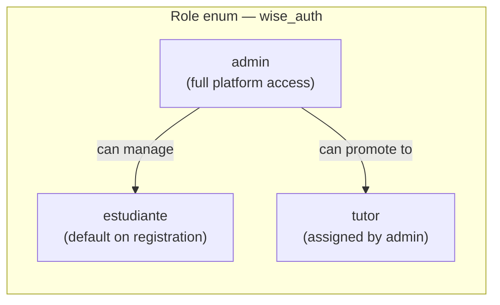
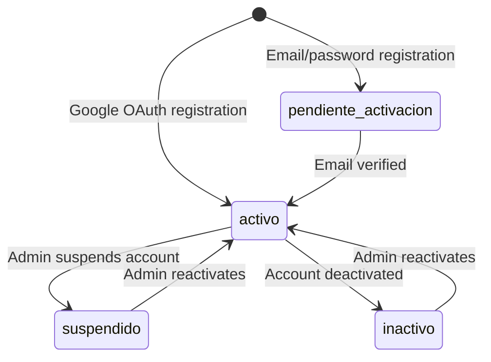
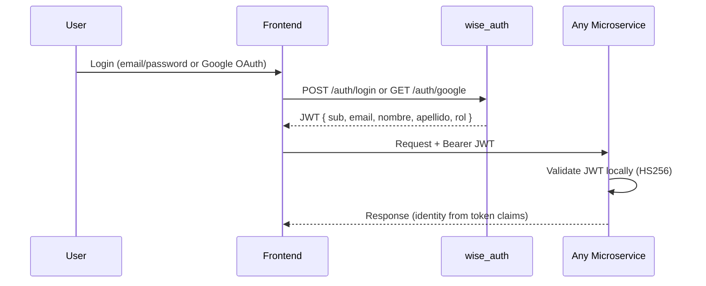
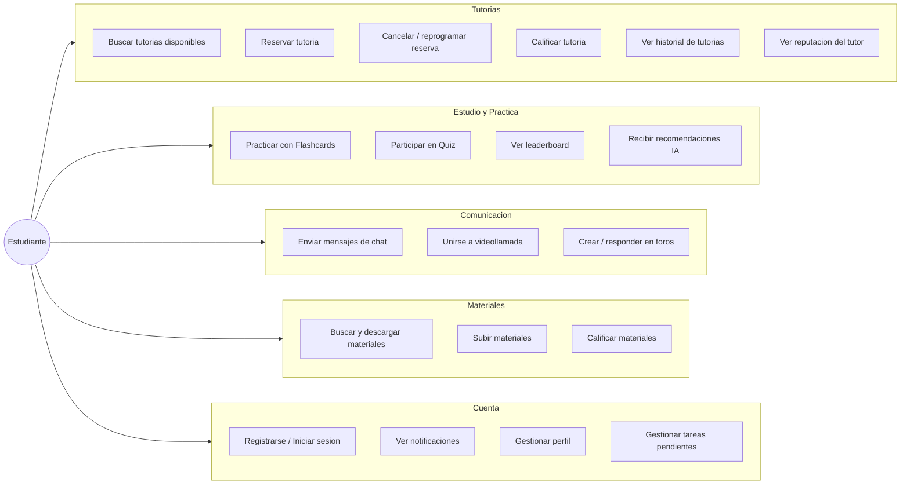
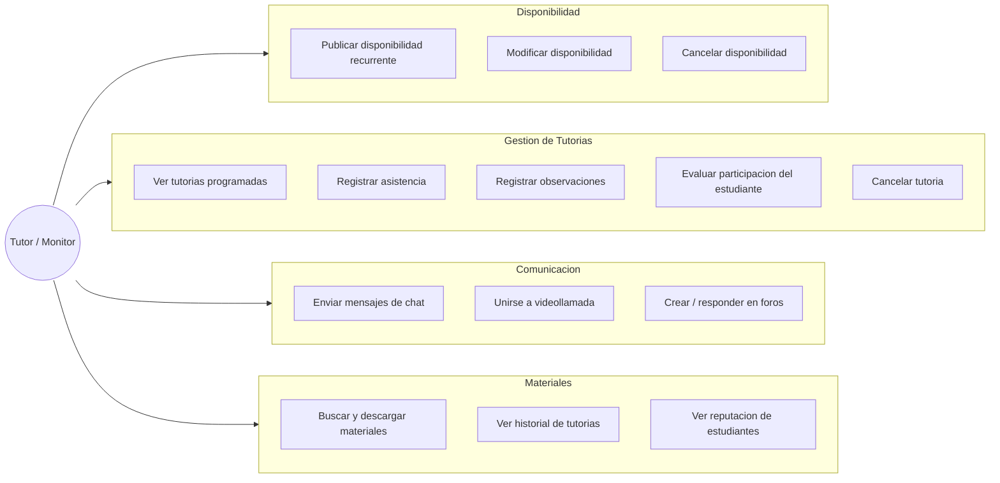
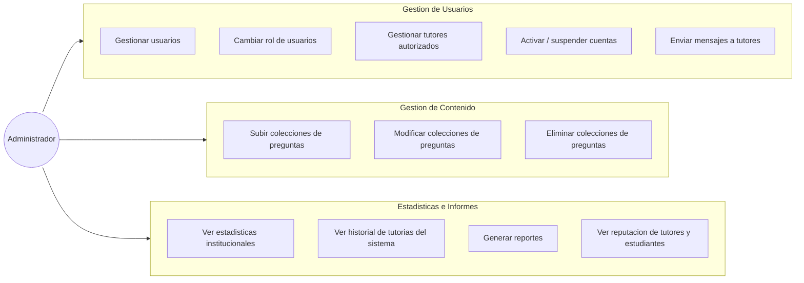

# Actors, Roles & Permissions

Actors represent the external entities that interact with the ECIWise system. Identity and authorization are managed centrally by the `wise_auth` microservice, which issues HS256 JWTs consumed by every downstream service without a round-trip to Auth.

---

## Roles

The `wise_auth` service defines three roles in `Role` enum:

| Role | Value | Description | Assigned by |
|------|-------|-------------|-------------|
| Student | `estudiante` | Default role on registration. Access to academic support tools, tutoring booking, study, forums, and AI recommendations. | Automatic on registration |
| Tutor | `tutor` | Authorized user (monitor) who offers academic tutoring sessions. Manages availability and conducts sessions. | Administrator |
| Admin | `admin` | Full platform access. Manages users, content, monitors, and institutional statistics. | System / manual |

---

## Account States

| State | Description |
|-------|-------------|
| `pendiente_activacion` | Registered via email, awaiting email verification |
| `activo` | Active account with full access |
| `inactivo` | Deactivated account |
| `suspendido` | Suspended by administrator |

---

## Authentication & JWT

All services receive and validate the JWT locally (HS256, shared `JWT_SECRET`) — no HTTP call to `wise_auth` per request.

**JWT Claims:**

| Claim | Type | Purpose |
|-------|------|---------|
| `sub` | UUID | User identifier — used as `userId` in all services |
| `email` | string | User email address |
| `nombre` | string | First name |
| `apellido` | string | Last name |
| `rol` | string | Role (`estudiante`, `tutor`, `admin`) |

---

## Use Case: Estudiante

---

## Use Case: Tutor / Monitor

---

## Use Case: Administrador

---

## Permissions Matrix

| Functionality | Estudiante | Tutor | Admin |
|---|:---:|:---:|:---:|
| Register / Login (email or Google) | x | x | x |
| Manage own profile | x | x | x |
| View notifications | x | x | x |
| **Tutorias** | | | |
| Search available tutoring sessions | x | x | x |
| Book a tutoring session | x | | |
| Cancel a reservation | x | | |
| Reschedule a tutoring session | x | | |
| Rate a tutoring session | x | | |
| View own tutoring history | x | x | x |
| View tutor reputation | x | | x |
| View student reputation | | x | x |
| Publish / modify / cancel availability | | x | |
| View scheduled sessions | | x | |
| Register attendance | | x | |
| Register observations | | x | |
| Evaluate student participation | | x | |
| Cancel a tutoria (as tutor) | | x | |
| View system-wide tutoring history | | | x |
| Manage authorized tutors | | | x |
| **Study & Practice** | | | |
| Practice with FlashCards | x | | |
| Participate in Quiz | x | | |
| View leaderboard | x | | |
| Receive AI recommendations | x | | |
| Manage own tasks (Todo) | x | | |
| **Communication** | | | |
| Send chat messages | x | x | |
| Join a video call | x | x | |
| Create a forum post | x | x | |
| Reply to a forum post | x | x | |
| Send messages to tutors (admin) | | | x |
| **Materials** | | | |
| Search and download materials | x | x | x |
| Upload materials | x | x | |
| Rate materials | x | x | |
| **Administration** | | | |
| Manage users (roles, status) | | | x |
| Upload / modify / delete question collections | | | x |
| View institutional statistics | | | x |
| Generate reports | | | x |
