# Architecture Decision Records

This page documents the key architectural decisions made throughout the ECIWise project — what was decided, why, the trade-offs accepted, and how each service evolved over time.

---

## ADR-001 — Microservice Architecture

**Status:** Accepted

### Context

ECIWise needed to support multiple independent domains: authentication, tutoring scheduling, academic materials, real-time chat, study practice, gamification, notifications, and AI predictions. A monolith would couple these domains, slow down team development, and make independent scaling impossible.

### Decision

Build each domain as an independent microservice with its **own database, own deployment, and own technology stack**. Services communicate synchronously via JWT-authenticated REST, and asynchronously via RabbitMQ for domain events.

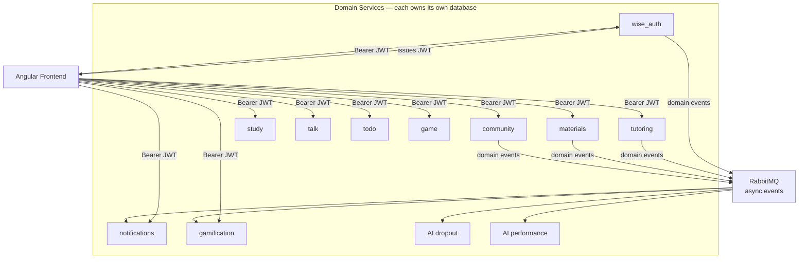

### Consequences

- **Good:** Independent deployments, isolated failures, team autonomy per service, technology flexibility.
- **Accepted cost:** Operational complexity; distributed tracing and observability require explicit tooling. JWT-based JIT user provisioning avoids inter-service user-sync calls.

---

## ADR-002 — RabbitMQ as the Event Broker (Azure Service Bus kept as a contingency alternative)

**Status:** Accepted

### Context

The platform needs asynchronous event delivery for notifications, gamification triggers, and AI prediction requests. Two options were evaluated: **Azure Service Bus** (managed, pay-per-use, Azure-native) and **RabbitMQ** (open-source, self-hostable, protocol-level control via AMQP).

RabbitMQ gives the team direct control over exchanges, queues, routing keys, and dead-letter policies — topology that Azure Service Bus expresses differently and at higher cost. It also runs identically in Docker locally and on any VPS or cloud VM in production, with no per-message billing.

### Decision

**Use RabbitMQ as the chosen broker for both development and production.** Implement a strategy-based broker abstraction in consumer services (notifications, gamification) so that the active broker is selected at runtime via the `MESSAGING_BROKER` environment variable. This keeps Azure Service Bus as a zero-code-change contingency if the team ever migrates to a fully managed Azure hosting model.

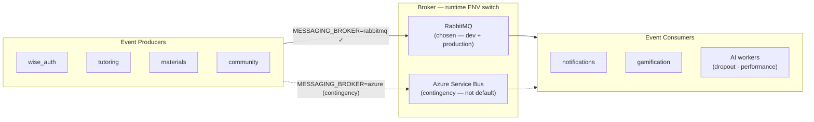

**RabbitMQ topology (notifications service):**

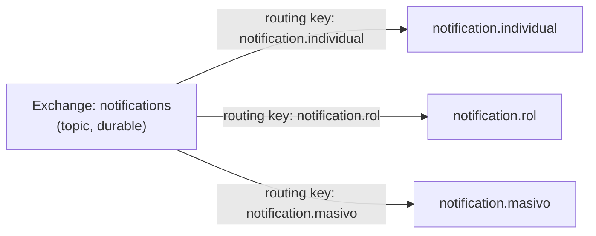

**AI prediction pipeline via RabbitMQ:**

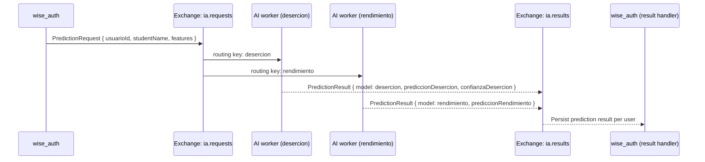

### Consequences

- **Good:** Full control over topology (exchanges, routing keys, DLX, TTL) with zero per-message cost. Runs identically locally and in production. Strategy abstraction means Azure SB can be activated at any time by changing one env var.
- **Accepted cost:** Self-hosting RabbitMQ in production requires cluster management, monitoring, and HA configuration. Not a managed service.

---

## ADR-003 — Architecture Pattern per Service: Hexagonal for Complex Domains, Layered for Simple Ones

**Status:** Accepted

### Context

Not every service in ECIWise has the same complexity or the same number of infrastructure dependencies. Applying hexagonal architecture everywhere would add unnecessary boilerplate to services whose domain logic is thin and whose infrastructure dependencies are stable. Applying layered architecture to services with rich domain rules or many swappable adapters would create framework coupling that makes testing and evolution harder.

### Decision

Choose the architecture pattern based on the domain complexity and number of swappable infrastructure dependencies for each service.

**Services using Hexagonal Architecture (Ports & Adapters):**

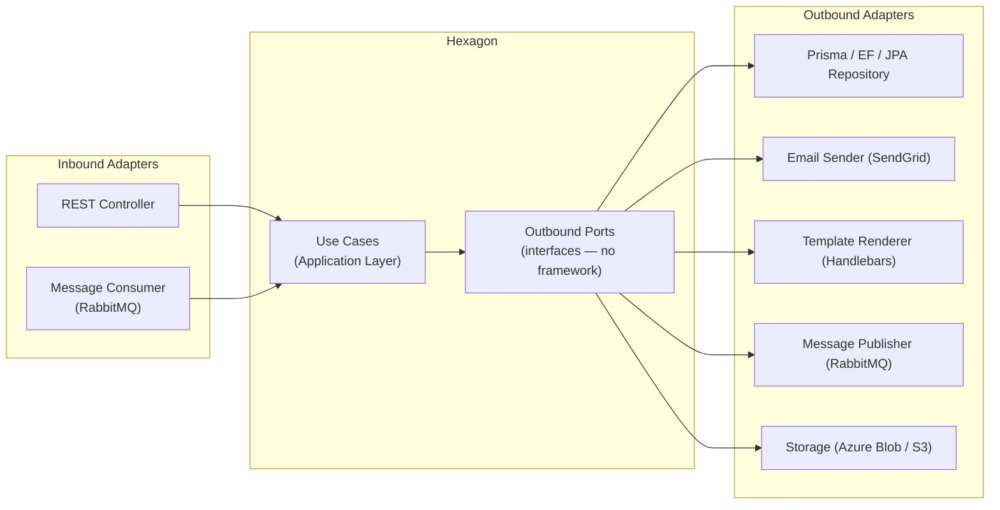

| Service | Why hexagonal | Key outbound ports |
|---------|--------------|-------------------|
| `wise_auth` | Many outbound dependencies (DB, cache, 2 RabbitMQ publishers); migrated from layered after god-class problems | `IUsuarioRepository`, `IDatosIaRepository`, `IPrediccionPublisher`, `INotificationPublisher`, `ICacheService` |
| `notifications` | Swappable broker (RabbitMQ / Azure SB), swappable email provider, swappable template engine | `NotificationRepositoryPort`, `EmailSenderPort`, `TemplateRendererPort` |
| `materials` | Swappable cloud storage (Azure Blob / S3), swappable message bus | `StoragePort`, `MessageBusPort`, `MaterialRepositoryPort` |
| `tutoring` | Rich domain (booking rules, concurrency, state machines), fully rewritten | Per-slice repository ports |
| `todo` | Port interfaces isolate Spring Data JPA from use cases | Input/output ports per use case |
| `gamification` | .NET Clean Architecture — RabbitMQ consumer adapter decoupled from domain | Repository ports, `Gamification.Messaging` adapter |

**Services using Classic Layered Architecture (Controller → Service → Repository):**

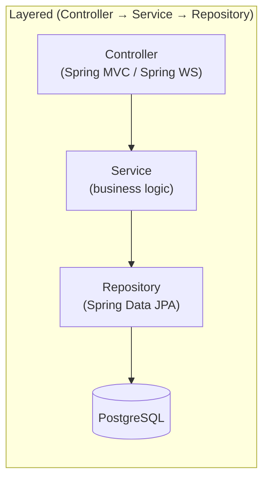

| Service | Technology | Reason for layered |
|---------|-----------|-------------------|
| `study` | Spring Boot · JPA | Thin domain (quiz sessions, flashcard review); stable infrastructure; no swappable adapters needed |
| `talk` | Spring Boot · WebSocket · Redis · MinIO | Chat logic is CRUD + real-time broadcast; Spring Data and MinIO are fixed infrastructure |

**`game` — event-driven goroutine model (Go):**

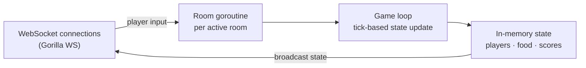

`game` is a Go WebSocket server with a tick-based game loop and in-memory state. It has no database and no traditional architectural layers — the model that fits its problem is concurrent goroutines per room with a shared state machine, not ports and adapters.

### Consequences

- **Good:** Each service uses the pattern that matches its actual complexity. Simple services (`study`, `talk`) avoid hexagonal boilerplate. Complex services (`notifications`, `tutoring`, `wise_auth`) get full testability and adapter swappability.
- **Accepted cost:** The codebase is not architecturally uniform. New team members must read the README of each service to understand which pattern it follows.

---

## ADR-004 — wise_auth: Migration from Layered to Hexagonal

**Status:** Accepted

### Context

`wise_auth` started as a standard NestJS layered service (Controller → AuthService → PrismaService). As new capabilities were added — IA data management, prediction publishing, tutor assignments, notification publishing, role management — the single `AuthService` grew into a god class with direct Prisma calls and tight coupling to infrastructure.

### Decision

Refactor `wise_auth` to hexagonal architecture, introducing domain ports for all outbound dependencies and isolating each capability in its own module.

```mermaid
graph TB
  subgraph Before["Before — Layered"]
    C1["AuthController"]
    S1["AuthService\n(god class: auth + IA + users + predictions)"]
    P1["PrismaService\n(direct calls everywhere)"]
    C1 --> S1 --> P1
  end

  subgraph After["After — Hexagonal"]
    subgraph Controllers["Inbound"]
      AC["AuthController"]
      IC["IaController"]
    end
    subgraph Domain["Domain Ports (outbound)"]
      UR["IUsuarioRepository"]
      DIR["IDatosIaRepository"]
      ATR["IAsignacionTutorRepository"]
      PP["IPrediccionPublisher"]
      NP["INotificationPublisher"]
      CS["ICacheService"]
    end
    subgraph Adapters["Infrastructure Adapters"]
      PRISMA["Prisma Repositories"]
      RMQ["RabbitMQ Publishers"]
      REDIS["Redis Cache"]
    end
    Controllers --> Domain
    Domain --> Adapters
  end
```

**Key domain port contracts added:**

| Port | Purpose |
|------|---------|
| `IUsuarioRepository` | User CRUD, role and status management |
| `IDatosIaRepository` | AI profile data per student |
| `IAsignacionTutorRepository` | Tutor–student assignment management |
| `IPrediccionPublisher` | Publishes prediction requests to RabbitMQ (`ia.requests` exchange) |
| `INotificationPublisher` | Publishes notification events to RabbitMQ |
| `ICacheService` | Cache abstraction (Redis adapter) |

### Consequences

- **Good:** `wise_auth` can now be tested without a database. The IA module, auth module, and user management module are independently testable. Adding a new outbound dependency (e.g., a new cache provider) is an adapter swap.
- **Accepted cost:** Migration required significant refactoring effort mid-project. All existing tests had to be updated to use port fakes instead of Prisma mocks.

---

## ADR-005 — tutoring: Complete Rewrite with Hexagonal + DDD + Vertical Slicing

**Status:** Accepted

### Context

The original tutoring service was a proof-of-concept with a flat layered structure and mock in-memory persistence. As business requirements matured — recurring availability templates, slot materialization, concurrency-safe booking, cancellation rules, rescheduling — the original codebase could not support them without a full redesign. The domain was too rich for a simple CRUD service.

### Decision

**Rewrite from scratch** using Hexagonal Architecture + Domain-Driven Design + Vertical Slicing. Each business capability is an independent vertical slice with its own domain model, use cases, and infrastructure. Dependencies flow strictly inward.

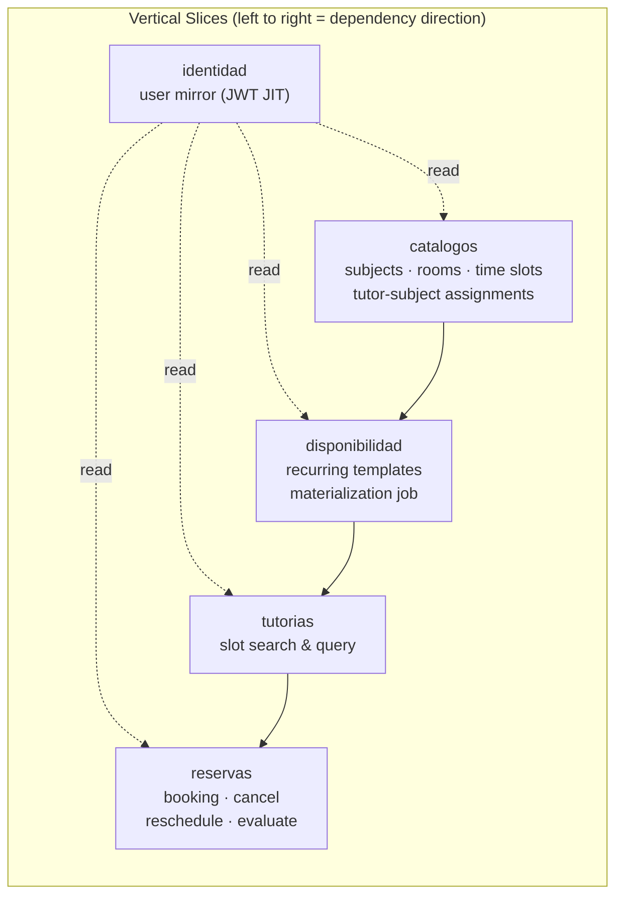

**Business rules encoded in the domain layer:**

| Rule | Enforcement layer |
|------|-----------------|
| No overlapping bookings (RN-01) | Domain — `Reserva` aggregate |
| Slot capacity control (RN-09) | Domain — atomic counter in `Tutoria` |
| Cancellation before session | Domain — `Reserva` state machine |
| Rescheduling constraints | Domain — `Reserva` aggregate |
| Slot materialization idempotency | Application — `DisponibilidadService` cron job |

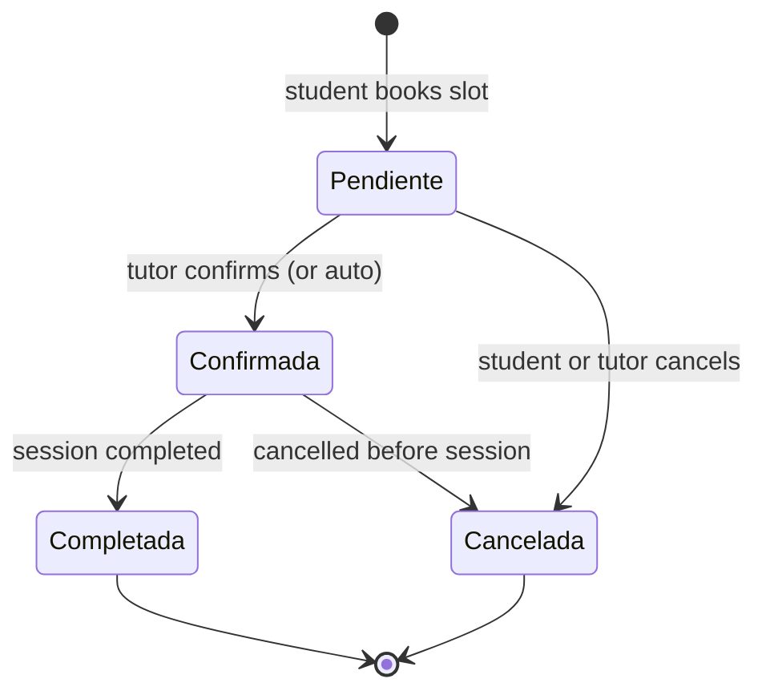

**Technology:**

| Component | Technology |
|-----------|------------|
| Framework | NestJS 11 · TypeScript (strict) |
| Architecture | Hexagonal + DDD + Vertical Slicing |
| ORM / DB | Prisma 7 · PostgreSQL (Neon) |
| Scheduling | `@nestjs/schedule` (materialization cron) |
| Events | `@nestjs/event-emitter` (in-memory, prepared for RabbitMQ) |
| Auth | Passport-JWT HS256 |
| Tests | Jest — domain unit tests with pure fakes (no DB) |

### Consequences

- **Good:** Business rules are explicit, testable, and co-located with the domain. Replacing the persistence layer requires only new adapters. The cron-based materialization decouples scheduling from the booking API.
- **Accepted cost:** Full rewrite cost in sprint time. DDD overhead is only justified by domain complexity — for simpler CRUD services it would be over-engineering.

---

## ADR-006 — gamification: .NET 10 / C# with Hexagonal Architecture

**Status:** Accepted

### Context

The gamification service manages points, levels, achievements, and leaderboards driven by user actions across the platform. The team member leading this service had deep expertise in .NET/C#. Additionally, .NET's strong typing, LINQ, and Entity Framework ecosystem were well-suited to the query-heavy nature of leaderboards and achievement evaluation.

### Decision

Build the gamification service in **.NET 10 / C#** following Clean/Hexagonal Architecture (Ports & Adapters). The service consumes domain events from RabbitMQ via a dedicated `Gamification.Messaging` project and exposes a REST API via `Gamification.Api`.

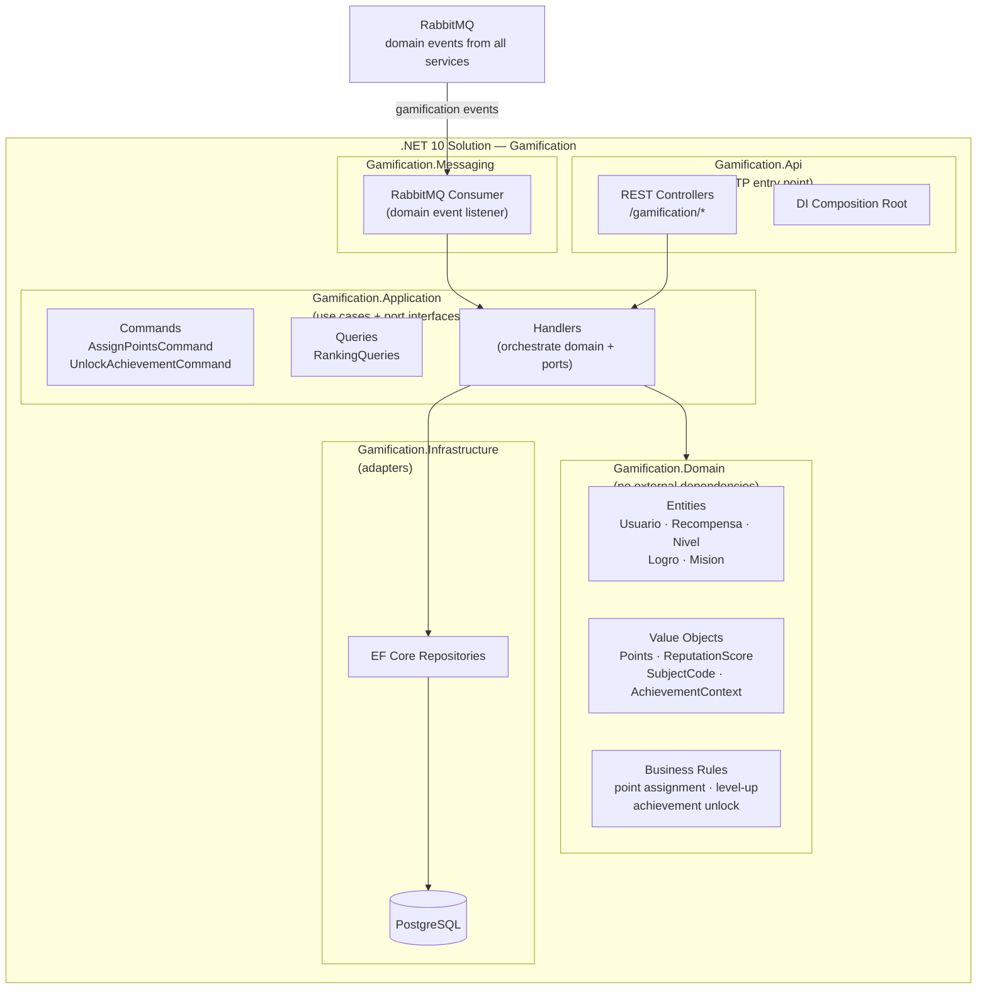

**Technology:**

| Component | Technology |
|-----------|------------|
| Platform | .NET 10 · C# |
| Architecture | Hexagonal / Clean Architecture |
| ORM | Entity Framework Core |
| Messaging | RabbitMQ (`Gamification.Messaging`) |
| Tests | xUnit · Moq |

### Consequences

- **Good:** Polyglot microservice architecture — the best tool for the job per team expertise. .NET's LINQ and EF Core are excellent for leaderboard and ranking queries. The service is fully decoupled from all other services via RabbitMQ events.
- **Accepted cost:** Adds a second runtime to the stack (.NET alongside Node.js and JVM). Docker images are slightly larger.

---

## ADR-007 — Two AI Models: Dropout Prediction and Performance Prediction

**Status:** Accepted

### Context

The platform aims to reduce student dropout and improve academic outcomes. Two distinct prediction needs were identified:
- **Dropout risk**: predict whether a student is at risk of dropping out based on socioeconomic, academic, and enrollment factors.
- **Academic performance**: predict a student's likely academic performance based on study habits, attendance, tutoring usage, and extracurricular factors.

These are different ML models with different feature sets and different intervention strategies. Merging them into one service would couple unrelated models and complicate independent retraining.

### Decision

Deploy **two independent AI worker services** (Python), each consuming from a dedicated RabbitMQ queue and publishing results back to `wise_auth` via the `ia.results` exchange. `wise_auth` orchestrates the prediction request lifecycle and stores results per student.

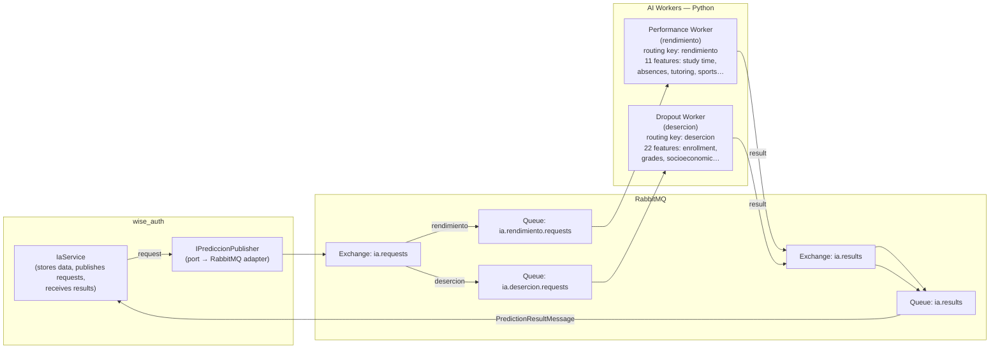

**Feature sets:**

| Model | Routing Key | Key Features |
|-------|-------------|-------------|
| Performance | `rendimiento` | `studyTimeWeekly`, `absences`, `tutoring`, `extracurricular`, `sports`, `music`, `volunteering`, `parentalSupport`, `gender`, `ethnicity`, `parentalEducation` |
| Dropout | `desercion` | `curricularUnits1stSem*` (credited, enrolled, evaluated, approved), `ageAtEnrollment`, `scholarshipHolder`, `debtor`, `tuitionFeesUpToDate`, `course`, `previousQualification`, `maritalStatus`, `applicationMode` + others |

**Result message contract:**

```json
{
  "usuarioId": "uuid",
  "model": "rendimiento | desercion",
  "prediccionRendimiento": "High | Medium | Low",
  "prediccionDesercion": "At Risk | Not At Risk",
  "confianzaDesercion": 0.87
}
```

**Role-based access to predictions:**

| Endpoint | Student | Tutor | Admin |
|----------|:-------:|:-----:|:-----:|
| `GET /ia/me` — own IA data | x | | |
| `PUT /ia/me` — update own features | x | | |
| `PUT /ia/me/prediccion` — save own prediction | x | | |
| `GET /ia/estudiantes` — list all students | | x | x |
| `GET /ia/estudiantes/:id` — student detail | | x | x |
| `GET /ia/metricas` — dashboard metrics | | x | x |
| `GET /ia/estadisticas` — platform-wide stats | | | x |
| `POST /ia/asignaciones` — tutor-student link | | | x |

### Consequences

- **Good:** Models are independently retrainable and deployable. Failure in one worker does not affect the other. Feature sets are cleanly separated. `wise_auth` acts as a thin orchestrator, not an ML service.
- **Accepted cost:** Two additional services to deploy and monitor. The async request/result pattern introduces latency; prediction results are not immediate. Students need to fill in their IA profile data before predictions can be generated.

---

## ADR-008 — Database per Service

**Status:** Accepted

### Context

Multiple microservices sharing a single database creates hidden coupling: schema migrations in one service can break another, a slow query in one domain can starve others, and it becomes impossible to evolve the data model of one service independently.

### Decision

Each microservice **owns its own database instance**. No service reads or writes directly to another service's database. Cross-service data needs are satisfied via:
- **JWT claims** for identity data (name, role, email) — no service calls `wise_auth` to look up a user.
- **JIT user provisioning** — services that need local user records upsert them on first authenticated request from JWT claims.
- **Async events** — for data that changes over time (e.g., a tutoring completion event triggers a gamification point award via RabbitMQ, not a direct DB read).

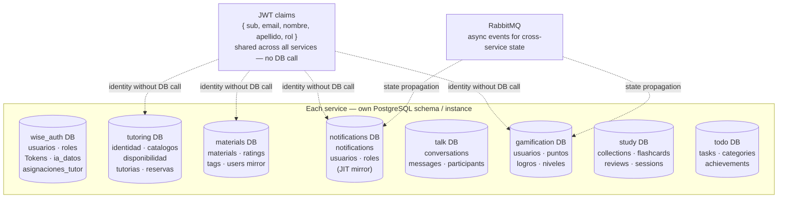

### Consequences

- **Good:** Services are fully independent. Schema migrations, performance tuning, and technology choices (ORM, indexing) are local to each service.
- **Accepted cost:** No cross-service JOINs. Reporting that needs data from multiple services requires aggregation at the application level or a dedicated analytics pipeline.
