# Architecture Decision Records

This page documents the key architectural decisions made throughout the ECIWise project — what was decided, why, the trade-offs accepted, and how each service evolved over time.

| # | Decision | Scope | Status |
|---|----------|-------|--------|
| [ADR-001](#adr-001--microservice-architecture--event-driven-architecture) | Microservices + Event-Driven Architecture | Platform | Accepted |
| [ADR-002](#adr-002--rabbitmq-as-the-event-broker-azure-service-bus-kept-as-a-contingency-alternative) | RabbitMQ as the event broker (Azure SB as contingency) | Platform | Accepted |
| [ADR-003](#adr-003--architecture-pattern-per-service-hexagonal-for-complex-domains-layered-for-simple-ones) | Hexagonal for complex domains, layered for simple ones | Platform | Accepted |
| [ADR-004](#adr-004--wise_auth-migration-from-layered-to-hexagonal) | `wise_auth`: layered → hexagonal migration | `wise_auth` | Accepted |
| [ADR-005](#adr-005--tutoring-complete-rewrite-with-hexagonal--ddd--vertical-slicing) | `tutoring`: rewrite with Hexagonal + DDD + Vertical Slicing | `tutoring` | Accepted |
| [ADR-006](#adr-006--gamification-net-10--c-with-hexagonal-architecture) | `gamification`: .NET 10 / C# with Clean Architecture | `gamification` | Accepted |
| [ADR-007](#adr-007--two-ai-models-dropout-prediction-and-performance-prediction) | Two independent AI models (dropout · performance) | AI | Accepted |
| [ADR-008](#adr-008--database-per-service) | Database per service | Platform | Accepted |
| [ADR-009](#adr-009--vector-database-in-the-ai-service-for-semantic-search-and-rag) | Qdrant vector database for semantic search and RAG | AI | Accepted |
| [ADR-010](#adr-010--wise_auth-password-hashing-migration-from-bcrypt-to-argon2id) | `wise_auth`: bcrypt → Argon2id password hashing | `wise_auth` | Accepted |
| [ADR-011](#adr-011--self-hosted-jitsi-meet-for-tutoring-video-calls) | Self-hosted Jitsi Meet for video calls | `tutoring` | Accepted |
| [ADR-012](#adr-012--collaborative-whiteboard-via-excalidraw-with-a-websocket-relay) | Excalidraw whiteboard with a WebSocket relay | `tutoring` | Accepted |
| [ADR-013](#adr-013--notifications-smtp-as-a-first-class-alternative-to-sendgrid) | `notifications`: SMTP as an alternative to SendGrid | `notifications` | Accepted |
| [ADR-014](#adr-014--jwt-hs256-as-the-cross-service-token-format) | JWT HS256 as the cross-service token format | Security | Accepted |
| [ADR-015](#adr-015--frontend-angular-standalone--signals--ssr-with-no-external-state-library) | Frontend: Angular standalone + signals + SSR, no store | Frontend | Accepted |
| [ADR-016](#adr-016--frontend-jwt-in-localstorage-with-host-restricted-attachment) | Frontend: JWT in `localStorage`, host-restricted | Frontend · Security | Accepted |
| [ADR-017](#adr-017--frontend-runtime-configuration-via-assetsenvjson) | Frontend: runtime config via `assets/env.json` | Frontend | Accepted |
| [ADR-018](#adr-018--materials-storage-provider-abstraction-azure-blob--s3) | `materials`: storage provider abstraction + upload validation | `materials` | Accepted |

A recurring pattern across ADR-002, ADR-013, and ADR-018: **when an infrastructure dependency has a credible second implementation, it goes behind a domain port and is selected by an environment variable** — never by a code change. See [Security](/docs/security/) for how these decisions compose into the platform's security posture.

---

## ADR-001 — Microservice Architecture + Event-Driven Architecture

**Status:** Accepted

### Context

ECIWise needed to support multiple independent domains: authentication, tutoring scheduling, academic materials, real-time chat, study practice, gamification, notifications, and AI predictions. A monolith would couple these domains, slow down team development, and make independent scaling impossible.

Beyond isolation, several cross-domain concerns required one service to react to what happens in another — a confirmed booking should trigger a notification, a completed tutoring session should award gamification points, a student registration should dispatch a prediction request to the AI workers. Solving this with direct HTTP calls between services would create tight temporal coupling: if the notification service is down, the booking would fail. That is not acceptable.

### Decision

ECIWise combines two complementary architectural styles:

**Microservice Architecture** — each domain is an independent service with its own database, deployment, and technology stack. No shared database. No direct inter-service database access.

**Event-Driven Architecture** — services that produce significant domain events publish them to RabbitMQ. Interested services subscribe independently. Producers do not know who consumes their events. This decouples services in time and space: a consumer being down does not fail the producer.

These two styles are not alternatives — microservices define the *decomposition boundary*, event-driven defines the *communication model* between those boundaries.

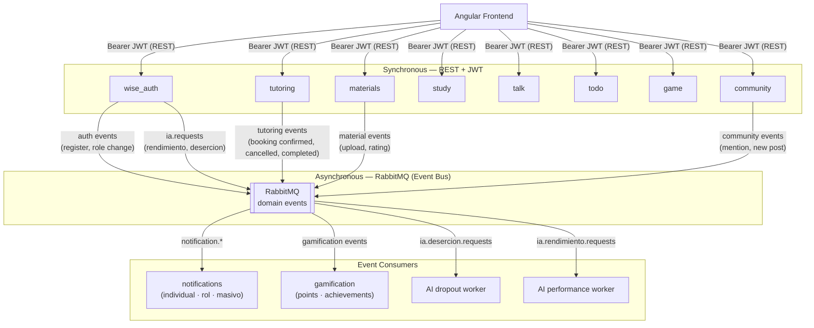

**When each communication style is used:**

| Scenario | Style | Reason |
|----------|-------|--------|
| Frontend requests data or actions | REST + JWT | Synchronous, needs immediate response |
| Booking confirmed → send email | Event-driven | Notification service failure must not fail the booking |
| Session completed → award points | Event-driven | Gamification is a side effect, not part of the booking transaction |
| Student registers → trigger AI prediction | Event-driven | Prediction is async; result arrives via a separate results exchange |
| `wise_auth` issues token → any service validates it | JWT local validation | No inter-service call needed at request time |

### Consequences

- **Good:** Services are decoupled in time — a consumer being unavailable does not affect the producer. New consumers can subscribe to existing events with zero changes to producers. REST gives fast, predictable responses for user-facing interactions.
- **Accepted cost:** Eventual consistency — the gamification or notification side effect may arrive milliseconds after the main action completes. Requires RabbitMQ cluster monitoring and dead-letter queue handling for failed deliveries.

---

## ADR-002 — RabbitMQ as the Event Broker (Azure Service Bus kept as a contingency alternative)

**Status:** Accepted

### Context

The platform needs asynchronous event delivery for notifications, gamification triggers, and AI prediction requests. Two options were evaluated: **Azure Service Bus** (managed, pay-per-use, Azure-native) and **RabbitMQ** (open-source, self-hostable, protocol-level control via AMQP).

RabbitMQ gives the team direct control over exchanges, queues, routing keys, and dead-letter policies — topology that Azure Service Bus expresses differently and at higher cost. It also runs identically in Docker locally and on any VPS or cloud VM in production, with no per-message billing.

### Decision

**Use RabbitMQ as the chosen broker for both development and production.** Implement a strategy-based broker abstraction in consumer services (notifications, gamification) so that the active broker is selected at runtime via the `MESSAGING_BROKER` environment variable. This keeps Azure Service Bus as a zero-code-change contingency if the team ever migrates to a fully managed Azure hosting model.

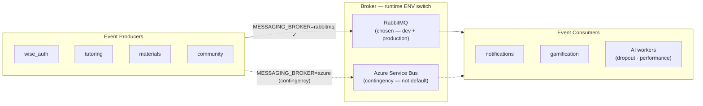

**RabbitMQ topology (notifications service):**

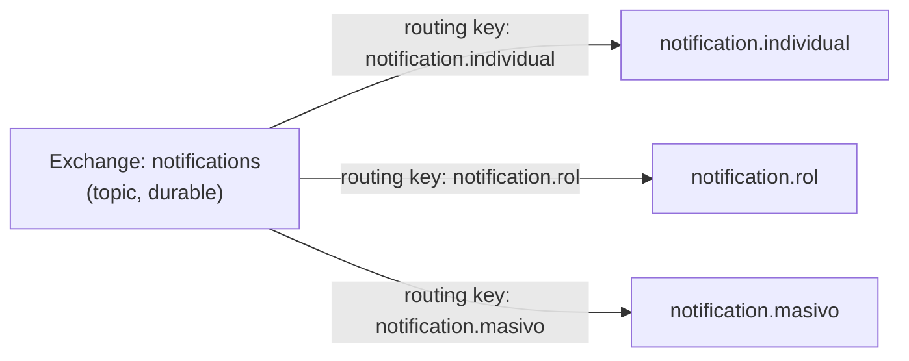

**AI prediction pipeline via RabbitMQ:**

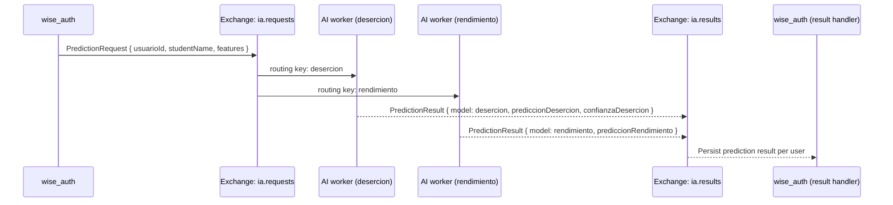

### Consequences

- **Good:** Full control over topology (exchanges, routing keys, DLX, TTL) with zero per-message cost. Runs identically locally and in production. Strategy abstraction means Azure SB can be activated at any time by changing one env var.
- **Accepted cost:** Self-hosting RabbitMQ in production requires cluster management, monitoring, and HA configuration. Not a managed service.

---

## ADR-003 — Architecture Pattern per Service: Hexagonal for Complex Domains, Layered for Simple Ones

**Status:** Accepted

### Context

Not every service in ECIWise has the same complexity or the same number of infrastructure dependencies. Applying hexagonal architecture everywhere would add unnecessary boilerplate to services whose domain logic is thin and whose infrastructure dependencies are stable. Applying layered architecture to services with rich domain rules or many swappable adapters would create framework coupling that makes testing and evolution harder.

### Decision

Choose the architecture pattern based on the domain complexity and number of swappable infrastructure dependencies for each service.

**Services using Hexagonal Architecture (Ports & Adapters):**

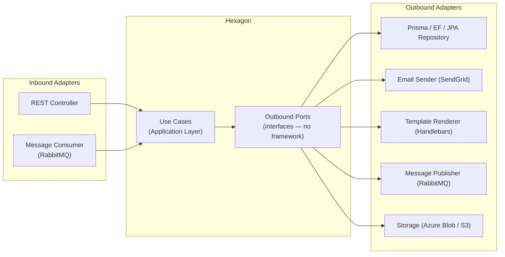

| Service | Why hexagonal | Key outbound ports |
|---------|--------------|-------------------|
| `wise_auth` | Many outbound dependencies (DB, cache, 2 RabbitMQ publishers); migrated from layered after god-class problems | `IUsuarioRepository`, `IDatosIaRepository`, `IPrediccionPublisher`, `INotificationPublisher`, `ICacheService` |
| `notifications` | Swappable broker (RabbitMQ / Azure SB), swappable email provider, swappable template engine | `NotificationRepositoryPort`, `EmailSenderPort`, `TemplateRendererPort` |
| `materials` | Swappable cloud storage (Azure Blob / S3), swappable message bus | `StoragePort`, `MessageBusPort`, `MaterialRepositoryPort` |
| `tutoring` | Rich domain (booking rules, concurrency, state machines), fully rewritten | Per-slice repository ports |
| `todo` | Port interfaces isolate Spring Data JPA from use cases | Input/output ports per use case |
| `gamification` | .NET Clean Architecture — RabbitMQ consumer adapter decoupled from domain | Repository ports, `Gamification.Messaging` adapter |

**Services using Classic Layered Architecture (Controller → Service → Repository):**

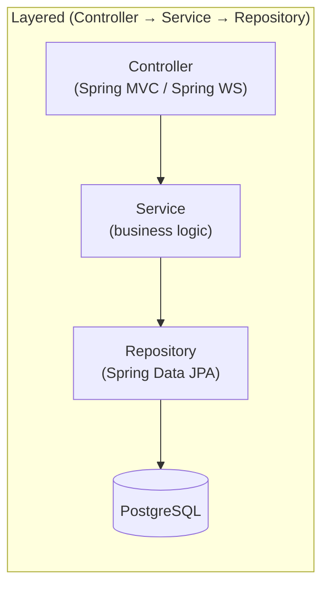

| Service | Technology | Reason for layered |
|---------|-----------|-------------------|
| `study` | Spring Boot · JPA | Thin domain (quiz sessions, flashcard review); stable infrastructure; no swappable adapters needed |
| `talk` | Spring Boot · WebSocket · Redis · MinIO | Chat logic is CRUD + real-time broadcast; Spring Data and MinIO are fixed infrastructure |

**`game` — event-driven goroutine model (Go):**

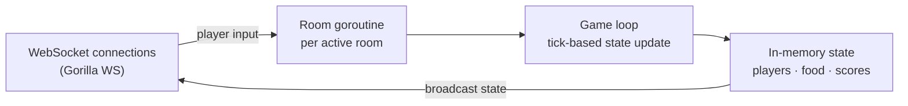

`game` is a Go WebSocket server with a tick-based game loop and in-memory state. It has no database and no traditional architectural layers — the model that fits its problem is concurrent goroutines per room with a shared state machine, not ports and adapters.

### Consequences

- **Good:** Each service uses the pattern that matches its actual complexity. Simple services (`study`, `talk`) avoid hexagonal boilerplate. Complex services (`notifications`, `tutoring`, `wise_auth`) get full testability and adapter swappability.
- **Accepted cost:** The codebase is not architecturally uniform. New team members must read the README of each service to understand which pattern it follows.

---

## ADR-004 — wise_auth: Migration from Layered to Hexagonal

**Status:** Accepted

### Context

`wise_auth` started as a standard NestJS layered service (Controller → AuthService → PrismaService). As new capabilities were added — IA data management, prediction publishing, tutor assignments, notification publishing, role management — the single `AuthService` grew into a god class with direct Prisma calls and tight coupling to infrastructure.

### Decision

Refactor `wise_auth` to hexagonal architecture, introducing domain ports for all outbound dependencies and isolating each capability in its own module.

```mermaid
graph TB
  subgraph Before["Before — Layered"]
    C1["AuthController"]
    S1["AuthService\n(god class: auth + IA + users + predictions)"]
    P1["PrismaService\n(direct calls everywhere)"]
    C1 --> S1 --> P1
  end

  subgraph After["After — Hexagonal"]
    subgraph Controllers["Inbound"]
      AC["AuthController"]
      IC["IaController"]
    end
    subgraph Domain["Domain Ports (outbound)"]
      UR["IUsuarioRepository"]
      DIR["IDatosIaRepository"]
      ATR["IAsignacionTutorRepository"]
      PP["IPrediccionPublisher"]
      NP["INotificationPublisher"]
      CS["ICacheService"]
    end
    subgraph Adapters["Infrastructure Adapters"]
      PRISMA["Prisma Repositories"]
      RMQ["RabbitMQ Publishers"]
      REDIS["Redis Cache"]
    end
    Controllers --> Domain
    Domain --> Adapters
  end
```

**Key domain port contracts added:**

| Port | Purpose |
|------|---------|
| `IUsuarioRepository` | User CRUD, role and status management |
| `IDatosIaRepository` | AI profile data per student |
| `IAsignacionTutorRepository` | Tutor–student assignment management |
| `IPrediccionPublisher` | Publishes prediction requests to RabbitMQ (`ia.requests` exchange) |
| `INotificationPublisher` | Publishes notification events to RabbitMQ |
| `ICacheService` | Cache abstraction (Redis adapter) |

### Consequences

- **Good:** `wise_auth` can now be tested without a database. The IA module, auth module, and user management module are independently testable. Adding a new outbound dependency (e.g., a new cache provider) is an adapter swap.
- **Accepted cost:** Migration required significant refactoring effort mid-project. All existing tests had to be updated to use port fakes instead of Prisma mocks.

---

## ADR-005 — tutoring: Complete Rewrite with Hexagonal + DDD + Vertical Slicing

**Status:** Accepted

### Context

The original tutoring service was a proof-of-concept with a flat layered structure and mock in-memory persistence. As business requirements matured — recurring availability templates, slot materialization, concurrency-safe booking, cancellation rules, rescheduling — the original codebase could not support them without a full redesign. The domain was too rich for a simple CRUD service.

### Decision

**Rewrite from scratch** using Hexagonal Architecture + Domain-Driven Design + Vertical Slicing. Each business capability is an independent vertical slice with its own domain model, use cases, and infrastructure. Dependencies flow strictly inward.

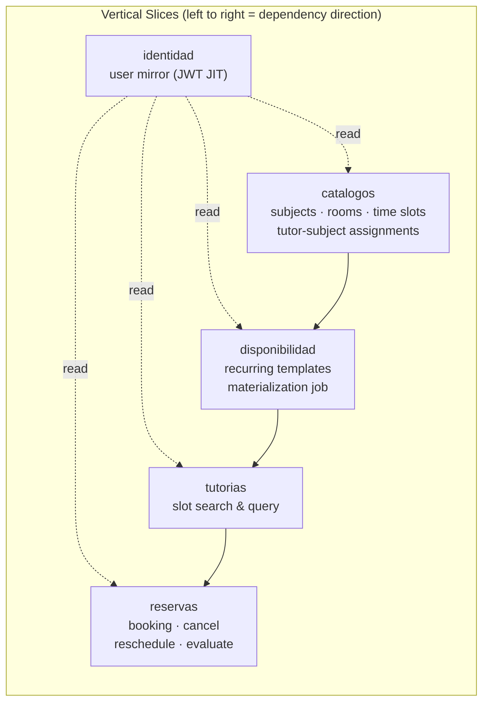

**Business rules encoded in the domain layer:**

| Rule | Enforcement layer |
|------|-----------------|
| No overlapping bookings (RN-01) | Domain — `Reserva` aggregate |
| Slot capacity control (RN-09) | Domain — atomic counter in `Tutoria` |
| Cancellation before session | Domain — `Reserva` state machine |
| Rescheduling constraints | Domain — `Reserva` aggregate |
| Slot materialization idempotency | Application — `DisponibilidadService` cron job |

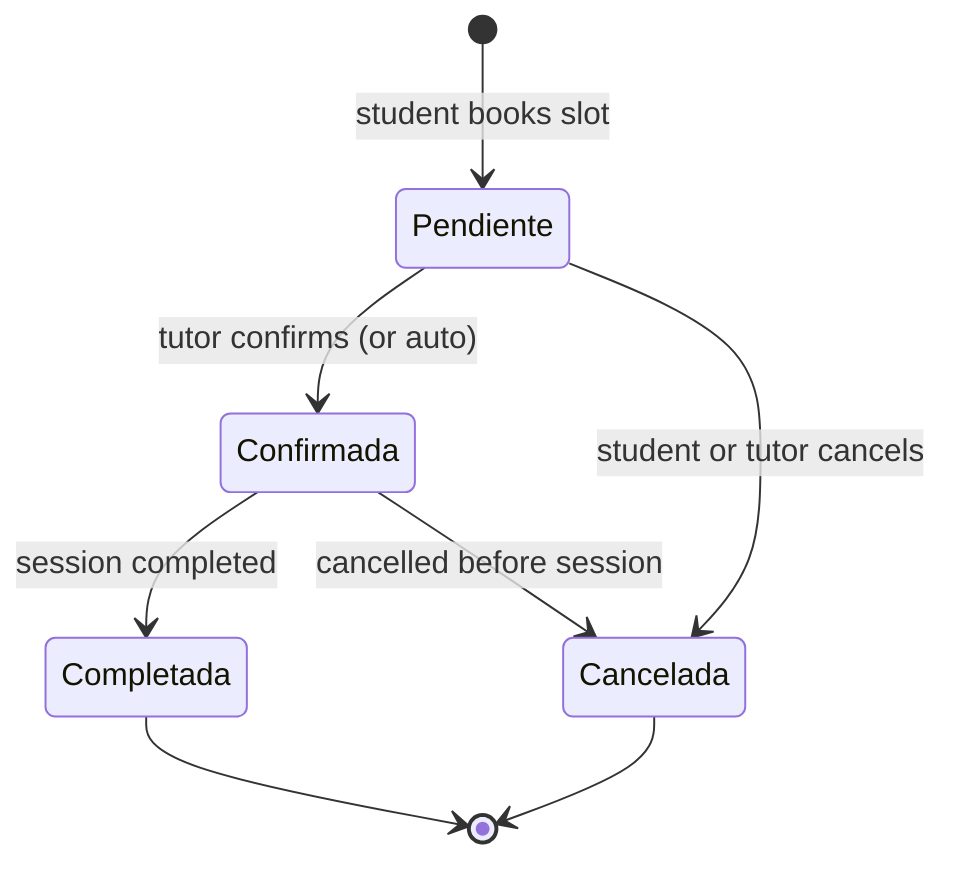

**Technology:**

| Component | Technology |
|-----------|------------|
| Framework | NestJS 11 · TypeScript (strict) |
| Architecture | Hexagonal + DDD + Vertical Slicing |
| ORM / DB | Prisma 7 · PostgreSQL (Neon) |
| Scheduling | `@nestjs/schedule` (materialization cron) |
| Events | `@nestjs/event-emitter` (in-memory, prepared for RabbitMQ) |
| Auth | Passport-JWT HS256 |
| Tests | Jest — domain unit tests with pure fakes (no DB) |

### Consequences

- **Good:** Business rules are explicit, testable, and co-located with the domain. Replacing the persistence layer requires only new adapters. The cron-based materialization decouples scheduling from the booking API.
- **Accepted cost:** Full rewrite cost in sprint time. DDD overhead is only justified by domain complexity — for simpler CRUD services it would be over-engineering.

---

## ADR-006 — gamification: .NET 10 / C# with Hexagonal Architecture

**Status:** Accepted

### Context

The gamification service manages points, levels, achievements, and leaderboards driven by user actions across the platform. The team member leading this service had deep expertise in .NET/C#. Additionally, .NET's strong typing, LINQ, and Entity Framework ecosystem were well-suited to the query-heavy nature of leaderboards and achievement evaluation.

### Decision

Build the gamification service in **.NET 10 / C#** following Clean/Hexagonal Architecture (Ports & Adapters). The service consumes domain events from RabbitMQ via a dedicated `Gamification.Messaging` project and exposes a REST API via `Gamification.Api`.

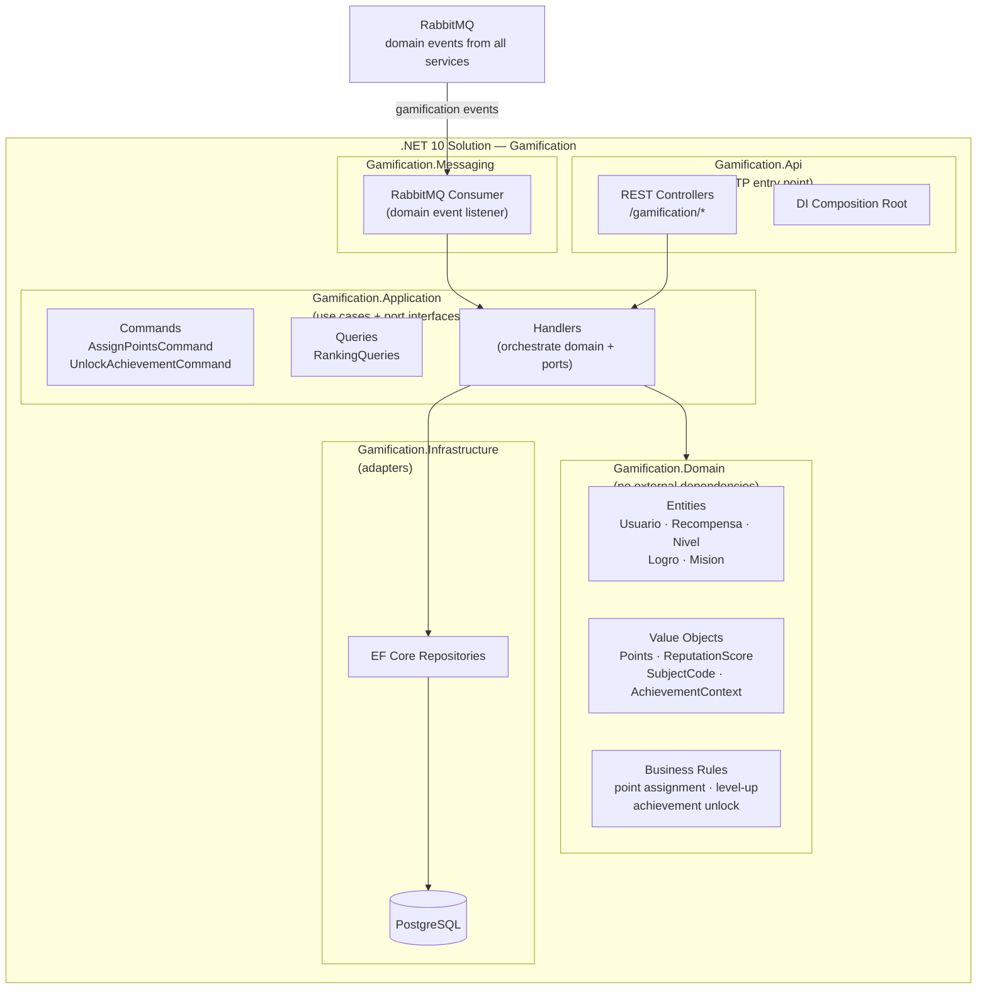

**Technology:**

| Component | Technology |
|-----------|------------|
| Platform | .NET 10 · C# |
| Architecture | Hexagonal / Clean Architecture |
| ORM | Entity Framework Core |
| Messaging | RabbitMQ (`Gamification.Messaging`) |
| Tests | xUnit · Moq |

### Consequences

- **Good:** Polyglot microservice architecture — the best tool for the job per team expertise. .NET's LINQ and EF Core are excellent for leaderboard and ranking queries. The service is fully decoupled from all other services via RabbitMQ events.
- **Accepted cost:** Adds a second runtime to the stack (.NET alongside Node.js and JVM). Docker images are slightly larger.

---

## ADR-007 — Two AI Models: Dropout Prediction and Performance Prediction

**Status:** Accepted

### Context

The platform aims to reduce student dropout and improve academic outcomes. Two distinct prediction needs were identified:
- **Dropout risk**: predict whether a student is at risk of dropping out based on socioeconomic, academic, and enrollment factors.
- **Academic performance**: predict a student's likely academic performance based on study habits, attendance, tutoring usage, and extracurricular factors.

These are different ML models with different feature sets and different intervention strategies. Merging them into one service would couple unrelated models and complicate independent retraining.

### Decision

Deploy **two independent AI worker services** (Python), each consuming from a dedicated RabbitMQ queue and publishing results back to `wise_auth` via the `ia.results` exchange. `wise_auth` orchestrates the prediction request lifecycle and stores results per student.

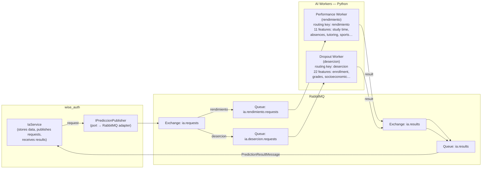

**Feature sets:**

| Model | Routing Key | Key Features |
|-------|-------------|-------------|
| Performance | `rendimiento` | `studyTimeWeekly`, `absences`, `tutoring`, `extracurricular`, `sports`, `music`, `volunteering`, `parentalSupport`, `gender`, `ethnicity`, `parentalEducation` |
| Dropout | `desercion` | `curricularUnits1stSem*` (credited, enrolled, evaluated, approved), `ageAtEnrollment`, `scholarshipHolder`, `debtor`, `tuitionFeesUpToDate`, `course`, `previousQualification`, `maritalStatus`, `applicationMode` + others |

**Result message contract:**

```json
{
  "usuarioId": "uuid",
  "model": "rendimiento | desercion",
  "prediccionRendimiento": "High | Medium | Low",
  "prediccionDesercion": "At Risk | Not At Risk",
  "confianzaDesercion": 0.87
}
```

**Role-based access to predictions:**

| Endpoint | Student | Tutor | Admin |
|----------|:-------:|:-----:|:-----:|
| `GET /ia/me` — own IA data | x | | |
| `PUT /ia/me` — update own features | x | | |
| `PUT /ia/me/prediccion` — save own prediction | x | | |
| `GET /ia/estudiantes` — list all students | | x | x |
| `GET /ia/estudiantes/:id` — student detail | | x | x |
| `GET /ia/metricas` — dashboard metrics | | x | x |
| `GET /ia/estadisticas` — platform-wide stats | | | x |
| `POST /ia/asignaciones` — tutor-student link | | | x |

### Consequences

- **Good:** Models are independently retrainable and deployable. Failure in one worker does not affect the other. Feature sets are cleanly separated. `wise_auth` acts as a thin orchestrator, not an ML service.
- **Accepted cost:** Two additional services to deploy and monitor. The async request/result pattern introduces latency; prediction results are not immediate. Students need to fill in their IA profile data before predictions can be generated.

---

## ADR-008 — Database per Service

**Status:** Accepted

### Context

Multiple microservices sharing a single database creates hidden coupling: schema migrations in one service can break another, a slow query in one domain can starve others, and it becomes impossible to evolve the data model of one service independently.

### Decision

Each microservice **owns its own database instance**. No service reads or writes directly to another service's database. Cross-service data needs are satisfied via:
- **JWT claims** for identity data (name, role, email) — no service calls `wise_auth` to look up a user.
- **JIT user provisioning** — services that need local user records upsert them on first authenticated request from JWT claims.
- **Async events** — for data that changes over time (e.g., a tutoring completion event triggers a gamification point award via RabbitMQ, not a direct DB read).

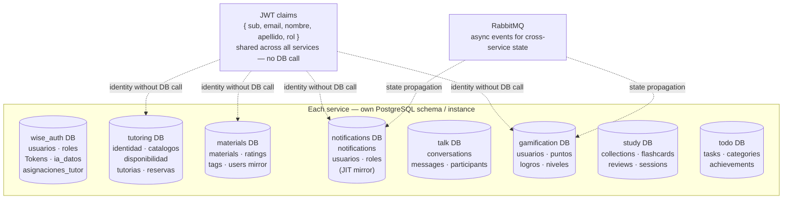

### Consequences

- **Good:** Services are fully independent. Schema migrations, performance tuning, and technology choices (ORM, indexing) are local to each service.
- **Accepted cost:** No cross-service JOINs. Reporting that needs data from multiple services requires aggregation at the application level or a dedicated analytics pipeline.

---

## ADR-009 — Vector Database in the AI Service for Semantic Search and RAG

**Status:** Accepted

### Context

The current AI service handles two structured ML predictions (dropout and academic performance) over fixed feature sets consumed from RabbitMQ. As the platform matures, new functional requirements emerge that cannot be satisfied by a traditional relational database or by fixed-feature ML models:

- **Personalized content recommendations**: students need to discover academic materials, study collections, and tutoring sessions semantically related to their current topics — not just by keyword match or category filter.
- **Tutoring session summarization and retrieval**: session notes, transcripts, and feedback accumulate over time and must be searchable by meaning, not by exact phrase.
- **Contextual AI responses (RAG)**: future AI assistant features require retrieving relevant platform context (materials, past sessions, peer performance patterns) before generating a response — retrieval-augmented generation requires a fast, high-dimensional similarity index.
- **Student similarity matching**: grouping students with similar academic profiles for peer study recommendations requires embedding-based nearest-neighbour queries, which relational databases cannot efficiently express.

A relational database cannot efficiently answer questions such as *"find the 10 materials most semantically similar to this student's current struggle"* because those queries live in dense vector space, not in row-and-column space. Adding vector search to PostgreSQL via `pgvector` is a partial solution but does not scale to millions of embeddings and lacks the index structures (HNSW, IVF) required for sub-millisecond approximate nearest-neighbour (ANN) search at platform scale.

### Decision

**Add [Qdrant](https://qdrant.tech/) as a dedicated vector store owned exclusively by the AI service.** Qdrant is an open-source, self-hostable vector database written in Rust that exposes a gRPC and REST API, supports HNSW indexing for ANN queries, and runs identically in Docker locally and on any VM or managed cloud in production.

The AI service is the sole writer and reader of Qdrant. Other services do not access it directly — they publish events or call REST endpoints on the AI service, which decides whether to embed and store or to query the vector index.

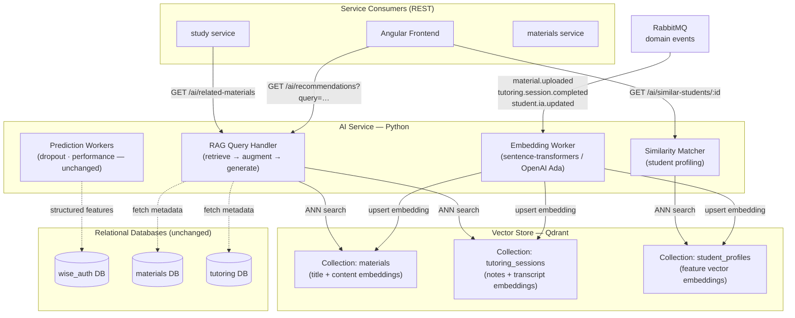

**Embedding pipeline:**

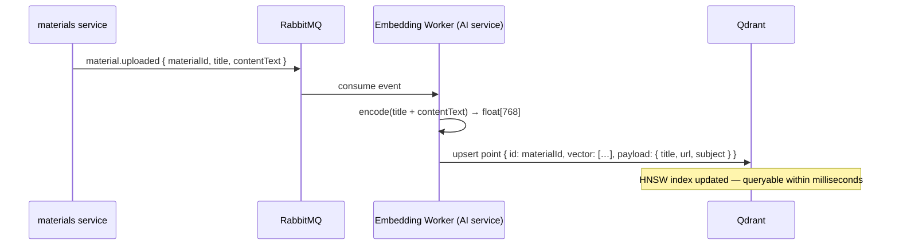

**RAG query flow:**

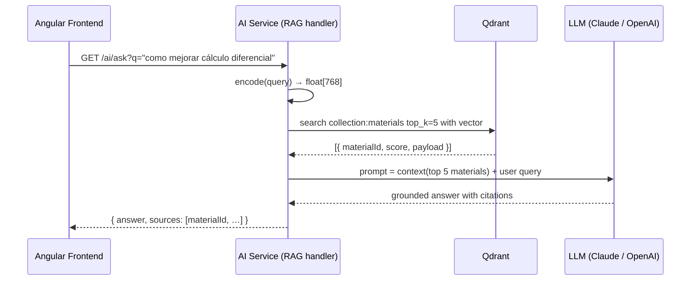

**Collections and index configuration:**

| Collection | Embedding model | Dimension | Index | Use case |
|-----------|----------------|-----------|-------|----------|
| `materials` | `paraphrase-multilingual-mpnet-base-v2` | 768 | HNSW | Content recommendation, RAG retrieval |
| `tutoring_sessions` | `paraphrase-multilingual-mpnet-base-v2` | 768 | HNSW | Session search, context for RAG |
| `student_profiles` | Custom feature encoder (MLP) | 128 | HNSW | Peer similarity matching |

**Events that trigger embedding upserts:**

| Event | Source service | Collection updated |
|-------|---------------|-------------------|
| `material.uploaded` | `materials` | `materials` |
| `material.updated` | `materials` | `materials` |
| `tutoring.session.completed` | `tutoring` | `tutoring_sessions` |
| `student.ia.updated` | `wise_auth` | `student_profiles` |

**New AI service REST endpoints:**

| Endpoint | Consumer | Description |
|----------|----------|-------------|
| `GET /ai/recommendations` | Frontend, `study` | Top-K semantically similar materials to a query |
| `GET /ai/ask` | Frontend | RAG answer grounded in platform materials |
| `GET /ai/similar-students/:id` | Admin, tutors | Students with similar academic profiles |
| `GET /ai/session-search` | Frontend | Semantic search over tutoring session notes |

### Consequences

- **Good:** Enables semantic search and RAG without changing the relational schema of any other service. The AI service remains the single owner of all vector data — no new coupling is introduced between existing services. Qdrant runs in Docker identically to production; onboarding cost is minimal. HNSW index gives sub-10ms ANN queries at scale. Existing prediction workers (dropout, performance) are untouched.
- **Accepted cost:** Adds a new infrastructure component (Qdrant) to operate and monitor. Embeddings must be kept in sync with source data — a delayed or failed `material.uploaded` event means stale search results until the event is reprocessed from the dead-letter queue. Embedding inference adds latency to the upload pipeline (acceptable because it is async via RabbitMQ). LLM calls for RAG introduce external API costs and latency that must be managed with caching and rate limiting.

---

## ADR-010 — wise_auth: Password Hashing Migration from bcrypt to Argon2id

**Status:** Accepted

### Context

`wise_auth` originally hashed passwords with **bcrypt** (cost factor 12). bcrypt is a solid, battle-tested algorithm and remains an acceptable choice, but it is not the strongest option available today:

- bcrypt is **not memory-hard**. It uses a small, fixed amount of memory, which makes it comparatively cheap to attack with GPUs and ASICs that parallelize thousands of guesses.
- bcrypt silently **truncates passwords to 72 bytes**, a footgun that must be guarded against at the DTO layer.

The current OWASP Password Storage Cheat Sheet ranks **Argon2id** as the first-choice algorithm (then scrypt, then bcrypt, then PBKDF2). Argon2id is memory-hard and tunable in memory, iterations, and parallelism, which raises the cost of large-scale offline cracking by orders of magnitude.

A separate but related weakness was found in the login flow: when the submitted email did not exist (or belonged to an OAuth-only account), the handler returned **before** running any hash comparison. That timing difference (an instant reject vs. a ~hundreds-of-milliseconds verification) is a **user-enumeration side channel** — an attacker can tell which emails are registered by measuring response time.

### Decision

Migrate password hashing to **Argon2id** behind a single `PasswordService`, and harden the login flow at the same time. Existing users must not be disrupted, so the migration is transparent and gradual.

**Design:**

- New hashes use **Argon2id** with OWASP-aligned parameters: **19 MiB** memory, **2** iterations, **parallelism 1** (`@node-rs/argon2`, which ships NAPI prebuilds via `optionalDependencies` and therefore works with the Docker image's `npm ci --ignore-scripts`).
- `PasswordService.verify` transparently accepts **both** Argon2id hashes and legacy bcrypt hashes (detected by prefix: `$argon2…` vs. `$2a/$2b/$2y`).
- **Rehash-on-login:** after a successful login, if the stored hash is not Argon2id, it is re-hashed with Argon2id and persisted. Users are migrated silently the next time they authenticate — no forced reset, no mass migration job.
- **Anti-enumeration:** when the email does not exist, the login runs a dummy Argon2id verification of equal computational cost before rejecting, so the response time no longer reveals whether the account exists.

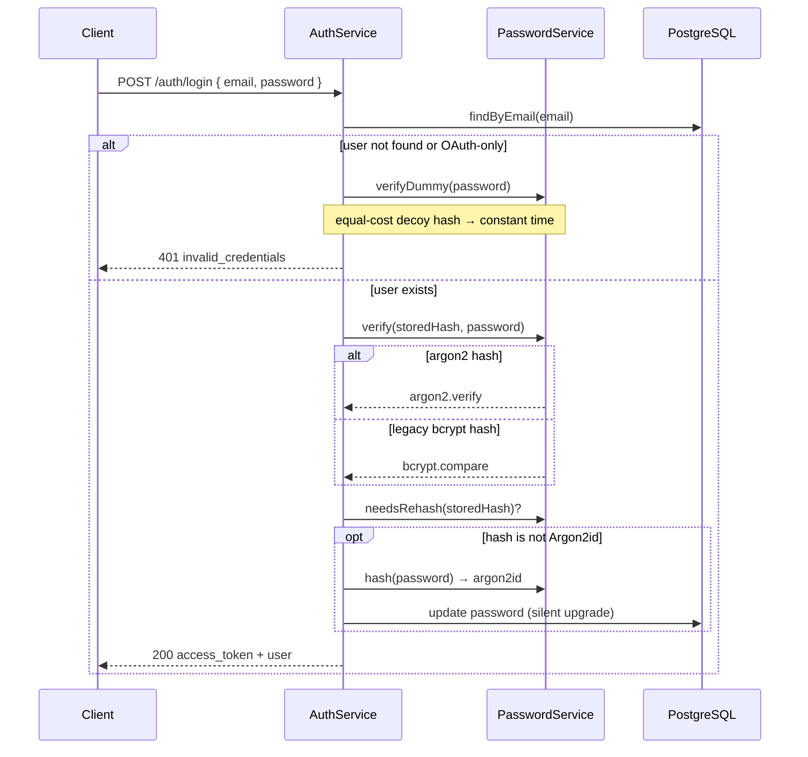

**Password hashing parameters:**

| Aspect | bcrypt (before) | Argon2id (after) |
|--------|-----------------|------------------|
| Algorithm family | Blowfish-based, CPU-bound | Memory-hard (Password Hashing Competition winner) |
| Cost parameters | cost 12 | memory 19 MiB · iterations 2 · parallelism 1 |
| GPU/ASIC resistance | Limited | High (memory-hard) |
| Max input | 72 bytes (truncates) | No practical limit |
| Library | `bcrypt` | `@node-rs/argon2` (+ `bcrypt` for legacy verification) |

### Consequences

- **Good:** New and migrated credentials use the strongest widely-recommended algorithm. Existing users are upgraded transparently on their next login with zero downtime and no forced password reset. The login flow no longer leaks account existence through timing. `@node-rs/argon2` uses per-platform prebuilds, so no compiler toolchain is needed in the image and the `--ignore-scripts` install still works.
- **Accepted cost:** Two hashing libraries coexist until every active user has logged in at least once (bcrypt is retained solely to verify not-yet-migrated hashes). Argon2id's memory-hardness makes each hash deliberately more expensive in CPU and memory than bcrypt — a conscious trade of server cost for attacker cost. Dormant accounts keep their bcrypt hash until their owner authenticates again.

---

## ADR-011 — Self-Hosted Jitsi Meet for Tutoring Video Calls

**Status:** Accepted

### Context

`VIRTUAL` tutoring sessions need a live audio/video channel embedded inside the platform so a student and tutor can meet without installing anything or leaving ECIWise. The first approach reused the **public `meet.jit.si`** server through the Jitsi IFrame API. That works for a demo but has real problems for institutional use:

- **Waiting-for-moderator screen.** Public `meet.jit.si` requires the moderator to be signed in with a Jitsi account; otherwise every participant sees a "waiting for a moderator" screen. In our flow nobody has a Jitsi account, so the tutor cannot reliably moderate.
- **No control over availability, branding, or data residency.** All media and signalling flow through a third party we do not operate. Session traffic (audio/video of tutoring sessions with real students) leaves the institution's control.
- **No way to bind the room to the platform's authorization.** Anyone with the room URL could join a public room.

We need video that ECIWise operates itself, where the tutor is always the moderator and where access is decided by the tutoring backend, not by knowledge of a URL.

### Decision

Embed **Jitsi Meet via its IFrame API** (`external_api.js`), and run a **self-hosted Jitsi stack on a dedicated server** as the production target. The Jitsi host is not hard-coded: the tutoring backend exposes it through the `JITSI_DOMAIN` environment variable. The default is the public `meet.jit.si` (so local development needs zero setup), but production points `JITSI_DOMAIN` at the institution's own Jitsi server.

Key properties:

- **Access is always gated by the backend.** The frontend calls `GET /tutorias/:id/videollamada/acceso`; the backend answers `{ canAccess, isModerator, domain, token }`. Only the tutor or a non-cancelled participant of that `VIRTUAL` session gets `canAccess: true`. The `domain` field only decides *which* Jitsi server the browser connects to — it never grants access on its own.
- **Non-guessable room per session.** The room name is `eciwise-tutoria-<tutoriaId>`, derived from the session id, so a room URL cannot be guessed from a session number.
- **Self-hosted stack.** The `jitsi/` Docker Compose stack runs the four official images: `web` (nginx reverse proxy that serves the app and `external_api.js` over HTTPS), `prosody` (XMPP signalling), `jicofo` (conference focus), and `jvb` (the video bridge that carries media over UDP 10000).
- **Moderation.** With anonymous auth (`ENABLE_AUTH=0`) the **first participant to join is moderator** and no waiting screen appears; because the flow drives the tutor in, the tutor moderates in practice. For strict role-based moderation (tutor is moderator regardless of join order), the Jitsi server can enable JWT auth and the backend signs a moderator token for the tutor (`JITSI_APP_SECRET`); students then join as guests.

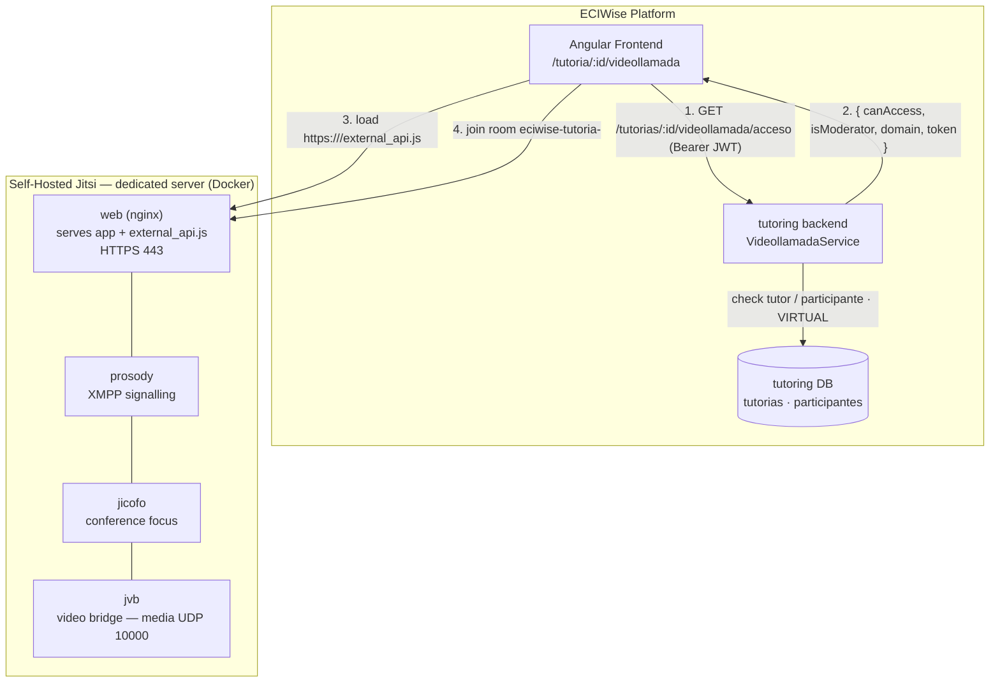

**Access resolution flow:**

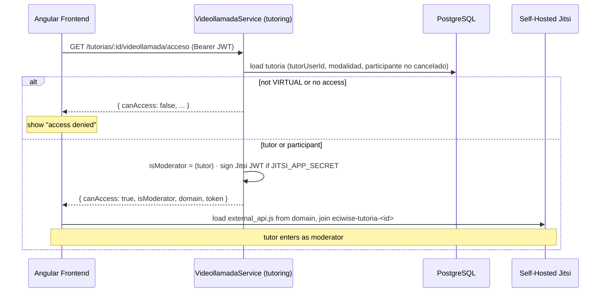

**Configuration (tutoring backend):**

| Variable | Default | Purpose |
|----------|---------|---------|
| `JITSI_DOMAIN` | `meet.jit.si` | Host of the Jitsi server (host only, no scheme). Point it at the self-hosted server in production. |
| `JITSI_APP_ID` | `eciwise` | Jitsi application id used when signing moderator tokens. |
| `JITSI_APP_SECRET` | *(empty)* | If set, the backend signs a Jitsi moderator JWT for the tutor (strict role-based moderation). If empty, everyone joins anonymously. |

### Consequences

- **Good:** The institution operates its own video infrastructure — media and signalling stay under its control, there is no "waiting for a moderator" screen, and the tutor moderates. Access is decided by the tutoring backend, not by URL knowledge. `JITSI_DOMAIN` makes it a one-variable swap between the public server (dev) and the self-hosted server (production), with optional JWT moderation on top.
- **Accepted cost:** A Jitsi server must be operated: a public DNS name, valid HTTPS (browsers require a secure context for camera/microphone and to load `external_api.js`), and open ports `443/tcp` and `10000/udp`. On Apple Silicon / Colima, Prosody's internal certificates sometimes must be generated by hand (documented in `jitsi/README.md`). Video quality and capacity now depend on the institution's own bandwidth and the sizing of the `jvb` bridge.

---

## ADR-012 — Collaborative Whiteboard via Excalidraw with a WebSocket Relay

**Status:** Accepted

### Context

A video call alone is not enough to explain most Systems Engineering topics — tutors need a shared drawing surface to sketch diagrams, formulas, and data structures live with the student. The requirements were specific:

- **Real-time, multi-user drawing** shared by everyone in the same `VIRTUAL` session.
- **The same access rules as the video call** — only the tutor or a non-cancelled participant of that session.
- **Persistence across the session** so the board survives reconnects and is still there when the tutor reopens it.
- **No heavy new infrastructure** — no third-party SaaS board, no separate CRDT server to operate.

A full operational-transform or CRDT backend would be over-engineering for a board shared by a handful of people in one session.

### Decision

Use **Excalidraw** (`@excalidraw/excalidraw`) on the frontend, synchronised in real time through a **raw WebSocket relay built into the tutoring service** (`PizarraSyncGateway`, endpoint `/pizarra/sync`). The backend is a **per-session relay**, one room per tutoring session:

- It **forwards the Excalidraw scene** (an array of elements) between the connected participants and **persists it debounced** (2 s after the last change) as opaque JSON in the `pizarra_tutoria` table.
- **Conflict reconciliation is done on the client** with Excalidraw's `reconcileElements`; the server never interprets the drawing — it only stores the last scene it received and relays scenes to the other clients.
- **Authentication on the WebSocket** is by JWT passed in the query string (`?tutoriaId=…&token=…`), because browsers cannot set headers on a WebSocket handshake. The gateway verifies the HS256 token and then re-checks whiteboard access (tutor or non-cancelled participant of a `VIRTUAL` session) before joining the socket to the room.
- **Lifecycle:** on connect the server sends an `init` message with the persisted scene; on each `scene` message it stores and relays; when the last client disconnects it persists and drops the in-memory room. A daily cron (`PizarraCleanupJob`, 03:00) deletes boards with no activity for more than **7 days** and closes their rooms.

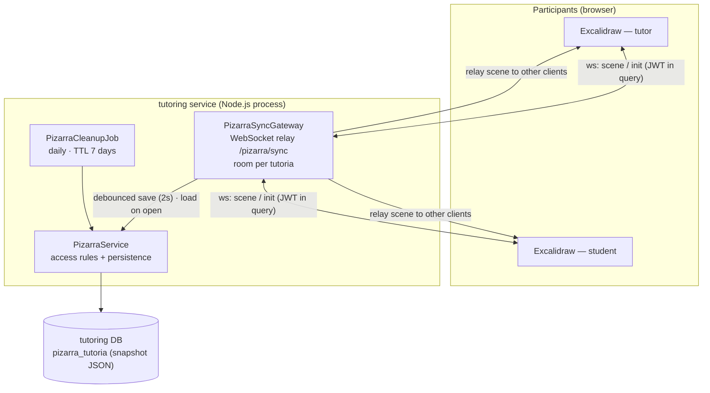

**Sync flow:**

```mermaid
sequenceDiagram
  participant T as Tutor (Excalidraw)
  participant S as Student (Excalidraw)
  participant GW as PizarraSyncGateway
  participant SVC as PizarraService
  participant DB as PostgreSQL

  T->>GW: WS upgrade /pizarra/sync?tutoriaId&token
  GW->>GW: verify JWT (HS256) + resolve pizarra access
  GW->>SVC: load persisted scene (or [])
  GW-->>T: { type: init, elements }
  T->>GW: { type: scene, elements }  (draws)
  GW->>GW: store last scene · schedule debounced save
  GW-->>S: relay { type: scene, elements }
  S->>S: reconcileElements(local, incoming)
  Note over GW,DB: 2s after last change → guardarEscena (upsert)
  GW->>SVC: persist
  SVC->>DB: UPSERT pizarra_tutoria.snapshot
```

**Persistence model (`pizarra_tutoria`):**

| Column | Purpose |
|--------|---------|
| `tutoria_id` (PK) | One board per tutoring session; cascades on session delete |
| `snapshot` (JSONB) | Excalidraw scene, stored opaque and upserted idempotently |
| `creado_en` / `actualizado_en` | Timestamps; `actualizado_en` drives the 7-day inactivity cleanup |

### Consequences

- **Good:** Real-time collaboration that reuses the tutoring service's JWT contract and the exact same access rules as the video call, with **no extra infrastructure** — the relay runs inside the existing `tutoring` process. The server stays domain-agnostic (Excalidraw elements are opaque JSON), reconciliation happens on the client, writes are debounced to batch updates, and abandoned boards are cleaned up automatically after a week.
- **Accepted cost:** The relay keeps each active room's state **in memory in a single process**, so it does not scale horizontally without shared room state or sticky WebSocket sessions. The server stores the *last scene it received* rather than a merged authoritative state, so correctness of merges is trusted to the client's `reconcileElements`. The JWT travels in the WebSocket query string (a browser handshake limitation) rather than in a header.

---

## ADR-013 — notifications: SMTP as a First-Class Alternative to SendGrid

**Status:** Accepted

### Context

The `notifications` service sent every transactional email through the **SendGrid API**. SendGrid is a good production choice — deliverability analytics, suppression lists, and a single API call for bulk fan-out — but it imposes a requirement the project could not meet during development:

- **SendGrid requires a verified sender identity.** Ideally that means a domain the team owns, with SPF and DKIM records published for it.
- ECIWise is a student project without its own mail domain. Sending as an address on a domain we do not control means the message is **not signed by that domain's SPF/DKIM**, so it **fails DMARC** at the receiving side and lands in spam — or is rejected outright. Emails were effectively not arriving.
- **Local development required real sends.** Testing the email path meant a real API key and real messages to real inboxes. There was no way to exercise templates, i18n resolution, and the dispatch flow offline.

We needed a way to actually deliver mail without owning a domain, and a way to test the whole path with nothing but Docker.

### Decision

**Add a second `EmailSenderPort` adapter, `SmtpEmailSender` (nodemailer), selected at runtime via `EMAIL_PROVIDER`.** SendGrid stays the default; SMTP becomes a fully supported alternative rather than a test double.

The key insight is *who signs the message*. Authenticating against the sender's own mailbox (e.g. Gmail with an app password) means **the provider signs the message with its own SPF/DKIM** — the mail is sent as the mailbox owner, which is exactly what the receiving side expects, so it passes DMARC and is delivered. No domain to own, no cost.

```mermaid
graph LR
  DNS["DispatchNotificationService\n(application layer)"]
  PORT["EmailSenderPort\n(domain — no provider knowledge)"]

  subgraph Root["notifications.module.ts"]
    SWITCH{"envs.emailProvider"}
  end

  SG["SendgridEmailSender\n@sendgrid/mail"]
  SMTP["SmtpEmailSender\nnodemailer"]

  API["SendGrid HTTPS API\n(verified sender required)"]
  GMAIL["Own mailbox via SMTP\n(signed by provider SPF/DKIM)"]
  MAILPIT["Mailpit :1025\n(local, no credentials)"]

  DNS --> PORT --> SWITCH
  SWITCH -->|"'sendgrid' — default"| SG --> API
  SWITCH -->|"'smtp'"| SMTP --> GMAIL
  SMTP -.->|"SMTP_HOST=localhost:1025"| MAILPIT
```

This is the **same strategy pattern already used for the broker** (ADR-002), applied to the outbound email edge. Both switches are orthogonal and resolved once, at composition time:

| Switch | Chooses | Values |
|--------|---------|--------|
| `MESSAGING_BROKER` | Where messages come **from** | `azure` · `rabbitmq` |
| `EMAIL_PROVIDER` | Where emails go **to** | `sendgrid` · `smtp` |

**Why the deliverability difference matters:**

```mermaid
sequenceDiagram
  participant N as notifications
  participant SG as SendGrid
  participant SMTP as Own mailbox (SMTP)
  participant RX as Recipient mail server

  Note over N,RX: Path A — SendGrid without an owned domain
  N->>SG: send as noreply@dominio-que-no-poseemos
  SG->>RX: message, not signed by that domain
  RX->>RX: SPF/DKIM ✗ → DMARC fails
  RX-->>N: spam / rejected

  Note over N,RX: Path B — SMTP authenticated against our own mailbox
  N->>SMTP: AUTH + send as <mailbox owner>
  SMTP->>RX: message signed with provider SPF/DKIM
  RX->>RX: SPF/DKIM ✓ → DMARC passes
  RX-->>N: delivered to inbox
```

**Adapter differences** (deliberately confined to the adapter — the port contract is identical):

| Aspect | `SendgridEmailSender` | `SmtpEmailSender` |
|--------|----------------------|-------------------|
| Transport | SendGrid HTTPS API | SMTP/TLS (`465` implicit · `587` STARTTLS · `1025` plain) |
| Credentials | API key (revocable, no mailbox password) | Mailbox / app password |
| Bulk strategy | One API call using `personalizations` | One message per recipient (addresses never exposed to each other) |
| Deliverability | Needs a verified sender or DMARC fails | Signed by the relay's own SPF/DKIM |
| Cost | Free tier, then per-message | Free (existing mailbox) |
| Local testing | Real key, real sends | Mailpit — offline, no credentials |

Provider credentials are validated **conditionally at boot** with Joi (`SENDGRID_API_KEY` required only when `EMAIL_PROVIDER=sendgrid`, `SMTP_HOST`/`SMTP_PORT` only when `smtp`), so a misconfiguration fails at startup rather than when the first notification needs to go out. `SMTP_USER`/`SMTP_PASS` stay optional because Mailpit accepts unauthenticated mail.

### Consequences

- **Good:** Email is actually delivered without owning a domain — the original blocker is gone. The full email path (templates, i18n, dispatch, logo embedding) is now testable offline against Mailpit with no API key and no real sends. Hexagonal architecture proved its value concretely: a whole second transport cost **one adapter class plus one ternary in the composition root**, with zero changes to the domain, use cases, templates, or consumers. SendGrid remains the default for production, and switching providers — or falling back if SendGrid has an incident — is one environment variable.
- **Accepted cost:** Two email libraries now ship in the image (`@sendgrid/mail` and `nodemailer`). Bulk sending is genuinely slower under SMTP — one message per recipient in a loop instead of a single batched API call — and mailbox providers such as Gmail impose their own daily send limits, so SMTP does not scale to large campaigns. SMTP also means holding a mailbox app password in configuration, which is a broader credential than a scoped, revocable SendGrid API key. And SMTP gives up SendGrid's analytics, bounce handling, and suppression lists entirely. Under SMTP, `MAIL_FROM` must match the authenticated mailbox or DMARC fails for exactly the reason the adapter exists to avoid.

---

## ADR-014 — JWT (HS256) as the Cross-Service Token Format

**Status:** Accepted

### Context

Every microservice must authenticate requests that originate from the frontend, and the platform is polyglot: NestJS (`wise_auth`, `tutoring`, `materials`, `notifications`, `community`), Spring Boot (`study`, `talk`, `todo`), .NET (`gamification`), and Go (`game`). A service must be able to decide *who is calling and with what role* on every request.

The options considered:

- **Opaque tokens + introspection** — `wise_auth` issues a random token; every service calls back to validate it.
- **PASETO** (Platform-Agnostic Security Tokens) — a modern alternative designed specifically to remove JWT's footguns.
- **JWT with RS256** — asymmetric: `wise_auth` signs with a private key, services verify with a public key.
- **JWT with HS256** — symmetric: one shared secret signs and verifies.

### Decision

**Use JWT signed with HS256 and a `JWT_SECRET` shared across services**, validated locally by each service with no call back to `wise_auth`.

```mermaid
graph LR
  AUTH["wise_auth\nsigns HS256 with JWT_SECRET"]

  subgraph Verify["Local verification — no network call to auth"]
    NEST["NestJS services\npassport-jwt · algorithms: ['HS256']"]
    SPRING["Spring services\njjwt · verifyWith(key)"]
    NET["gamification (.NET)\nSystem.IdentityModel.Tokens.Jwt"]
    GO["game (Go)\nJWTMiddleware"]
  end

  FE["Angular Frontend"]

  AUTH -->|"access_token"| FE
  FE -->|"Authorization: Bearer <jwt>"| NEST & SPRING & NET & GO
  AUTH -. "shared JWT_SECRET (config, not runtime)" .-> NEST & SPRING & NET & GO
```

**Why JWT over the alternatives:**

| Option | Verdict | Reasoning |
|--------|---------|-----------|
| **Opaque + introspection** | Rejected | Every request from every service would need an HTTP round-trip to `wise_auth`, making it a **latency tax and a single point of failure** for the whole platform. It directly contradicts ADR-008 (database per service, no inter-service lookups for identity). Revocation is its one real advantage — not enough to justify coupling every request to auth's availability. |
| **PASETO** | Rejected | Genuinely the better-designed primitive: versioned protocols, no `alg` header, so **algorithm-confusion and `alg: none` attacks are impossible by construction** rather than by correct configuration. It was rejected on **ecosystem maturity across four runtimes**, not on cryptographic merit. JWT has first-party, battle-tested libraries everywhere we need them (`passport-jwt`, `jjwt`, `System.IdentityModel.Tokens.Jwt`, `golang-jwt`); PASETO's libraries for .NET and Go are third-party, less maintained, and would have to interoperate flawlessly across all four stacks. A token format that four independent runtimes must agree on byte-for-byte is the wrong place to take an ecosystem risk. We mitigate JWT's footgun explicitly instead — see below. |
| **JWT RS256** | Rejected *for now* | The right choice **once services are operated by separate teams**: only `wise_auth` holds the private key, so a compromised downstream service can verify tokens but not mint them. Under HS256 the shared secret is a **signing** key in every service — anyone holding it can forge a token for any user and any role. Today all services are deployed by one team from one configuration source, so the blast radius is the same either way, and HS256 avoids operating a JWKS endpoint and a key-rotation story. **This is the decision most likely to be revisited.** |
| **JWT HS256** | **Accepted** | Universally supported across NestJS, Spring, .NET, and Go. Zero-latency local validation. Claims carry the identity data (`sub`, `email`, `nombre`, `apellido`, `rol`) that services need, which is precisely what makes the no-shared-database rule practical. |

**JWT's known footgun, and how it is closed.** JWT's fatal weakness is that the *token* declares its own algorithm in the `alg` header. A verifier that trusts that header can be tricked into `alg: none` (accept anything) or into verifying an RS256 token as HS256 using the public key as the HMAC secret. **The mitigation is to pin the algorithm at the verifier**, which every service does:

```ts
// wise_auth — jwt.strategy.ts
super({
  jwtFromRequest: ExtractJwt.fromAuthHeaderAsBearerToken(),
  ignoreExpiration: false,
  secretOrKey: envs.jwtSecret,
  // Fijamos el algoritmo (HS256) para evitar ataques de confusión de algoritmo.
  algorithms: ['HS256'],
});
```

This is exactly the class of bug PASETO removes by design. We accept the obligation to configure it correctly on every service instead.

**Token contract** — the claims every service can rely on:

| Claim | Purpose |
|-------|---------|
| `sub` | User UUID — **the only accepted source of user identity**; never read from the URL |
| `email` | User email |
| `nombre` / `apellido` | Display name, used for JIT provisioning |
| `rol` | `estudiante` · `tutor` · `admin` — drives role guards |
| `exp` | Expiry, configurable via `JWT_EXPIRATION`; `ignoreExpiration: false` everywhere |

### Consequences

- **Good:** Any service in any of the four runtimes validates a token in microseconds with no network call, so authentication does not couple services to `wise_auth`'s uptime. Claims carry enough identity to make JIT provisioning work without cross-service lookups (ADR-008). Algorithm pinning closes the main JWT attack class.
- **Accepted cost:** **The shared secret is a signing key in every service** — a leak anywhere lets an attacker mint a token for any user and any role. `JWT_SECRET` is a minimum-16-character Joi-validated secret managed only through deployment configuration, never committed. **Tokens cannot be revoked before expiry**: a logout is a client-side discard, so a stolen token is valid until `exp`. This is the fundamental trade for stateless validation, and it is why token lifetime is kept short. Rotating the secret invalidates every live session across the platform at once and requires coordinated redeployment of every service. Migrating to RS256 is the documented escape hatch when service ownership diverges.

---

## ADR-015 — Frontend: Angular Standalone + Signals + SSR, with No External State Library

**Status:** Accepted

### Context

The frontend is a single Angular application serving three roles (student, tutor, admin) across a wide feature surface: tutoring, materials, chat, forums, flashcards, quizzes, games, gamification, AI predictions, video calls, and a collaborative whiteboard. Two decisions had to be made early: how to structure the app, and how to manage state.

The default reflex for an app this size is a state management library (NgRx or similar). That brings actions, reducers, effects, and selectors — a large amount of ceremony that pays off when many distant components share and mutate the same state.

### Decision

**Use Angular 21 with standalone components, signals for state, and SSR — with no external state management library.** Feature state lives in `@Injectable({ providedIn: 'root' })` services that expose signals.

```mermaid
graph TB
  subgraph Core["src/app/core — cross-cutting"]
    AUTH["auth/\nAuthService · authGuard · roleGuard\nauthInterceptor"]
    HTTP["http/\nerrorInterceptor"]
    CONFIG["config/\nEnvService · api-hosts · feature flags"]
    I18N["i18n/ · theme/ · a11y/"]
    DOMAIN["tutoring/ · study/ · talk/ · game/\ncommunity/ · notifications/ · ia/\ngamification/ · todo/"]
  end

  subgraph Features["src/app/features — one folder per domain"]
    LANDING["landing/ · auth/"]
    STUDENT["student/ · tutor/ · admin/"]
    LEARN["aprendizaje/ · practica/"]
    RT["chat/ · videollamada/ · pizarra/"]
    AI["ia/ · ai-assistant/ · ai-quiz/"]
  end

  subgraph Shared["src/app/shared"]
    UI["ui/ — eci-button · eci-card · eci-icon\neci-modal · eci-select"]
    LAYOUT["layout/ — AppShell · top-bar · side-nav"]
    UTIL["util/ · styles/ · ethics/"]
  end

  Features --> Core
  Features --> Shared
  Shared --> Core
```

**State model — signals in services, not a store:**

```mermaid
graph LR
  SVC["AuthService\n_user — signal of User or null"]
  RO["user\n_user.asReadonly()"]
  C1["isAuthenticated\ncomputed — user is not null"]
  C2["role\ncomputed — user role or null"]
  CMP["Components\n(OnPush — re-render on signal change)"]

  SVC --> RO --> CMP
  SVC --> C1 --> CMP
  SVC --> C2 --> CMP
```

| Choice | Alternative rejected | Reasoning |
|--------|---------------------|-----------|
| Signals in root services | NgRx / global store | State here is **owned by one domain and read by a few components** — session, theme, chat, flags. There is almost no distant cross-domain mutation, which is the problem a store solves. `computed()` gives derived state without selectors, and OnPush components re-render precisely. NgRx would add reducers and effects to state that is genuinely one signal. |
| Standalone components | NgModules | No module bookkeeping; each component declares its own imports. The Angular team's own direction. |
| SSR (`@angular/ssr`) | SPA only | First paint before hydration, and crawlable public pages (landing, help). Cost: **browser-only code must be guarded** with `isPlatformBrowser` — `AuthService` and `ChatService` guard every `localStorage` access. |
| Runtime i18n (`@ngx-translate`) | Angular built-in i18n | One build serves all locales; the user switches language live. Angular's compile-time i18n needs one build per locale. Enforced by convention: **no visible string is hardcoded** — every one goes through the `translate` pipe. |
| `eci-*` UI kit | Component framework (Material) | The design system follows ECI's institutional identity. A shared `eci-icon` (Lucide) is mandatory — **never emojis** — and every screen must respect light, dark, and accessibility themes. |

**Bootstrap order matters** (`app.config.ts`): `provideAppInitializer` loads `EnvService` *before* feature flags, because resolving flags needs `wise_auth`'s URL — which comes from the env file. Flag initialization is deliberately **not awaited**: it seeds synchronously from local cache and syncs in the background, so a slow or down backend cannot stall hydration behind a fetch.

### Consequences

- **Good:** Far less ceremony than a store for state that is genuinely local to a domain. `computed()` derives state with no selector boilerplate. Standalone components keep imports honest and explicit. SSR gives fast first paint and crawlable public pages. One build serves every locale and every environment.
- **Accepted cost:** No store means **no time-travel debugging and no centralized action log** — tracing a state change means reading the owning service. Signals are still comparatively new, so patterns are less established than NgRx's. SSR imposes a permanent discipline: any new browser-only API must be guarded, and forgetting breaks the server render. If cross-domain state coupling grows substantially, this decision should be revisited.

---

## ADR-016 — Frontend: JWT in `localStorage` with Host-Restricted Attachment

**Status:** Accepted

### Context

The frontend must persist the JWT issued by `wise_auth` across reloads and attach it to API calls. The canonical secure answer is an **`httpOnly` cookie**: JavaScript cannot read it, so an XSS payload cannot exfiltrate the token.

That answer does not fit this architecture:

- The frontend calls **twelve different services on different origins** (`wise_auth`, tutoring, materials, notifications, study, talk, todo, community, gamification, game, and two AI services). A cookie is scoped to a domain — making one cookie work across all of them requires a shared parent domain and per-service CORS credential handling.
- Services are **stateless and validate the token locally** (ADR-014). Cookie auth would push CSRF protection into every one of them, in four different runtimes.
- The frontend also opens **WebSockets** (chat, game, whiteboard) where the browser cannot set an `Authorization` header at all, so the token must be readable by JavaScript to be passed another way.

### Decision

**Store the JWT in `localStorage`, and mitigate the resulting XSS exposure with a defense-in-depth stack rather than with cookie semantics.**

```mermaid
graph TB
  LOGIN["Login / OAuth callback"]
  LS["localStorage\neciwise.token · eciwise.session"]

  subgraph Guards["Mitigations"]
    HOST["authInterceptor\nattaches token ONLY to isOwnApiUrl(...)"]
    CSP["CSP + HSTS + X-Frame-Options: DENY\nframe-ancestors 'none' · no token to steal via clickjacking"]
    NG["Angular built-in escaping\n(no bypassSecurityTrust* · no innerHTML)"]
    EXP["isUsableToken()\nstale/expired tokens purged on read"]
  end

  API["Own services\n(wise_auth · tutoring · … )"]
  THIRD["Third-party origins"]

  LOGIN --> LS --> HOST
  HOST -->|"Authorization: Bearer"| API
  HOST -->|"no token attached"| THIRD
  CSP & NG & EXP -.->|"reduce XSS surface"| LS
```

**The critical mitigation is host restriction.** A naive interceptor attaches the token to *every* outgoing request — so any third-party URL the app ever calls receives the user's credentials. Ours attaches it only to a **centrally maintained allowlist** of our own service hosts:

```ts
// auth.interceptor.ts
const token = localStorage.getItem(TOKEN_KEY);
if (!token || !isOwnApiUrl(req.url, ownApiHosts())) {
  return next(req);   // third-party host → no token leaves
}
return next(req.clone({ setHeaders: { Authorization: `Bearer ${token}` } }));
```

`ownApiHosts()` is the single source of truth, deliberately shared with the `errorInterceptor` so that **token attachment and 401/403 session handling can never disagree about which hosts are ours**.

**Session hygiene:**

| Behaviour | Implementation |
|-----------|---------------|
| Expired token never used | `isUsableToken()` decodes `exp` on every read; an expired token is purged and treated as no session |
| Stale session cleared on boot | `restoreUser()` drops the persisted user if the token is missing, expired, or corrupt — no "logged-in" UI with a dead token |
| Dead session → logout | `errorInterceptor` logs out on 401/403 from our hosts **only when `sessionExpired()`** is true |
| Permission denial ≠ logout | A 403 with a still-valid token is a **permission** error and must not end the session |
| SSR safety | Every `localStorage` access is guarded by `isPlatformBrowser`; the server has no token |

### Consequences

- **Good:** One token works across twelve origins with no shared-domain requirement and no per-service CORS credential configuration. Services stay stateless with no CSRF machinery in four runtimes. WebSocket auth is possible at all. Host restriction means the token is never sent to a third party even if the app calls one. Expired sessions are cleaned deterministically instead of failing at the API.
- **Accepted cost:** **`localStorage` is readable by any JavaScript running on the origin — a successful XSS means token theft, and no amount of CSP fully removes that risk.** This is a real, permanent trade, accepted because cookie auth is impractical across twelve origins plus WebSockets. It raises the stakes on the mitigations: Angular's escaping must not be bypassed (`bypassSecurityTrust*` and raw `innerHTML` stay out of the codebase), CSP and HSTS must stay in place, and any dependency that could inject script is a token-theft vector. Combined with ADR-014's lack of revocation, a stolen token is usable until `exp` — which is precisely why token lifetime is kept short.

---

## ADR-017 — Frontend: Runtime Configuration via `assets/env.json`

**Status:** Accepted

### Context

The frontend must know the base URL of **twelve backend services**. Those URLs differ per environment: `localhost` ports in development, Azure hostnames in production.

Angular's conventional answer is `environment.ts` / `environment.prod.ts`, swapped at build time by the CLI. That makes **the build artifact environment-specific**: promoting the exact binary that passed CI to production is impossible, because production needs a different build. Changing one service's hostname means a full rebuild and redeploy.

### Decision

**Resolve service URLs at runtime from `/assets/env.json`, fetched during app initialization.** The build is environment-agnostic; `scripts/write-env.mjs` generates `env.json` from process environment variables at container start or deploy time.

```mermaid
graph LR
  ENVVARS["Environment variables\nAUTH_SERVICE · TALK_SERVICE\nTUTORING_SERVICE · …"]
  SCRIPT["scripts/write-env.mjs\n(prestart / prebuild)"]
  JSON["/assets/env.json"]
  SVC["EnvService.load()\nfetch · no-cache · 3s timeout"]
  TOKENS["Injection tokens\nAUTH_CONFIG · TALK_CONFIG\nTUTORING_CONFIG · …"]
  APP["Services & components"]

  ENVVARS --> SCRIPT --> JSON --> SVC --> TOKENS --> APP
  SVC -.->|"fetch fails or times out"| DEF["localhost defaults"] --> TOKENS
```

Each service gets a **typed injection token** wired by a factory, so no component ever reads a raw URL:

```ts
{
  provide: TUTORING_CONFIG,
  useFactory: (env: EnvService) => ({
    tutoringApiUrl: env.get('tutoringApiUrl', 'http://localhost:3007'),
  }),
  deps: [EnvService],
}
```

**The timeout is load-bearing.** `env.load()` blocks app initialization. Without a bound, a backend that accepts the connection but never responds leaves the page **rendered by SSR but never hydrated** — visible and completely unresponsive. A 3-second `AbortSignal.timeout` falls through to the same `catch` path as a failed fetch, so the app boots with defaults instead of hanging:

```ts
const res = await fetch('/assets/env.json', {
  cache: 'no-cache',
  signal: AbortSignal.timeout(LOAD_TIMEOUT_MS),  // 3000
});
```

| Property | Consequence |
|----------|------------|
| One artifact, many environments | The binary that passed CI is the binary that ships |
| Hostname change without rebuild | Edit `env.json` (or the env var + restart) — no CI round-trip |
| `cache: 'no-cache'` | A stale cached `env.json` can't pin the app to a dead backend |
| Timeout + `catch` → defaults | A hung or missing config never blocks hydration |
| Typed tokens, not raw strings | URLs are injectable and mockable; tests override the token |

### Consequences

- **Good:** One build artifact promotes unchanged from CI to production. Service URLs change without a rebuild. `EnvService` degrades to sensible localhost defaults, so a developer with no `env.json` still gets a working app. Typed tokens keep URL knowledge out of components and make tests trivial to configure. `ownApiHosts()` (ADR-016) reads the same tokens, so **the security allowlist automatically follows the runtime configuration** — no second list to drift.
- **Accepted cost:** One extra network round-trip before the app initializes (bounded at 3s). Configuration errors surface at **runtime, not build time** — a typo in `env.json` is not caught by the compiler and silently falls back to a localhost default, which in production looks like a service being down. `env.json` is public: it is served to the browser, so **it may only ever contain non-secret values** — URLs, never keys.

---

## ADR-018 — materials: Storage Provider Abstraction (Azure Blob / S3)

**Status:** Accepted

### Context

The `materials` service stores academic PDFs uploaded by students and tutors. The files must live in object storage, not in the database. Azure Blob Storage was the natural default since the platform deploys to Azure — but committing the domain to the Azure SDK would make a later move to AWS (or to MinIO for local development) a rewrite of every code path that touches a file.

The service also publishes domain events (material uploaded, rated) and faces the same broker question as `notifications` (ADR-002).

### Decision

**Abstract both the storage backend and the message bus behind domain ports, and select the concrete adapter via environment variables** — consistent with `notifications` (ADR-013) and the broker strategy (ADR-002).

```mermaid
graph LR
  UC["Use cases\n(MaterialService)"]

  subgraph Ports["Domain ports"]
    SP["StoragePort"]
    MB["MessageBusPort"]
  end

  subgraph Storage["STORAGE_PROVIDER"]
    AZ["azure-blob.adapter\nAzure Blob Storage"]
    S3["s3.adapter\nAWS S3"]
  end

  subgraph Bus["MESSAGE_BUS_PROVIDER"]
    ASB["Azure Service Bus"]
    RMQ["RabbitMQ"]
  end

  UC --> SP & MB
  SP -->|"'azure' (default)"| AZ
  SP -->|"'s3'"| S3
  MB -->|"'azure'"| ASB
  MB -->|"'rabbitmq'"| RMQ
```

| Variable | Options | Default |
|----------|---------|---------|
| `STORAGE_PROVIDER` | `azure` (Blob Storage) · `s3` (AWS S3) | `azure` |
| `MESSAGE_BUS_PROVIDER` | `azure` (Service Bus) · `rabbitmq` | `azure` |

Each provider's credentials are **conditionally required** by Joi (`BLOB_STORAGE_CONNECTION_STRING` only when `azure`; `AWS_ACCESS_KEY_ID` only when `s3`), so a misconfiguration fails at boot.

**Upload validation is layered, because MIME type is a claim, not a fact.** The `Content-Type` header is attacker-controlled — trusting it means accepting an executable renamed to `.pdf`. The controller therefore checks the **magic bytes** as well:

```mermaid
graph TB
  UP["POST /material (multipart)"]
  JWT["JwtAuthGuard\nverify token · JIT upsert user"]
  MIME["mimetype === 'application/pdf'"]
  MAGIC["magic bytes: %PDF- (0x25 50 44 46 2D)"]
  SIZE["size ≤ MAX_FILE_SIZE_MB"]
  AI["AI content validation"]
  STORE["StoragePort.upload → Azure Blob / S3"]
  EV["MessageBusPort.publish(material.uploaded)"]

  UP --> JWT --> MIME --> MAGIC --> SIZE --> AI --> STORE --> EV
  MIME -.->|reject| ERR["400 — not a PDF"]
  MAGIC -.->|reject| ERR2["400 — MIME spoofing"]
  SIZE -.->|reject| ERR3["400 — too large"]
```

| Layer | Check | Attack blocked |
|-------|-------|---------------|
| Guard | Valid JWT + JIT user upsert | Anonymous upload |
| MIME | `mimetype === 'application/pdf'` | Casual wrong-type upload |
| Magic bytes | First 5 bytes are `%PDF-` | **MIME spoofing** — the declared type is a claim; the bytes are evidence |
| Size | `MAX_FILE_SIZE_MB` enforced in the controller *and* in the Multer limit | Storage exhaustion / DoS |
| AI validation | Content screening before persistence | Irrelevant or inappropriate material |

### Consequences

- **Good:** The domain never imports a cloud SDK — moving from Azure Blob to S3 is an environment variable, and the same is true for the broker. Local development can point at S3-compatible storage without touching code. Conditional Joi validation means credentials for the *unselected* provider need not exist. The dual MIME + magic-byte check makes a spoofed content type useless, and the size limit is enforced twice (framework and controller) so neither alone is a single point of failure.
- **Accepted cost:** Two storage SDKs ship in the image even though one is active. The port is a lowest-common-denominator abstraction: provider-specific features (Azure lifecycle policies, S3 storage classes) are not exposed and would need a port change to reach. Magic-byte checking requires the file to be buffered in memory before validation, which is fine at the current size ceiling but would need streaming validation for substantially larger files.

---

## ADR-019 — Node.js / Express.js for the AI RAG Service

**Status:** Accepted

### Context

The ECIWise platform is deliberately polyglot — each microservice uses the runtime that best fits its problem domain and its team's expertise ([ADR-001](#adr-001--microservice-architecture--event-driven-architecture), [ADR-003](#adr-003--architecture-pattern-per-service-hexagonal-for-complex-domains-layered-for-simple-ones)). The AI RAG service needed a runtime for a workload that is fundamentally **I/O-bound**: every user request triggers 1–5 external HTTP calls to LLM APIs and embedding providers, plus pgvector similarity queries against PostgreSQL. There is no CPU-intensive computation, no WebSocket broadcasting, and no real-time tick loop.

Two primary options were evaluated:

| Criterion | NestJS (TypeScript) | Express.js (TypeScript) |
|-----------|--------------------|-----------------------|
| DI container | Built-in, auto-wired | Manual — constructor injection |
| Learning curve | Steep — decorators, modules, providers | Flat — standard Node.js HTTP |
| Boot speed | Slower (metadata scanning, module tree) | Faster — minimal framework overhead |
| Hexagonal architecture | Natural via NestJS modules + providers | Achievable via manual DI in route files |
| Streaming support | Requires `@nestjs/platform-express` adapter | Native `res.write()` for SSE |
| Ecosystem fit | Shares language with `wise_auth`, `tutoring`, `materials` | Shares language with frontend toolchain (npm, ESM) |
| Community familiarity | Team had limited NestJS experience for this service | Team was productive with Express from sprint 1 |

The service was the **first TypeScript microservice built** in the project, created before the team standardized on NestJS for subsequent services (`wise_auth`, `tutoring`, `materials`, `notifications`). By the time NestJS became the default, the AI service was stable and working.

### Decision

**Use Node.js 22 with Express.js 4 and native ESM modules** for the AI RAG service. Hexagonal architecture (Ports & Adapters) is implemented through:

- **Input ports**: `IChatPort`, `ISocraticPort`, `IQuizPort` — defined as JSDoc `@interface` contracts in `src/domain/ports/input/`.
- **Output ports**: `ILLMPort`, `IDocumentRepositoryPort`, `IEmbeddingPort`, `IMessageBusPort` — defined in `src/domain/ports/output/`.
- **Dependency injection**: manual constructor wiring at the route level (`chat.routes.js`, `quiz.routes.js`, `socratic.routes.js`), passing adapter instances into use-case constructors.

```mermaid
graph TB
  subgraph "NestJS (5 services)" 
    NEST["wise_auth · tutoring · materials · notifications · community"]
    NEST_MOD["NestJS Modules\nauto-wired DI\nDecorators: @Injectable, @Controller"]
  end

  subgraph "Express.js (AI RAG service)"
    EXP["AI RAG Service"]
    EXP_ROUTE["Route files\nchat.routes.js · quiz.routes.js"]
    EXP_UC["Use Cases\nChatUseCase · SocraticUseCase · QuizUseCase"]
    EXP_PORTS["Ports (JSDoc interfaces)\nIChatPort · IQuizPort · ILLMPort · etc."]
  end

  NEST --> NEST_MOD
  EXP --> EXP_ROUTE
  EXP_ROUTE --> EXP_UC
  EXP_UC --> EXP_PORTS
```

The domain layer (`src/domain/`) does not import any Express or infrastructure library. Use cases depend only on port interfaces. Adapters (`GeminiService`, `PrismaService`, `EmbeddingService`, `ServiceBusService`) are wired as concrete implementations at the boundary.

### Consequences

- **Good:** Fast startup, flat learning curve, minimal boilerplate. Streaming SSE responses (`/api/chat/stream`) work natively with Express's `res.write()`. The service was production-ready within weeks of initial development.
- **Accepted cost:** No auto-wired DI container — adding a new port requires manually passing the adapter through route → use-case constructors. This is manageable at the current service size (~15 files) but would become tedious if the service grows to 50+ files. The team accepted this trade-off because the service's scope is well-bounded (chat, quiz, socratic, document analysis).

---

## ADR-020 — pgvector as Vector Database (not Qdrant)

**Status:** Accepted

### Context

[ADR-009](#adr-009--vector-database-in-the-ai-service-for-semantic-search-and-rag) analyzed the vector database landscape and concluded that a dedicated vector store (Qdrant) would eventually be needed as the platform scales. At the time of that analysis, the platform's document corpus was expected to grow to hundreds of thousands of embeddings.

However, the **current production reality** is different:

| Factor | Current state | Threshold for Qdrant migration |
|--------|--------------|-------------------------------|
| Document count | ~50–200 academic PDFs | 10,000+ documents |
| Embeddings per doc | ~10–30 chunks | Unchanged |
| Total embeddings | ~500–6,000 | 100,000+ |
| Query latency (pgvector HNSW) | < 50 ms | > 200 ms unacceptable |
| Infrastructure overhead | Zero — PostgreSQL already deployed | Justified only at scale |

The AI service already owns a PostgreSQL instance with the `pgvector` extension. Adding Qdrant would introduce a second database to operate, monitor, back up, and secure — overhead that is not justified at current volume.

### Decision

**Keep pgvector as the vector database for the AI service.** The `DocumentChunk.embedding` column stores `vector(768)` embeddings. An HNSW index (`m=16, ef_construction=64`) provides sub-50 ms cosine similarity search. The vector search operator (`<=>`) is used via Prisma `$queryRaw` because Prisma's query builder does not natively support pgvector types.

```mermaid
graph TB
  subgraph "AI Service (Node.js)"
    EMB["EmbeddingService\n(text-embedding-004 → float[768])"]
    SEARCH["AdvancedSearchService\nvector + FTS + fuzzy + semantic"]
    GEM["GeminiService\nsearchRelevantDocuments()"]
  end

  subgraph "PostgreSQL + pgvector"
    EXT["CREATE EXTENSION vector"]
    TBL["DocumentChunk.embedding\ncolumn: vector(768)"]
    IDX["HNSW index\nm=16, ef_construction=64\nvector_cosine_ops"]
  end

  EMB -->|"INSERT ... ::vector"| TBL
  SEARCH -->|"SELECT ... <=> $1::vector"| TBL
  GEM -->|"SELECT ... <=> $1::vector"| TBL
  TBL --- IDX
  IDX --- EXT
```

The migration to Qdrant (per ADR-009) remains a **documented future option**. The trigger criteria are:

1. Total embeddings exceed 100,000.
2. Query latency consistently exceeds 200 ms.
3. Multi-collection search (materials + sessions + student profiles) is needed.

When those thresholds are reached, the `IDocumentRepositoryPort` and `IEmbeddingPort` abstractions already exist — migrating to Qdrant requires only a new adapter, not a rewrite of use cases.

### Consequences

- **Good:** Zero additional infrastructure. PostgreSQL is already deployed, backed up, and monitored. The pgvector HNSW index handles current volume with sub-50 ms latency. No new operational cost or complexity.
- **Accepted cost:** pgvector does not scale as efficiently as purpose-built vector databases for collections exceeding millions of vectors. If the platform reaches that scale, a migration will be required. The port abstractions mitigate this cost — the migration path is an adapter swap, not a rewrite.

---

## ADR-021 — Multi-Provider LLM and Embedding Abstraction

**Status:** Accepted

### Context

The AI service calls external LLM APIs for chat responses, document classification, quiz generation, and answer evaluation. It also calls embedding APIs for vector search. Locking into a single provider creates three risks:

1. **Vendor lock-in** — a price increase or API deprecation forces a code rewrite.
2. **Development friction** — cloud LLM APIs cost money per call; developers need a free or local alternative for iteration.
3. **Availability** — a provider outage blocks all AI features with no fallback.

The platform also runs in different environments: local development, CI/CD tests, and Azure production. Each environment has different budget and latency constraints.

### Decision

**Abstract both LLM and embedding providers behind unified interfaces** with runtime selection via environment variables. The `ILLMPort` and `IEmbeddingPort` interfaces define the contracts. A single adapter (`GeminiService`) implements both ports and dispatches to the correct provider based on config.

```mermaid
graph LR
  ENV["ENV VARS\nLLM_PROVIDER\nEMBEDDING_PROVIDER"]
  
  subgraph "Config Resolution"
    CFG["config.llm.provider\nconfig.embedding.provider\n(defaults cascade)"]
  end

  subgraph "Adapters"
    GEM["GeminiService\n(callLLM, callLLMStream)\n(ILLMPort)"]
    EMB["EmbeddingService\n(getEmbedding)\n(IEmbeddingPort)"]
  end

  subgraph "Providers"
    GP["Google Gemini\nREST API v1beta"]
    OP["OpenAI\n/chat/completions"]
    GQ["Groq\nOpenAI-compatible"]
    OL["Ollama\n/api/generate"]
  end

  ENV --> CFG
  CFG --> GEM
  CFG --> EMB
  GEM --> GP & OP & GQ & OL
  EMB --> GP & OP & OL
```

**Provider matrix:**

| Provider | LLM | Embeddings | Protocol | Free tier |
|----------|-----|-----------|----------|-----------|
| Gemini | `gemini-2.0-flash` | `text-embedding-004` | Gemini REST API v1beta | Yes (RPM limits) |
| OpenAI | `gpt-4o-mini` | `text-embedding-3-small` | OpenAI-compatible `/chat/completions` | Pay-per-token |
| Groq | `llama-3.1-8b-instant` | Not supported | OpenAI-compatible `/chat/completions` | Yes (free tier) |
| Ollama | `llama3.1` | `nomic-embed-text` | Ollama `/api/generate` | Free (local) |

**Embedding provider fallback:** `EMBEDDING_PROVIDER` → `LLM_PROVIDER` → `'gemini'`. If Groq is selected as the LLM provider, embeddings fall back to Gemini because Groq does not support an embedding API.

Switching providers requires **zero code changes** — one environment variable swap.

### Consequences

- **Good:** Developers can use Ollama locally (no API costs), Groq for fast CI tests (free tier), and Gemini or OpenAI in production. Provider outages can be mitigated at deploy time by switching env vars. The `callLLM` and `callLLMStream` interfaces are identical across providers.
- **Accepted cost:** Each provider has quirks (Gemini uses `responseSchema` for JSON mode; Groq/OpenAI use `response_format: { type: "json_object" }`). The adapter contains provider-specific branching logic (~30 lines per provider in `callLLM`). Adding a new provider requires adding a `case` block, not a new class — simpler but less extensible than a full Strategy pattern with separate classes.

---

## ADR-022 — Provider-Agnostic Message Bus (Azure Service Bus + RabbitMQ)

**Status:** Accepted

### Context

The AI service receives document analysis requests asynchronously from the ECIWise backend. The platform's message broker strategy ([ADR-002](#adr-002--rabbitmq-as-the-event-broker-azure-service-bus-kept-as-a-contingency-alternative)) chose RabbitMQ as the primary broker with Azure Service Bus as a contingency.

The AI service needs to consume from and publish to a message bus, but the choice of broker depends on the deployment environment:

| Environment | Broker | Reason |
|-------------|--------|--------|
| Local development | RabbitMQ (Docker) | Free, full control over topology |
| CI/CD tests | Azure Service Bus (emulator) or mock | Matches production contract |
| Azure production (current) | Azure Service Bus | Managed, integrated with Azure App Service |
| Azure production (future) | RabbitMQ (self-hosted) | Consistent with ADR-002 |

Hard-coding a broker SDK into the service would force a rewrite to switch. This violates the hexagonal architecture principle of swappable adapters.

### Decision

**Implement the message bus as an output port (`IMessageBusPort`) with two driven adapters** and a **factory function** (`createMessageBus()`) that selects the adapter at startup based on the `MESSAGE_BUS_PROVIDER` environment variable.

```mermaid
graph TB
  subgraph "Domain Port"
    PORT["IMessageBusPort\nsend · subscribe · close"]
  end

  subgraph "Factory"
    FACT["createMessageBus()\nsrc/adapters/messageBus/index.js\nreads MESSAGE_BUS_PROVIDER"]
  end

  subgraph "Adapters"
    AZURE["AzureServiceBusAdapter\n@ServiceBusClient\nsrc/adapters/messageBus/\nazureServiceBus.adapter.js"]
    RABBIT["RabbitMqAdapter\namqplib\nsrc/adapters/messageBus/\nrabbitMq.adapter.js"]
  end

  subgraph "External Brokers"
    ASB_EXT["Azure Service Bus\n(material.process / material.responses)"]
    RMQ_EXT["RabbitMQ\n(material.process / material.responses)"]
  end

  subgraph "Consumer"
    SB["ServiceBusService\n(subscribes to material.process\npublishes to material.responses)"]
  end

  FACT -->|"MESSAGE_BUS_PROVIDER=azure"| AZURE
  FACT -->|"MESSAGE_BUS_PROVIDER=rabbitmq"| RABBIT
  AZURE -.->|"implements"| PORT
  RABBIT -.->|"implements"| PORT
  AZURE --> ASB_EXT
  RABBIT --> RMQ_EXT
  SB --> PORT
```

**Adapter normalisation:** Both adapters normalise the message contract so that `ServiceBusService` sees a uniform interface regardless of broker:

| Concern | Azure Service Bus | RabbitMQ |
|---------|-------------------|----------|
| `subject` | Top-level `msg.subject` property | `msg.properties.headers.subject` |
| `correlationId` | Top-level `msg.correlationId` | `msg.properties.correlationId` |
| Ack (success) | `completeMessage(msg)` | `channel.ack(msg)` |
| Nack (failure) | `deadLetterMessage(msg)` | `channel.nack(msg, false, false)` |

The factory validates required configuration at boot and throws immediately if the selected provider's credentials are missing, preventing silent failures at runtime.

### Consequences

- **Good:** Switching brokers is a single environment variable change (`MESSAGE_BUS_PROVIDER=rabbitmq`). Local development uses RabbitMQ (free, Docker-based); production can use Azure Service Bus (managed) or RabbitMQ (self-hosted). Both adapters are < 160 lines each and independently testable.
- **Accepted cost:** The AMQP protocol (RabbitMQ) and the Azure Service Bus protocol have different message formats, delivery semantics, and connection management. The normalisation layer in each adapter handles these differences, but edge cases (e.g., message auto-renew, prefetch counts) may behave differently between brokers. The team monitors both adapters in staging before switching production traffic.

---

## ADR-023 — Hybrid Search Strategy (Vector + Full-Text + Fuzzy + Semantic)

**Status:** Accepted

### Context

The RAG pipeline depends on retrieving the most relevant documents for a user query. No single search method covers all cases:

| Method | Strength | Weakness |
|--------|----------|----------|
| Vector search (pgvector cosine) | Understands meaning, not just keywords | Fails if no embeddings exist; misses exact terminology |
| Full-text search (PostgreSQL `to_tsquery`) | Fast, index-backed, exact keyword matching | Cannot understand synonyms; language-dependent |
| Fuzzy search (Fuse.js) | Tolerates typos and partial matches | No semantic understanding; slow on large corpora |
| Semantic search (synonym expansion) | Bridges vocabulary gaps ("ia" → "inteligencia artificial") | Limited by synonym dictionary size; adds embedding latency |

A student might search for `"progrmacion"` (typo), `"ia"` (abbreviation), or `"transformada de Fourier"` (precise technical term). No single method handles all three optimally.

### Decision

**Combine all four search methods with configurable weights**, running them in parallel and merging results via a weighted score combiner. Each method returns a ranked list of documents with a normalised score (0–1). The combiner computes a final weighted score per document and returns results above a configurable threshold.

```mermaid
flowchart LR
  Q["🔍 User Query"] 

  Q --> V["Vector Search\nweight: 0.40\npgvector cosine distance\non DocumentChunk embeddings"]
  Q --> FTS["Full-Text Search\nweight: 0.30\nto_tsquery('spanish', ...)\nILIKE fallback"]
  Q --> FZ["Fuzzy Search\nweight: 0.20\nFuse.js · threshold 0.4\nmateria · tema · tags · fileName"]
  Q --> SEM["Semantic Search\nweight: 0.10\nsynonymMap expansion\nre-embedding → vector search"]

  V --> SC["📊 Score Combiner\ncombineScores()\nscore ≥ 0.1 threshold"]
  FTS --> SC
  FZ --> SC
  SEM --> SC

  SC --> R["✅ Ranked Results\ntop documents for RAG context"]
```

**Fallback strategy per method:**

| Method | Primary | Fallback |
|--------|---------|----------|
| Vector | pgvector cosine `<=>` | Keyword ILIKE on Summary fields |
| Full-text | `to_tsquery('spanish', ...)` | ILIKE on materia, tema, tags, summary |
| Fuzzy | Fuse.js with normalised scores | Empty result (no fallback) |
| Semantic | Synonym expansion + embedding | Original query embedding (skip expansion) |

**Score normalisation:** Each method returns scores in different ranges. Before combining, all scores are min-max normalised to [0, 1] across the result set to prevent any single method from dominating.

**When each method fires:**

| Scenario | Most effective method | Example |
|----------|----------------------|---------|
| Precise technical query | Vector (40%) | "transformada de Fourier" |
| Exact keyword match | FTS (30%) | "cálculo diferencial" |
| Typo in search | Fuzzy (20%) | "progrmacion" → "programación" |
| Abbreviation / slang | Semantic (10%) | "ia" → "inteligencia artificial, machine learning" |

### Consequences

- **Good:** No single search failure blocks document retrieval. If pgvector is unavailable, FTS and fuzzy still return results. If FTS indexes are missing, ILIKE activates automatically. The weight configuration is tunable per deployment without code changes.
- **Accepted cost:** Four parallel searches add latency compared to a single search. In practice, vector and FTS queries execute in < 30 ms (HNSW + GIN indexes), fuzzy search loads up to 1000 docs into memory for Fuse.js (< 50 ms), and semantic search adds one extra embedding call (~200 ms). Total p95 latency is < 400 ms, which is acceptable for the RAG pipeline where the LLM call itself takes 2–5 seconds. The score combiner adds ~1 ms of computation.
