# Architecture Decision Records

This page documents the key architectural decisions made throughout the ECIWise project — what was decided, why, the trade-offs accepted, and how each service evolved over time.

---

## ADR-001 — Microservice Architecture + Event-Driven Architecture

**Status:** Accepted

### Context

ECIWise needed to support multiple independent domains: authentication, tutoring scheduling, academic materials, real-time chat, study practice, gamification, notifications, and AI predictions. A monolith would couple these domains, slow down team development, and make independent scaling impossible.

Beyond isolation, several cross-domain concerns required one service to react to what happens in another — a confirmed booking should trigger a notification, a completed tutoring session should award gamification points, a student registration should dispatch a prediction request to the AI workers. Solving this with direct HTTP calls between services would create tight temporal coupling: if the notification service is down, the booking would fail. That is not acceptable.

### Decision

ECIWise combines two complementary architectural styles:

**Microservice Architecture** — each domain is an independent service with its own database, deployment, and technology stack. No shared database. No direct inter-service database access.

**Event-Driven Architecture** — services that produce significant domain events publish them to RabbitMQ. Interested services subscribe independently. Producers do not know who consumes their events. This decouples services in time and space: a consumer being down does not fail the producer.

These two styles are not alternatives — microservices define the *decomposition boundary*, event-driven defines the *communication model* between those boundaries.

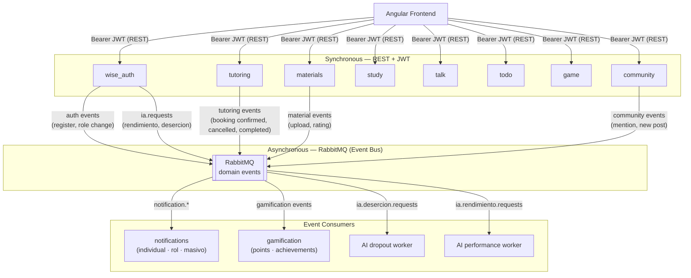

**When each communication style is used:**

| Scenario | Style | Reason |
|----------|-------|--------|
| Frontend requests data or actions | REST + JWT | Synchronous, needs immediate response |
| Booking confirmed → send email | Event-driven | Notification service failure must not fail the booking |
| Session completed → award points | Event-driven | Gamification is a side effect, not part of the booking transaction |
| Student registers → trigger AI prediction | Event-driven | Prediction is async; result arrives via a separate results exchange |
| `wise_auth` issues token → any service validates it | JWT local validation | No inter-service call needed at request time |

### Consequences

- **Good:** Services are decoupled in time — a consumer being unavailable does not affect the producer. New consumers can subscribe to existing events with zero changes to producers. REST gives fast, predictable responses for user-facing interactions.
- **Accepted cost:** Eventual consistency — the gamification or notification side effect may arrive milliseconds after the main action completes. Requires RabbitMQ cluster monitoring and dead-letter queue handling for failed deliveries.

---

## ADR-002 — RabbitMQ as the Event Broker (Azure Service Bus kept as a contingency alternative)

**Status:** Accepted

### Context

The platform needs asynchronous event delivery for notifications, gamification triggers, and AI prediction requests. Two options were evaluated: **Azure Service Bus** (managed, pay-per-use, Azure-native) and **RabbitMQ** (open-source, self-hostable, protocol-level control via AMQP).

RabbitMQ gives the team direct control over exchanges, queues, routing keys, and dead-letter policies — topology that Azure Service Bus expresses differently and at higher cost. It also runs identically in Docker locally and on any VPS or cloud VM in production, with no per-message billing.

### Decision

**Use RabbitMQ as the chosen broker for both development and production.** Implement a strategy-based broker abstraction in consumer services (notifications, gamification) so that the active broker is selected at runtime via the `MESSAGING_BROKER` environment variable. This keeps Azure Service Bus as a zero-code-change contingency if the team ever migrates to a fully managed Azure hosting model.

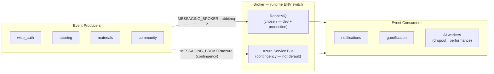

**RabbitMQ topology (notifications service):**

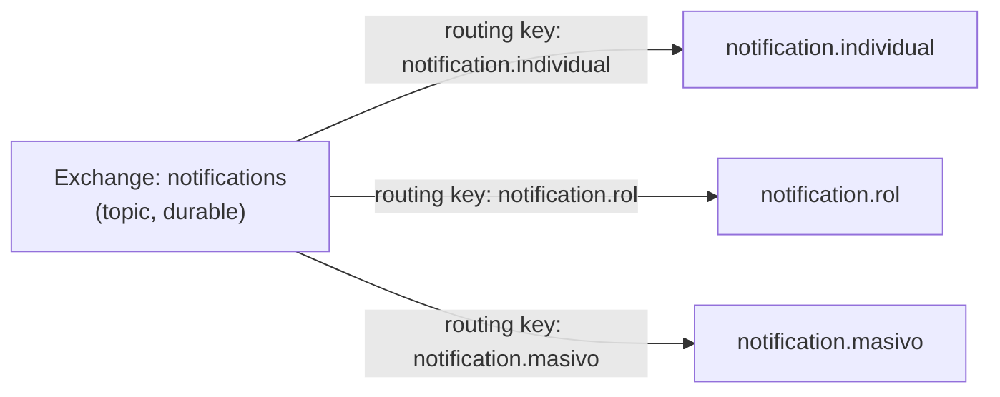

**AI prediction pipeline via RabbitMQ:**

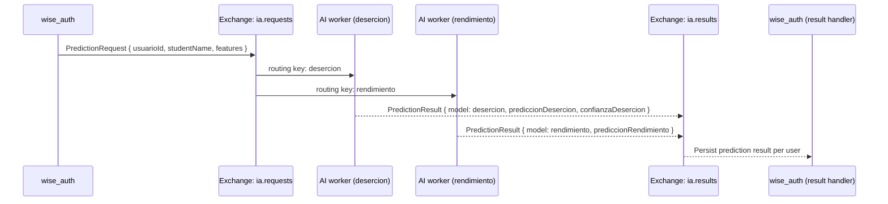

### Consequences

- **Good:** Full control over topology (exchanges, routing keys, DLX, TTL) with zero per-message cost. Runs identically locally and in production. Strategy abstraction means Azure SB can be activated at any time by changing one env var.
- **Accepted cost:** Self-hosting RabbitMQ in production requires cluster management, monitoring, and HA configuration. Not a managed service.

---

## ADR-003 — Architecture Pattern per Service: Hexagonal for Complex Domains, Layered for Simple Ones

**Status:** Accepted

### Context

Not every service in ECIWise has the same complexity or the same number of infrastructure dependencies. Applying hexagonal architecture everywhere would add unnecessary boilerplate to services whose domain logic is thin and whose infrastructure dependencies are stable. Applying layered architecture to services with rich domain rules or many swappable adapters would create framework coupling that makes testing and evolution harder.

### Decision

Choose the architecture pattern based on the domain complexity and number of swappable infrastructure dependencies for each service.

**Services using Hexagonal Architecture (Ports & Adapters):**

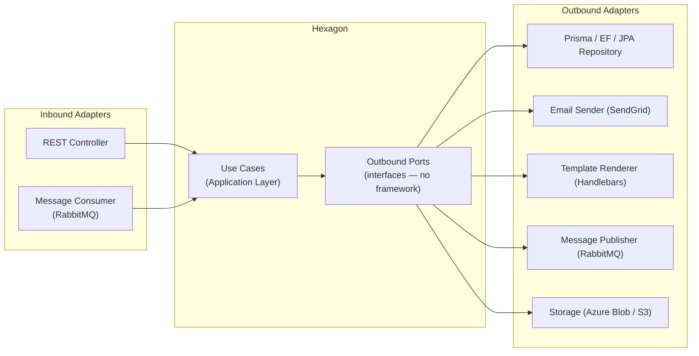

| Service | Why hexagonal | Key outbound ports |
|---------|--------------|-------------------|
| `wise_auth` | Many outbound dependencies (DB, cache, 2 RabbitMQ publishers); migrated from layered after god-class problems | `IUsuarioRepository`, `IDatosIaRepository`, `IPrediccionPublisher`, `INotificationPublisher`, `ICacheService` |
| `notifications` | Swappable broker (RabbitMQ / Azure SB), swappable email provider, swappable template engine | `NotificationRepositoryPort`, `EmailSenderPort`, `TemplateRendererPort` |
| `materials` | Swappable cloud storage (Azure Blob / S3), swappable message bus | `StoragePort`, `MessageBusPort`, `MaterialRepositoryPort` |
| `tutoring` | Rich domain (booking rules, concurrency, state machines), fully rewritten | Per-slice repository ports |
| `todo` | Port interfaces isolate Spring Data JPA from use cases | Input/output ports per use case |
| `gamification` | .NET Clean Architecture — RabbitMQ consumer adapter decoupled from domain | Repository ports, `Gamification.Messaging` adapter |

**Services using Classic Layered Architecture (Controller → Service → Repository):**

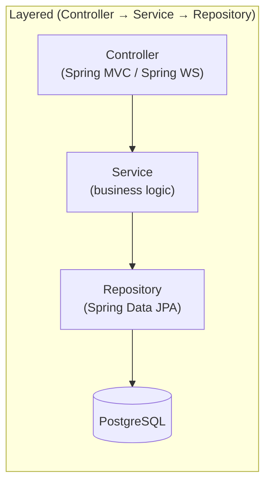

| Service | Technology | Reason for layered |
|---------|-----------|-------------------|
| `study` | Spring Boot · JPA | Thin domain (quiz sessions, flashcard review); stable infrastructure; no swappable adapters needed |
| `talk` | Spring Boot · WebSocket · Redis · MinIO | Chat logic is CRUD + real-time broadcast; Spring Data and MinIO are fixed infrastructure |

**`game` — event-driven goroutine model (Go):**

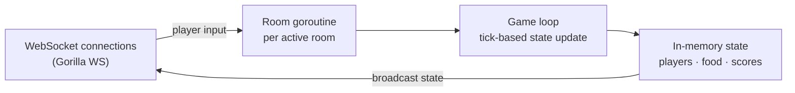

`game` is a Go WebSocket server with a tick-based game loop and in-memory state. It has no database and no traditional architectural layers — the model that fits its problem is concurrent goroutines per room with a shared state machine, not ports and adapters.

### Consequences

- **Good:** Each service uses the pattern that matches its actual complexity. Simple services (`study`, `talk`) avoid hexagonal boilerplate. Complex services (`notifications`, `tutoring`, `wise_auth`) get full testability and adapter swappability.
- **Accepted cost:** The codebase is not architecturally uniform. New team members must read the README of each service to understand which pattern it follows.

---

## ADR-004 — wise_auth: Migration from Layered to Hexagonal

**Status:** Accepted

### Context

`wise_auth` started as a standard NestJS layered service (Controller → AuthService → PrismaService). As new capabilities were added — IA data management, prediction publishing, tutor assignments, notification publishing, role management — the single `AuthService` grew into a god class with direct Prisma calls and tight coupling to infrastructure.

### Decision

Refactor `wise_auth` to hexagonal architecture, introducing domain ports for all outbound dependencies and isolating each capability in its own module.

```mermaid
graph TB
  subgraph Before["Before — Layered"]
    C1["AuthController"]
    S1["AuthService\n(god class: auth + IA + users + predictions)"]
    P1["PrismaService\n(direct calls everywhere)"]
    C1 --> S1 --> P1
  end

  subgraph After["After — Hexagonal"]
    subgraph Controllers["Inbound"]
      AC["AuthController"]
      IC["IaController"]
    end
    subgraph Domain["Domain Ports (outbound)"]
      UR["IUsuarioRepository"]
      DIR["IDatosIaRepository"]
      ATR["IAsignacionTutorRepository"]
      PP["IPrediccionPublisher"]
      NP["INotificationPublisher"]
      CS["ICacheService"]
    end
    subgraph Adapters["Infrastructure Adapters"]
      PRISMA["Prisma Repositories"]
      RMQ["RabbitMQ Publishers"]
      REDIS["Redis Cache"]
    end
    Controllers --> Domain
    Domain --> Adapters
  end
```

**Key domain port contracts added:**

| Port | Purpose |
|------|---------|
| `IUsuarioRepository` | User CRUD, role and status management |
| `IDatosIaRepository` | AI profile data per student |
| `IAsignacionTutorRepository` | Tutor–student assignment management |
| `IPrediccionPublisher` | Publishes prediction requests to RabbitMQ (`ia.requests` exchange) |
| `INotificationPublisher` | Publishes notification events to RabbitMQ |
| `ICacheService` | Cache abstraction (Redis adapter) |

### Consequences

- **Good:** `wise_auth` can now be tested without a database. The IA module, auth module, and user management module are independently testable. Adding a new outbound dependency (e.g., a new cache provider) is an adapter swap.
- **Accepted cost:** Migration required significant refactoring effort mid-project. All existing tests had to be updated to use port fakes instead of Prisma mocks.

---

## ADR-005 — tutoring: Complete Rewrite with Hexagonal + DDD + Vertical Slicing

**Status:** Accepted

### Context

The original tutoring service was a proof-of-concept with a flat layered structure and mock in-memory persistence. As business requirements matured — recurring availability templates, slot materialization, concurrency-safe booking, cancellation rules, rescheduling — the original codebase could not support them without a full redesign. The domain was too rich for a simple CRUD service.

### Decision

**Rewrite from scratch** using Hexagonal Architecture + Domain-Driven Design + Vertical Slicing. Each business capability is an independent vertical slice with its own domain model, use cases, and infrastructure. Dependencies flow strictly inward.

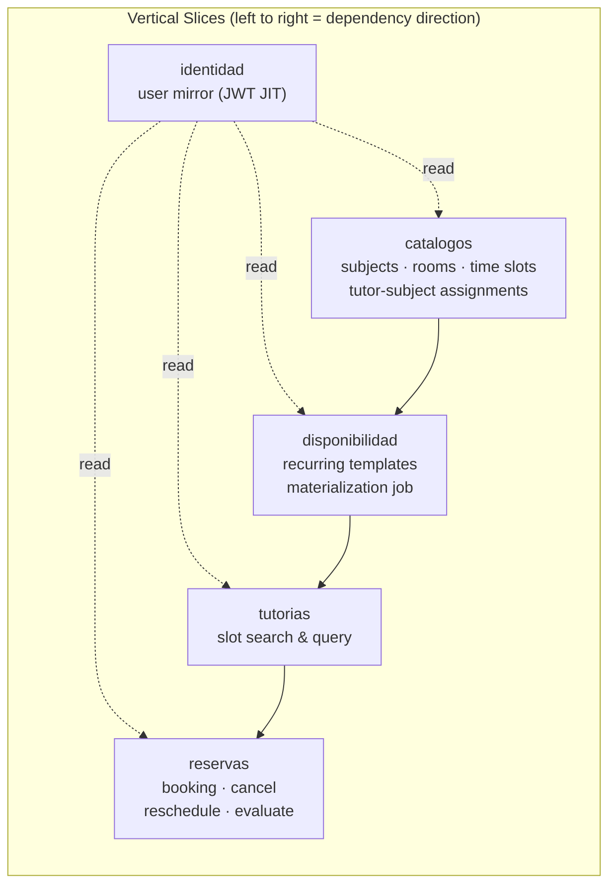

**Business rules encoded in the domain layer:**

| Rule | Enforcement layer |
|------|-----------------|
| No overlapping bookings (RN-01) | Domain — `Reserva` aggregate |
| Slot capacity control (RN-09) | Domain — atomic counter in `Tutoria` |
| Cancellation before session | Domain — `Reserva` state machine |
| Rescheduling constraints | Domain — `Reserva` aggregate |
| Slot materialization idempotency | Application — `DisponibilidadService` cron job |

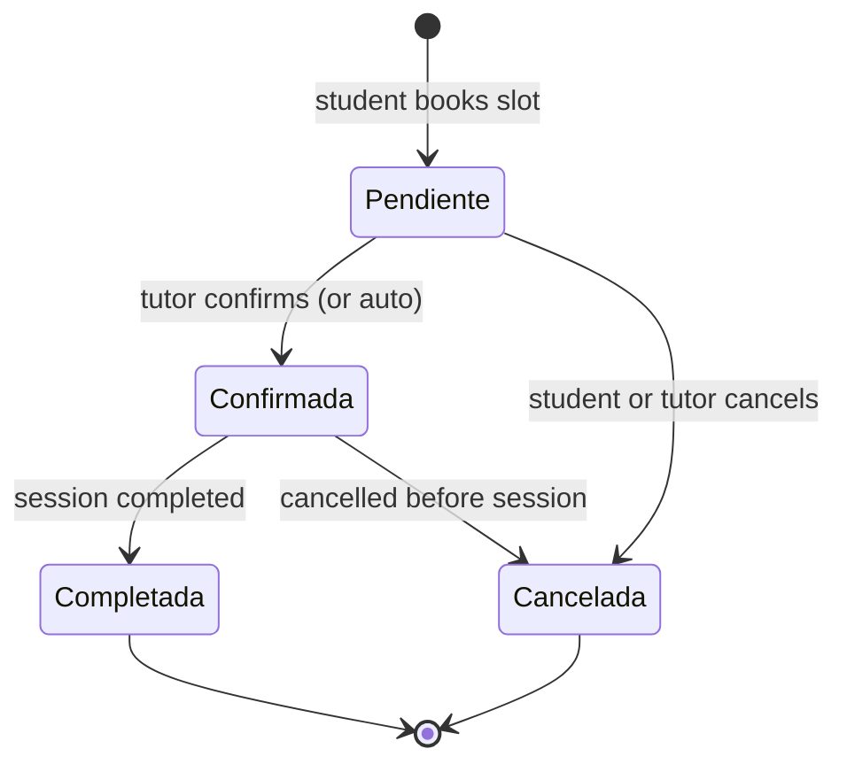

**Technology:**

| Component | Technology |
|-----------|------------|
| Framework | NestJS 11 · TypeScript (strict) |
| Architecture | Hexagonal + DDD + Vertical Slicing |
| ORM / DB | Prisma 7 · PostgreSQL (Neon) |
| Scheduling | `@nestjs/schedule` (materialization cron) |
| Events | `@nestjs/event-emitter` (in-memory, prepared for RabbitMQ) |
| Auth | Passport-JWT HS256 |
| Tests | Jest — domain unit tests with pure fakes (no DB) |

### Consequences

- **Good:** Business rules are explicit, testable, and co-located with the domain. Replacing the persistence layer requires only new adapters. The cron-based materialization decouples scheduling from the booking API.
- **Accepted cost:** Full rewrite cost in sprint time. DDD overhead is only justified by domain complexity — for simpler CRUD services it would be over-engineering.

---

## ADR-006 — gamification: .NET 10 / C# with Hexagonal Architecture

**Status:** Accepted

### Context

The gamification service manages points, levels, achievements, and leaderboards driven by user actions across the platform. The team member leading this service had deep expertise in .NET/C#. Additionally, .NET's strong typing, LINQ, and Entity Framework ecosystem were well-suited to the query-heavy nature of leaderboards and achievement evaluation.

### Decision

Build the gamification service in **.NET 10 / C#** following Clean/Hexagonal Architecture (Ports & Adapters). The service consumes domain events from RabbitMQ via a dedicated `Gamification.Messaging` project and exposes a REST API via `Gamification.Api`.

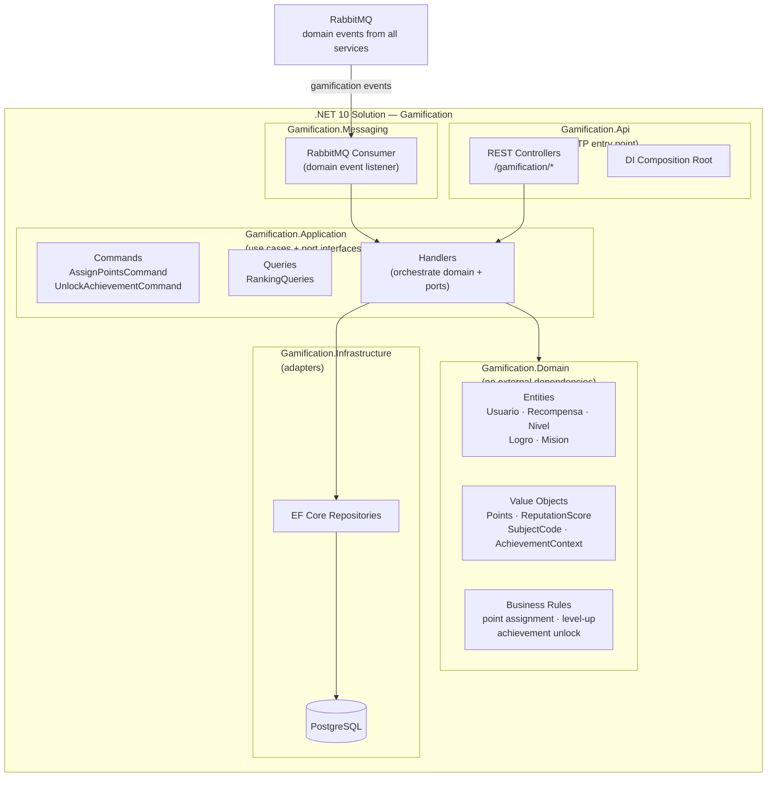

**Technology:**

| Component | Technology |
|-----------|------------|
| Platform | .NET 10 · C# |
| Architecture | Hexagonal / Clean Architecture |
| ORM | Entity Framework Core |
| Messaging | RabbitMQ (`Gamification.Messaging`) |
| Tests | xUnit · Moq |

### Consequences

- **Good:** Polyglot microservice architecture — the best tool for the job per team expertise. .NET's LINQ and EF Core are excellent for leaderboard and ranking queries. The service is fully decoupled from all other services via RabbitMQ events.
- **Accepted cost:** Adds a second runtime to the stack (.NET alongside Node.js and JVM). Docker images are slightly larger.

---

## ADR-007 — Two AI Models: Dropout Prediction and Performance Prediction

**Status:** Accepted

### Context

The platform aims to reduce student dropout and improve academic outcomes. Two distinct prediction needs were identified:
- **Dropout risk**: predict whether a student is at risk of dropping out based on socioeconomic, academic, and enrollment factors.
- **Academic performance**: predict a student's likely academic performance based on study habits, attendance, tutoring usage, and extracurricular factors.

These are different ML models with different feature sets and different intervention strategies. Merging them into one service would couple unrelated models and complicate independent retraining.

### Decision

Deploy **two independent AI worker services** (Python), each consuming from a dedicated RabbitMQ queue and publishing results back to `wise_auth` via the `ia.results` exchange. `wise_auth` orchestrates the prediction request lifecycle and stores results per student.

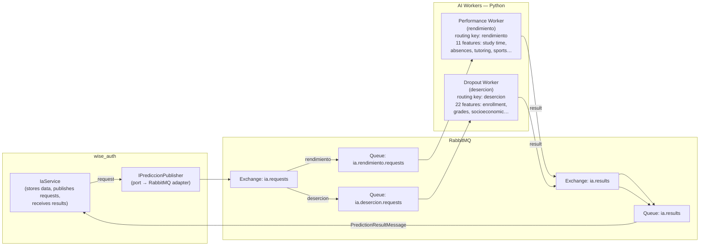

**Feature sets:**

| Model | Routing Key | Key Features |
|-------|-------------|-------------|
| Performance | `rendimiento` | `studyTimeWeekly`, `absences`, `tutoring`, `extracurricular`, `sports`, `music`, `volunteering`, `parentalSupport`, `gender`, `ethnicity`, `parentalEducation` |
| Dropout | `desercion` | `curricularUnits1stSem*` (credited, enrolled, evaluated, approved), `ageAtEnrollment`, `scholarshipHolder`, `debtor`, `tuitionFeesUpToDate`, `course`, `previousQualification`, `maritalStatus`, `applicationMode` + others |

**Result message contract:**

```json
{
  "usuarioId": "uuid",
  "model": "rendimiento | desercion",
  "prediccionRendimiento": "High | Medium | Low",
  "prediccionDesercion": "At Risk | Not At Risk",
  "confianzaDesercion": 0.87
}
```

**Role-based access to predictions:**

| Endpoint | Student | Tutor | Admin |
|----------|:-------:|:-----:|:-----:|
| `GET /ia/me` — own IA data | x | | |
| `PUT /ia/me` — update own features | x | | |
| `PUT /ia/me/prediccion` — save own prediction | x | | |
| `GET /ia/estudiantes` — list all students | | x | x |
| `GET /ia/estudiantes/:id` — student detail | | x | x |
| `GET /ia/metricas` — dashboard metrics | | x | x |
| `GET /ia/estadisticas` — platform-wide stats | | | x |
| `POST /ia/asignaciones` — tutor-student link | | | x |

### Consequences

- **Good:** Models are independently retrainable and deployable. Failure in one worker does not affect the other. Feature sets are cleanly separated. `wise_auth` acts as a thin orchestrator, not an ML service.
- **Accepted cost:** Two additional services to deploy and monitor. The async request/result pattern introduces latency; prediction results are not immediate. Students need to fill in their IA profile data before predictions can be generated.

---

## ADR-008 — Database per Service

**Status:** Accepted

### Context

Multiple microservices sharing a single database creates hidden coupling: schema migrations in one service can break another, a slow query in one domain can starve others, and it becomes impossible to evolve the data model of one service independently.

### Decision

Each microservice **owns its own database instance**. No service reads or writes directly to another service's database. Cross-service data needs are satisfied via:
- **JWT claims** for identity data (name, role, email) — no service calls `wise_auth` to look up a user.
- **JIT user provisioning** — services that need local user records upsert them on first authenticated request from JWT claims.
- **Async events** — for data that changes over time (e.g., a tutoring completion event triggers a gamification point award via RabbitMQ, not a direct DB read).

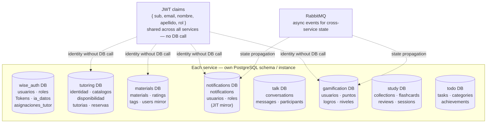

### Consequences

- **Good:** Services are fully independent. Schema migrations, performance tuning, and technology choices (ORM, indexing) are local to each service.
- **Accepted cost:** No cross-service JOINs. Reporting that needs data from multiple services requires aggregation at the application level or a dedicated analytics pipeline.

---

## ADR-009 — Vector Database in the AI Service for Semantic Search and RAG

**Status:** Accepted

### Context

The current AI service handles two structured ML predictions (dropout and academic performance) over fixed feature sets consumed from RabbitMQ. As the platform matures, new functional requirements emerge that cannot be satisfied by a traditional relational database or by fixed-feature ML models:

- **Personalized content recommendations**: students need to discover academic materials, study collections, and tutoring sessions semantically related to their current topics — not just by keyword match or category filter.
- **Tutoring session summarization and retrieval**: session notes, transcripts, and feedback accumulate over time and must be searchable by meaning, not by exact phrase.
- **Contextual AI responses (RAG)**: future AI assistant features require retrieving relevant platform context (materials, past sessions, peer performance patterns) before generating a response — retrieval-augmented generation requires a fast, high-dimensional similarity index.
- **Student similarity matching**: grouping students with similar academic profiles for peer study recommendations requires embedding-based nearest-neighbour queries, which relational databases cannot efficiently express.

A relational database cannot efficiently answer questions such as *"find the 10 materials most semantically similar to this student's current struggle"* because those queries live in dense vector space, not in row-and-column space. Adding vector search to PostgreSQL via `pgvector` is a partial solution but does not scale to millions of embeddings and lacks the index structures (HNSW, IVF) required for sub-millisecond approximate nearest-neighbour (ANN) search at platform scale.

### Decision

**Add [Qdrant](https://qdrant.tech/) as a dedicated vector store owned exclusively by the AI service.** Qdrant is an open-source, self-hostable vector database written in Rust that exposes a gRPC and REST API, supports HNSW indexing for ANN queries, and runs identically in Docker locally and on any VM or managed cloud in production.

The AI service is the sole writer and reader of Qdrant. Other services do not access it directly — they publish events or call REST endpoints on the AI service, which decides whether to embed and store or to query the vector index.

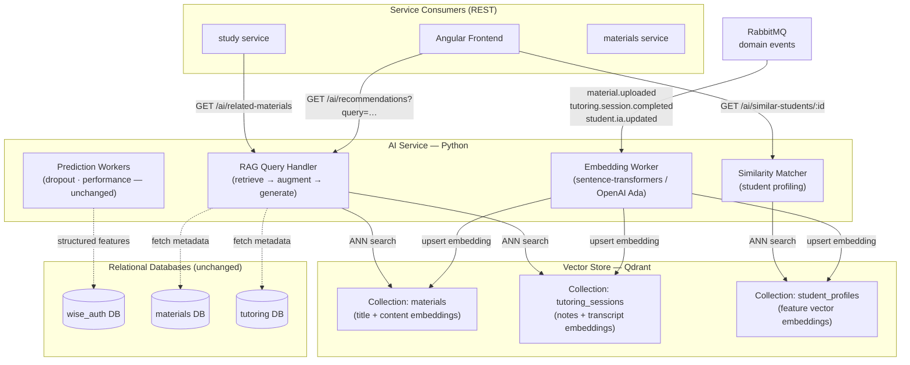

**Embedding pipeline:**

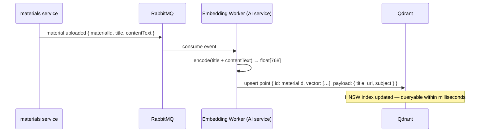

**RAG query flow:**

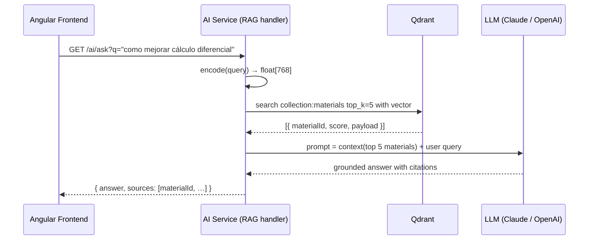

**Collections and index configuration:**

| Collection | Embedding model | Dimension | Index | Use case |
|-----------|----------------|-----------|-------|----------|
| `materials` | `paraphrase-multilingual-mpnet-base-v2` | 768 | HNSW | Content recommendation, RAG retrieval |
| `tutoring_sessions` | `paraphrase-multilingual-mpnet-base-v2` | 768 | HNSW | Session search, context for RAG |
| `student_profiles` | Custom feature encoder (MLP) | 128 | HNSW | Peer similarity matching |

**Events that trigger embedding upserts:**

| Event | Source service | Collection updated |
|-------|---------------|-------------------|
| `material.uploaded` | `materials` | `materials` |
| `material.updated` | `materials` | `materials` |
| `tutoring.session.completed` | `tutoring` | `tutoring_sessions` |
| `student.ia.updated` | `wise_auth` | `student_profiles` |

**New AI service REST endpoints:**

| Endpoint | Consumer | Description |
|----------|----------|-------------|
| `GET /ai/recommendations` | Frontend, `study` | Top-K semantically similar materials to a query |
| `GET /ai/ask` | Frontend | RAG answer grounded in platform materials |
| `GET /ai/similar-students/:id` | Admin, tutors | Students with similar academic profiles |
| `GET /ai/session-search` | Frontend | Semantic search over tutoring session notes |

### Consequences

- **Good:** Enables semantic search and RAG without changing the relational schema of any other service. The AI service remains the single owner of all vector data — no new coupling is introduced between existing services. Qdrant runs in Docker identically to production; onboarding cost is minimal. HNSW index gives sub-10ms ANN queries at scale. Existing prediction workers (dropout, performance) are untouched.
- **Accepted cost:** Adds a new infrastructure component (Qdrant) to operate and monitor. Embeddings must be kept in sync with source data — a delayed or failed `material.uploaded` event means stale search results until the event is reprocessed from the dead-letter queue. Embedding inference adds latency to the upload pipeline (acceptable because it is async via RabbitMQ). LLM calls for RAG introduce external API costs and latency that must be managed with caching and rate limiting.

---

## ADR-010 — wise_auth: Password Hashing Migration from bcrypt to Argon2id

**Status:** Accepted

### Context

`wise_auth` originally hashed passwords with **bcrypt** (cost factor 12). bcrypt is a solid, battle-tested algorithm and remains an acceptable choice, but it is not the strongest option available today:

- bcrypt is **not memory-hard**. It uses a small, fixed amount of memory, which makes it comparatively cheap to attack with GPUs and ASICs that parallelize thousands of guesses.
- bcrypt silently **truncates passwords to 72 bytes**, a footgun that must be guarded against at the DTO layer.

The current OWASP Password Storage Cheat Sheet ranks **Argon2id** as the first-choice algorithm (then scrypt, then bcrypt, then PBKDF2). Argon2id is memory-hard and tunable in memory, iterations, and parallelism, which raises the cost of large-scale offline cracking by orders of magnitude.

A separate but related weakness was found in the login flow: when the submitted email did not exist (or belonged to an OAuth-only account), the handler returned **before** running any hash comparison. That timing difference (an instant reject vs. a ~hundreds-of-milliseconds verification) is a **user-enumeration side channel** — an attacker can tell which emails are registered by measuring response time.

### Decision

Migrate password hashing to **Argon2id** behind a single `PasswordService`, and harden the login flow at the same time. Existing users must not be disrupted, so the migration is transparent and gradual.

**Design:**

- New hashes use **Argon2id** with OWASP-aligned parameters: **19 MiB** memory, **2** iterations, **parallelism 1** (`@node-rs/argon2`, which ships NAPI prebuilds via `optionalDependencies` and therefore works with the Docker image's `npm ci --ignore-scripts`).
- `PasswordService.verify` transparently accepts **both** Argon2id hashes and legacy bcrypt hashes (detected by prefix: `$argon2…` vs. `$2a/$2b/$2y`).
- **Rehash-on-login:** after a successful login, if the stored hash is not Argon2id, it is re-hashed with Argon2id and persisted. Users are migrated silently the next time they authenticate — no forced reset, no mass migration job.
- **Anti-enumeration:** when the email does not exist, the login runs a dummy Argon2id verification of equal computational cost before rejecting, so the response time no longer reveals whether the account exists.

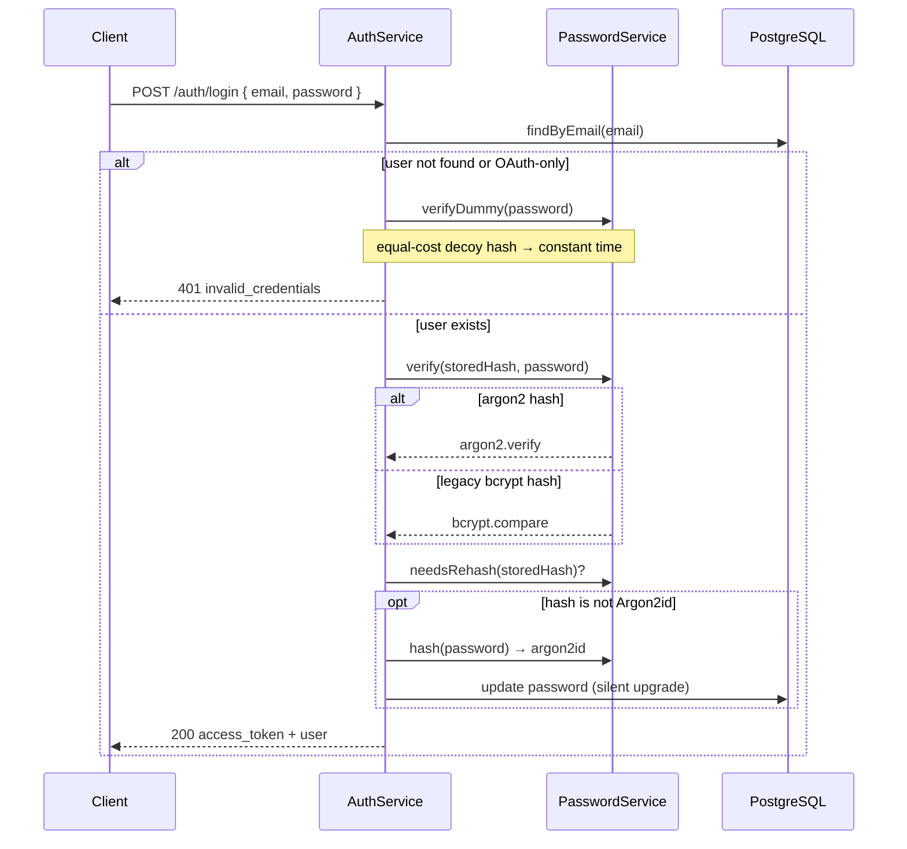

**Password hashing parameters:**

| Aspect | bcrypt (before) | Argon2id (after) |
|--------|-----------------|------------------|
| Algorithm family | Blowfish-based, CPU-bound | Memory-hard (Password Hashing Competition winner) |
| Cost parameters | cost 12 | memory 19 MiB · iterations 2 · parallelism 1 |
| GPU/ASIC resistance | Limited | High (memory-hard) |
| Max input | 72 bytes (truncates) | No practical limit |
| Library | `bcrypt` | `@node-rs/argon2` (+ `bcrypt` for legacy verification) |

### Consequences

- **Good:** New and migrated credentials use the strongest widely-recommended algorithm. Existing users are upgraded transparently on their next login with zero downtime and no forced password reset. The login flow no longer leaks account existence through timing. `@node-rs/argon2` uses per-platform prebuilds, so no compiler toolchain is needed in the image and the `--ignore-scripts` install still works.
- **Accepted cost:** Two hashing libraries coexist until every active user has logged in at least once (bcrypt is retained solely to verify not-yet-migrated hashes). Argon2id's memory-hardness makes each hash deliberately more expensive in CPU and memory than bcrypt — a conscious trade of server cost for attacker cost. Dormant accounts keep their bcrypt hash until their owner authenticates again.

---

## ADR-011 — Self-Hosted Jitsi Meet for Tutoring Video Calls

**Status:** Accepted

### Context

`VIRTUAL` tutoring sessions need a live audio/video channel embedded inside the platform so a student and tutor can meet without installing anything or leaving ECIWise. The first approach reused the **public `meet.jit.si`** server through the Jitsi IFrame API. That works for a demo but has real problems for institutional use:

- **Waiting-for-moderator screen.** Public `meet.jit.si` requires the moderator to be signed in with a Jitsi account; otherwise every participant sees a "waiting for a moderator" screen. In our flow nobody has a Jitsi account, so the tutor cannot reliably moderate.
- **No control over availability, branding, or data residency.** All media and signalling flow through a third party we do not operate. Session traffic (audio/video of tutoring sessions with real students) leaves the institution's control.
- **No way to bind the room to the platform's authorization.** Anyone with the room URL could join a public room.

We need video that ECIWise operates itself, where the tutor is always the moderator and where access is decided by the tutoring backend, not by knowledge of a URL.

### Decision

Embed **Jitsi Meet via its IFrame API** (`external_api.js`), and run a **self-hosted Jitsi stack on a dedicated server** as the production target. The Jitsi host is not hard-coded: the tutoring backend exposes it through the `JITSI_DOMAIN` environment variable. The default is the public `meet.jit.si` (so local development needs zero setup), but production points `JITSI_DOMAIN` at the institution's own Jitsi server.

Key properties:

- **Access is always gated by the backend.** The frontend calls `GET /tutorias/:id/videollamada/acceso`; the backend answers `{ canAccess, isModerator, domain, token }`. Only the tutor or a non-cancelled participant of that `VIRTUAL` session gets `canAccess: true`. The `domain` field only decides *which* Jitsi server the browser connects to — it never grants access on its own.
- **Non-guessable room per session.** The room name is `eciwise-tutoria-<tutoriaId>`, derived from the session id, so a room URL cannot be guessed from a session number.
- **Self-hosted stack.** The `jitsi/` Docker Compose stack runs the four official images: `web` (nginx reverse proxy that serves the app and `external_api.js` over HTTPS), `prosody` (XMPP signalling), `jicofo` (conference focus), and `jvb` (the video bridge that carries media over UDP 10000).
- **Moderation.** With anonymous auth (`ENABLE_AUTH=0`) the **first participant to join is moderator** and no waiting screen appears; because the flow drives the tutor in, the tutor moderates in practice. For strict role-based moderation (tutor is moderator regardless of join order), the Jitsi server can enable JWT auth and the backend signs a moderator token for the tutor (`JITSI_APP_SECRET`); students then join as guests.

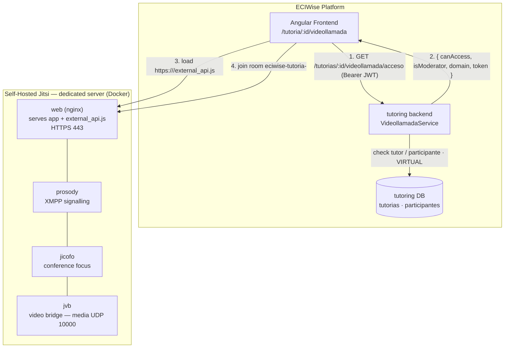

**Access resolution flow:**

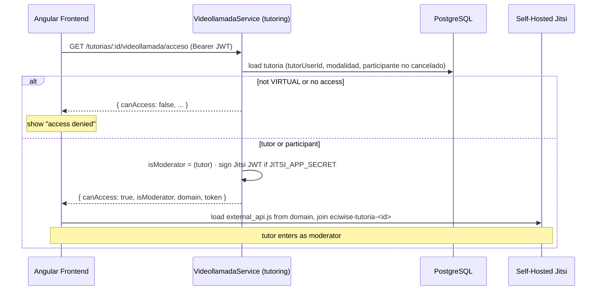

**Configuration (tutoring backend):**

| Variable | Default | Purpose |
|----------|---------|---------|
| `JITSI_DOMAIN` | `meet.jit.si` | Host of the Jitsi server (host only, no scheme). Point it at the self-hosted server in production. |
| `JITSI_APP_ID` | `eciwise` | Jitsi application id used when signing moderator tokens. |
| `JITSI_APP_SECRET` | *(empty)* | If set, the backend signs a Jitsi moderator JWT for the tutor (strict role-based moderation). If empty, everyone joins anonymously. |

### Consequences

- **Good:** The institution operates its own video infrastructure — media and signalling stay under its control, there is no "waiting for a moderator" screen, and the tutor moderates. Access is decided by the tutoring backend, not by URL knowledge. `JITSI_DOMAIN` makes it a one-variable swap between the public server (dev) and the self-hosted server (production), with optional JWT moderation on top.
- **Accepted cost:** A Jitsi server must be operated: a public DNS name, valid HTTPS (browsers require a secure context for camera/microphone and to load `external_api.js`), and open ports `443/tcp` and `10000/udp`. On Apple Silicon / Colima, Prosody's internal certificates sometimes must be generated by hand (documented in `jitsi/README.md`). Video quality and capacity now depend on the institution's own bandwidth and the sizing of the `jvb` bridge.

---

## ADR-012 — Collaborative Whiteboard via Excalidraw with a WebSocket Relay

**Status:** Accepted

### Context

A video call alone is not enough to explain most Systems Engineering topics — tutors need a shared drawing surface to sketch diagrams, formulas, and data structures live with the student. The requirements were specific:

- **Real-time, multi-user drawing** shared by everyone in the same `VIRTUAL` session.
- **The same access rules as the video call** — only the tutor or a non-cancelled participant of that session.
- **Persistence across the session** so the board survives reconnects and is still there when the tutor reopens it.
- **No heavy new infrastructure** — no third-party SaaS board, no separate CRDT server to operate.

A full operational-transform or CRDT backend would be over-engineering for a board shared by a handful of people in one session.

### Decision

Use **Excalidraw** (`@excalidraw/excalidraw`) on the frontend, synchronised in real time through a **raw WebSocket relay built into the tutoring service** (`PizarraSyncGateway`, endpoint `/pizarra/sync`). The backend is a **per-session relay**, one room per tutoring session:

- It **forwards the Excalidraw scene** (an array of elements) between the connected participants and **persists it debounced** (2 s after the last change) as opaque JSON in the `pizarra_tutoria` table.
- **Conflict reconciliation is done on the client** with Excalidraw's `reconcileElements`; the server never interprets the drawing — it only stores the last scene it received and relays scenes to the other clients.
- **Authentication on the WebSocket** is by JWT passed in the query string (`?tutoriaId=…&token=…`), because browsers cannot set headers on a WebSocket handshake. The gateway verifies the HS256 token and then re-checks whiteboard access (tutor or non-cancelled participant of a `VIRTUAL` session) before joining the socket to the room.
- **Lifecycle:** on connect the server sends an `init` message with the persisted scene; on each `scene` message it stores and relays; when the last client disconnects it persists and drops the in-memory room. A daily cron (`PizarraCleanupJob`, 03:00) deletes boards with no activity for more than **7 days** and closes their rooms.

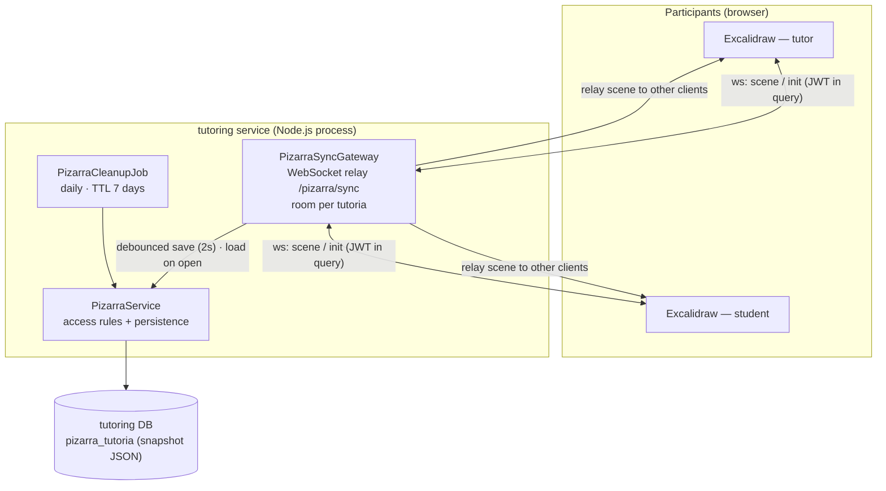

**Sync flow:**

```mermaid
sequenceDiagram
  participant T as Tutor (Excalidraw)
  participant S as Student (Excalidraw)
  participant GW as PizarraSyncGateway
  participant SVC as PizarraService
  participant DB as PostgreSQL

  T->>GW: WS upgrade /pizarra/sync?tutoriaId&token
  GW->>GW: verify JWT (HS256) + resolve pizarra access
  GW->>SVC: load persisted scene (or [])
  GW-->>T: { type: init, elements }
  T->>GW: { type: scene, elements }  (draws)
  GW->>GW: store last scene · schedule debounced save
  GW-->>S: relay { type: scene, elements }
  S->>S: reconcileElements(local, incoming)
  Note over GW,DB: 2s after last change → guardarEscena (upsert)
  GW->>SVC: persist
  SVC->>DB: UPSERT pizarra_tutoria.snapshot
```

**Persistence model (`pizarra_tutoria`):**

| Column | Purpose |
|--------|---------|
| `tutoria_id` (PK) | One board per tutoring session; cascades on session delete |
| `snapshot` (JSONB) | Excalidraw scene, stored opaque and upserted idempotently |
| `creado_en` / `actualizado_en` | Timestamps; `actualizado_en` drives the 7-day inactivity cleanup |

### Consequences

- **Good:** Real-time collaboration that reuses the tutoring service's JWT contract and the exact same access rules as the video call, with **no extra infrastructure** — the relay runs inside the existing `tutoring` process. The server stays domain-agnostic (Excalidraw elements are opaque JSON), reconciliation happens on the client, writes are debounced to batch updates, and abandoned boards are cleaned up automatically after a week.
- **Accepted cost:** The relay keeps each active room's state **in memory in a single process**, so it does not scale horizontally without shared room state or sticky WebSocket sessions. The server stores the *last scene it received* rather than a merged authoritative state, so correctness of merges is trusted to the client's `reconcileElements`. The JWT travels in the WebSocket query string (a browser handshake limitation) rather than in a header.
