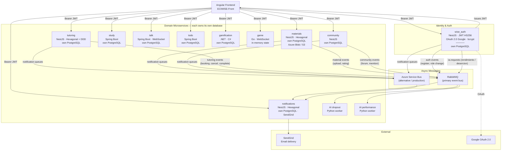
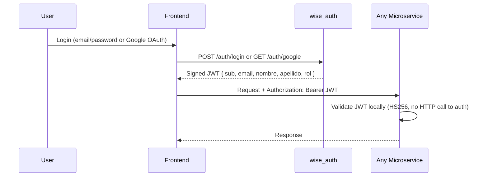
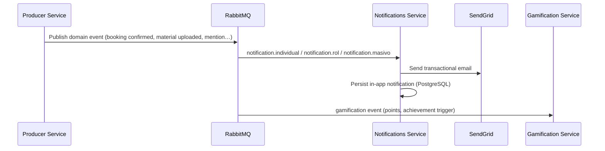

# ECIWise+

Institutional academic support platform for Systems Engineering students at ECI.

  <svg viewBox="0 0 48 48" width="140" height="140" aria-label="ECIWise">
    <path d="M24 4 C20 16 16 20 4 24 C16 28 20 32 24 44 C28 32 32 28 44 24 C32 20 28 16 24 4 Z" fill="#c8102e"/>
    <path d="M24 17 V31 M17 24 H31" fill="none" stroke="#ffffff" stroke-width="3" stroke-linecap="round"/>
  </svg>

---

## What is ECIWise

ECIWise is an institutional digital platform that centralizes and improves access for Systems Engineering students at ECI to academic support tools, integrating virtual and in-person tutoring, interactive study, gamification, communication, and AI-based recommendations.

---

## Problem

- Monitor schedules are posted physically with no way to consult them digitally.
- Students must go to the classroom in person without knowing if spots are available.
- There is no virtual modality for tutoring — everything is in-person.
- The satisfaction form is manual and generates no useful statistics.
- There is no tutoring history or student progress tracking.
- Students cannot choose a monitor based on reputation or specialty.
- There are no notifications for schedule changes or cancellations.
- There is no ecosystem that integrates study, communication, and tutoring in one place.
- There is no institutional tool where students can practice with ECI-specific exam questions.

---

## General Objective

To develop an institutional digital platform that centralizes and improves access for Systems Engineering students at ECI to academic support tools — integrating virtual and in-person tutoring, interactive study, gamification, communication, and AI-based recommendations — in order to strengthen learning, academic support, and reduce student dropout.

---

## System Architecture

ECIWise is built as a **microservice architecture**. Each service owns its own database and communicates asynchronously via RabbitMQ (and Azure Service Bus) for domain events. The Angular frontend authenticates through `wise_auth`, which issues HS256 JWTs validated locally by every downstream service — no round-trip to auth per request.

---

## Services

| Service | Technology | Architecture | Responsibility |
|---------|------------|--------------|----------------|
| `wise_auth` | NestJS · Prisma · JWT HS256 | Hexagonal | Authentication, registration, Google OAuth, JWT issuance, AI data, predictions |
| `tutoring` | NestJS · Prisma | Hexagonal + DDD + Vertical Slicing | Tutor availability, slot materialization, bookings, cancellations |
| `materials` | NestJS · Prisma | Hexagonal | PDF repository, AI validation, cloud storage (Azure Blob / S3) |
| `notifications` | NestJS · Prisma · SendGrid | Hexagonal | Transactional emails, in-app notification persistence |
| `todo` | Spring Boot · JPA | Hexagonal | Task and pending items management |
| `gamification` | .NET 10 · C# | Hexagonal (Clean Arch) | Points, achievements, leaderboard, reputation |
| `study` | Spring Boot · JPA | Layered | Flashcards, Kahoot-style quiz, study history |
| `talk` | Spring Boot · WebSocket · Redis · MinIO | Layered | Real-time chat, conversations, reactions, attachments |
| `game` | Go · WebSocket | Event-driven goroutines | Real-time multiplayer game server (in-memory) |
| `community` | NestJS | — | Forums, threads, replies, moderation |
| `AI dropout` | Python · RabbitMQ | Worker | Dropout risk prediction (22-feature model) |
| `AI performance` | Python · RabbitMQ | Worker | Academic performance prediction (11-feature model) |

---

## Authentication Flow

Every microservice validates the token locally using the shared `JWT_SECRET`. The `userId` is always extracted from the `sub` claim — never from the URL.

---

## Event Flow (RabbitMQ)

---

## Roles

| Role | Value | Description |
|------|-------|-------------|
| Student | `estudiante` | Default on registration. Access to tutoring, study, chat, forums, materials, and AI. |
| Tutor / Monitor | `tutor` | Manages availability and conducts tutoring sessions. Assigned by admin. |
| Administrator | `admin` | Full access. Manages users, content, and institutional statistics. |

---

## Team

- Daniel Eduardo Useche Pinilla
- Ignacio Andrés Castillo Rendón
- Juan Diego Rodríguez Velásquez
- David Alejandro Patacón Henao
- Anderson Fabián García Nieto
- Christian Alfonso Romero Martínez
- Laura Alejandra Venegas Pirabán
- Hildebrando Peña Quezada
- Isaac David Palomo Peralta
- Juana Lozano Chaves
- Maria Paula Rodríguez Muñoz
- Felipe Eduardo Calvache Gallego
- Marianella Polo Peña
