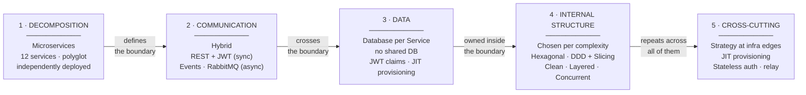
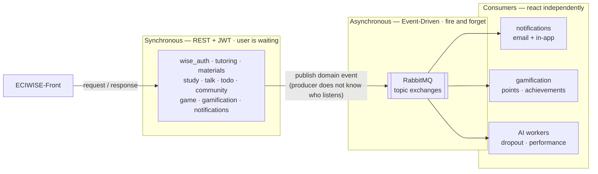
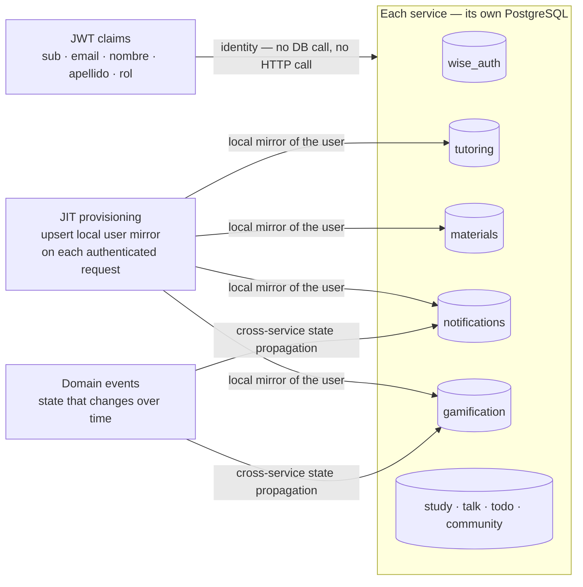
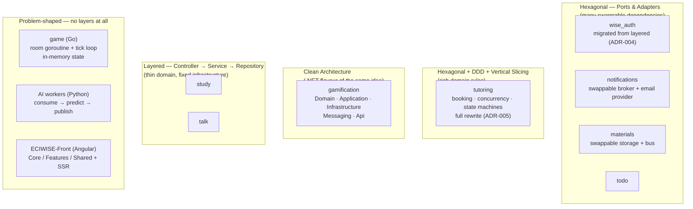
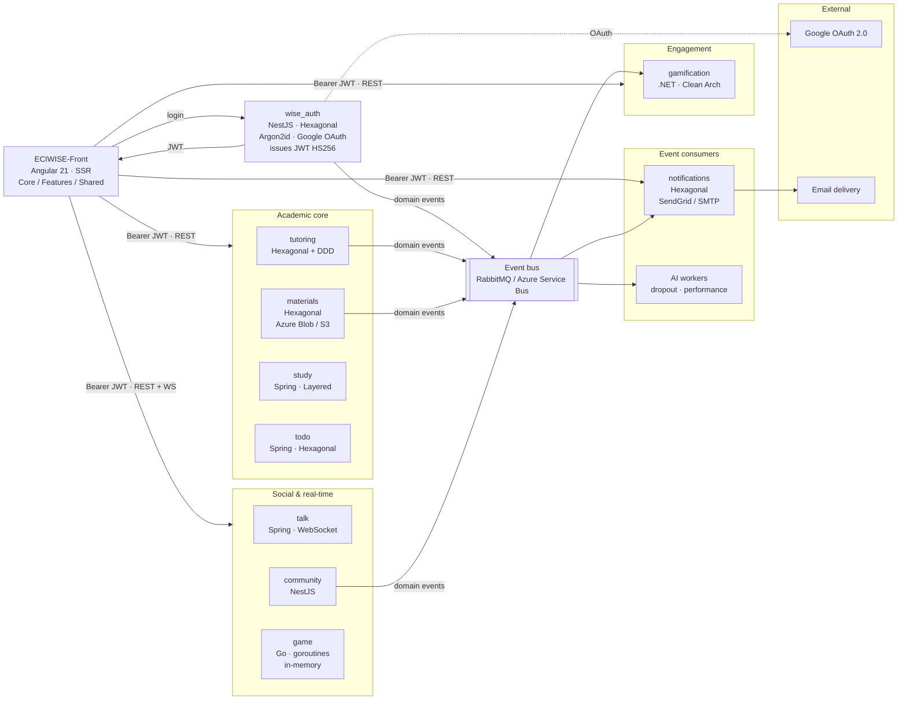
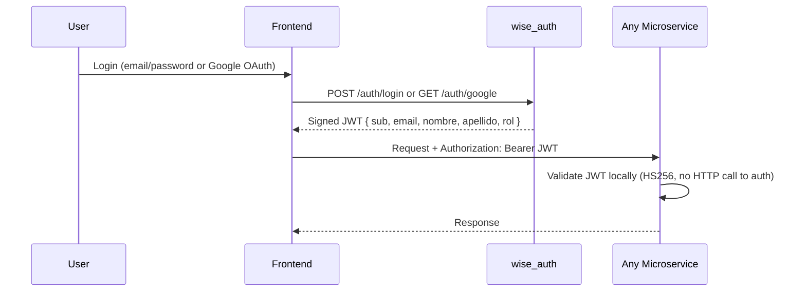
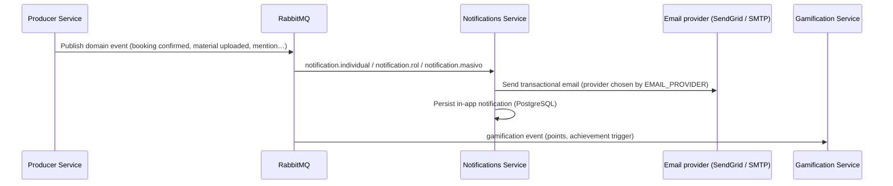

# ECIWise+

Institutional academic support platform for Systems Engineering students at ECI.

  <svg viewBox="0 0 48 48" width="140" height="140" aria-label="ECIWise">
    <path d="M24 4 C20 16 16 20 4 24 C16 28 20 32 24 44 C28 32 32 28 44 24 C32 20 28 16 24 4 Z" fill="#c8102e"/>
    <path d="M24 17 V31 M17 24 H31" fill="none" stroke="#ffffff" stroke-width="3" stroke-linecap="round"/>
  </svg>

---

## What is ECIWise

ECIWise is an institutional digital platform that centralizes and improves access for Systems Engineering students at ECI to academic support tools, integrating virtual and in-person tutoring, interactive study, gamification, communication, and AI-based recommendations.

---

## Problem

- Monitor schedules are posted physically with no way to consult them digitally.
- Students must go to the classroom in person without knowing if spots are available.
- There is no virtual modality for tutoring — everything is in-person.
- The satisfaction form is manual and generates no useful statistics.
- There is no tutoring history or student progress tracking.
- Students cannot choose a monitor based on reputation or specialty.
- There are no notifications for schedule changes or cancellations.
- There is no ecosystem that integrates study, communication, and tutoring in one place.
- There is no institutional tool where students can practice with ECI-specific exam questions.

---

## General Objective

To develop an institutional digital platform that centralizes and improves access for Systems Engineering students at ECI to academic support tools — integrating virtual and in-person tutoring, interactive study, gamification, communication, and AI-based recommendations — in order to strengthen learning, academic support, and reduce student dropout.

---

## System Architecture

ECIWise is not "a microservice architecture" — that phrase only answers *how the system is cut into pieces*. It says nothing about how those pieces talk, how they own data, or how each one is built inside. Those are **four independent decisions**, and ECIWise answers each one differently:

| Decision level | Question it answers | Style chosen |
|---|---|---|
| **1 · Decomposition** | How is the system cut into deployable units? | **Microservices** — 12 services, polyglot, independently deployed |
| **2 · Communication** | How do those units talk to each other? | **Hybrid** — synchronous REST + JWT for queries, **Event-Driven** (RabbitMQ) for side effects |
| **3 · Data** | Who owns which data? | **Database per Service** — no shared DB, identity travels in JWT claims |
| **4 · Internal structure** | How is each service built inside? | **Chosen per service complexity** — Hexagonal, DDD + Vertical Slicing, Clean, Layered, concurrent, worker |
| **5 · Cross-cutting** | What repeats everywhere? | **Strategy at infrastructure edges**, JIT provisioning, stateless auth |

The important claim: **these styles are not alternatives competing for the same slot — they compose.** Microservices define the *boundary*, event-driven defines the *communication across* that boundary, database-per-service defines *ownership inside* it, and hexagonal (or layered) defines the *internal structure*. Picking one does not constrain the others.

### Level 1 — Decomposition: Microservices

Each domain is an **independent service with its own database, deployment, and technology stack**. No shared database, no direct inter-service database access. The stack is deliberately **polyglot**: each service uses the runtime that best fits its problem and its owner's expertise ([ADR-006](/docs/architecture-decisions/#adr-006--gamification-net-10--c-with-hexagonal-architecture)).

| Runtime | Services | Why this runtime |
|---|---|---|
| **NestJS · TypeScript** | `wise_auth`, `tutoring`, `materials`, `notifications`, `community` | Rich DI container makes Ports & Adapters natural; shares the frontend's language |
| **Spring Boot · Java** | `study`, `talk`, `todo` | Mature JPA and WebSocket/STOMP ecosystem |
| **.NET 10 · C#** | `gamification` | LINQ and EF Core suit query-heavy leaderboards; team expertise |
| **Go** | `game` | Goroutines fit a tick-based real-time loop with no GC pauses to speak of |
| **Python** | AI workers (`dropout`, `performance`) | The ML ecosystem lives here |
| **Angular 21 · SSR** | `ECIWISE-Front` | Single client for every role |

**The cost is real:** five runtimes mean five toolchains, five dependency ecosystems, and five sets of security idioms to keep aligned — which is exactly why the [Security](/docs/security/) page has to be comparative.

### Level 2 — Communication: Synchronous *and* Event-Driven

Two styles coexist because they answer **different questions**. The rule is about *who needs the answer, and when*:

- **REST + JWT** when the user is waiting for a result. A student browsing tutoring slots needs data now.
- **Events** when the work is a *side effect* of something already decided. A confirmed booking must send an email and award points — but if the notification service is down, **the booking must still succeed**. Solving that with a direct HTTP call would couple the booking's success to the mail service's uptime. That is not acceptable, and it is the whole reason the event bus exists ([ADR-001](/docs/architecture-decisions/#adr-001--microservice-architecture--event-driven-architecture)).

| Scenario | Style | Why |
|---|---|---|
| Frontend queries data or acts | REST + JWT | Needs an immediate answer |
| Booking confirmed → send email | Event | A mail failure must not fail the booking |
| Session completed → award points | Event | Gamification is a side effect, not part of the transaction |
| Student registers → run AI prediction | Event | Prediction is slow; the result returns on a separate exchange |
| Any service validates a token | **Neither** — local | No call to `wise_auth` at request time at all |

**Producers do not know their consumers.** A new service can subscribe to `tutoring.session.completed` with zero changes to `tutoring`. That is the property being bought, and the price is **eventual consistency**: points and emails land milliseconds *after* the action, not inside it.

### Level 3 — Data: Database per Service

Each service **owns its database outright**. This is what makes independent deployment real rather than theoretical: if two services shared a schema, a migration in one could break the other, and neither could deploy alone.

The obvious problem: if no service can read another's database, how does `tutoring` know who the user is? Three mechanisms, none of which is a lookup:

| Need | Mechanism | Cost avoided |
|---|---|---|
| Who is calling? | **JWT claims** — identity travels *with* the request | An HTTP call to `wise_auth` on every request |
| A local `usuarios` row to foreign-key against | **JIT provisioning** — upsert from claims on first authenticated request | A synchronization job or a shared user table |
| State that changes over time (points, notifications) | **Async events** | A cross-service read |

**Accepted cost:** no cross-service JOINs. Reporting that spans services must aggregate at the application level or in a dedicated pipeline ([ADR-008](/docs/architecture-decisions/#adr-008--database-per-service)).

### Level 4 — Internal structure: chosen per service, not imposed

The deliberate refusal of a house style. **Hexagonal everywhere would be boilerplate** for a service whose domain is thin and whose infrastructure never changes; **layered everywhere** would couple rich domains to their framework and make swapping adapters a rewrite. The rule: *architecture follows domain complexity and the number of genuinely swappable dependencies* ([ADR-003](/docs/architecture-decisions/#adr-003--architecture-pattern-per-service-hexagonal-for-complex-domains-layered-for-simple-ones)).

| Service | Structure | What justifies it |
|---|---|---|
| `wise_auth` | Hexagonal | Many outbound deps (DB, cache, 2 publishers). Migrated *away from* layered after the service grew a god class ([ADR-004](/docs/architecture-decisions/#adr-004--wise_auth-migration-from-layered-to-hexagonal)) |
| `notifications` | Hexagonal | **Two** infrastructure switches — broker *and* email provider. The SMTP adapter proved the payoff: a whole second transport cost one class and one ternary ([ADR-013](/docs/architecture-decisions/#adr-013--notifications-smtp-as-a-first-class-alternative-to-sendgrid)) |
| `materials` | Hexagonal | Swappable storage (Azure Blob / S3) and bus ([ADR-018](/docs/architecture-decisions/#adr-018--materials-storage-provider-abstraction-azure-blob--s3)) |
| `tutoring` | Hexagonal + **DDD + Vertical Slicing** | The richest domain: overlapping-booking rules, slot capacity, cancellation state machines. Each capability is its own slice ([ADR-005](/docs/architecture-decisions/#adr-005--tutoring-complete-rewrite-with-hexagonal--ddd--vertical-slicing)) |
| `gamification` | **Clean Architecture** | The .NET expression of ports & adapters — messaging isolated in its own project ([ADR-006](/docs/architecture-decisions/#adr-006--gamification-net-10--c-with-hexagonal-architecture)) |
| `study`, `talk` | **Layered** | Thin domains (quiz sessions, chat CRUD + broadcast). Spring Data and MinIO are fixed — there is nothing to swap, so ports would be ceremony |
| `game` | **Concurrent goroutines** | No database and no layers. The fitting model is a goroutine per room over shared in-memory state |
| AI workers | **Worker pipeline** | Consume from a queue, predict, publish. Not a request/response service at all |
| `ECIWISE-Front` | **Component-based + SSR** | Core / Features / Shared, signals for state, no store ([ADR-015](/docs/architecture-decisions/#adr-015--frontend-angular-standalone--signals--ssr-with-no-external-state-library)) |

**Accepted cost:** the codebase is **not architecturally uniform**. A new contributor must read a service's README to know which pattern it follows — the price paid for not taxing simple services with ceremony they never needed.

### Level 5 — Cross-cutting: strategy at the infrastructure edges

One pattern recurs across three unrelated services, and it is worth naming explicitly:

> **When an infrastructure dependency has a credible second implementation, it goes behind a domain port and is selected by an environment variable — never by a code change.**

| Service | Port | Switch | Options |
|---|---|---|---|
| `notifications` | `MessagingProviderPort` | `MESSAGING_BROKER` | RabbitMQ · Azure Service Bus |
| `notifications` | `EmailSenderPort` | `EMAIL_PROVIDER` | SendGrid · SMTP (nodemailer) |
| `materials` | `StoragePort` | `STORAGE_PROVIDER` | Azure Blob · AWS S3 |
| `materials` | `MessageBusPort` | `MESSAGE_BUS_PROVIDER` | Azure Service Bus · RabbitMQ |

The switches are **orthogonal and resolved once at startup**, so RabbitMQ + Mailpit gives a fully offline local stack while Azure Service Bus + SendGrid runs production — from the same build. Credentials are validated **conditionally at boot**, so selecting SMTP does not demand a dummy SendGrid key.

Other patterns that repeat platform-wide: **stateless authentication** (every service validates the JWT locally, nobody calls `wise_auth` at request time — [ADR-014](/docs/architecture-decisions/#adr-014--jwt-hs256-as-the-cross-service-token-format)), **JIT provisioning**, and the **relay** used by the whiteboard ([ADR-012](/docs/architecture-decisions/#adr-012--collaborative-whiteboard-via-excalidraw-with-a-websocket-relay)).

### The system, in one view

Services grouped by capability; the frontend reaches all of them over REST + JWT, and only four services publish events.

Every service validates the JWT **locally** — the arrows from `FE` carry identity with them, which is precisely what makes database-per-service workable.

---

## Services

| Service | Technology | Architecture | Responsibility |
|---------|------------|--------------|----------------|
| [`ECIWISE-Front`](/how/frontend/) | Angular 21 · SSR · signals | Core / Features / Shared | The single client for every role — see [Frontend](/how/frontend/) |
| `wise_auth` | NestJS · Prisma · JWT HS256 | Hexagonal | Authentication, registration, Google OAuth, JWT issuance, AI data, predictions |
| `tutoring` | NestJS · Prisma | Hexagonal + DDD + Vertical Slicing | Tutor availability, slot materialization, bookings, cancellations |
| `materials` | NestJS · Prisma | Hexagonal | PDF repository, AI validation, cloud storage (Azure Blob / S3) |
| `notifications` | NestJS · Prisma · SendGrid / SMTP | Hexagonal | Transactional emails (swappable provider), in-app notification persistence |
| `todo` | Spring Boot · JPA | Hexagonal | Task and pending items management |
| `gamification` | .NET 10 · C# | Hexagonal (Clean Arch) | Points, achievements, leaderboard, reputation |
| `study` | Spring Boot · JPA | Layered | Flashcards, Kahoot-style quiz, study history |
| `talk` | Spring Boot · WebSocket · Redis · MinIO | Layered | Real-time chat, conversations, reactions, attachments |
| `game` | Go · WebSocket | Event-driven goroutines | Real-time multiplayer game server (in-memory) |
| `community` | NestJS | — | Forums, threads, replies, moderation |
| `AI dropout` | Python · RabbitMQ | Worker | Dropout risk prediction (22-feature model) |
| `AI performance` | Python · RabbitMQ | Worker | Academic performance prediction (11-feature model) |

---

## Authentication Flow

Every microservice validates the token locally using the shared `JWT_SECRET`. The `userId` is always extracted from the `sub` claim — never from the URL.

**Why JWT and not PASETO?** PASETO is the better-designed primitive, but the token must be parsed identically by four runtimes (Node, JVM, .NET, Go) and JWT has first-party libraries in all of them. We close JWT's algorithm-confusion footgun by pinning HS256 at every verifier instead. Full reasoning — including why RS256 and opaque tokens were rejected — in [ADR-014](/docs/architecture-decisions/#adr-014--jwt-hs256-as-the-cross-service-token-format).

---

## Security

Security spans the frontend and all twelve services. The model rests on three rules: **identity comes from the token, never the request**; **every service validates independently**; and **the frontend is not a security boundary**.

| Area | Highlights |
|------|-----------|
| Identity | JWT HS256, algorithm pinned at every verifier · claims carry `sub`, `email`, `nombre`, `apellido`, `rol` |
| Credentials | **Argon2id** (19 MiB · 2 iters) with transparent bcrypt migration · anti-enumeration timing on login |
| Frontend | CSP · HSTS preload · `X-Frame-Options: DENY` · **host-allowlisted token egress** — the JWT never reaches a third party |
| Uploads | Magic-byte validation (`%PDF-`) — the declared MIME type is a claim, the bytes are evidence |
| Messaging | Poison-pill defense · `gamification` requires a JWT on every RabbitMQ event |
| Supply chain | CodeQL · npm audit · dependency-review · Gitleaks · ESLint ratchet, on every push and weekly |

See **[Security](/docs/security/)** for the full comparative breakdown per service, the accepted risks (XSS → token theft, no revocation before `exp`, shared-secret blast radius), and the documented gaps.

---

## Event Flow (RabbitMQ)

---

## Roles

| Role | Value | Description |
|------|-------|-------------|
| Student | `estudiante` | Default on registration. Access to tutoring, study, chat, forums, materials, and AI. |
| Tutor / Monitor | `tutor` | Manages availability and conducts tutoring sessions. Assigned by admin. |
| Administrator | `admin` | Full access. Manages users, content, and institutional statistics. |

---

## Team

- Daniel Eduardo Useche Pinilla
- Ignacio Andrés Castillo Rendón
- Juan Diego Rodríguez Velásquez
- David Alejandro Patacón Henao
- Anderson Fabián García Nieto
- Christian Alfonso Romero Martínez
- Laura Alejandra Venegas Pirabán
- Hildebrando Peña Quezada
- Isaac David Palomo Peralta
- Juana Lozano Chaves
- Maria Paula Rodríguez Muñoz
- Felipe Eduardo Calvache Gallego
- Marianella Polo Peña
