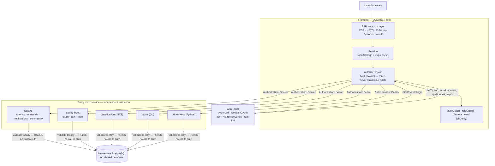
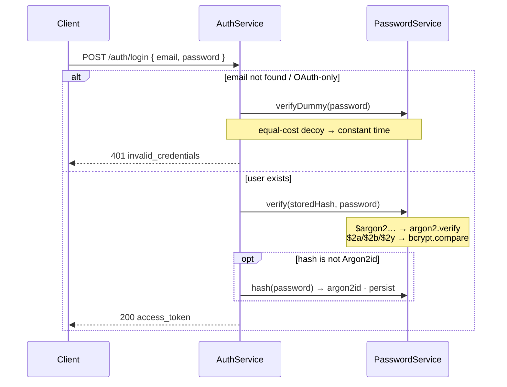
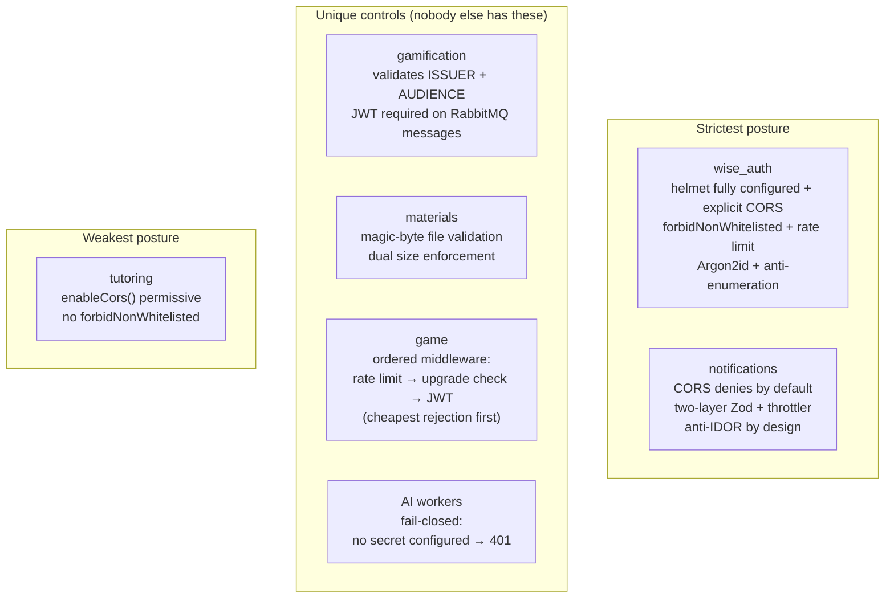
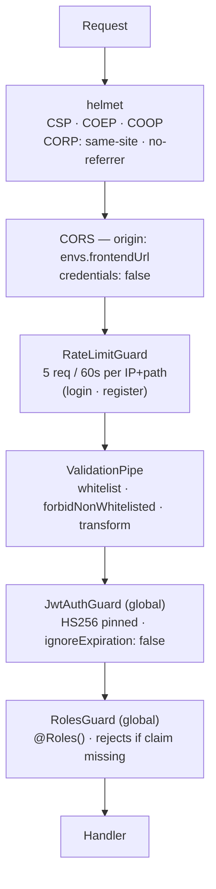
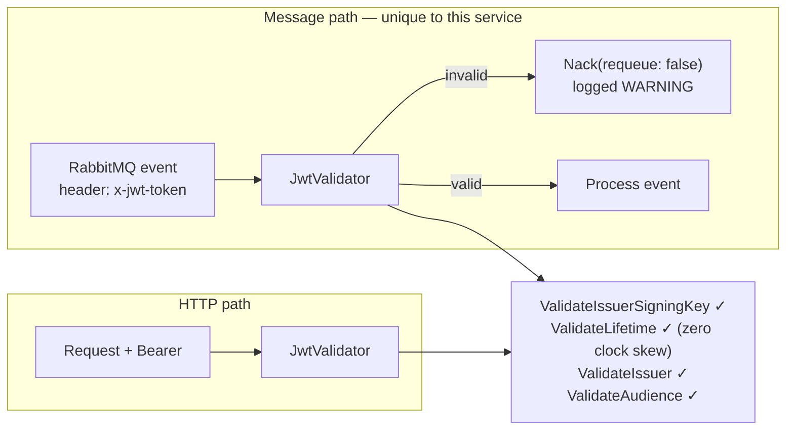
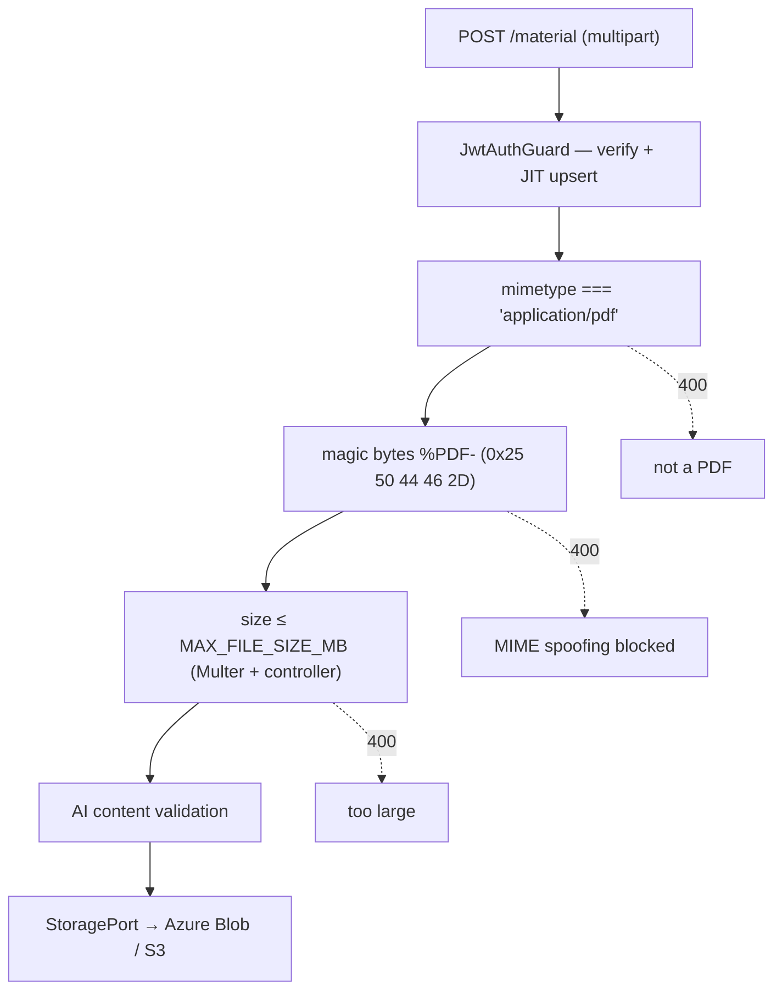
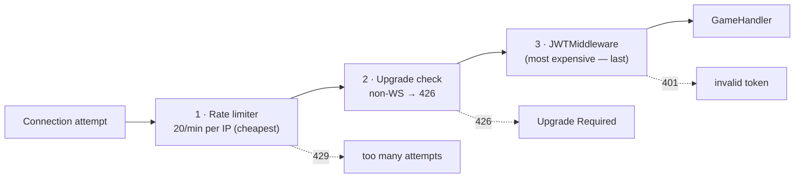
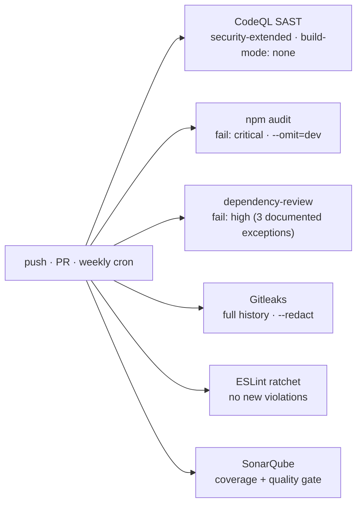

# Security

This page documents the security components in place across the ECIWise platform — in the Angular frontend and in each of the twelve microservices — and, for every significant choice, **which alternatives were rejected and why**. A control without its rationale is folklore; the reasoning is what lets the next person know when the decision stops being valid.

The platform is polyglot (NestJS, Spring Boot, .NET, Go, Python), so the same threat is answered with different tools in different runtimes. Where the implementations diverge, that is stated. Where a service has a **gap**, that is stated too — this page documents what *is*, not what we wish were true.

---

## Security Model

Three principles hold across every service:

1. **Identity comes from the token, never from the request.** The `userId` is always the JWT `sub` claim. No endpoint accepts a user id from a URL, body, or query parameter to decide *whose* data it returns. This closes IDOR by construction rather than by review.
2. **Every service validates independently.** No service trusts another service's say-so, and no service asks `wise_auth` at request time. A compromised or buggy caller cannot escalate through a trusting callee.
3. **The frontend is not a security boundary.** Guards and hidden menu items are UX. Every rule they express is re-enforced server-side, because anything running in a browser is under the user's control.



---

## Cross-Cutting Decisions — What Was Chosen and Against What

### Token format — JWT (HS256), not PASETO

The decision that shapes everything else. Full reasoning in [ADR-014](/docs/architecture-decisions/#adr-014--jwt-hs256-as-the-cross-service-token-format).

| Option | Verdict | Reasoning |
|--------|:-------:|-----------|
| **Opaque token + introspection** | Rejected | Every request in every service would need an HTTP round-trip to `wise_auth` — a **latency tax on every call and a single point of failure for the platform**. It contradicts database-per-service ([ADR-008](/docs/architecture-decisions/#adr-008--database-per-service)), whose entire premise is that identity travels with the request. Its one real advantage is instant revocation. |
| **PASETO** | Rejected | **The better-designed primitive, rejected on ecosystem maturity — not on cryptography.** PASETO has versioned protocols and no `alg` header, so algorithm-confusion and `alg: none` attacks are impossible *by construction* instead of by correct configuration. But our token must be parsed identically by **four independent runtimes** (Node, JVM, .NET, Go). JWT has first-party, battle-tested libraries in all four (`passport-jwt`, `jjwt`, `System.IdentityModel.Tokens.Jwt`, `golang-jwt`); PASETO's .NET and Go libraries are third-party and less maintained. A format that four runtimes must agree on byte-for-byte is the wrong place to take an ecosystem risk. We close JWT's footgun explicitly instead (see below). |
| **JWT RS256** | Rejected *for now* | The correct choice **once services are operated by separate teams**: only `wise_auth` holds the private key, so a compromised downstream service can *verify* but not *mint*. Under HS256 the shared secret is a **signing** key in every service. Today one team deploys every service from one configuration source, so the blast radius is identical either way, and HS256 avoids operating a JWKS endpoint and key rotation. **This is the decision most likely to be revisited.** |
| **JWT HS256** | **Chosen** | Universal support across all four runtimes. Zero-latency local validation. Claims carry the identity data that makes the no-shared-database rule practical. |

**Closing JWT's footgun.** JWT's fatal flaw is that the token declares its own algorithm. A verifier trusting that header can be tricked into `alg: none`, or into verifying an RS256 token as HS256 using the public key as the HMAC secret. **The mitigation is pinning the algorithm at every verifier** — which is exactly the class of bug PASETO removes for free, and exactly the obligation we accepted in exchange for library maturity:

| Service | Pinning |
|---------|---------|
| `wise_auth`, NestJS services | `algorithms: ['HS256']` in the Passport strategy |
| `talk`, `study`, `todo` | `Jwts.parser().verifyWith(signingKey())` — key type fixes the algorithm |
| `gamification` | `TokenValidationParameters` with an explicit `SymmetricSecurityKey` |
| AI workers | `jwt.decode(..., algorithms=[settings.jwt_algorithm])` |

### Password hashing — Argon2id, not bcrypt

Only `wise_auth` stores passwords. Full reasoning in [ADR-010](/docs/architecture-decisions/#adr-010--wise_auth-password-hashing-migration-from-bcrypt-to-argon2id).

| Option | Verdict | Reasoning |
|--------|:-------:|-----------|
| **PBKDF2** | Rejected | OWASP's last resort. Not memory-hard; cheapest of the four to attack with GPUs. |
| **bcrypt** (was in use) | Migrated away | Solid and battle-tested, but **not memory-hard** — small fixed memory makes GPU/ASIC parallelization comparatively cheap. Also **silently truncates passwords at 72 bytes**, a footgun needing a DTO-layer guard. Retained *only* to verify not-yet-migrated hashes. |
| **scrypt** | Rejected | Memory-hard and acceptable, but OWASP ranks Argon2id first and the Node ecosystem around Argon2id is stronger. |
| **Argon2id** | **Chosen** | OWASP's first choice. Memory-hard and tunable in memory, iterations, and parallelism — raising offline cracking cost by orders of magnitude. OWASP-aligned parameters: **19 MiB · 2 iterations · parallelism 1**. `@node-rs/argon2` ships NAPI prebuilds via `optionalDependencies`, so it works under the image's `npm ci --ignore-scripts` with no compiler toolchain. |

Migration is **transparent and gradual**: `PasswordService.verify` accepts both hash types (detected by prefix — `$argon2…` vs `$2a/$2b/$2y`), and a successful login with a legacy hash **silently re-hashes to Argon2id**. No forced reset, no mass migration job. Dormant accounts keep bcrypt until their owner returns.

The same work closed a **user-enumeration side channel**: the login previously returned *before* any hash comparison when the email did not exist, so an instant reject vs. a ~hundreds-of-ms verification told an attacker which emails were registered. Now a **dummy Argon2id verification of equal cost** runs before rejecting.



### Token storage — `localStorage`, not `httpOnly` cookies

An **accepted risk**, not an oversight. Full reasoning in [ADR-016](/docs/architecture-decisions/#adr-016--frontend-jwt-in-localstorage-with-host-restricted-attachment).

| Option | Verdict | Reasoning |
|--------|:-------:|-----------|
| **`httpOnly` cookie** | Rejected | The textbook answer, and genuinely stronger against XSS — JS cannot read the token. But the frontend calls **twelve services across different origins**; one cookie covering them all needs a shared parent domain plus per-service CORS credential handling. It would push **CSRF defense into every service in four runtimes**. And the browser cannot attach cookies usefully to the WebSockets used by chat, game, and the whiteboard. |
| **In-memory only** | Rejected | Immune to persistent theft, but the session dies on every reload — unacceptable UX. |
| **`localStorage`** | **Chosen** | Works uniformly across twelve origins and WebSockets with no shared-domain requirement and no CSRF machinery. **Cost: any successful XSS can read the token.** Mitigated in depth — never eliminated. |

Because the token is readable, the **host allowlist is the critical control**. The interceptor attaches it only to our own hosts, so it is never handed to a third party:

```ts
// core/auth/auth.interceptor.ts
if (!token || !isOwnApiUrl(req.url, ownApiHosts())) {
  return next(req);   // third-party host → no token attached
}
return next(req.clone({ setHeaders: { Authorization: `Bearer ${token}` } }));
```

`ownApiHosts()` derives from the **same injection tokens the runtime config populates**, so the allowlist tracks configuration automatically — no second list to drift. It is shared with the `errorInterceptor` deliberately: token attachment and session-expiry handling can never disagree about which hosts are ours.

### Validation strategy — local, not introspection

Each service verifies the signature itself. The trade is explicit:

| Property | Local validation (chosen) | Introspection (rejected) |
|----------|---------------------------|--------------------------|
| Latency | Microseconds, no network | HTTP round-trip per request |
| `wise_auth` availability | Irrelevant after issuance | **Every request depends on it** |
| Revocation | **Impossible before `exp`** | Immediate |
| Secret distribution | Shared secret in every service | Only auth holds state |

**Revocation is the accepted loss.** Logout is a client-side discard; a stolen token stays valid until `exp`. This is inherent to stateless validation and is why token lifetime (`JWT_EXPIRATION`) is kept short. It is also why the XSS risk above matters more than it otherwise would — the two accepted risks compound.

---

## Security Components by Service

### Comparison matrix

| Service | Runtime | AuthN | Role AuthZ | Headers | CORS | Input validation | Rate limit |
|---------|---------|-------|-----------|---------|------|-----------------|-----------|
| **Frontend** | Angular 21 · SSR | JWT in `localStorage` + `exp` checks | `authGuard` · `roleGuard` · `feature.guard` *(UX only)* | **CSP · HSTS · XFO · nosniff · Referrer-Policy** | n/a (host allowlist on egress) | Angular escaping; no `bypassSecurityTrust*` | — |
| **wise_auth** | NestJS | JWT HS256 (pinned) · Google OAuth · **Argon2id** | Global `RolesGuard` + `@Roles()` | **helmet** — CSP, COEP, COOP, CORP `same-site`, `no-referrer` | Explicit `frontendUrl`, `credentials: false` | `whitelist` + **`forbidNonWhitelisted`** + `transform` | **`RateLimitGuard`** — 5/min per IP+path |
| **tutoring** | NestJS | JWT HS256 strategy | `RolesGuard` + domain access rules | `helmet()` (defaults) | **`enableCors()` — permissive** ⚠ | `whitelist` + `transform` *(no `forbidNonWhitelisted`)* | — |
| **materials** | NestJS | `JwtAuthGuard` — verify + JIT upsert | Ownership checks | `helmet()` (defaults) | Explicit allowlist, else **`false`** | `whitelist` + `forbidNonWhitelisted` · **magic bytes + size** | — |
| **notifications** | NestJS | Global `JwtAuthGuard` (HS256) | `@Public()` opt-out | **helmet** — CSP relaxed only when Swagger on | Explicit `CORS_ORIGINS`, else **`false`** | `whitelist` + `forbidNonWhitelisted` + `transform` · **two-layer Zod** | **`@nestjs/throttler`** — `THROTTLE_TTL`/`LIMIT` |
| **community** | NestJS | Global JWT guard · Socket.IO handshake | `@Roles()` + `RolesGuard` | — | — | DTO validation | — |
| **talk** | Spring Boot | `JwtAuthFilter` + `JwtValidator` (jjwt) | `@EnableMethodSecurity` | Spring defaults | Configurable, **`allowCredentials: true`** | Bean validation | — |
| **study** | Spring Boot | `JwtAuthenticationFilter` | **`hasAnyAuthority`** per path group | Spring defaults | Explicit `allowed-origins` | Bean validation | — |
| **todo** | Spring Boot | `JwtAuthenticationFilter` | **`hasAnyAuthority`** per path group | Spring defaults | Explicit `allowed-origins` | Bean validation | — |
| **gamification** | .NET 10 | `JwtValidator` — **+ issuer + audience** | Claims-based | — | — | DTO validation · **JWT required on RabbitMQ messages** | — |
| **game** | Go · Fiber | `JWTMiddleware` on WS upgrade | — (in-memory rooms) | `recover` + `logger` | Explicit `FrontendURL`, `GET/OPTIONS` only | Upgrade check → **426** | **20 conns/min per IP** |
| **AI workers** | Python · FastAPI | `HTTPBearer` + `require_auth` — **fail-closed** | Deferred to `wise_auth` / APIM | — | Explicit origins, `credentials: false` | Pydantic schemas | — |

⚠ = documented gap, see [Known gaps](#known-gaps-and-inconsistencies).

### Where the implementations genuinely differ

Same threat, different answer — these are the interesting rows:



| Control | Who has it | Why it matters |
|---------|-----------|----------------|
| **Issuer + audience validation** | `gamification` **only** | Everyone else validates signature + expiry. Issuer/audience checks mean a valid token minted for a *different* audience is rejected. Since all services share one secret ([ADR-014](/docs/architecture-decisions/#adr-014--jwt-hs256-as-the-cross-service-token-format)), this is the one service where a token is bound to a purpose rather than merely being well-signed. |
| **JWT on message-bus events** | `gamification` **only** | Every event must carry `x-jwt-token`; invalid → `Nack(requeue: false)`, validated **before** processing. Every other consumer trusts the broker: whoever can publish to the exchange can trigger the side effect. |
| **Magic-byte validation** | `materials` **only** | `Content-Type` is an attacker-supplied *claim*; the first five bytes (`%PDF-`) are *evidence*. Blocks an executable renamed `.pdf`. Size is enforced **twice** (Multer limit + controller) so neither alone is a single point of failure. |
| **Ordered middleware by cost** | `game` **only** | Rate limit → upgrade check (`426`) → JWT. The cheapest rejection runs first, so a flood is dropped before spending CPU on signature verification. A DoS-aware ordering nobody else needed. |
| **Fail-closed on misconfiguration** | AI workers **only** | No `JWT_SECRET` configured → **401**, not "allow". Most frameworks fail *open* when auth is unconfigured; this refuses to serve rather than serve unprotected. |
| **`forbidNonWhitelisted`** | `wise_auth`, `materials`, `notifications` | `whitelist` silently *strips* unknown properties; `forbidNonWhitelisted` **rejects** the request. Stripping hides a client sending fields it should not — mass-assignment probing looks like success. `tutoring` only strips. |
| **CORS denies by default** | `notifications`, `materials` | Empty config → `origin: false` (deny), not "reflect the origin". A missing env var fails **closed**. |
| **Anti-enumeration timing** | `wise_auth` **only** | The only service with a login to leak. |

### Frontend

Detailed in the [Frontend page](/how/frontend/#security). Summary of layers:

| Layer | Control |
|-------|---------|
| Transport | CSP (`upgrade-insecure-requests`, `connect-src 'self' https: wss:`, `frame-ancestors 'none'`, `object-src 'none'`, `base-uri 'self'`) · HSTS 2y preload · `X-Frame-Options: DENY` · `nosniff` · `no-referrer` |
| Session | `isUsableToken()` on every read · `restoreUser()` purges stale sessions at boot |
| Egress | `authInterceptor` host allowlist — **the token never reaches a third party** |
| Access | `authGuard` · `roleGuard` (redirects to the user's own home) · `feature.guard` |
| Errors | `AppError` translation keys — backend detail never surfaces. A **403 with a valid token is a permission denial, not a logout** |
| Supply chain | CodeQL · npm audit · dependency-review · Gitleaks · ESLint ratchet |

The CSP is **transport-focused by design**: Jitsi's `external_api.js` loads from a backend-supplied dynamic domain ([ADR-011](/docs/architecture-decisions/#adr-011--self-hosted-jitsi-meet-for-tutoring-video-calls)) and PDFs are embedded, so restricting `script-src`/`frame-src` would break real features. HSTS and CSP are emitted **only over HTTPS** (`X-Forwarded-Proto` behind Azure's edge) so local `http://` development never pins HSTS on `localhost`.

### wise_auth — the only service that mints tokens

The blast radius here is the whole platform, so it has the strictest posture.



| Control | Detail |
|---------|--------|
| Password storage | **Argon2id** (19 MiB · 2 iters · p=1), bcrypt verify-only for legacy, rehash-on-login |
| Enumeration | Equal-cost dummy verification when the email does not exist |
| Rate limiting | In-memory, per IP+path, 5/60s, with **bounded map** (10k entries, expired-entry eviction) — a naive counter map is itself a memory-exhaustion vector |
| Token payload | `validate()` **rejects tokens missing `sub`, `email`, or `rol`** — a token that parses is not automatically a token we accept |
| Guard order | `JwtAuthGuard` **then** `RolesGuard` — authenticate before authorize |
| OAuth | Google OAuth 2.0 via `google.strategy` |

Rate limiting is **per instance, not distributed** — deliberate, with Azure API Management providing global edge limiting. Documented in the code itself.

### Spring services — talk, study, todo

All three share a posture: **stateless, CSRF disabled, JWT filter before `UsernamePasswordAuthenticationFilter`**.

**CSRF disabled is correct here, not a shortcut.** CSRF exploits *ambient* credentials — cookies the browser attaches automatically. These APIs are stateless (`SessionCreationPolicy.STATELESS`) and authenticate via an `Authorization` header that must be set explicitly by JavaScript. A cross-site form post cannot set that header, so there is nothing to forge. Cookie auth would have made CSRF tokens mandatory in all three — one of the reasons cookies were rejected ([ADR-016](/docs/architecture-decisions/#adr-016--frontend-jwt-in-localstorage-with-host-restricted-attachment)).

| Aspect | `talk` | `study` / `todo` |
|--------|--------|------------------|
| Authorization | `@EnableMethodSecurity` — annotations on methods | **`hasAnyAuthority('estudiante','tutor','admin')`** per path group |
| Public paths | `/actuator/health`, `/actuator/info`, **`/ws/**`** | none — `anyRequest().authenticated()` |
| CORS | Configurable, `allowedHeaders: *`, **`allowCredentials: true`** | Explicit `Authorization`/`Content-Type` only |
| Extra hardening | — | `httpBasic` and `formLogin` **explicitly disabled** — no fallback auth path |

**`talk`'s `/ws/**` permitAll is not an opening.** The WebSocket handshake cannot carry an `Authorization` header, so Spring Security must let the upgrade through and authentication happens in the STOMP `ChannelInterceptor` instead. Access control moved, it did not disappear.

`talk`'s `JwtValidator` is the most diagnostic of the four runtimes — it distinguishes **expired vs. malformed vs. incomplete claims** so the layer above can answer with a precise HTTP/STOMP code and logs point at the real cause. It explicitly rejects tokens missing `email` or `rol` rather than building a half-populated principal that breaks role logic later.

### gamification — the strictest token validation



Two things nobody else does: **issuer + audience validation** (a token minted for another audience is rejected even though the shared secret makes it well-signed), and **JWT-authenticated message-bus events** — validated *before* processing, rejected without requeue so a poison message cannot loop. Every other consumer trusts the broker: whoever can publish can trigger the side effect. `gamification` also ships a **`SECURITY.md`** with a vulnerability disclosure process (48h acknowledgement, coordinated advisory) — the only service with one.

### materials — file upload is the attack surface



The **magic-byte check is the load-bearing one**: `Content-Type` is set by the client and means nothing. Detailed in [ADR-018](/docs/architecture-decisions/#adr-018--materials-storage-provider-abstraction-azure-blob--s3).

### notifications — anti-IDOR by design

| Control | Detail |
|---------|--------|
| **Anti-IDOR** | `userId` always from the JWT `sub` via `@GetUser('id')`, **never from the URL**. `read/:id` and `DELETE /:id` are owner-scoped and return **404** (not 403) for someone else's notification — the response does not confirm the resource exists |
| Two-layer validation | Envelope validator, then type-specific Zod schema per `individual`/`rol`/`masivo` |
| Poison-pill defense | Invalid messages are **ACK'd, not retried** — a malformed message cannot loop the queue forever |
| Rate limiting | `@nestjs/throttler`, `THROTTLE_TTL` / `THROTTLE_LIMIT` |
| CORS | `CORS_ORIGINS` explicit; **empty → deny** |
| Swagger CSP | Relaxed (`unsafe-inline`) **only when Swagger is enabled** — production keeps helmet's default policy rather than disabling CSP wholesale |
| Secret hygiene | `JWT_SECRET` Joi-validated at **min 16 chars** — a trivial secret fails at boot |
| Email credentials | Conditional per provider ([ADR-013](/docs/architecture-decisions/#adr-013--notifications-smtp-as-a-first-class-alternative-to-sendgrid)) — SMTP mode needs no SendGrid key, and vice versa |

Returning **404 instead of 403** is intentional: a 403 would confirm the notification exists and belongs to someone else.

### game — DoS-aware ordering



The comment in `main.go` states the reasoning: *"middleware order matters — cheapest rejection runs first"*. A connection flood is dropped by an IP counter before any signature verification happens. CORS allows `GET, OPTIONS` only, from the configured frontend origin. `recover` middleware means a panic in one room does not take down the server.

### AI workers — fail-closed

```python
if not _settings.jwt_secret:
    # Sin secreto configurado no se puede validar nada: se rechaza por seguridad.
    raise HTTPException(status_code=401, detail="auth_not_configured")
```

The important line. Most frameworks fail **open** when auth is unconfigured — a missing env var silently disables protection. These workers **refuse to serve** instead. Errors distinguish `missing_token` / `token_expired` / `invalid_token` without leaking whether the *user* exists. Fine-grained role authorization is deliberately deferred to `wise_auth`/APIM; these services only prove the caller holds a valid platform token.

---

## Threat Model

| Threat | Status | Control |
|--------|:------:|---------|
| Credential stuffing / brute force | **Defended** | `RateLimitGuard` 5/min · Argon2id cost · APIM at the edge |
| Offline password cracking | **Defended** | Argon2id memory-hardness (19 MiB/hash) |
| User enumeration | **Defended** | Equal-cost dummy verification on login |
| Algorithm confusion / `alg: none` | **Defended** | HS256 pinned at every verifier |
| IDOR | **Defended** | `userId` from `sub` only; owner-scoped queries; 404 not 403 |
| MIME spoofing on upload | **Defended** | Magic-byte validation |
| Mass assignment | **Mostly** | `forbidNonWhitelisted` in `wise_auth`/`materials`/`notifications`; `tutoring` only strips |
| CSRF | **N/A by design** | Stateless + `Authorization` header — no ambient credentials to forge |
| MITM / SSL stripping | **Defended** | HSTS preload · `upgrade-insecure-requests` · `connect-src https: wss:` |
| Clickjacking | **Defended** | `frame-ancestors 'none'` · `X-Frame-Options: DENY` |
| Token leaked to third party | **Defended** | `authInterceptor` host allowlist |
| Poison-pill queue loop | **Defended** | Invalid messages ACK'd (`notifications`) / `Nack(requeue: false)` (`gamification`) |
| WebSocket connection flood | **Defended** *(game only)* | IP rate limit before upgrade and JWT |
| Secrets in git | **Defended** | Gitleaks on full history |
| Vulnerable dependencies | **Gated** | npm audit (critical) · dependency-review (high) · weekly schedule |
| **XSS → token theft** | **Accepted risk** | `localStorage` readable by any JS on the origin. Mitigated by Angular escaping, CSP, CodeQL, dependency gates — **not eliminated** ([ADR-016](/docs/architecture-decisions/#adr-016--frontend-jwt-in-localstorage-with-host-restricted-attachment)) |
| **Token revocation before `exp`** | **Not possible** | Inherent to stateless validation ([ADR-014](/docs/architecture-decisions/#adr-014--jwt-hs256-as-the-cross-service-token-format)). Mitigated only by short lifetime |
| **`JWT_SECRET` compromise** | **Accepted risk** | HS256 means the secret is a *signing* key in every service — a leak anywhere forges any user and any role. Mitigated by config-only distribution and min-16-char validation. **RS256 is the documented escape hatch** |
| Unauthenticated event publishing | **Partial** | Only `gamification` requires JWT on messages. Other consumers trust broker access |
| Malicious whiteboard payload | **Partial** | The relay stores Excalidraw scenes as opaque JSON without interpreting them; merge correctness is trusted to the client ([ADR-012](/docs/architecture-decisions/#adr-012--collaborative-whiteboard-via-excalidraw-with-a-websocket-relay)) |

### Known gaps and inconsistencies

Documented deliberately — an undocumented gap is the dangerous kind.

| # | Gap | Impact | Suggested fix |
|---|-----|--------|--------------|
| 1 | **`tutoring` calls `enableCors()` with no arguments** | Permissive CORS — any origin may make cross-origin requests. Its siblings (`materials`, `notifications`, `wise_auth`) all restrict explicitly and deny by default | Adopt the `notifications` pattern: explicit `CORS_ORIGINS`, empty → `false` |
| 2 | **`tutoring` omits `forbidNonWhitelisted`** | Unknown properties are silently stripped instead of rejected, so mass-assignment probing looks like success | Add `forbidNonWhitelisted: true` |
| 3 | **No rate limiting** in `tutoring`, `materials`, `study`, `talk`, `todo`, `gamification` | Only `wise_auth`, `notifications`, and `game` limit request rate. Others rely entirely on APIM at the edge — which does not exist in local or non-Azure deployments | Add `@nestjs/throttler` / Bucket4j, or make the APIM dependency explicit |
| 4 | **Only `gamification` validates issuer/audience** | Since all services share one secret, a token accepted by one is accepted by all. Issuer/audience would bind tokens to a purpose | Add `iss`/`aud` claims at issuance and validate platform-wide |
| 5 | **Only `gamification` authenticates message-bus events** | Broker access alone is enough to trigger notifications or point awards | Extend the `x-jwt-token` pattern to `notifications` and the AI workers |
| 6 | **`talk` sets `allowCredentials: true` with `allowedHeaders: *`** | Unnecessary for a stateless Bearer API and a broader posture than its siblings | Narrow to `Authorization`, `Content-Type`; drop `allowCredentials` |
| 7 | **Whiteboard JWT travels in the WebSocket query string** | Query strings are logged by proxies more readily than headers. A browser handshake limitation, not a choice | Short-lived, single-purpose board tokens |
| 8 | **In-memory rate limiting is per instance** | `wise_auth`'s limit multiplies by replica count | Redis-backed limiter, or rely on APIM by explicit contract |

None of these are exploitable in isolation given the layers around them; they are recorded so they are fixed by decision rather than discovered by accident.

---

## Security in CI

The frontend runs the most complete pipeline (`.github/workflows/security.yml`) — on every push to `main`/`develop`/`feat/**`/`fix/**`, every PR, and weekly at 06:00 UTC Mondays. `wise_auth` runs its own `pr-security.yml`.



Two decisions worth their reasoning:

- **`build-mode: none` for CodeQL.** JS/TS needs no compilation to analyze, and building the SSR app in CI caused OOM failures. Building would have bought nothing and cost reliability.
- **Gitleaks as a binary, not the action.** `gitleaks-action@v2` requires a paid license for organizations; the official binary is MIT and free. The control was kept by changing the delivery mechanism instead of dropping the scan.

**Accepted risk, documented in the workflow rather than silenced:** `lodash-es` (high) arrives only transitively via `@excalidraw/excalidraw`. No fix exists without a breaking Excalidraw downgrade, and the impact is client-side inside the whiteboard editor. Three specific GHSAs are allowlisted **by id**; the gate stays at `fail-on-severity: high` for everything else. That is the difference between an accepted risk and an ignored one.

---

## Related

- [Architecture Decisions](/docs/architecture-decisions/) — full ADR log
- [ADR-014](/docs/architecture-decisions/#adr-014--jwt-hs256-as-the-cross-service-token-format) — JWT HS256 vs PASETO, RS256, opaque tokens
- [ADR-010](/docs/architecture-decisions/#adr-010--wise_auth-password-hashing-migration-from-bcrypt-to-argon2id) — Argon2id vs bcrypt
- [ADR-016](/docs/architecture-decisions/#adr-016--frontend-jwt-in-localstorage-with-host-restricted-attachment) — `localStorage` vs `httpOnly` cookies
- [Frontend](/how/frontend/#security) — frontend security in depth
- [Actors, Roles and Permissions](/docs/actors-roles-permissions/) — the authorization model
