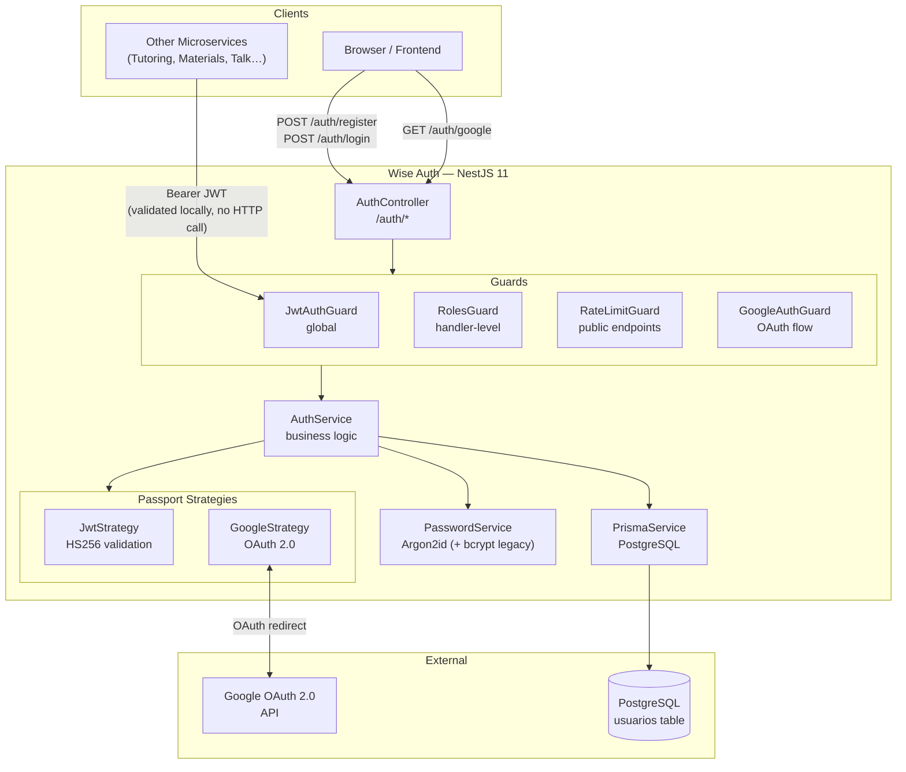
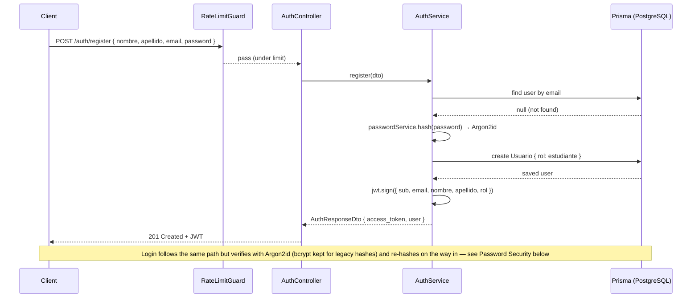
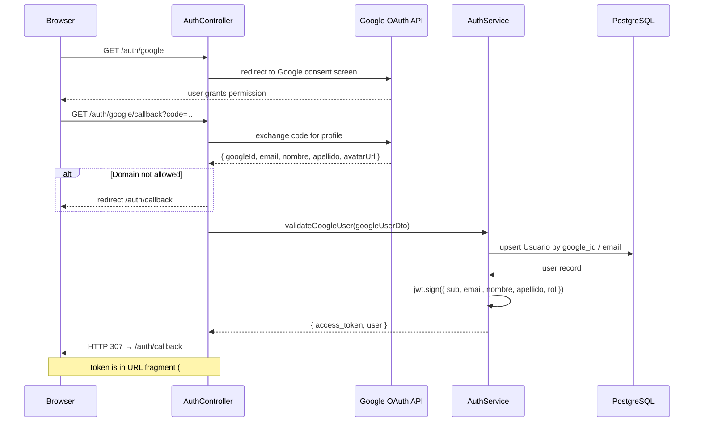
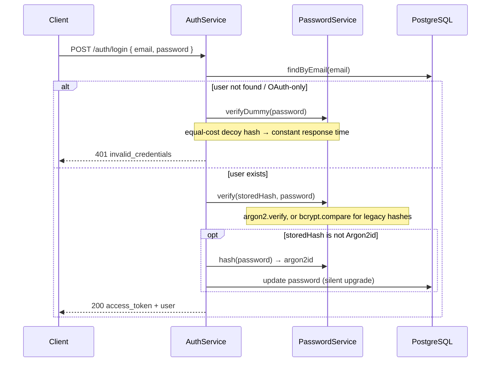
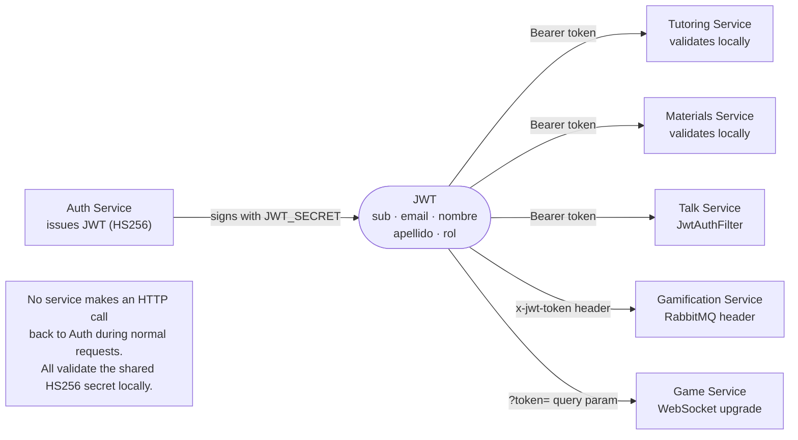
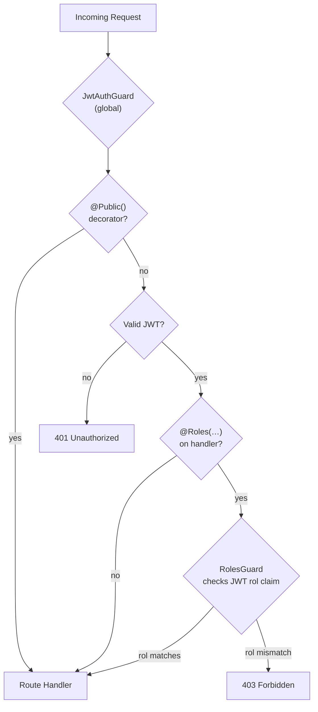
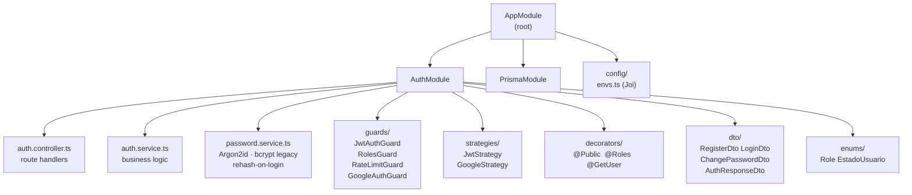
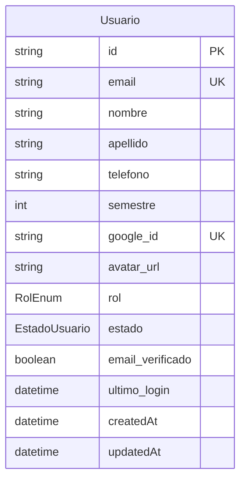
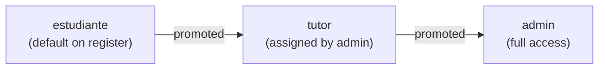

# Auth Service

## Overview

`wise_auth` is the authentication and authorization microservice for the ECIWise platform. It handles user registration, email/password login, OAuth 2.0 sign-in via Google, and JWT issuance shared across all other services.

The service handles two core domains:

- **Identity management**: register and store users with hashed passwords, manage profile data (name, semester, avatar), and track login state.
- **Token issuance**: issue HS256 JWTs carrying the claims (`sub`, `email`, `nombre`, `apellido`, `rol`) consumed by every downstream service without a round-trip to Auth.

---

## System Architecture



---

## Authentication Flows

### Email / Password Flow



### Google OAuth 2.0 Flow



---

## Password Security

Passwords are hashed with **Argon2id** — the algorithm ranked first by the OWASP Password Storage Cheat Sheet — behind a single `PasswordService`. Argon2id is *memory-hard*, so it resists GPU/ASIC cracking far better than bcrypt. All hashing, verification, and rehash logic lives in one place; the rest of the service never touches a crypto primitive directly.

### Hashing parameters

| Parameter | Value | Rationale |
|---|---|---|
| Algorithm | Argon2id | Memory-hard, OWASP first choice |
| Memory cost | 19 MiB | OWASP-recommended minimum |
| Iterations (time cost) | 2 | Balanced with the memory cost |
| Parallelism | 1 | Single lane, deterministic cost |
| Library | `@node-rs/argon2` | NAPI prebuilds — works with the image's `npm ci --ignore-scripts` |

### Transparent migration from bcrypt

The service previously used bcrypt (cost 12). Rather than force a password reset, legacy hashes are migrated **silently on login**:

- `PasswordService.verify` detects the algorithm by prefix — `$argon2…` uses Argon2id, `$2a/$2b/$2y…` falls back to bcrypt.
- After a successful login, if the stored hash is not Argon2id, the password is re-hashed with Argon2id and persisted (**rehash-on-login**). Each user is upgraded the next time they authenticate.

### Anti-enumeration (constant-time login)

When the email does not exist — or belongs to an OAuth-only account with no password — the login still performs a **dummy Argon2id verification of equal cost** before returning `401`. This removes the timing side channel that would otherwise let an attacker discover which emails are registered.



> Design rationale and trade-offs are recorded in [ADR-010 — Password Hashing Migration from bcrypt to Argon2id](/docs/architecture-decisions/#adr-010--wise_auth-password-hashing-migration-from-bcrypt-to-argon2id).

---

## JWT Flow Across Services



---

## Role & Guard System



---

## Package Structure



---

## Data Model



### Role Enum



---

## JWT-based Identity

All services in ECIWise share the same HS256 secret. The Auth service issues the token; downstream services validate it locally without a network call to Auth.

### JWT Claims

| Claim | Type | Description |
|---|---|---|
| `sub` | string (UUID) | User identifier |
| `email` | string | User email address |
| `nombre` | string | First name |
| `apellido` | string | Last name |
| `rol` | string | `estudiante`, `tutor`, or `admin` |

---

## Endpoints

### Public (no JWT required)

| Method | Path | Description |
|---|---|---|
| `POST` | `/auth/register` | Create a student account (email + password) |
| `POST` | `/auth/login` | Authenticate with email + password; returns JWT |
| `GET` | `/auth/google` | Initiate Google OAuth 2.0 flow |
| `GET` | `/auth/google/callback` | Google callback; redirects frontend with JWT in URL fragment |

### Protected (JWT required)

| Method | Path | Description |
|---|---|---|
| `POST` | `/auth/cambiar-contrasena` | Change the authenticated user's password |

### Register request body

```json
{
  "nombre": "Daniel",
  "apellido": "Useche",
  "email": "daniel@mail.escuelaing.edu.co",
  "password": "s3cur3P@ss"
}
```

### Login response

```json
{
  "access_token": "eyJhbGciOiJIUzI1NiJ9...",
  "user": {
    "id": "uuid",
    "email": "daniel@mail.escuelaing.edu.co",
    "nombre": "Daniel",
    "apellido": "Useche",
    "rol": "estudiante"
  }
}
```

### Error codes

| HTTP | Meaning |
|---|---|
| 400 | Validation error in request body |
| 401 | Invalid credentials |
| 403 | Role not permitted |
| 409 | Email already registered |
| 429 | Rate limit exceeded on public endpoint |

---

## Deployment

### Environment Variables

| Variable | Required | Example | Purpose |
|---|---|---|---|
| `PORT` | Yes | `3000` | HTTP port |
| `DATABASE_URL` | Yes | `postgresql://…` | PostgreSQL connection (Prisma runtime) |
| `DIRECT_URL` | Yes | `postgresql://…` | Direct connection (Prisma migrations) |
| `JWT_SECRET` | Yes | `supersecret32chars+` | HS256 signing secret |
| `JWT_EXPIRATION` | Yes | `7d` | Token TTL |
| `GOOGLE_CLIENT_ID` | Yes | `123.apps.googleusercontent.com` | Google OAuth client ID |
| `GOOGLE_CLIENT_SECRET` | Yes | `GOCSPX-…` | Google OAuth client secret |
| `GOOGLE_CALLBACK_URL` | Yes | `http://localhost:3000/auth/google/callback` | OAuth redirect URI |
| `FRONTEND_URL` | Yes | `http://localhost:4200` | Frontend origin for post-auth redirect |

### Local Execution

```bash
npm install
cp .env.example .env
npx prisma generate
npx prisma migrate deploy
npm run start:dev
```

### API Documentation

Swagger is served at `/api/docs` when the service is running.

---

## Further Reading

- Source repository: [EciWise/wise_auth](https://github.com/EciWise/wise_auth)
- Swagger: `/api/docs` at runtime
- Prisma schema: `prisma/schema.prisma`
