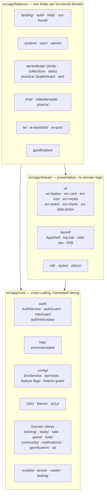
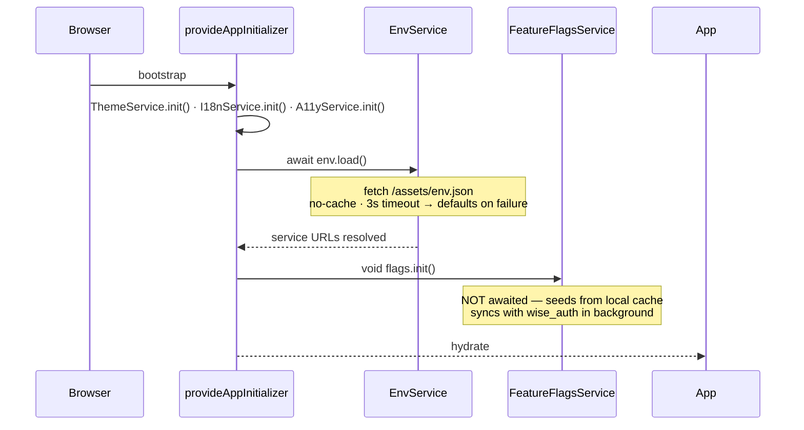
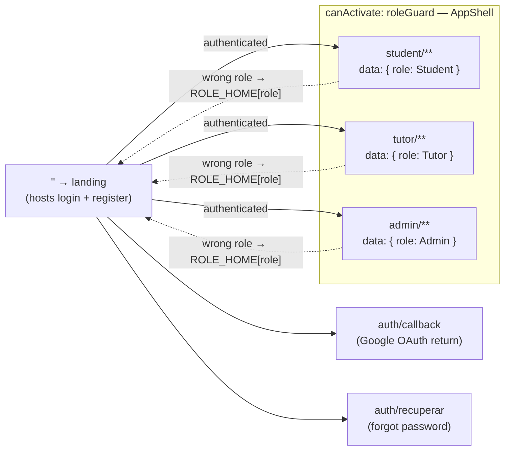
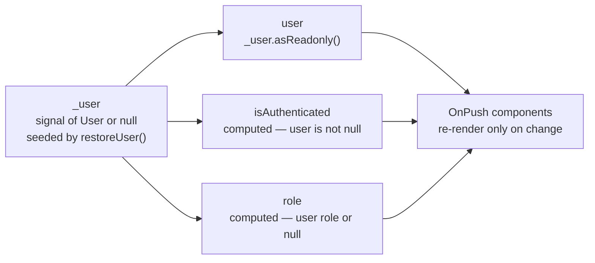
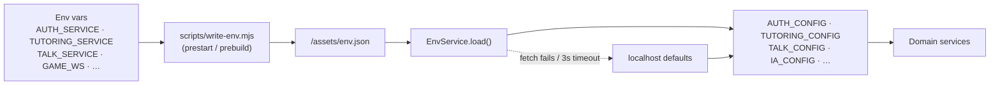
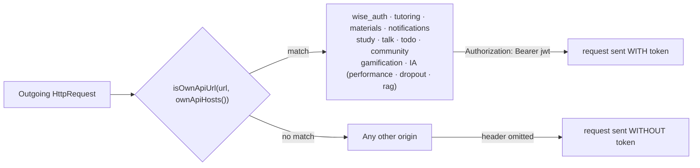
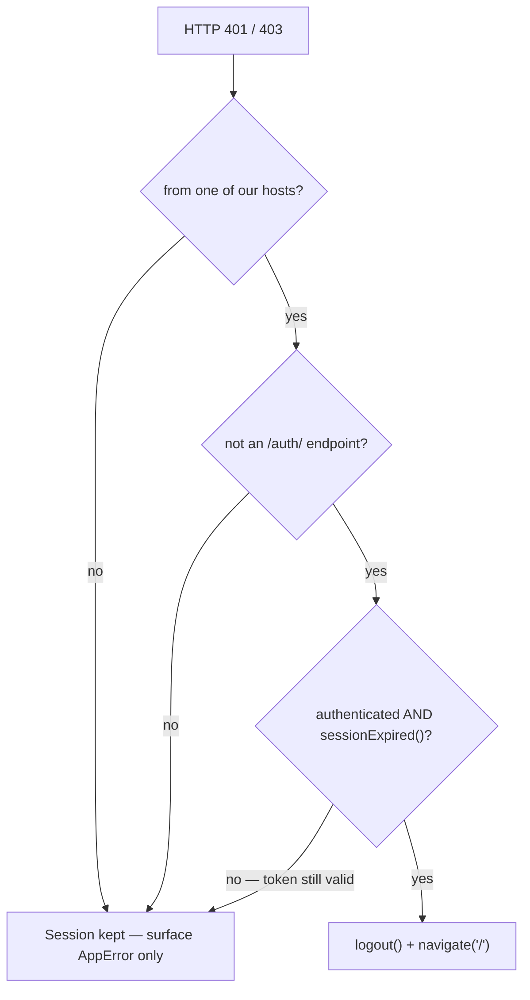

# Frontend — ECIWISE-Front

## Overview

`ECIWISE-Front` is the single Angular application that every user of the platform interacts with. It serves three roles (student, tutor, admin) over a wide feature surface — tutoring, materials, chat, forums, flashcards, quizzes, games, gamification, AI predictions, video calls, and a collaborative whiteboard — and it is the **only** client of the twelve backend microservices.

- **Angular 21** with standalone components, signals for state, and **SSR** (`@angular/ssr`) behind an Express server.
- **No external state library.** Feature state lives in root-provided services that expose signals ([ADR-015](/docs/architecture-decisions/#adr-015--frontend-angular-standalone--signals--ssr-with-no-external-state-library)).
- **Runtime configuration.** Service URLs are resolved at boot from `/assets/env.json`, so one build artifact serves every environment ([ADR-017](/docs/architecture-decisions/#adr-017--frontend-runtime-configuration-via-assetsenvjson)).
- **Security by default.** JWT never leaves our own hosts, CSP and HSTS are emitted by the SSR server, and a five-job CI pipeline gates every push.

| Component | Technology |
|-----------|------------|
| Framework | Angular 21 · TypeScript (strict) · standalone components |
| State | Angular signals (`signal`, `computed`) — no NgRx |
| SSR | `@angular/ssr` · Express (`src/server.ts`) |
| Routing | `provideRouter` with lazy `loadComponent` / `loadChildren` |
| i18n | `@ngx-translate/core` — runtime switching (es, en, de, pt, fr) |
| UI kit | `eci-*` component library · Lucide icons (`@lucide/angular`) |
| Realtime | `@stomp/stompjs` (chat) · native WebSocket (game, whiteboard) |
| Video / board | Jitsi IFrame API · `@excalidraw/excalidraw` |
| Tests | Karma/Jasmine (unit + integration) · Playwright (e2e) |
| Quality gates | ESLint (ratchet) · SonarQube · CodeQL · Gitleaks |

---

## Architecture

The app is organized in three layers with dependencies pointing **inward toward `core`**. A feature may depend on `core` and `shared`; `core` never depends on a feature.



| Layer | Path | Responsibility |
|-------|------|---------------|
| Core | `src/app/core` | Auth, HTTP, i18n, theme, a11y, runtime config, feature flags, per-service HTTP clients, cross-cutting models |
| Features | `src/app/features` | Screens and services per functional domain |
| Shared layout | `src/app/shared/layout` | Shell, side navigation, top bar, floating actions |
| Shared UI | `src/app/shared/ui` | `eci-*` design-system components |
| Shared util | `src/app/shared/util` | Reusable helpers |

### Bootstrap

`src/app/app.config.ts` is the composition root. **Initialization order is load-bearing:**



Two details that exist for a concrete reason:

- **`EnvService` loads before feature flags**, because resolving flags requires `wise_auth`'s URL — which comes from the env file.
- **`flags.init()` is deliberately not awaited.** It seeds synchronously from local cache and only the backend sync runs in the background. Awaiting it delayed hydration by however long `wise_auth` took to answer — and with the backend down, until the fetch expired — leaving the page painted by SSR but unresponsive. Not awaiting adds no flicker: SSR already paints with default flags, so the adjustment on arrival happens either way.

### Routing and access control

Routes are lazy by default. Every authenticated area sits under `AppShellComponent` and is gated by `roleGuard`, which redirects to the user's own home rather than to a dead end.



`auth/login` and `auth/register` remain as `redirectTo: ''` — the landing now hosts both flows, and the redirects keep old bookmarks alive.

### State

State lives in `@Injectable({ providedIn: 'root' })` services exposing signals. `AuthService` is the reference implementation:



There is no store. State here is owned by one domain and read by a few components — `computed()` derives it without selectors, and that is the whole problem NgRx would have solved at much higher cost.

### Runtime configuration

The frontend talks to twelve services whose URLs differ per environment. Rather than baking them in at build time, `scripts/write-env.mjs` generates `/assets/env.json` from environment variables, and each service gets a typed injection token.



No component ever reads a raw URL — it injects the typed token, which makes tests trivial to configure.

### SSR

`src/server.ts` is an Express server that renders the app, serves static assets, compresses every text response, and emits security headers. Compression is not cosmetic: Azure App Service does not compress dynamic Node responses, so without it the bundle and SVGs ship uncompressed — about **1.4 MB extra on first load**.

The SSR discipline: **any browser-only API must be guarded** with `isPlatformBrowser`. `AuthService` guards every `localStorage` access; `ChatService` guards local persistence. Forgetting breaks the server render.

---

## Development Guidelines

### Angular

- **Standalone components** — no NgModules.
- **`ChangeDetectionStrategy.OnPush`** on every new component.
- Prefer **`inject()`** over constructor injection.
- Prefer **`signal()` / `computed()`** for new local state.
- Use modern control flow: **`@if`, `@for`, `@switch`**.
- Avoid `ngClass` / `ngStyle` — use direct bindings.
- Components must not call `HttpClient` directly when a domain service already exists.

### File layout

```text
feature-name/            # screen components
  feature-name.ts
  feature-name.html
  feature-name.css

feature-name.service.ts  # services
feature-name.service.spec.ts
```

### Visible text — never hardcoded

Every user-visible string goes through i18n. This is enforced by convention across all five locales (es, en, de, pt, fr):


```html
{{ 'clave.ruta' | translate }}

<!-- attributes -->
[placeholder]="'tasks.placeholder' | translate"
[attr.aria-label]="'common.close' | translate"
```


### UI

- Reuse the kit: `eci-button`, `eci-card`, `eci-page-header`, `eci-section-tabs`, `eci-select`, `eci-modal`.
- **Icons come from `eci-icon` (Lucide) — never emojis.**
- Functional screens stay inside authenticated areas; they are not landing pages.
- **Mobile first.**
- No cards inside cards.
- Every screen must respect **light, dark, and accessibility** themes.
- Consume design tokens from `src/styles.css` (`--surface`, …) — no hardcoded colors.

### Testing

| Layer | Command | Scope |
|-------|---------|-------|
| Unit | `npm run test:unit` | `src/**/*.unit.spec.ts` |
| Integration | `npm run test:integration` | `src/**/*.integration.spec.ts` |
| Coverage | `npm run test:coverage` | feeds SonarQube (`lcov.info`) |
| E2E | `npm run e2e` | Playwright |

### Lint ratchet

`npm run lint:ci` runs a **ratchet**: the build fails on *new* lint violations while tolerating the existing baseline. Quality improves monotonically without a big-bang cleanup blocking delivery.

---

## Security

The frontend holds the user's credential and is the entry point to every service, so its security posture is a stack of independent layers rather than a single control.

```mermaid
graph TB
  subgraph Transport["1 — Transport (SSR server, src/server.ts)"]
    HSTS["Strict-Transport-Security\nmax-age=63072000 · includeSubDomains · preload"]
    CSP["Content-Security-Policy\nupgrade-insecure-requests · connect-src 'self' https: wss:\nframe-ancestors 'none' · object-src 'none' · base-uri 'self'"]
    HDRS["X-Content-Type-Options: nosniff\nX-Frame-Options: DENY\nReferrer-Policy: no-referrer"]
  end

  subgraph Session["2 — Session (core/auth)"]
    STORE["localStorage: eciwise.token · eciwise.session"]
    EXP["isUsableToken() — exp checked on every read"]
    REST["restoreUser() — stale session purged at boot"]
  end

  subgraph Egress["3 — Token egress (authInterceptor)"]
    ALLOW["isOwnApiUrl(req.url, ownApiHosts())\ntoken attached ONLY to our own hosts"]
  end

  subgraph Access["4 — Access control (guards)"]
    AG["authGuard — session required"]
    RG["roleGuard — role required"]
    FG["feature.guard — flag required"]
  end

  subgraph Errors["5 — Error handling (errorInterceptor)"]
    E401["401/403 from our hosts + sessionExpired() → logout"]
    EPERM["403 with a valid token → permission error, session kept"]
  end

  subgraph CI["6 — Supply chain (GitHub Actions)"]
    CQL["CodeQL SAST"]
    AUD["npm audit · dependency-review"]
    GL["Gitleaks secret scan"]
    LINT["ESLint ratchet"]
  end

  Transport --> Session --> Egress --> Access --> Errors
  CI -.->|"gates every push"| Transport
```



### 1 — Transport hardening

The SSR server emits a CSP **focused on transport (anti-MITM)** rather than on script origins. That is a deliberate scoping decision: the app loads Jitsi's `external_api.js` and iframe from a **dynamic domain supplied by the backend** ([ADR-011](/docs/architecture-decisions/#adr-011--self-hosted-jitsi-meet-for-tutoring-video-calls)) and embeds PDFs, so restricting `script-src` / `frame-src` would break real features.

| Directive | Purpose |
|-----------|---------|
| `upgrade-insecure-requests` | Promotes any `http://` / `ws://` request to HTTPS/WSS — kills mixed content and neutralizes a plaintext downgrade |
| `connect-src 'self' https: wss:` | fetch/XHR/WebSocket only over encrypted channels; an attacker cannot force a cleartext connection to sniff. (Does not affect the Jitsi iframe — it runs under its own context and policy) |
| `frame-ancestors 'none'` + `X-Frame-Options: DENY` | Nobody can embed the app — clickjacking / UI redressing over an intercepted session |
| `object-src 'none'` | No plugins |
| `base-uri 'self'` | Blocks `<base>` injection |
| `X-Content-Type-Options: nosniff` | No MIME sniffing |
| `Referrer-Policy: no-referrer` | URLs never leak to third parties |
| **HSTS** — 2 years, subdomains, preload | Browser always uses HTTPS for the domain — defeats SSL stripping |

**HSTS and CSP are only emitted over HTTPS.** Behind Azure's edge, TLS terminates there and arrives as `X-Forwarded-Proto: https` (hence `app.set('trust proxy', true)`). The guard exists so local `http://` development never accidentally pins HSTS on `localhost`.

### 2 — Session handling

The JWT lives in `localStorage` — a conscious trade documented in [ADR-016](/docs/architecture-decisions/#adr-016--frontend-jwt-in-localstorage-with-host-restricted-attachment), taken because cookie auth is impractical across twelve origins plus WebSockets.

| Behaviour | Implementation |
|-----------|---------------|
| Expired token is never used | `isUsableToken()` decodes `exp` on every read; expired → purged, treated as no session |
| Stale session cleared at boot | `restoreUser()` drops the persisted user if the token is missing, expired, or corrupt |
| Token without `exp` | Treated as valid — absence of `exp` does not force a logout |
| Corrupt token | Any `jwtDecode` throw is treated as expired |
| SSR safety | Every `localStorage` access guarded by `isPlatformBrowser`; the server never has a token |

The rule this enforces: **the UI is never "logged in" with a dead token.** Guards see the true state and redirect to login instead of letting the user hit a wall of 401s.

### 3 — Token egress — the host allowlist

The single most important frontend control. A naive interceptor attaches the token to *every* outgoing request, handing the user's credential to any third party the app happens to call.

```ts
// core/auth/auth.interceptor.ts
const token = localStorage.getItem(TOKEN_KEY);
if (!token || !isOwnApiUrl(req.url, ownApiHosts())) {
  return next(req);   // third-party host → no token attached
}
return next(req.clone({ setHeaders: { Authorization: `Bearer ${token}` } }));
```

`ownApiHosts()` (`core/config/api-hosts.ts`) builds the allowlist from the **same injection tokens the runtime config populates**, so the security allowlist automatically tracks configuration — there is no second list to drift out of sync.



`isOwnApiUrl` matches on `url === base || url.startsWith(base + '/')` — the trailing-slash check matters, since a prefix test alone would match a hostile `https://wise-auth.evil.com` against a `https://wise-auth.example` base.

The same function backs the `errorInterceptor`, deliberately: **token attachment and session-expiry handling can never disagree about which hosts are ours.**

### 4 — Access control

Guards are UX and defense-in-depth, **not the security boundary** — every service independently validates the JWT and its role claim. A tampered `localStorage` role changes what the menu renders; it changes nothing about what the API returns.

| Guard | Enforces | On failure |
|-------|----------|-----------|
| `authGuard` | Active session | Redirect to `/` (landing hosts login) |
| `roleGuard` | `data: { role }` matches the session role | Redirect to `ROLE_HOME[role]` — the user's own home, not a dead end |
| `feature.guard` | Feature flag enabled | Blocks routes for admin-disabled features |

### 5 — Error handling

The `errorInterceptor` normalizes every HTTP error to an `AppError` carrying a **translation key** — raw backend messages never reach the UI, so internal details cannot leak through an error toast.

Its session logic is deliberately narrow:



Two distinctions that matter:

- **A 403 with a still-valid token is a permission denial, not a dead session.** Logging the user out would be wrong and infuriating.
- **A 401 on an `/auth/` endpoint is part of the flow** (wrong password), not an expiry.

### 6 — Supply chain and CI gates

`.github/workflows/security.yml` runs on every push to `main`, `develop`, `feat/**`, `fix/**`, on every PR, and weekly on a schedule.

| Job | Tool | Gate |
|-----|------|------|
| **CodeQL SAST** | `github/codeql-action` | `security-extended,security-and-quality`; `build-mode: none` — JS/TS needs no compilation, which avoids OOM/SSR build failures |
| **Dependency audit** | `npm audit` | Fails on **critical** only (`--omit=dev`) — no fix exists in Angular 21.x for the current highs |
| **Dependency review** | `actions/dependency-review-action` | Fails PRs on **high**, with three documented `allow-ghsas` exceptions |
| **Secret scan** | Gitleaks binary (MIT) | Full history, `--redact`. The official action requires a paid org license, so the binary is used directly |
| **Lint security** | ESLint ratchet | No new violations |
| **Code quality** | SonarQube (`sonar.yml`) | Coverage via `lcov.info`; i18n translation files excluded from duplication detection — they are *data*, and `en.ts`/`es.ts` sharing a key structure is their entire purpose |

The accepted dependency risk is documented in the workflow rather than silently ignored: **`lodash-es` (high) arrives only transitively via `@excalidraw/excalidraw`**. There is no fix without a breaking Excalidraw downgrade, and the impact is client-side inside the whiteboard editor. The rest of the gate stays strict.

### Frontend threat model — what is and is not defended

| Threat | Status | Control |
|--------|:------:|---------|
| Token sent to a third party | **Defended** | `authInterceptor` host allowlist |
| MITM / SSL stripping | **Defended** | HSTS preload · `upgrade-insecure-requests` · `connect-src https: wss:` |
| Clickjacking | **Defended** | `frame-ancestors 'none'` · `X-Frame-Options: DENY` |
| MIME sniffing | **Defended** | `X-Content-Type-Options: nosniff` |
| Referrer leakage | **Defended** | `Referrer-Policy: no-referrer` |
| Stale/expired session UI | **Defended** | `isUsableToken()` · `restoreUser()` · `errorInterceptor` |
| Backend error detail leaking to UI | **Defended** | `AppError` translation keys |
| Secrets committed | **Defended** | Gitleaks on full history |
| Privilege escalation via tampered role | **Defended** *(server-side)* | Guards are UX only; every service re-validates the JWT role claim |
| **XSS → token theft** | **Accepted risk** | `localStorage` is readable by any JS on the origin. Mitigated by Angular's built-in escaping (no `bypassSecurityTrust*`, no raw `innerHTML`), CSP, CodeQL, and dependency gates — **but not eliminated**. See [ADR-016](/docs/architecture-decisions/#adr-016--frontend-jwt-in-localstorage-with-host-restricted-attachment) |
| **Token revocation before `exp`** | **Not possible** | Logout is a client-side discard; the token stays valid until expiry. Inherent to stateless validation — see [ADR-014](/docs/architecture-decisions/#adr-014--jwt-hs256-as-the-cross-service-token-format) |
| Script-origin injection via CDN | **Partially** | CSP deliberately does not restrict `script-src` — Jitsi's domain is dynamic and PDFs are embedded |

See [Security](/docs/security/) for how these controls compare with each microservice's.

---

## Related

- [Security](/docs/security/) — comparative security across the frontend and every microservice
- [ADR-015](/docs/architecture-decisions/#adr-015--frontend-angular-standalone--signals--ssr-with-no-external-state-library) — Angular standalone + signals + SSR
- [ADR-016](/docs/architecture-decisions/#adr-016--frontend-jwt-in-localstorage-with-host-restricted-attachment) — JWT in `localStorage`
- [ADR-017](/docs/architecture-decisions/#adr-017--frontend-runtime-configuration-via-assetsenvjson) — runtime configuration
