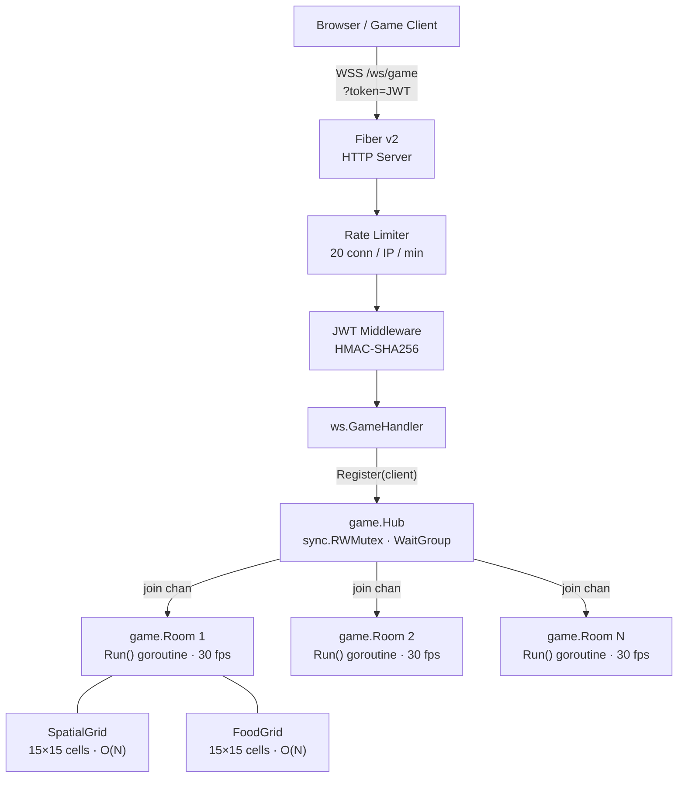
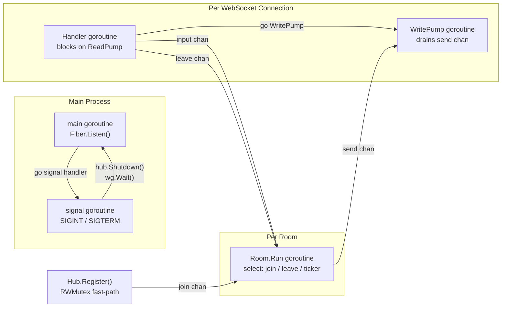
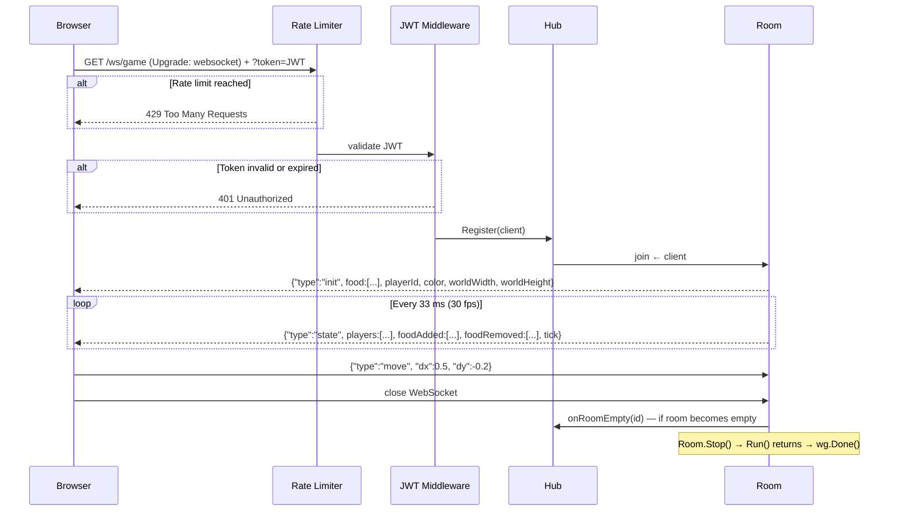
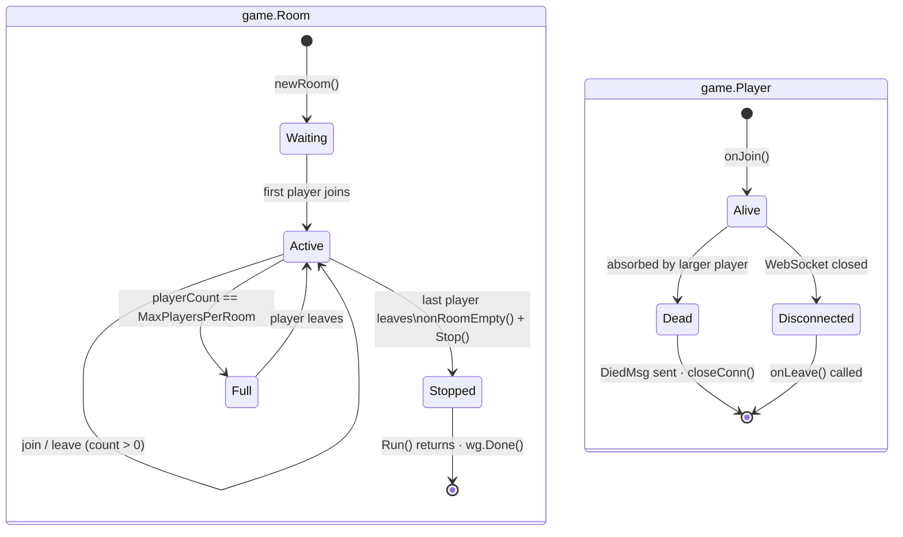
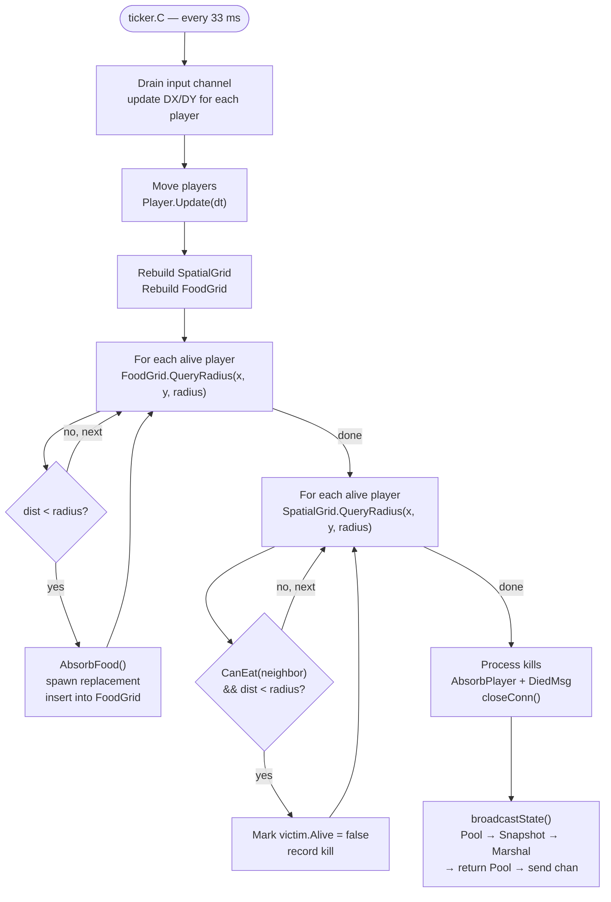
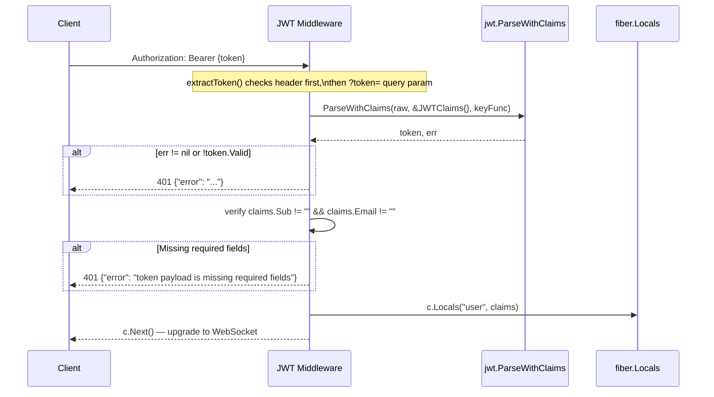
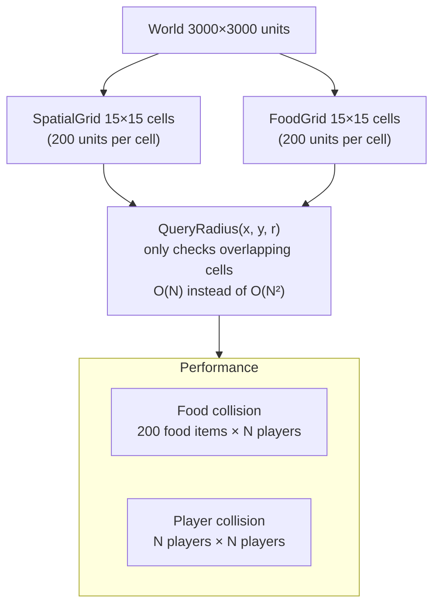
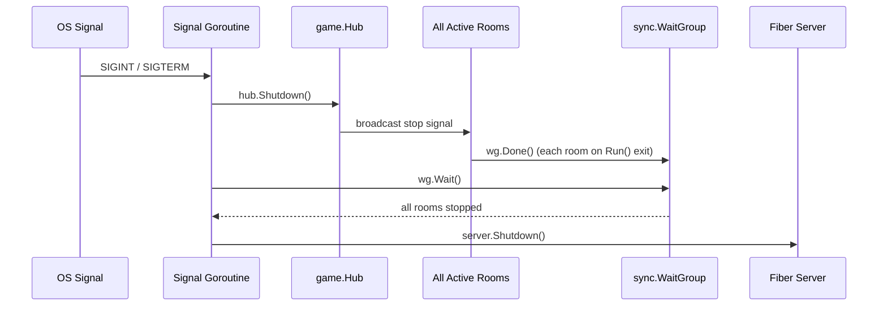

# Game Service

## Overview

`game` is the real-time multiplayer game server for the ECIWise platform. It implements an agar.io-style game in which players move a circular cell around a shared world, absorb food to grow, and eliminate smaller players. The server is built with **Go** and **Fiber v2**, communicating exclusively over WebSocket.

The service handles four core concerns:

- **WebSocket management**: authenticated connections, per-connection read/write pumps, and graceful shutdown.
- **Room lifecycle**: rooms are created on demand, run at a fixed tick rate, and destroyed automatically when empty.
- **Game simulation**: spatial grid collision detection for food absorption and player-eating at O(N) cost per tick.
- **Security**: mandatory JWT authentication on every connection with rate limiting per IP.

---

## System Architecture



---

## Concurrency Model



---

## WebSocket Connection Lifecycle



---

## Room State Machine



---

## Game Tick Flow (30 fps)



---

## JWT Authentication Flow



---

## Spatial Grid



---

## Graceful Shutdown



---

## Configuration

| Variable | Required | Default | Description |
|---|---|---|---|
| `JWT_SECRET` | Yes | — | HMAC-SHA256 secret (shared with Auth service) |
| `PORT` | No | `8080` | HTTP port |
| `FRONTEND_URL` | No | `http://localhost:5173` | Allowed CORS origin |
| `MAX_PLAYERS_PER_ROOM` | No | `50` | Maximum players before a room is full |
| `WORLD_WIDTH` | No | `3000` | World width in game units |
| `WORLD_HEIGHT` | No | `3000` | World height in game units |
| `TICK_RATE_MS` | No | `33` | Milliseconds between ticks (~30 fps) |
| `FOOD_COUNT` | No | `200` | Number of food pellets in the world at any time |

---

## WebSocket Protocol

### Client → Server

```json
{ "type": "move", "dx": 0.5, "dy": -0.2 }
```

`dx`, `dy` in range `[-1, 1]`.

### Server → Client

| Type | When | Key fields |
|---|---|---|
| `init` | On connection | `playerId`, `color`, `worldWidth`, `worldHeight`, full `food` list |
| `state` | Every tick (~33 ms) | `tick`, `players[]`, `foodAdded[]`, `foodRemoved[]`, optional `leaderboard` (every 10 ticks) |
| `died` | Player absorbed | `killedBy`, `finalScore` |
| `error` | Auth or internal error | `message` |

---

## Endpoints

| Method | Path | Auth | Description |
|---|---|---|---|
| `GET` | `/health` | None | Server health: active rooms and player count |
| `WS` | `/ws/game` | JWT | Primary game WebSocket channel |
| `WS` | `/game/ws/game` | JWT | Alternate path (same handler) |

---

## Local Execution

```bash
go mod download
go run .

# With Docker
docker compose up --build
```

---

## Further Reading

- Source repository: [EciWise/game](https://github.com/EciWise/game)
- Spatial grid: `game/grid.go`
- Room loop: `game/room.go`
- JWT middleware: `ws/jwt.go`
