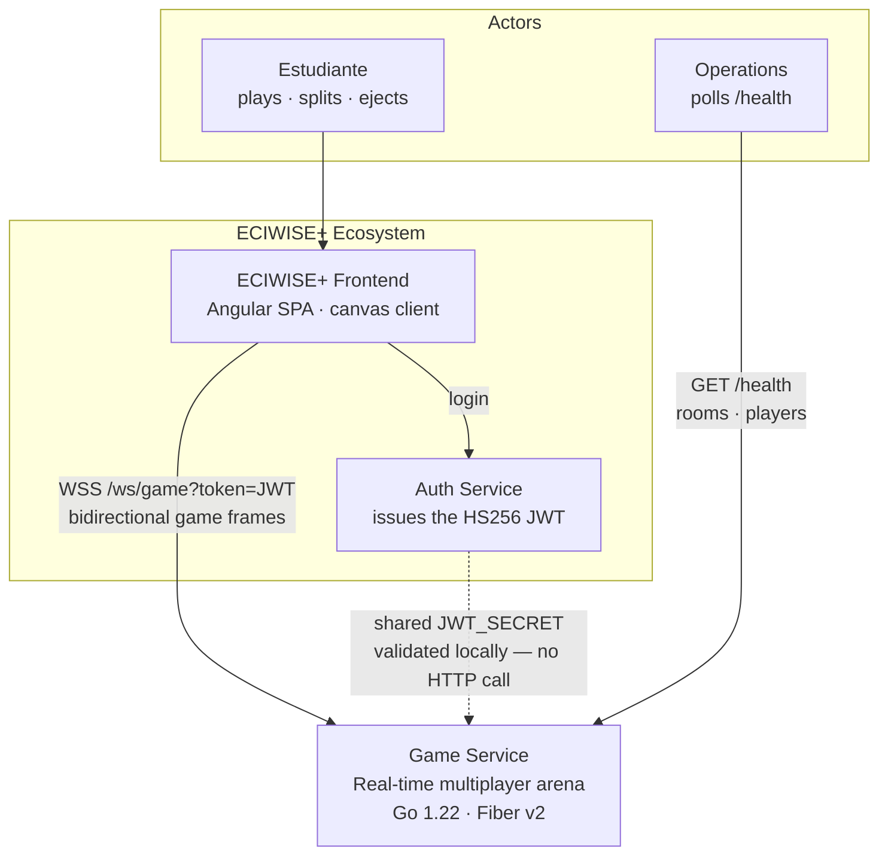
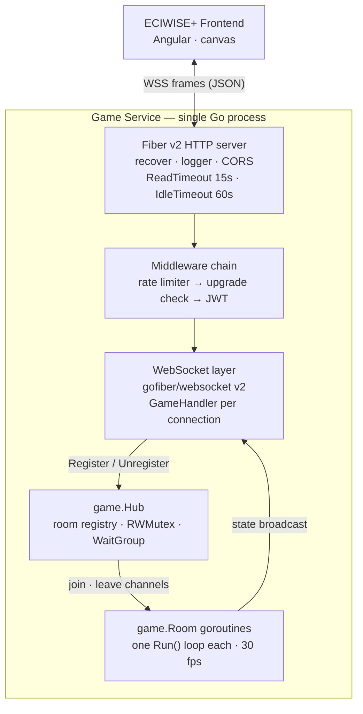
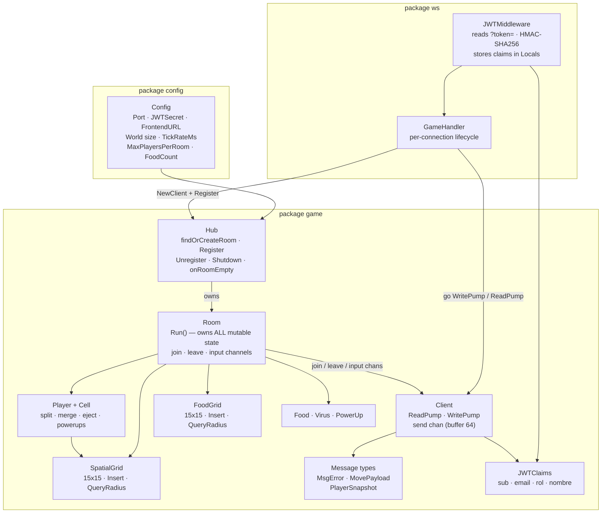
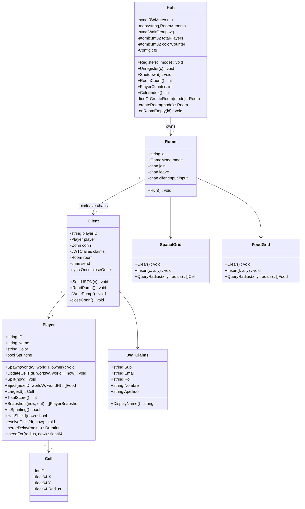
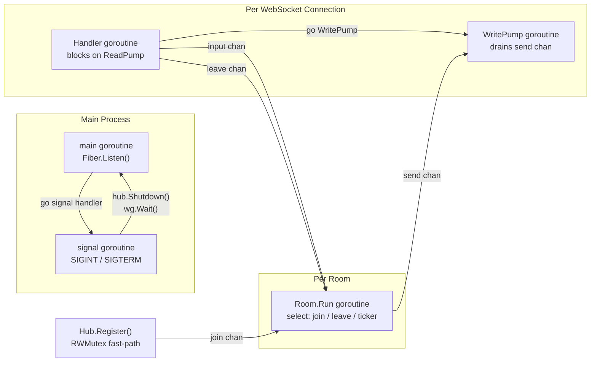
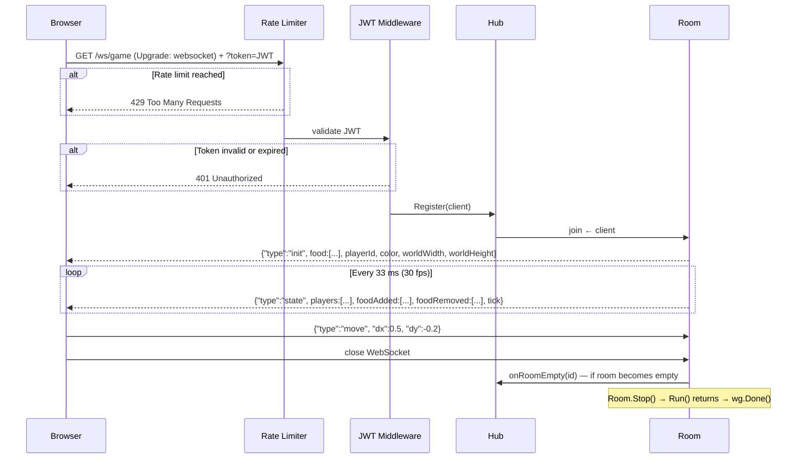
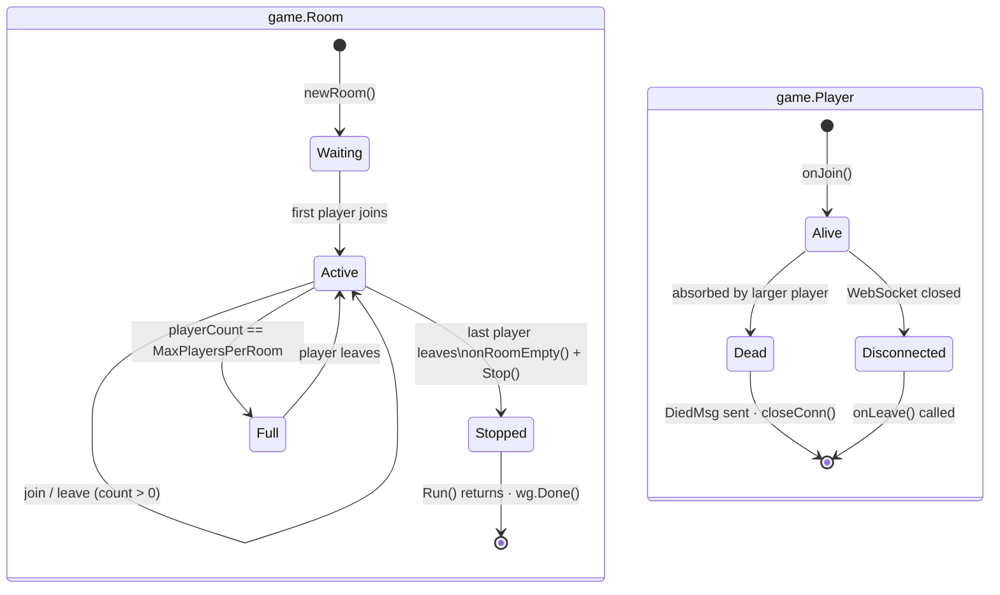
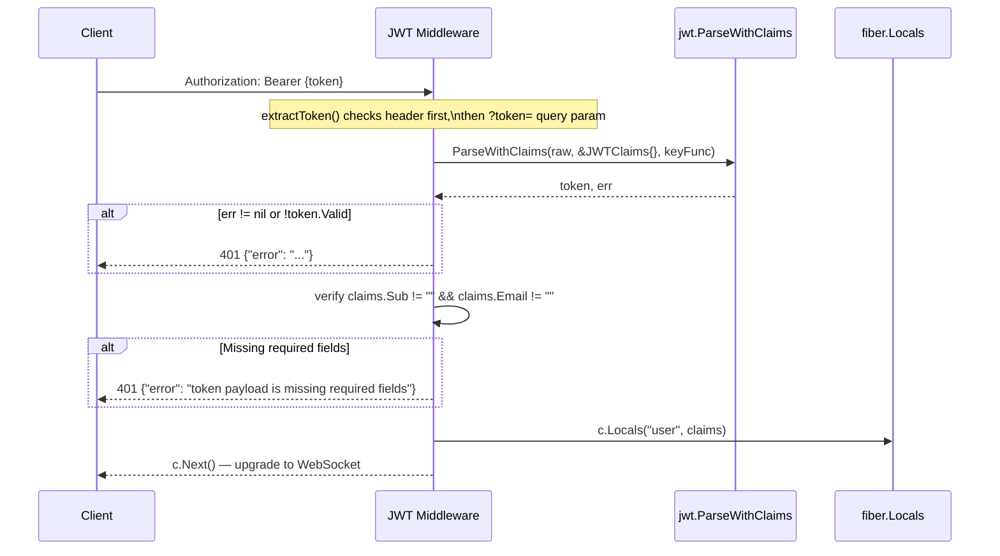
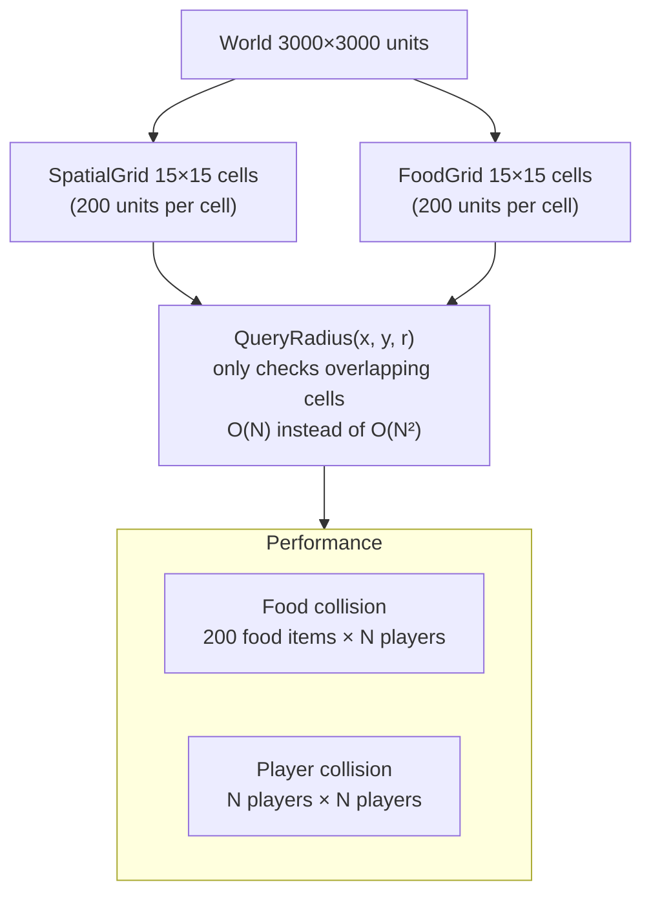
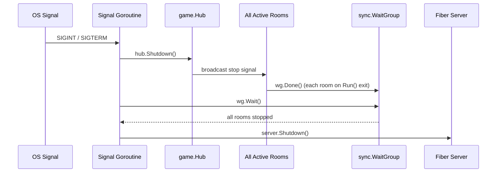

# Game Service

## Overview

`game` is the real-time multiplayer game server for the ECIWise platform. It implements an agar.io-style game in which players move a circular cell around a shared world, absorb food to grow, and eliminate smaller players. The server is built with **Go** and **Fiber v2**, communicating exclusively over WebSocket.

The service handles four core concerns:

- **WebSocket management**: authenticated connections, per-connection read/write pumps, and graceful shutdown.
- **Room lifecycle**: rooms are created on demand, run at a fixed tick rate, and destroyed automatically when empty.
- **Game simulation**: spatial grid collision detection for food absorption and player-eating at O(N) cost per tick.
- **Security**: mandatory JWT authentication on every connection with rate limiting per IP.

---

## C4 — Level 1: System Context



### Actors

| Actor | Interaction |
|---|---|
| Estudiante | Connects over WebSocket, moves, splits, ejects mass, competes on the leaderboard |
| Operations | Polls `/health` for room and player counts — the only unauthenticated route |

### Neighbouring systems

| System | Relationship |
|---|---|
| Auth Service | Issues the JWT. Game validates it locally with `golang-jwt` on the upgrade request |
| Frontend | The only client; carries the token as a **query parameter** because browsers cannot set headers on a WebSocket handshake |

Game is **fully in-memory and stateless across restarts**: no database, no message broker, no calls to any other service. A restart drops every room — matches are ephemeral by design.

---

## C4 — Level 2: Containers



| Container | Technology | Responsibility |
|---|---|---|
| HTTP server | Fiber v2 (fasthttp) | `/health` plus the WebSocket upgrade routes |
| Middleware chain | Fiber middleware | Rate limit → upgrade check → JWT, cheapest rejection first |
| WebSocket layer | `gofiber/websocket` | One `ReadPump` + one `WritePump` goroutine per client |
| Hub | Go stdlib | Room registry, player/colour counters, graceful drain |
| Rooms | Go goroutines | The simulation itself — one loop per room, 30 ticks/s |

There is **no persistence container**. All state lives in the room goroutines' stacks and heaps.

Two route prefixes are registered — `/ws/game` and `/game/ws/game` — so the service works both when exposed directly and when mounted behind a `/game` path prefix at the gateway.

---

## C4 — Level 3: Components



| Component | Role |
|---|---|
| `ws.JWTMiddleware` | Validates the token **before** the upgrade; puts `*game.JWTClaims` in Fiber `Locals` |
| `ws.GameHandler` | Registers the client, starts `WritePump` as a goroutine, runs `ReadPump` inline, unregisters on return |
| `game.Hub` | Finds or creates a room per mode, tracks counts atomically, drains on shutdown |
| `game.Room` | The actor: its `Run()` goroutine exclusively owns the world state |
| `game.Client` | Socket I/O only — never touches world state directly |
| `game.SpatialGrid` / `FoodGrid` | 15×15 uniform bucketing that turns collision checks from O(N²) into ~O(N) |

### Game modes

| Mode | Query value | Timed |
|---|---|---|
| Classic | `classic` (default) | no |
| Pomodoro | `pomodoro` | yes |
| Battle Royale | `battleroyale` | yes |

`ParseMode` normalises anything unrecognised to `classic`, so a malformed query never rejects a connection.

---

## C4 — Level 4: Code



### The concurrency contract

The design is **CSP / actor**, and the invariant is worth stating explicitly because it is what makes the server safe without locks on the hot path:

> All mutable world state lives exclusively inside `Room.Run()`. External goroutines never touch it — they communicate only through the `join`, `leave` and `input` channels.

Consequences visible in the code:

| Mechanism | Why |
|---|---|
| `Hub.Register` sets `client.room` **before** either pump starts | `ReadPump`'s deferred cleanup dereferences it |
| `Client.send` is buffered (64) and frames are **dropped** when full | A slow client must never block the 30 fps game loop |
| `closeOnce sync.Once` | `ReadPump` and `WritePump` can both reach cleanup; the socket closes once |
| `snapshotPool sync.Pool` | Recycles `[]PlayerSnapshot` arrays to cut per-tick heap allocation |
| `Hub.wg` (`WaitGroup`) | `Shutdown()` waits for every room goroutine to finish before Fiber stops |
| `atomic.Int32` counters | `/health` reads player/room counts without taking the hub lock |

Tuning constants live in `game/constants.go` — `InitialRadius` 22, `FoodRadius` 8, `MinEatRatio` 1.1 (a blob must be 10 % larger to absorb another), `BaseSpeed` 200 u/s decaying by `speed = BaseSpeed / (1 + radius/120)`, mass decay of 1.5 % every 5 ticks, and a 10-player leaderboard.

---

## Concurrency Model



---

## WebSocket Connection Lifecycle



---

## Room State Machine



---

## Game Tick Flow (30 fps)


---

## JWT Authentication Flow



---

## Spatial Grid



---

## Graceful Shutdown



---

## Configuration

| Variable | Required | Default | Description |
|---|---|---|---|
| `JWT_SECRET` | Yes | — | HMAC-SHA256 secret (shared with Auth service) |
| `PORT` | No | `8080` | HTTP port |
| `FRONTEND_URL` | No | `http://localhost:5173` | Allowed CORS origin |
| `MAX_PLAYERS_PER_ROOM` | No | `50` | Maximum players before a room is full |
| `WORLD_WIDTH` | No | `3000` | World width in game units |
| `WORLD_HEIGHT` | No | `3000` | World height in game units |
| `TICK_RATE_MS` | No | `33` | Milliseconds between ticks (~30 fps) |
| `FOOD_COUNT` | No | `200` | Number of food pellets in the world at any time |

---

## WebSocket Protocol

### Client → Server

```json
{ "type": "move", "dx": 0.5, "dy": -0.2 }
```

`dx`, `dy` in range `[-1, 1]`.

### Server → Client

| Type | When | Key fields |
|---|---|---|
| `init` | On connection | `playerId`, `color`, `worldWidth`, `worldHeight`, full `food` list |
| `state` | Every tick (~33 ms) | `tick`, `players[]`, `foodAdded[]`, `foodRemoved[]`, optional `leaderboard` (every 10 ticks) |
| `died` | Player absorbed | `killedBy`, `finalScore` |
| `error` | Auth or internal error | `message` |

---

## Endpoints

| Method | Path | Auth | Description |
|---|---|---|---|
| `GET` | `/health` | None | Server health: active rooms and player count |
| `WS` | `/ws/game` | JWT | Primary game WebSocket channel |
| `WS` | `/game/ws/game` | JWT | Alternate path (same handler) |

---

## Local Execution

```bash
go mod download
go run .

# With Docker
docker compose up --build
```

---

## Further Reading

- Source repository: [EciWise/game](https://github.com/EciWise/game)
- Spatial grid: `game/grid.go`
- Room loop: `game/room.go`
- JWT middleware: `ws/jwt.go`
