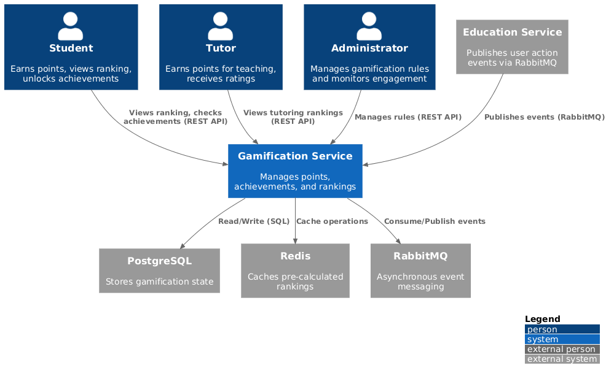
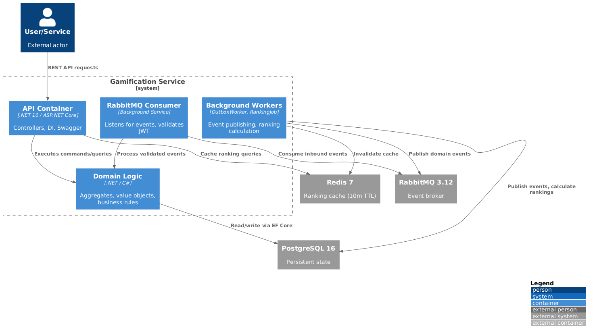
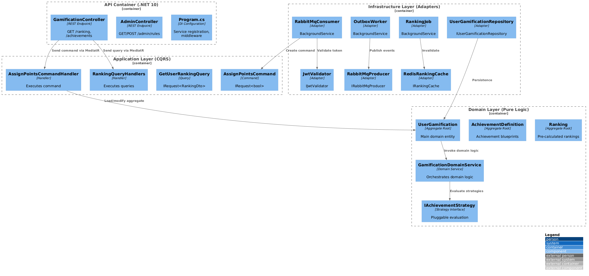
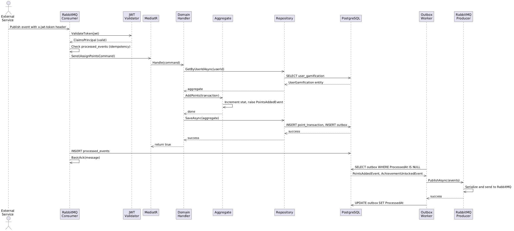

# Gamification Service

## Overview

`gamification-service` is a secure, event-driven microservice responsible for managing all gamification elements within the EciWise platform. It provides students with motivation through points, achievements, and rankings, while giving administrators the ability to configure gamification rules and monitor user engagement.

The service handles three core domains:

- **Points Management**: Automatically award points to users based on their actions (completed tutorials, taught tutoring sessions, approved materials, rated tutorials, published forum posts) with configurable rules and transactional audit trails.
- **Achievement System**: Unlock digital badges based on user milestones and activity thresholds through pluggable evaluation strategies, allowing easy extension without modifying core logic.
- **Dynamic Rankings**: Calculate and cache global, subject-specific, and monthly leaderboards using specialized algorithms, with instant cache invalidation and pre-calculated periodic updates.

---

## Gamification Flow

The gamification service operates on an event-driven architecture where external services publish user actions to RabbitMQ, the service validates JWT authentication, processes the event with guaranteed idempotency, and publishes domain events through an Outbox Pattern for reliable eventual consistency.

**User Actions** trigger events published to RabbitMQ:
- Tutorial Completed → `+10 points` + increment `TutoriaCompletada` stat
- Tutorial Taught → `+15 points` + increment `TutoriaDictada` stat
- Material Approved → `+5 points` + increment `MaterialAprobado` stat
- Tutorial Rated → `+8 points` + increment `TutoriaCalificada` stat
- Forum Post Published → `+3 points` + increment `ForoPublicado` stat

**Achievement Strategies** evaluate user progress:
- **First Tutoring**: `TutoriaDictada >= 1` → "First Tutor" badge
- **Active Collaborator**: `MaterialAprobado >= 5` → "Collaborator" badge
- **Outstanding Tutor**: `TutoriaCalificada >= 10` → "Expert Tutor" badge
- **Mentor of the Month**: Ranked in top 10 globally → "Monthly Mentor" badge

**Ranking Types** serve different leaderboards:
- **GlobalPorPuntos**: All users ranked by total points
- **TutoresMejorCalificados**: Top tutors by average rating
- **TopDelMes**: Highest point earners this month
- **PorMateria**: Rankings within each subject

---

## Architecture

The Gamification Service follows a **Hexagonal Architecture** (Ports & Adapters) combined with **Domain-Driven Design** and **CQRS**, ensuring clean separation of business logic from infrastructure concerns and allowing the domain layer to remain framework-agnostic.

Every inbound message from RabbitMQ passes through the **Security Layer** where `IJwtValidator` validates the JWT signature, expiration, issuer, and audience. Validated messages proceed to the **Application Layer** where `IMediator` (MediatR) routes commands to their respective handlers. The **Domain Layer** contains pure business logic with zero external dependencies: aggregates, value objects, domain events, and repository ports. The **Infrastructure Layer** implements repository adapters (EF Core + PostgreSQL), message adapters (RabbitMQ producer/consumer), and cache adapters (Redis).

### **Runtime Environment**

The service is built with **.NET 10** and **C#**, backed by:
- **PostgreSQL 16**: Relational database for persistent state
- **RabbitMQ 3.12**: Asynchronous message broker for event-driven integration
- **Redis 7**: Distributed cache for pre-calculated rankings (10-minute TTL)
- **Entity Framework Core 10**: ORM for database operations
- **MediatR 12**: CQRS pattern implementation

### Package/Project Structure

```
Gamification.slnx (.NET 10 Solution)
├── Gamification.Domain/              (DDD - pure business logic)
│   ├── Aggregates/
│   │   ├── AggregateRoot
│   │   ├── UserGamification          (main aggregate root)
│   │   ├── AchievementDefinition
│   │   └── Ranking
│   ├── Entities/
│   │   ├── Entity
│   │   ├── PointTransaction
│   │   ├── LevelDefinition
│   │   ├── UserAchievement
│   │   ├── UserLevelHistory
│   │   ├── WeeklyActivity
│   │   ├── GamificationRule
│   │   └── RankingEntry
│   ├── ValueObjects/
│   │   ├── ValueObject
│   │   ├── Points
│   │   ├── UserId
│   │   ├── ReputationScore
│   │   ├── UserActionStat
│   │   ├── DateRange
│   │   ├── SubjectCode
│   │   ├── IdempotencyKey
│   │   └── (7 more...)
│   ├── Events/
│   │   ├── DomainEvent
│   │   ├── PointsAddedEvent
│   │   ├── AchievementUnlockedEvent
│   │   ├── LevelUpEvent
│   │   └── LowRatingAlertEvent
│   ├── Enums/
│   │   ├── ActionType
│   │   └── RankingType
│   ├── Services/
│   │   ├── GamificationDomainService
│   │   ├── IAchievementStrategy (port)
│   │   └── IAchievementStrategyFactory
│   └── Repositories/ (ports)
│       ├── IUserGamificationRepository
│       ├── IAchievementDefinitionRepository
│       ├── IGamificationRuleRepository
│       └── (3 more...)
│
├── Gamification.Application/         (CQRS orchestration)
│   ├── Commands/
│   │   ├── AssignPointsCommand
│   │   └── UnlockAchievementCommand
│   ├── Queries/
│   │   ├── GetUserRankingQuery
│   │   ├── GetUserAchievementsQuery
│   │   └── GetTopRankingQuery
│   └── Handlers/
│       ├── AssignPointsCommandHandler
│       └── RankingQueryHandlers
│
├── Gamification.Infrastructure/      (Adapters - persistence, cache, messaging)
│   ├── Persistence/
│   │   ├── AppDbContext
│   │   ├── OutboxEntities / OutboxWorker
│   │   ├── RankingJob (background service)
│   │   └── Repositories/
│   │       ├── UserGamificationRepository
│   │       ├── AchievementDefinitionRepository
│   │       └── (4 more...)
│   ├── Messaging/
│   │   ├── RabbitMqConsumer (background service)
│   │   └── RabbitMqProducer
│   ├── Cache/
│   │   └── RedisRankingCache
│   └── Security/
│       ├── IJwtValidator (port)
│       └── JwtValidator (adapter)
│
├── Gamification.Api/                 (HTTP entry point)
│   ├── Controllers/
│   │   ├── GamificationController
│   │   └── AdminController
│   ├── Program.cs                    (DI configuration, middleware setup)
│   └── appsettings.json
│
├── Gamification.Messaging/           (event contracts)
│
└── tests/
    ├── Gamification.Domain.Tests/
    ├── Gamification.Application.Tests/
    └── Gamification.Integration.Tests/
```

### Runtime Dependencies

| Dependency | Version | Purpose |
|---|---|---|
| .NET | 10 | Runtime framework |
| EntityFrameworkCore | 10 | ORM layer |
| EntityFrameworkCore.PostgreSQL (Npgsql) | 10 | PostgreSQL driver |
| RabbitMQ.Client | 6.x | Message broker client |
| StackExchange.Redis | 2.x | Redis client |
| MediatR | 12.x | CQRS mediator |
| System.IdentityModel.Tokens.Jwt | 8.19.1 | JWT validation |
| Microsoft.IdentityModel.Tokens | 8.19.1 | Token handling |
| xUnit | Latest | Unit testing |
| Moq | Latest | Mocking framework |
| FluentAssertions | Latest | Assertion library |

### Database Migrations

| Version | Description |
|---|---|
| V1 | Core tables: user_gamification, point_transactions, level_definitions |
| V2 | Achievement system: achievement_definitions, user_achievements |
| V3 | Rankings: rankings, ranking_entries |
| V4 | Gamification rules and activity tracking: gamification_rules, weekly_activity |
| V5 | Outbox Pattern & Idempotency: outbox, processed_events |

---

## JWT-based Identity & Security

On every message received from RabbitMQ, the service validates a JWT token placed in the `x-jwt-token` message header:

| Validation | Purpose |
|---|---|
| **Signature** | HMAC-SHA256 with shared secret key |
| **Expiration** | Token must not be expired (no clock skew tolerance) |
| **Issuer** | Must match configured issuer (e.g., `gamification-service`) |
| **Audience** | Must match configured audience (e.g., `gamification-api`) |

**Invalid JWT Handling**:
- Missing JWT → `Nack(requeue=false)` + WARNING log
- Expired JWT → `Nack(requeue=false)` + WARNING log
- Invalid signature → `Nack(requeue=false)` + WARNING log
- Valid JWT → Process message normally + ACK

**Configuration** (from environment variables or appsettings.json):
```env
JWT_SECRET_KEY=your-super-secret-key-min-32-characters-long!!!
JWT_ISSUER=gamification-service
JWT_AUDIENCE=gamification-api
```

---

## Data Model

### UserGamification (Aggregate Root)

| Column | Type | Notes |
|---|---|---|
| `Id` | `GUID PK` | Aggregate root ID |
| `UserId` | `GUID` | External user ID |
| `TotalPoints` | `INT` | Cumulative points earned |
| `CurrentLevel` | `VARCHAR FK` | References `level_definitions.name` |
| `ReputationScore` | `DECIMAL` | Average rating (0.0–5.0) |
| `CreatedAt` | `TIMESTAMP` | When user entered gamification system |
| `UpdatedAt` | `TIMESTAMP` | Last modification time |

**Owned Collections**:
- `ActionStats`: List of `UserActionStat` value objects (TutoriaCompletada count, TutoriaDictada count, etc.)

### PointTransaction (Entity)

| Column | Type | Notes |
|---|---|---|
| `Id` | `GUID PK` | Transaction ID |
| `UserId` | `GUID FK` | References `user_gamification.UserId` |
| `Points` | `INT` | Points awarded (immutable) |
| `ActionType` | `VARCHAR` | Enum: TutoriaCompletada, TutoriaDictada, MaterialAprobado, TutoriaCalificada, ForoPublicado |
| `Description` | `VARCHAR` | Human-readable reason (e.g., "Completed tutorial in Database Design") |
| `SourceEventId` | `GUID` | External event ID (for idempotency key) |
| `IdempotencyKey` | `VARCHAR` | Unique key: `{SourceEventId}-{ActionType}` |
| `OccurredAt` | `TIMESTAMP` | When the action occurred |

### LevelDefinition (Entity)

| Column | Type | Notes |
|---|---|---|
| `Name` | `VARCHAR PK` | Level name (Bronze, Silver, Gold, Platinum) |
| `MinPoints` | `INT` | Minimum cumulative points to reach this level |

### AchievementDefinition (Aggregate Root)

| Column | Type | Notes |
|---|---|---|
| `Id` | `GUID PK` | Achievement ID |
| `Name` | `VARCHAR` | Achievement name |
| `Description` | `VARCHAR` | Achievement description |
| `ImageUrl` | `VARCHAR` | Badge image URL |
| `StrategyKey` | `VARCHAR` | Strategy identifier (FIRST_TUTORING, ACTIVE_COLLABORATOR, etc.) |
| `CriteriaConfig` | `JSON` | Strategy-specific configuration (serialized JSON) |
| `IsActive` | `BOOLEAN` | Whether achievement can be unlocked |

### UserAchievement (Entity)

| Column | Type | Notes |
|---|---|---|
| `Id` | `GUID PK` | Link ID |
| `UserId` | `GUID FK` | References `user_gamification.UserId` |
| `AchievementId` | `GUID FK` | References `achievement_definitions.Id` |
| `UnlockedAt` | `TIMESTAMP` | When achievement was unlocked |

### Ranking (Aggregate Root)

| Column | Type | Notes |
|---|---|---|
| `Id` | `GUID PK` | Ranking ID |
| `Type` | `VARCHAR` | RankingType enum (GlobalPorPuntos, TutoresMejorCalificados, TopDelMes, PorMateria) |
| `PeriodStart` | `TIMESTAMP` | Ranking period start |
| `PeriodEnd` | `TIMESTAMP` | Ranking period end |
| `SubjectCode` | `VARCHAR` | Subject code (nullable, null for global rankings) |

**Owned Collections**:
- `Entries`: List of `RankingEntry` entities

### RankingEntry (Entity)

| Column | Type | Notes |
|---|---|---|
| `Id` | `GUID PK` | Entry ID |
| `UserId` | `GUID` | User ranked |
| `Position` | `INT` | Rank position (1 = first place) |
| `Score` | `DECIMAL` | Score value (points, rating average, etc.) |
| `ComputedAt` | `TIMESTAMP` | When ranking was calculated |

### GamificationRule (Entity)

| Column | Type | Notes |
|---|---|---|
| `Id` | `GUID PK` | Rule ID |
| `ActionType` | `VARCHAR` | ActionType enum |
| `PointsAwarded` | `INT` | Points granted for this action |
| `IsActive` | `BOOLEAN` | Whether rule is enforced |

### Outbox (Entity - Transactional Outbox Pattern)

| Column | Type | Notes |
|---|---|---|
| `Id` | `GUID PK` | Event ID |
| `EventType` | `VARCHAR` | Domain event class name |
| `AggregateId` | `GUID` | Affected aggregate |
| `Payload` | `JSON` | Serialized event data |
| `ProcessedAt` | `TIMESTAMP` | When event was published (null while pending) |
| `RetryCount` | `INT` | Publish retry attempts (max 5) |
| `CreatedAt` | `TIMESTAMP` | When event was recorded |

### ProcessedEvents (Entity - Idempotency)

| Column | Type | Notes |
|---|---|---|
| `EventId` | `VARCHAR PK` | IdempotencyKey value |
| `ProcessedAt` | `TIMESTAMP` | When event was processed |

### WeeklyActivity (Entity)

| Column | Type | Notes |
|---|---|---|
| `Id` | `GUID PK` | Activity record ID |
| `UserId` | `GUID FK` | References `user_gamification.UserId` |
| `WeekStart` | `DATE` | Monday of that week |
| `PointsEarned` | `INT` | Points earned this week |
| `ActionsCount` | `INT` | Number of actions this week |
| `RecordedAt` | `TIMESTAMP` | When this weekly summary was created |

### UserLevelHistory (Entity)

| Column | Type | Notes |
|---|---|---|
| `Id` | `GUID PK` | History record ID |
| `UserId` | `GUID FK` | References `user_gamification.UserId` |
| `Level` | `VARCHAR FK` | References `level_definitions.name` |
| `PointsAtThatMoment` | `INT` | Snapshot of total points when level reached |
| `AchievedAt` | `TIMESTAMP` | When user reached this level |

---

## Domain Concepts

### Value Objects (Immutable)

- **Points**: Non-negative integer, cannot be negative
- **UserId**: Immutable user identifier (GUID)
- **ReputationScore**: Decimal between 0.0 and 5.0
- **UserActionStat**: Holds action type and count, incremented only through domain methods
- **DateRange**: Immutable period with Start ≤ End validation
- **SubjectCode**: Immutable subject identifier string
- **IdempotencyKey**: Unique key preventing duplicate processing
- **AchievementContext**: Context data for achievement evaluation (sourceEventId, occurredAt)
- **CriteriaConfig**: JSON configuration for achievement strategies
- **EventDescription**: Human-readable action description
- **UserRankingData**: Tuple of (UserId, Score) for ranking calculations

### Domain Events

- **PointsAddedEvent**: Fired when points are assigned to a user
- **AchievementUnlockedEvent**: Fired when user meets achievement criteria
- **LevelUpEvent**: Fired when user reaches a new level
- **LowRatingAlertEvent**: Fired when a user's reputation drops below threshold

### Strategy Pattern (Extensible Achievements)

`IAchievementStrategy` defines an interface for evaluating whether a user qualifies for an achievement:

```csharp
public interface IAchievementStrategy
{
    string StrategyKey { get; }
    bool Evaluate(UserGamification user, List<UserActionStat> stats,
                  CriteriaConfig config, AchievementContext context);
}
```

Implementations:
- **FirstTutoringStrategy**: Checks if `TutoriaDictada >= 1`
- **ActiveCollaboratorStrategy**: Checks if `MaterialAprobado >= 5`
- **OutstandingTutorStrategy**: Checks if `TutoriaCalificada >= 10`
- **MentorOfMonthStrategy**: Evaluates global ranking position

This allows adding new achievement types without modifying domain logic.

---

## Endpoints

### User Gamification

| Method | Path | Auth | Role | Description |
|---|---|---|---|---|
| `GET` | `/api/gamification/users/{userId}/ranking` | Yes | — | Get user's ranking position |
| `GET` | `/api/gamification/users/{userId}/achievements` | Yes | — | List user's unlocked achievements |

### Administration

| Method | Path | Auth | Role | Description |
|---|---|---|---|---|
| `GET` | `/api/admin/rules` | Yes | admin | Get all active gamification rules |
| `POST` | `/api/admin/rules` | Yes | admin | Create a new gamification rule |
| `PUT` | `/api/admin/rules/{id}` | Yes | admin | Update a gamification rule |
| `DELETE` | `/api/admin/rules/{id}` | Yes | admin | Deactivate a rule |

---

## Service Communication

This service is **event-driven and asynchronous**, receiving user action events from RabbitMQ and publishing domain events for consumption by other services.

### Inbound Messages (RabbitMQ Queue: `gamification_events_queue`)

External services publish user action events with a JWT token in the `x-jwt-token` header:

```json
{
  "eventId": "550e8400-e29b-41d4-a716-446655440000",
  "userId": "user-123",
  "eventType": "LessonCompleted"
}
```

**Processing Flow**:
1. RabbitMqConsumer receives message
2. Extract JWT from `x-jwt-token` header
3. JwtValidator validates signature, expiration, issuer, audience
4. Extract `eventId` and check `processed_events` table (idempotency)
5. Create `AssignPointsCommand` with action type and points
6. Send command via MediatR to AssignPointsCommandHandler
7. Handler loads UserGamification aggregate, calls `AddPoints(transaction)`
8. Domain logic raises `PointsAddedEvent`, added to outbox table
9. Record event in `processed_events` for idempotency
10. BasicAck message (remove from queue)

### Outbound Events (RabbitMQ Publishing)

Domain events are persisted in the `outbox` table during the same database transaction as the aggregate update, ensuring consistency. The **OutboxWorker** (background service running every 5 seconds) reads pending events and publishes them via RabbitMqProducer with retry logic (max 5 attempts).

**Published Events**:
- `PointsAddedEvent`: When points are awarded
- `AchievementUnlockedEvent`: When achievement criteria are met
- `LevelUpEvent`: When user reaches new level
- `LowRatingAlertEvent`: When reputation drops below threshold

### Background Services

1. **RabbitMqConsumer**: Listens for inbound events, validates JWT, processes commands
2. **OutboxWorker**: Publishes pending domain events to RabbitMQ (every 5 seconds, max 5 retries)
3. **RankingJob**: Recalculates rankings periodically (every 24 hours), saves to DB, invalidates Redis cache

### Just-in-time User Recognition

The service does **not** provision users — external services must provide the user's ID (UserId) in the event. The UserGamification aggregate is created on first point assignment.

---

## C4 Diagrams

### Context Diagram (Level 1)

[](gamification/img_1.png)

The diagram shows the Gamification Service within the EciWise ecosystem. External services (Education Service) publish events to RabbitMQ, which the Gamification Service consumes and validates with JWT authentication. Three user roles interact via REST API: Students view rankings and achievements, Tutors see teaching metrics, and Administrators manage gamification rules. The service persists state in PostgreSQL and caches rankings in Redis.

### Container Diagram (Level 2)

[](gamification/img_2.png)

The container diagram decomposes the Gamification Service into four main components. The API Container exposes REST endpoints for clients. The RabbitMQ Consumer (background service) listens to the event queue, validates JWT tokens, and routes commands to handlers. Background Workers (OutboxWorker and RankingJob) handle asynchronous tasks: publishing domain events and recalculating rankings. All components access PostgreSQL for persistent state, Redis for caching, and RabbitMQ for messaging.

### Component Diagram (Level 3)

[](gamification/img_3.png)

The component diagram details the internal architecture across four layers. The API Container exposes Controllers and DI configuration. The Domain Layer contains three Aggregates (UserGamification, AchievementDefinition, Ranking), a Domain Service, and a Strategy interface. The Application Layer implements CQRS with Commands, Queries, and their Handlers. The Infrastructure Layer provides Adapters: Repository implementations, JWT validation, RabbitMQ consumer/producer, Redis cache, and background workers. Controllers send commands/queries via MediatR; Handlers orchestrate domain logic; Adapters handle persistence, messaging, and external integrations.

### Sequence Diagram (Level 4 - Assign Points Flow)

[](gamification/img_4.png)

This sequence diagram illustrates the complete flow of assigning points to a user triggered by an external event. The External Service publishes an event with an `x-jwt-token` header. The RabbitMQ Consumer validates the JWT token and checks for idempotency. The AssignPointsCommand is sent through MediatR to the Domain Handler, which loads the UserGamification aggregate from the Repository and increments points, raising a PointsAddedEvent. The aggregate is persisted with the event stored in the Outbox table (atomically). The consumer inserts a record into the processed_events table for idempotency and acknowledges the message. Finally, the OutboxWorker picks up the pending events and publishes them through the RabbitMQ Producer.

---

## Design Patterns & Best Practices

### 1. **Hexagonal Architecture (Ports & Adapters)**
- Domain layer has zero external dependencies
- Ports (interfaces) defined in Domain, implemented in Infrastructure
- Easy to test, extend, and replace adapters

### 2. **Domain-Driven Design (DDD)**
- Aggregate Roots: UserGamification, AchievementDefinition, Ranking
- Entities: PointTransaction, UserAchievement, RankingEntry
- Value Objects: Points, UserId, DateRange, IdempotencyKey (immutable, compared by value)
- Domain Services: GamificationDomainService orchestrates complex operations
- Ubiquitous Language: Domain concepts are explicit in code

### 3. **CQRS (Command Query Responsibility Segregation)**
- **Commands** (write): AssignPointsCommand, UnlockAchievementCommand
- **Queries** (read): GetUserRankingQuery, GetUserAchievementsQuery
- Handlers separate read and write logic
- Enables independent scaling of read/write paths

### 4. **Event-Driven Architecture**
- Domain Events: PointsAddedEvent, AchievementUnlockedEvent, LevelUpEvent, LowRatingAlertEvent
- Outbox Pattern: Events persisted atomically with aggregate changes, published asynchronously
- Guaranteed delivery with retry logic (max 5 attempts)

### 5. **Strategy Pattern**
- `IAchievementStrategy` interface for pluggable evaluation logic
- Concrete strategies: FirstTutoringStrategy, ActiveCollaboratorStrategy, OutstandingTutorStrategy, MentorOfMonthStrategy
- New strategies can be added without modifying domain logic

### 6. **Idempotency**
- Every event has a deterministic IdempotencyKey: `{sourceEventId}-{actionType}`
- `processed_events` table tracks already-processed events
- Prevents duplicate point assignments from message retries

### 7. **Cache-Aside Pattern**
- Rankings pre-calculated by RankingJob every 24 hours
- Stored in PostgreSQL and cached in Redis (10-minute TTL)
- On cache miss, fallback to database and refresh cache
- Cache invalidated on ranking recalculation

### 8. **JWT-based Authentication**
- Every RabbitMQ message includes JWT in `x-jwt-token` header
- Validation occurs before message processing
- Claims extracted: `sub` (userId), `iss` (issuer), `aud` (audience)
- Invalid messages rejected with `Nack(requeue=false)`

---

## Infrastructure Topology

```
External Services
    ↓ (publishes events with JWT)
RabbitMQ Broker
    ↓ (durable queue)
Gamification Service
├── RabbitMqConsumer (validates JWT, routes to handlers)
├── Application Layer (CQRS via MediatR)
├── Domain Layer (pure business logic)
└── Infrastructure Layer
    ├── PostgreSQL (persistent state)
    ├── Redis (cached rankings)
    └── RabbitMQ Producer (publishes domain events)

Background Workers:
├── OutboxWorker (publishes domain events every 5s)
└── RankingJob (recalculates rankings every 24h)
```

---

## Deployment Checklist

- [ ] PostgreSQL 16 database running with schema migrated
- [ ] Redis 7 instance accessible and configured
- [ ] RabbitMQ 3.12 broker with `gamification_events_queue` declared (durable)
- [ ] `.env` file configured with JWT credentials
- [ ] HTTPS/TLS enabled for API in production
- [ ] RabbitMQ TLS connection configured for production
- [ ] PostgreSQL TLS connection configured for production
- [ ] Secrets stored in Azure Key Vault (production only)
- [ ] Monitoring and alerting configured (ELK stack or Splunk)
- [ ] Database backups automated
- [ ] Load balancer configured with health checks (`GET /health`)
- [ ] Rate limiting and DDoS protection enabled
- [ ] Security headers configured (CORS, X-Frame-Options, etc.)

---

## Further Reading

- [README.md](https://github.com/EciWise/gamification#readme) — Quick start and feature overview
- [CONTRIBUTING.md](https://github.com/EciWise/gamification/blob/develop/CONTRIBUTING.md) — Development guidelines
- [SECURITY.md](https://github.com/EciWise/gamification/blob/develop/SECURITY.md) — Security policies and best practices
- [Hexagonal Architecture](https://medium.com/ssense-tech/hexagonal-architecture-there-are-only-strings-and-mirros-52cb50d41092) — Design pattern explanation
- [Domain-Driven Design](https://en.wikipedia.org/wiki/Domain-driven_design) — Domain modeling approach
