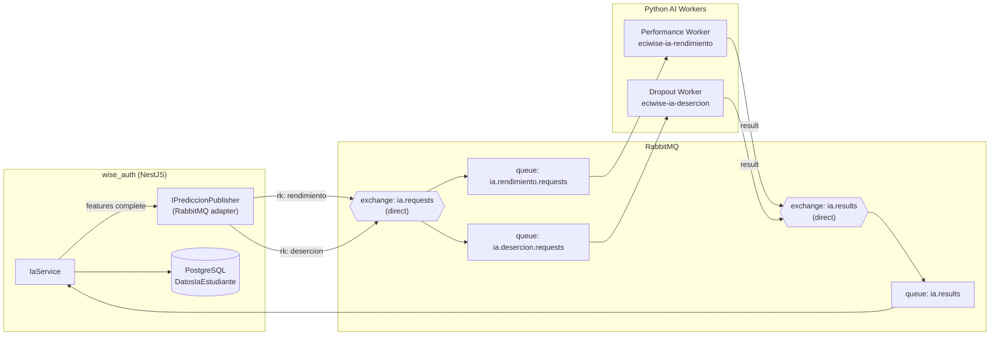
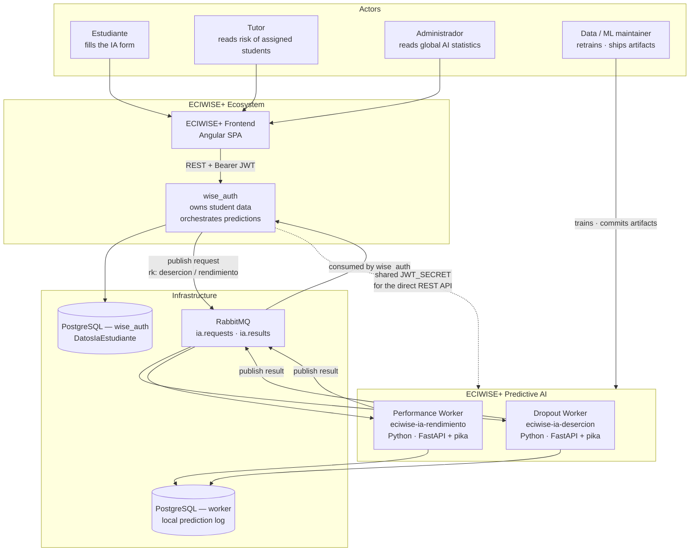
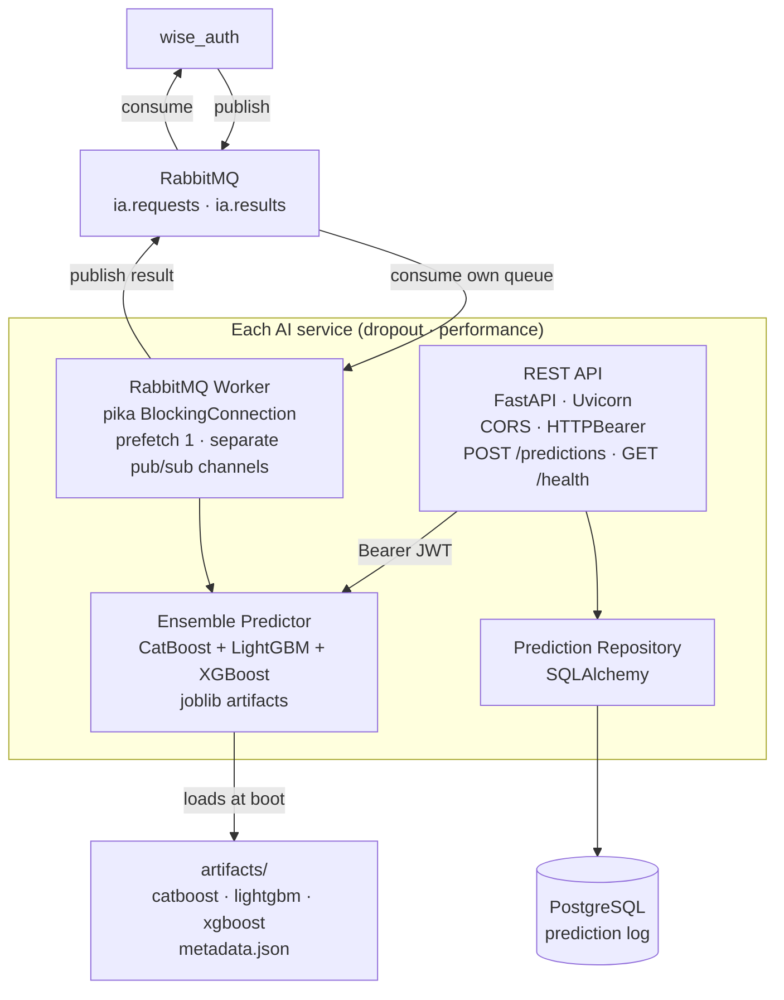
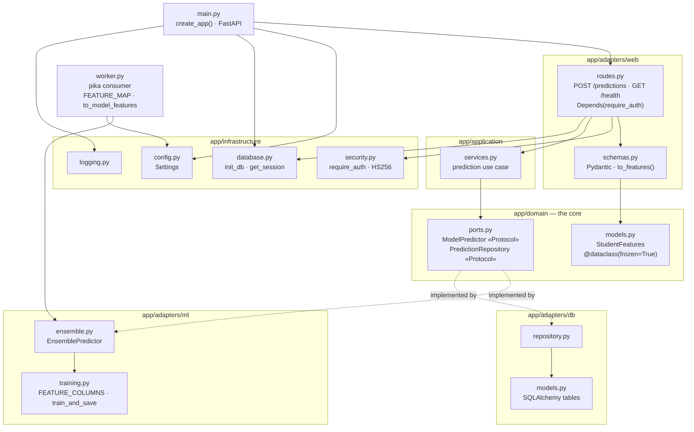
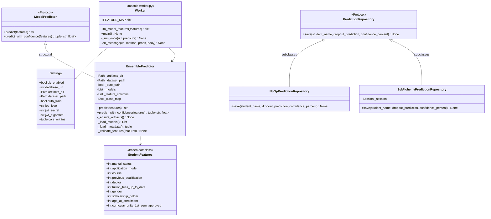
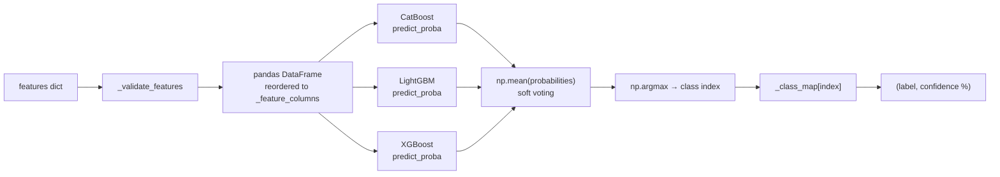
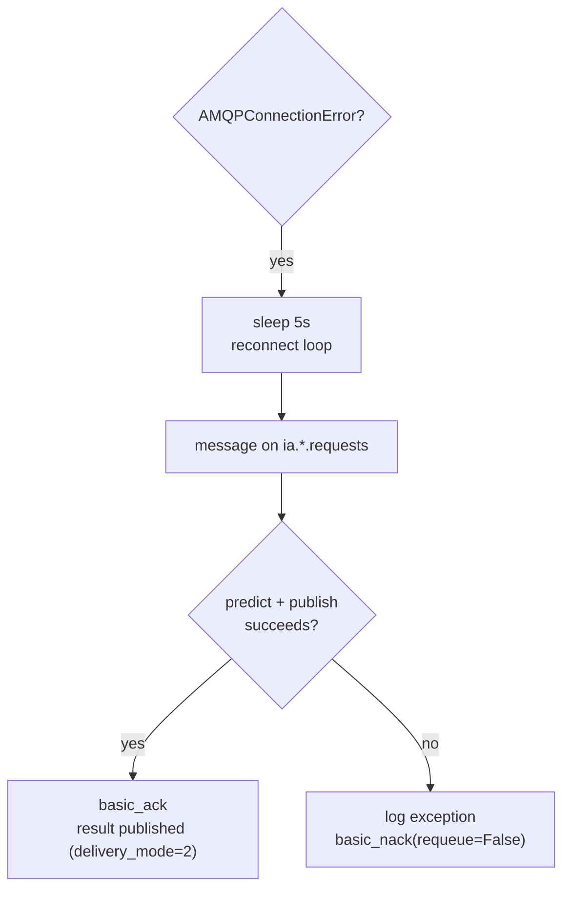
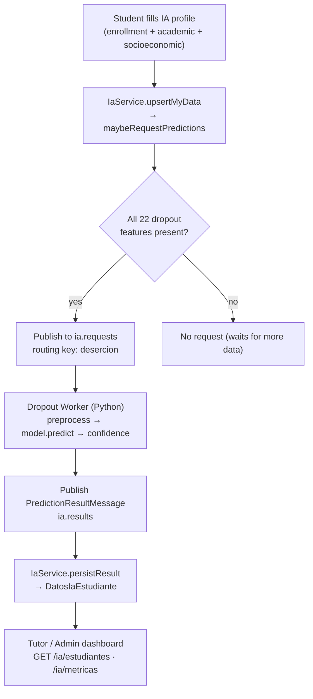
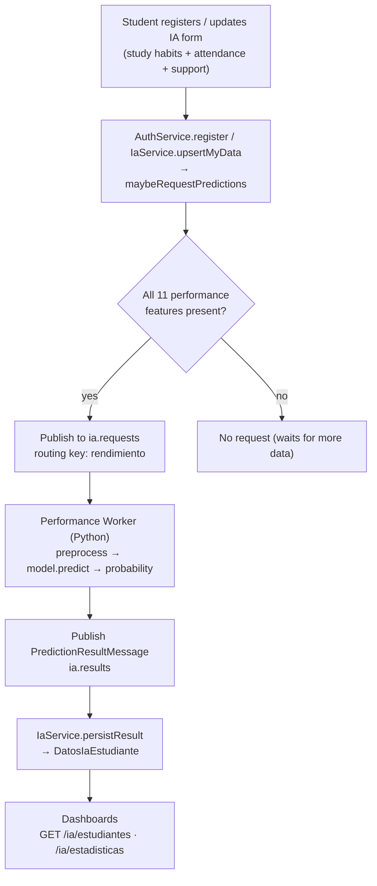
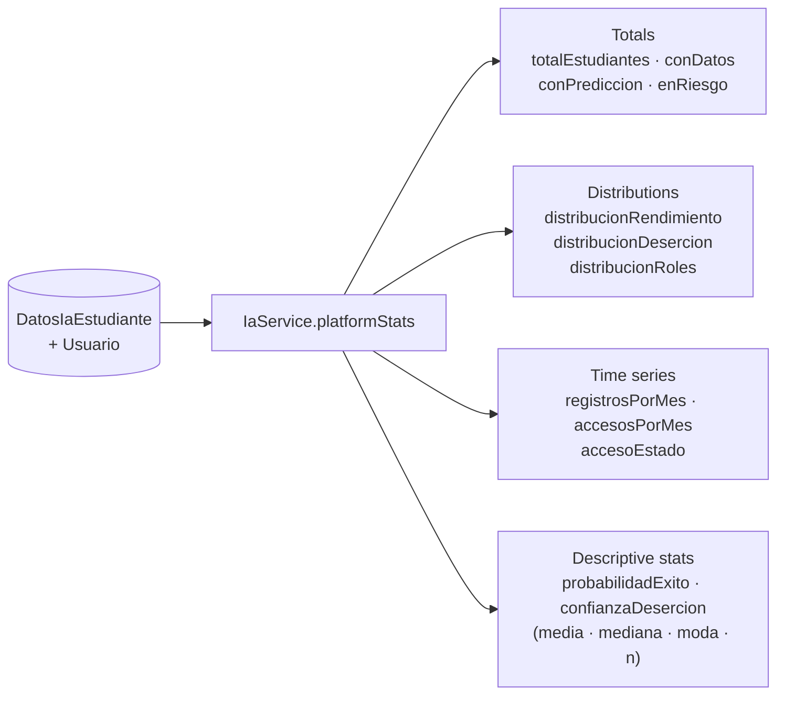

# AI Prediction Models — Dropout & Performance

## Overview

Beyond the RAG assistant, ECIWise runs **two independent predictive AI services**, each a dedicated Python worker:

- **Dropout Prediction** (`desercion`) — estimates a student's risk of dropping out from enrollment, academic, and socioeconomic factors.
- **Performance Prediction** (`rendimiento`) — estimates a student's likely academic performance from study habits, attendance, tutoring usage, and extracurricular factors.

They are **separate services** with separate feature sets, models, and retraining cycles. `wise_auth` owns the student data and orchestrates the prediction lifecycle: it collects the features, publishes a request, and stores the result — it is a thin orchestrator, never an ML runtime. All communication is **asynchronous over RabbitMQ**, so a slow or unavailable worker never blocks the API.

> The high-level decision behind splitting these into two models is recorded in [ADR-007 — Two AI Models](/docs/architecture-decisions/#adr-007--two-ai-models-dropout-prediction-and-performance-prediction).

---

## Shared Architecture

Both models share the same messaging topology. `wise_auth` publishes a `PredictionRequestMessage` to the `ia.requests` exchange with a routing key that selects the model; each worker consumes its own queue and publishes a `PredictionResultMessage` back through the `ia.results` exchange. The request and result channels are never mixed.



**Message contracts**

Request published by `wise_auth`:

```json
{
  "usuarioId": "uuid",
  "studentName": "Ana Díaz",
  "features": { "studyTimeWeekly": 10, "absences": 3, "...": 0 }
}
```

Result published by a worker:

```json
{
  "usuarioId": "uuid",
  "model": "rendimiento | desercion",
  "prediccionRendimiento": "…",
  "prediccionDesercion": "…",
  "confianzaDesercion": 0.87
}
```

**When is a prediction requested?** Feature capture is progressive: a subset is collected at registration and the rest in the dedicated IA form. `IaService` only publishes a request for a model **once every feature that model needs is present** (`maybeRequestPredictions`). A partially filled profile produces no request, so workers never receive incomplete inputs.

---

## C4 — Level 1: System Context

Both workers share one context: they are **downstream of `wise_auth`** and talk to nobody else.



### Actors and systems

| Party | Relationship |
|---|---|
| `wise_auth` | The **only** producer of requests and consumer of results. Owns the features and the canonical prediction |
| Frontend | Never talks to a worker; it reads predictions from `wise_auth` |
| RabbitMQ | The sole integration channel — no worker exposes a synchronous dependency to the platform |
| Worker PostgreSQL | Each worker also logs its own predictions locally, independent of `wise_auth`'s copy |

Each worker additionally exposes a small **FastAPI** surface (`POST /predictions`, `GET /health`) protected by the same HS256 JWT. That path is for direct/manual use and diagnostics; the platform flow is the async one.

---

## C4 — Level 2: Containers

The two services are **structurally identical twins** — same layout, same libraries, different queue, feature set and artifacts.



| Container | Technology | Responsibility |
|---|---|---|
| REST API | FastAPI + Uvicorn | Synchronous prediction and health, JWT-protected |
| Worker | `pika` | Consumes the model's request queue, publishes to `ia.results` |
| Ensemble predictor | CatBoost, LightGBM, XGBoost, joblib | Loads the three models and averages their probabilities |
| Repository | SQLAlchemy | Local prediction log |
| Artifacts | joblib + `metadata.json` | Trained models, feature column order, class map |

| | Dropout | Performance |
|---|---|---|
| Service | `eciwise-ia-desercion` | `eciwise-ia-rendimiento` |
| Request queue | `ia.desercion.requests` | `ia.rendimiento.requests` |
| Routing key | `desercion` | `rendimiento` |
| Output | Class **+ confidence %** | Grade class |
| Features | 22 enrollment / socioeconomic / 1st-sem columns | Study habits, attendance, tutoring, extracurricular |

The worker and the API are separate **processes** from the same image — the worker is not served by Uvicorn.

---

## C4 — Level 3: Components

Both services use the same hexagonal package layout: `domain` (ports + models) at the centre, `application` orchestrating, `adapters` on the edge, `infrastructure` for cross-cutting concerns.



| Component | Role |
|---|---|
| `domain/ports.py` | `ModelPredictor` and `PredictionRepository` as `typing.Protocol` — structural, no inheritance |
| `domain/models.py` | `StudentFeatures`, a frozen dataclass — the immutable input contract |
| `adapters/ml/ensemble.py` | Loads the three models, validates features, averages probabilities |
| `adapters/ml/training.py` | `FEATURE_COLUMNS` and `train_and_save` — the retraining path |
| `adapters/web/routes.py` | The REST surface; `require_auth` is a FastAPI dependency, so auth is declarative |
| `infrastructure/security.py` | HS256 validation that **fails closed** |
| `worker.py` | The async entry point; owns the RabbitMQ contract and the feature-name mapping |

> `ports.py` declares both ports as `typing.Protocol`, not ABCs. The two adapters then conform in **different ways**: `EnsemblePredictor` is a plain class that never imports the port at all (structural conformance), while the repositories explicitly subclass `PredictionRepository` (nominal conformance — legal for a `Protocol`, and it makes the intent obvious at the class declaration). Both satisfy the same contract.

---

## C4 — Level 4: Code



### How a prediction is actually computed

`EnsemblePredictor` is not one model — it is a **soft-voting ensemble of three gradient-boosting libraries**:



Points that matter for correctness:

| Detail | Why |
|---|---|
| `frame[self._feature_columns]` | Column **order** is restored from `metadata.json`; a dict has no order guarantee and the boosters are position-sensitive |
| `avg_proba = np.mean(probabilities)` | Soft voting on probabilities, not majority voting on labels — keeps the confidence meaningful |
| `confidence = avg_proba[0][class_index] * 100` | Confidence is the winning class's averaged probability, as a percentage |
| `_class_map` from artifacts | The index→label mapping ships **with** the models, so a retrain cannot silently permute labels |
| `_ensure_artifacts` + `auto_train` | On a missing artifact the service can retrain from the dataset at boot instead of crashing |

### The worker's translation layer

`wise_auth` speaks camelCase; the models were trained on the dataset's original column names. `worker.py` owns that mapping explicitly in `FEATURE_MAP`:

| Model column (training) | Message key (`wise_auth`) |
|---|---|
| `Marital status` | `maritalStatus` |
| `Tuition fees up to date` | `tuitionFeesUpToDate` |
| `Curricular units 1st sem (approved)` | `curricularUnits1stSemApproved` |
| `Age at enrollment` | `ageAtEnrollment` |

`to_model_features` raises a `KeyError` on any missing key, so an incomplete message fails loudly rather than predicting from defaults.

The worker also opens **two channels on one connection** — one to consume, one to publish — so the request and result paths never share a channel, and uses `prefetch_count=1` so a worker takes one prediction at a time.

### Failure handling



| Behaviour | Rationale |
|---|---|
| `basic_nack(requeue=False)` on any exception | A message that cannot be predicted is **poison** — requeuing it would spin forever. It is dropped rather than blocking the queue |
| Broad `except Exception` around `on_message` | One bad message must never kill the worker process |
| `delivery_mode=2` on results | Results are persistent — a broker restart does not lose a completed prediction |
| Reconnect loop on `AMQPConnectionError` (5 s) | The worker outlives a broker outage instead of crash-looping |

Note the asymmetry with the ack: the result is published **before** `basic_ack`, but they are not atomic. A crash in between redelivers the request and produces a duplicate result. That is harmless here because `wise_auth` *upserts* the prediction by `usuarioId` — the operation is idempotent on the consumer side.

---

## Dropout Prediction (Deserción)

Predicts the likelihood that a student abandons their studies, so tutors and administrators can intervene early.

### Architecture



### Procedure

1. **Feature capture** — the student completes the dropout feature set through `PUT /ia/me`. Data is stored in `DatosIaEstudiante`.
2. **Completeness check** — `IaService.maybeRequestPredictions` verifies all 22 dropout features are non-null. If any is missing, no request is sent.
3. **Request** — a `PredictionRequestMessage` is published to `ia.requests` with routing key `desercion`; RabbitMQ routes it to `ia.desercion.requests`.
4. **Inference** — the dropout worker consumes the message, preprocesses the features, runs the trained classifier, and derives a risk label plus a confidence score.
5. **Result** — the worker publishes a `PredictionResultMessage` (`model: "desercion"`) to `ia.results`.
6. **Persistence** — `IaService.persistResult` stores `prediccionDesercion` and `confianzaDesercion` on the student's `DatosIaEstudiante` row, stamped with `fechaPrediccion`.
7. **Consumption** — tutors and admins read the result through the dashboards; students flagged as at risk (`prediccionDesercion = "Dropout"`) are surfaced in the risk metrics.

### Feature set (22)

| Group | Features |
|---|---|
| Demographic | `gender`, `maritalStatus`, `nacionality`, `international`, `ageAtEnrollment`, `displaced` |
| Enrollment | `applicationMode`, `applicationOrder`, `course`, `previousQualification` |
| Family | `motherQualification`, `fatherQualification`, `motherOccupation`, `fatherOccupation` |
| Financial | `debtor`, `tuitionFeesUpToDate`, `scholarshipHolder` |
| Support | `educationalSpecialNeeds` |
| 1st-semester academics | `curricularUnits1stSemCredited`, `curricularUnits1stSemEnrolled`, `curricularUnits1stSemEvaluations`, `curricularUnits1stSemApproved` |

### Output

| Field | Description |
|---|---|
| `prediccionDesercion` | Risk label (e.g., `Dropout`, `Enrolled`, `Graduate`) |
| `confianzaDesercion` | Model confidence for the predicted class (0–1) |

---

## Performance Prediction (Rendimiento)

Predicts a student's expected academic performance so support (tutoring, reinforcement) can be targeted where it helps most.

### Architecture



### Procedure

1. **Feature capture** — the performance feature subset is captured at **registration** (`POST /auth/register` carries `datosIa`) and can be updated later via `PUT /ia/me`.
2. **Completeness check** — a request is only published when all 11 performance features are present.
3. **Request** — published to `ia.requests` with routing key `rendimiento`, routed to `ia.rendimiento.requests`.
4. **Inference** — the performance worker preprocesses the features, runs the trained model, and produces a performance class and a success probability.
5. **Result** — a `PredictionResultMessage` (`model: "rendimiento"`) is published to `ia.results`.
6. **Persistence** — `IaService.persistResult` stores `prediccionRendimiento` (and `probabilidadExito`) on the student's row with `fechaPrediccion`.
7. **Consumption** — the grade distribution feeds the platform statistics and the tutor/admin dashboards.

### Feature set (11)

| Group | Features |
|---|---|
| Demographic | `gender`, `ethnicity`, `parentalEducation` |
| Study habits | `studyTimeWeekly`, `absences`, `tutoring` |
| Support | `parentalSupport` |
| Extracurricular | `extracurricular`, `sports`, `music`, `volunteering` |

### Output

| Field | Description |
|---|---|
| `prediccionRendimiento` | Predicted performance class / grade band |
| `probabilidadExito` | Estimated probability of academic success (0–1) |

---

## AI Statistics

`wise_auth` aggregates the stored predictions into dashboards. Two endpoints expose them, gated by role.

| Endpoint | Role | Scope |
|---|---|---|
| `GET /ia/metricas` | Tutor, Admin | Counts for a tutor's assigned students, or platform-wide for admins |
| `GET /ia/estadisticas` | Admin | Full platform-wide statistics |

### Tutor / Admin metrics — `GET /ia/metricas`

| Metric | Meaning |
|---|---|
| `conDatos` | Students who have filled in IA feature data |
| `enRiesgo` | Students whose dropout prediction is `Dropout` |
| `conPrediccion` | Students that already have a stored prediction (`fechaPrediccion` set) |

A tutor sees these counts restricted to students assigned to them; an admin sees them across the whole platform.

### Platform statistics — `GET /ia/estadisticas`



| Group | Fields | Description |
|---|---|---|
| Totals | `totalEstudiantes`, `conDatos`, `conPrediccion`, `enRiesgo` | Headline counts |
| Performance distribution | `distribucionRendimiento` | Count of students per predicted grade band |
| Dropout distribution | `distribucionDesercion` | Count of students per dropout label |
| Roles | `distribucionRoles` | Users per role |
| Registrations | `registrosPorMes` | New students bucketed by month (last 6) |
| Access | `accesosPorMes`, `accesoEstado` | Logins by month; ever-logged-in vs. never |
| Success probability | `estadisticasProbabilidadExito` | `media`, `mediana`, `moda`, `n` over `probabilidadExito` |
| Dropout confidence | `estadisticasConfianzaDesercion` | `media`, `mediana`, `moda`, `n` over `confianzaDesercion` |

The descriptive statistics (mean, median, mode, sample size) are computed in `wise_auth` from the stored per-student probabilities — no call to the AI workers is needed to render the dashboard, since results are persisted as they arrive.

---

## Further Reading

- Orchestration source: [EciWise/wise_auth](https://github.com/EciWise/wise_auth) — `src/ia`, `src/messaging`
- Decision record: [ADR-007 — Two AI Models](/docs/architecture-decisions/#adr-007--two-ai-models-dropout-prediction-and-performance-prediction)
- RAG assistant (separate AI service): [AI Service](/how/ai-service/)
