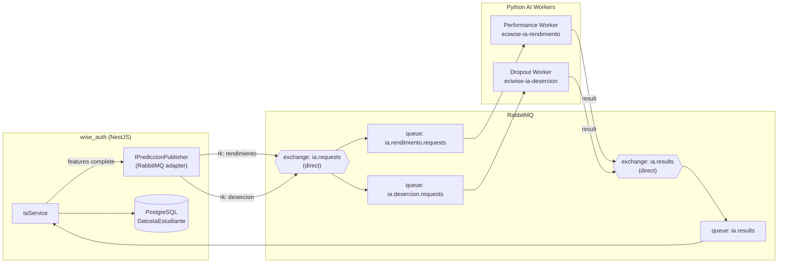
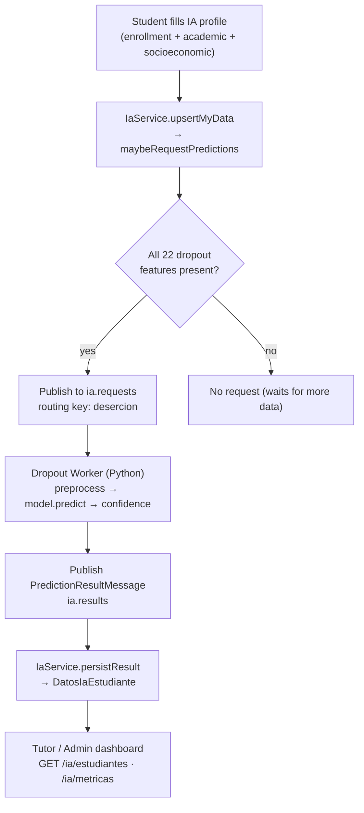
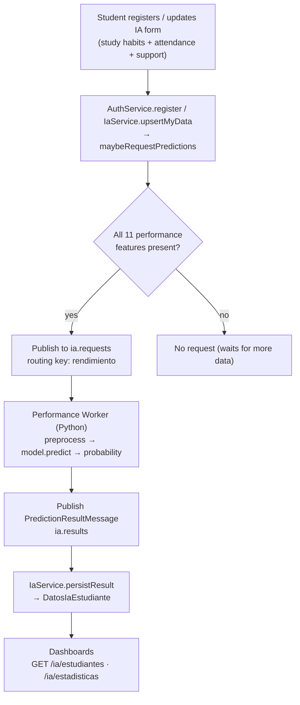
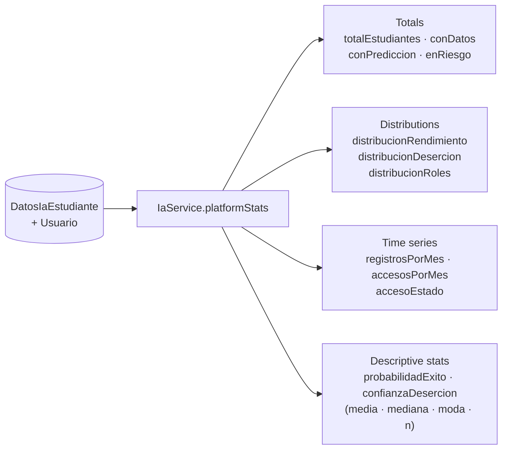

# AI Prediction Models — Dropout & Performance

## Overview

Beyond the RAG assistant, ECIWise runs **two independent predictive AI services**, each a dedicated Python worker:

- **Dropout Prediction** (`desercion`) — estimates a student's risk of dropping out from enrollment, academic, and socioeconomic factors.
- **Performance Prediction** (`rendimiento`) — estimates a student's likely academic performance from study habits, attendance, tutoring usage, and extracurricular factors.

They are **separate services** with separate feature sets, models, and retraining cycles. `wise_auth` owns the student data and orchestrates the prediction lifecycle: it collects the features, publishes a request, and stores the result — it is a thin orchestrator, never an ML runtime. All communication is **asynchronous over RabbitMQ**, so a slow or unavailable worker never blocks the API.

> The high-level decision behind splitting these into two models is recorded in [ADR-007 — Two AI Models](/docs/architecture-decisions/#adr-007--two-ai-models-dropout-prediction-and-performance-prediction).

---

## Shared Architecture

Both models share the same messaging topology. `wise_auth` publishes a `PredictionRequestMessage` to the `ia.requests` exchange with a routing key that selects the model; each worker consumes its own queue and publishes a `PredictionResultMessage` back through the `ia.results` exchange. The request and result channels are never mixed.



**Message contracts**

Request published by `wise_auth`:

```json
{
  "usuarioId": "uuid",
  "studentName": "Ana Díaz",
  "features": { "studyTimeWeekly": 10, "absences": 3, "...": 0 }
}
```

Result published by a worker:

```json
{
  "usuarioId": "uuid",
  "model": "rendimiento | desercion",
  "prediccionRendimiento": "…",
  "prediccionDesercion": "…",
  "confianzaDesercion": 0.87
}
```

**When is a prediction requested?** Feature capture is progressive: a subset is collected at registration and the rest in the dedicated IA form. `IaService` only publishes a request for a model **once every feature that model needs is present** (`maybeRequestPredictions`). A partially filled profile produces no request, so workers never receive incomplete inputs.

---

## Dropout Prediction (Deserción)

Predicts the likelihood that a student abandons their studies, so tutors and administrators can intervene early.

### Architecture



### Procedure

1. **Feature capture** — the student completes the dropout feature set through `PUT /ia/me`. Data is stored in `DatosIaEstudiante`.
2. **Completeness check** — `IaService.maybeRequestPredictions` verifies all 22 dropout features are non-null. If any is missing, no request is sent.
3. **Request** — a `PredictionRequestMessage` is published to `ia.requests` with routing key `desercion`; RabbitMQ routes it to `ia.desercion.requests`.
4. **Inference** — the dropout worker consumes the message, preprocesses the features, runs the trained classifier, and derives a risk label plus a confidence score.
5. **Result** — the worker publishes a `PredictionResultMessage` (`model: "desercion"`) to `ia.results`.
6. **Persistence** — `IaService.persistResult` stores `prediccionDesercion` and `confianzaDesercion` on the student's `DatosIaEstudiante` row, stamped with `fechaPrediccion`.
7. **Consumption** — tutors and admins read the result through the dashboards; students flagged as at risk (`prediccionDesercion = "Dropout"`) are surfaced in the risk metrics.

### Feature set (22)

| Group | Features |
|---|---|
| Demographic | `gender`, `maritalStatus`, `nacionality`, `international`, `ageAtEnrollment`, `displaced` |
| Enrollment | `applicationMode`, `applicationOrder`, `course`, `previousQualification` |
| Family | `motherQualification`, `fatherQualification`, `motherOccupation`, `fatherOccupation` |
| Financial | `debtor`, `tuitionFeesUpToDate`, `scholarshipHolder` |
| Support | `educationalSpecialNeeds` |
| 1st-semester academics | `curricularUnits1stSemCredited`, `curricularUnits1stSemEnrolled`, `curricularUnits1stSemEvaluations`, `curricularUnits1stSemApproved` |

### Output

| Field | Description |
|---|---|
| `prediccionDesercion` | Risk label (e.g., `Dropout`, `Enrolled`, `Graduate`) |
| `confianzaDesercion` | Model confidence for the predicted class (0–1) |

---

## Performance Prediction (Rendimiento)

Predicts a student's expected academic performance so support (tutoring, reinforcement) can be targeted where it helps most.

### Architecture



### Procedure

1. **Feature capture** — the performance feature subset is captured at **registration** (`POST /auth/register` carries `datosIa`) and can be updated later via `PUT /ia/me`.
2. **Completeness check** — a request is only published when all 11 performance features are present.
3. **Request** — published to `ia.requests` with routing key `rendimiento`, routed to `ia.rendimiento.requests`.
4. **Inference** — the performance worker preprocesses the features, runs the trained model, and produces a performance class and a success probability.
5. **Result** — a `PredictionResultMessage` (`model: "rendimiento"`) is published to `ia.results`.
6. **Persistence** — `IaService.persistResult` stores `prediccionRendimiento` (and `probabilidadExito`) on the student's row with `fechaPrediccion`.
7. **Consumption** — the grade distribution feeds the platform statistics and the tutor/admin dashboards.

### Feature set (11)

| Group | Features |
|---|---|
| Demographic | `gender`, `ethnicity`, `parentalEducation` |
| Study habits | `studyTimeWeekly`, `absences`, `tutoring` |
| Support | `parentalSupport` |
| Extracurricular | `extracurricular`, `sports`, `music`, `volunteering` |

### Output

| Field | Description |
|---|---|
| `prediccionRendimiento` | Predicted performance class / grade band |
| `probabilidadExito` | Estimated probability of academic success (0–1) |

---

## AI Statistics

`wise_auth` aggregates the stored predictions into dashboards. Two endpoints expose them, gated by role.

| Endpoint | Role | Scope |
|---|---|---|
| `GET /ia/metricas` | Tutor, Admin | Counts for a tutor's assigned students, or platform-wide for admins |
| `GET /ia/estadisticas` | Admin | Full platform-wide statistics |

### Tutor / Admin metrics — `GET /ia/metricas`

| Metric | Meaning |
|---|---|
| `conDatos` | Students who have filled in IA feature data |
| `enRiesgo` | Students whose dropout prediction is `Dropout` |
| `conPrediccion` | Students that already have a stored prediction (`fechaPrediccion` set) |

A tutor sees these counts restricted to students assigned to them; an admin sees them across the whole platform.

### Platform statistics — `GET /ia/estadisticas`



| Group | Fields | Description |
|---|---|---|
| Totals | `totalEstudiantes`, `conDatos`, `conPrediccion`, `enRiesgo` | Headline counts |
| Performance distribution | `distribucionRendimiento` | Count of students per predicted grade band |
| Dropout distribution | `distribucionDesercion` | Count of students per dropout label |
| Roles | `distribucionRoles` | Users per role |
| Registrations | `registrosPorMes` | New students bucketed by month (last 6) |
| Access | `accesosPorMes`, `accesoEstado` | Logins by month; ever-logged-in vs. never |
| Success probability | `estadisticasProbabilidadExito` | `media`, `mediana`, `moda`, `n` over `probabilidadExito` |
| Dropout confidence | `estadisticasConfianzaDesercion` | `media`, `mediana`, `moda`, `n` over `confianzaDesercion` |

The descriptive statistics (mean, median, mode, sample size) are computed in `wise_auth` from the stored per-student probabilities — no call to the AI workers is needed to render the dashboard, since results are persisted as they arrive.

---

## Further Reading

- Orchestration source: [EciWise/wise_auth](https://github.com/EciWise/wise_auth) — `src/ia`, `src/messaging`
- Decision record: [ADR-007 — Two AI Models](/docs/architecture-decisions/#adr-007--two-ai-models-dropout-prediction-and-performance-prediction)
- RAG assistant (separate AI service): [AI Service](/how/ai-service/)
