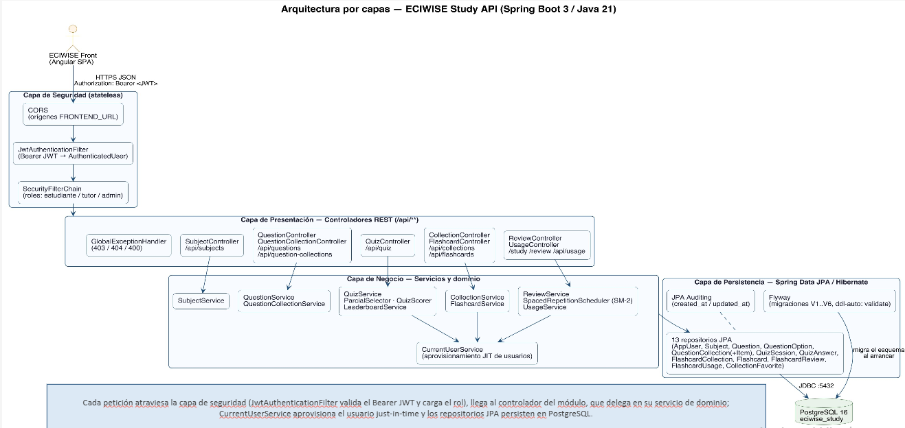
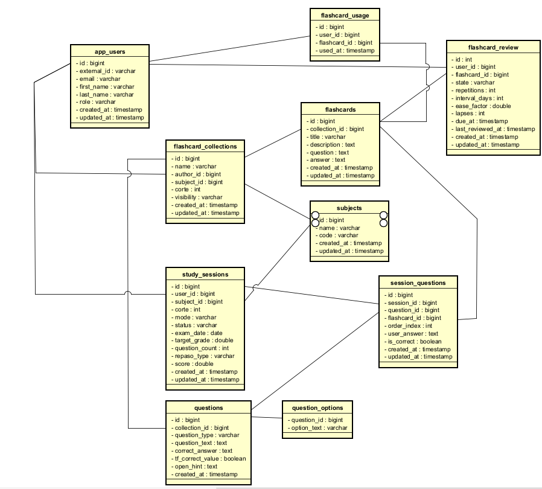
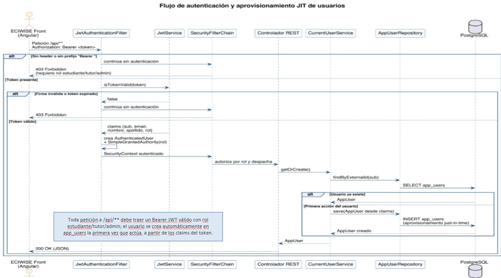
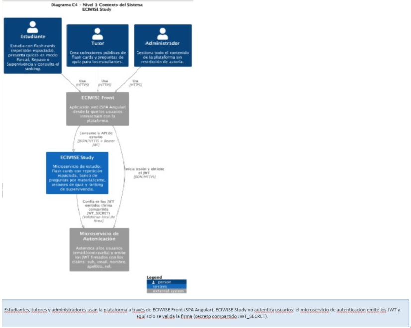
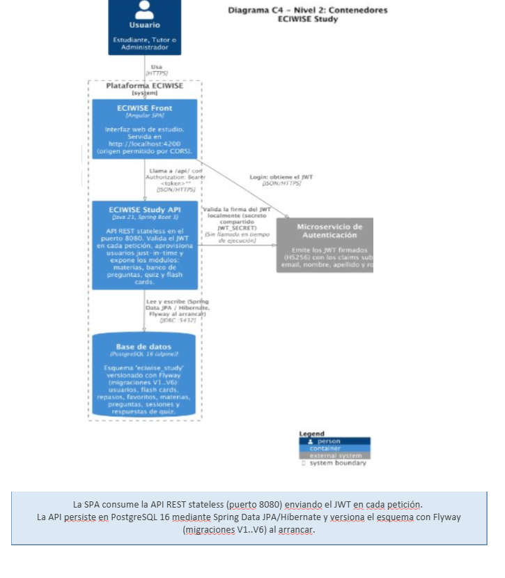
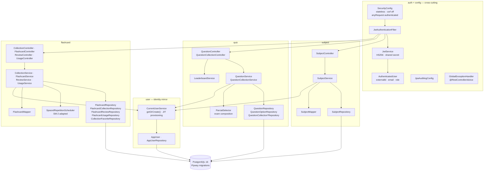
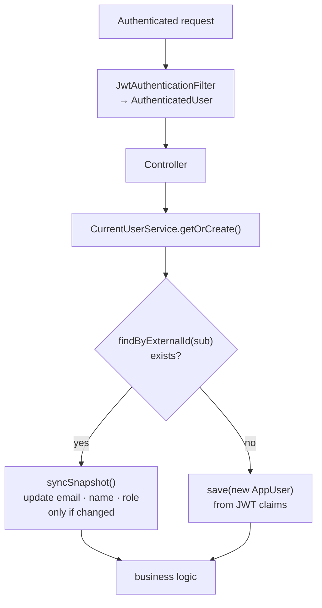
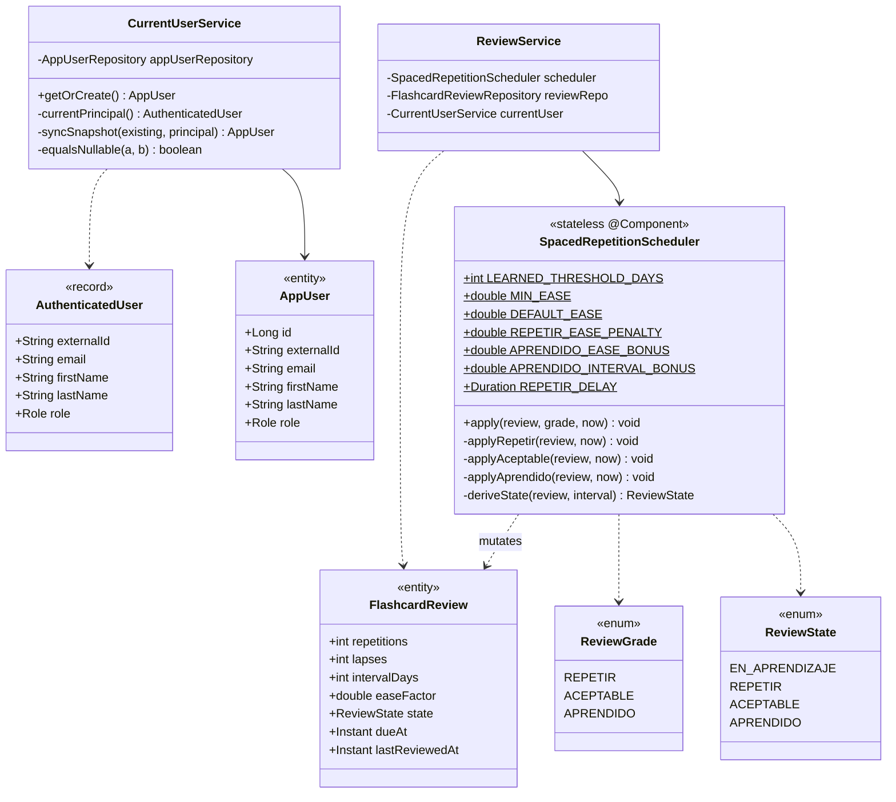
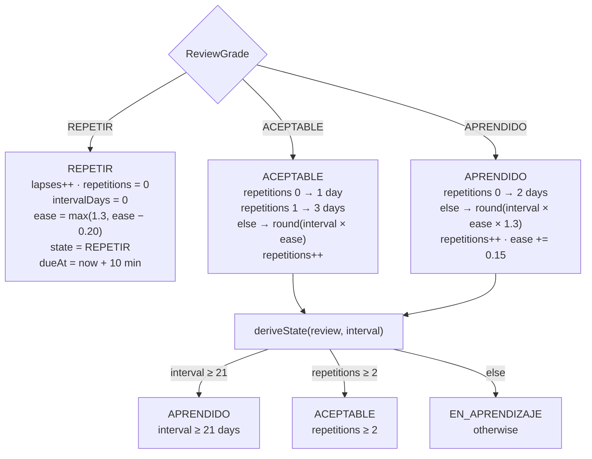

# Study Service

## Overview

`eciwise-study` is the microservice responsible for managing the academic study experience within the ECIWise platform. It provides students with structured tools to prepare for exams and practice course content, while giving monitors and admins the ability to create and organize study material.

The service handles two core domains:

- **Content management**: monitors and admins can create subjects, flashcard collections, and formal questions (True/False, Open, and Closed). Students can create their own private flashcard collections for personal study.
- **Study sessions**: students can start a study session for a specific subject and semester period (corte) in one of two modes: **Parcial**, which simulates an exam with a dynamically calculated question set based on days remaining and target grade; and **Repaso**, which allows free practice by choosing a specific question type.

---

## Study Module Flow
Click on the image to zoom in

[](study/img_7.png)
[](study/img_8.png)
The study module supports two distinct user roles with different capabilities.

**Students** can start study sessions by selecting a subject and a semester period (corte), then choosing between two modes:

- **Parcial** — simulates an exam by calculating the number of questions based on days remaining and target grade (minimum 20, maximum 35), presenting True/False, Open, and Closed questions.
- **Repaso** — allows free practice by selecting a specific question type (True/False, Flashcard, Open, or Closed).

Both modes produce a score out of 5.0 at the end of the session, which is registered in the student's history.

Students can also create flashcard collections by grouping flashcards with a question/description and an answer, associated to a subject and corte.

**Monitors and admins** have full CRUD access to collections and can create and edit formal questions (True/False, Closed, Open) within collections, specifying the subject, corte, visibility (public or private), and other metadata.

---

## Architecture
[](study/img_14.png)
The service follows a layered architecture. Every request passes through the Security Layer, where JwtAuthenticationFilter validates the Bearer JWT and loads the authenticated user before reaching any controller. The Presentation Layer contains the REST controllers grouped by domain. The Business Layer holds the services and domain logic, with CurrentUserService handling just-in-time user provisioning shared across all services. The Persistence Layer uses Spring Data JPA with Hibernate, Flyway for schema migrations, and connects to a PostgreSQL 16 database via JDBC on port 5432
### **Runtime Environment**
The service is built with **Spring Boot 3.3.13** and **Java 21**, backed by a **PostgreSQL 16** database running in Docker. Database schema changes are managed exclusively through Flyway migrations.

### Package Structure

```
com.eciwise.study
├── auth/          JWT filter and security configuration
├── config/        CORS and Spring Security setup
├── exception/     Global exception handler and custom exceptions
├── flashcard/     Flashcard collections, flashcards, usage and review
├── user/          AppUser entity and CurrentUserService
└── study/
    ├── subject/   Subject entity, CRUD
    └── (root)     Questions, study sessions, session questions
```

### Runtime Dependencies

| Dependency | Version |
|---|---|
| spring-boot-starter-parent | 3.3.13 |
| spring-boot-starter-web | — |
| spring-boot-starter-security | — |
| spring-boot-starter-data-jpa | — |
| spring-boot-starter-validation | — |
| flyway-core | — |
| flyway-database-postgresql | — |
| jjwt-api | 0.12.6 |
| postgresql | runtime |
| lombok | optional |

### Database Migrations

| Version | Description |
|---|---|
| V1 | Create core tables |
| V2 | Create flashcards and users |
| V3 | Create flashcard reviews |
| V4 | Study module — subjects, questions, study sessions, session questions |

---

## JWT-based Identity

On every request, the service reads the JWT token and extracts the following claims:

| Claim | Purpose |
|---|---|
| sub | Identifies the user (stored as external_id in app_users) |
| email | User email |
| nombre | User first name |
| apellido | User last name |
| rol | User role: estudiante, monitor, admin |

---
## Data Model

### AppUser

| Column | Type | Notes |
|---|---|---|
| `id` | `BIGINT PK` | Auto-generated |
| `external_id` | `VARCHAR` | User ID from eciwise-auth (from JWT `sub` claim) |
| `email` | `VARCHAR` | From JWT `email` claim |
| `first_name` | `VARCHAR` | From JWT `nombre` claim |
| `last_name` | `VARCHAR` | From JWT `apellido` claim |
| `role` | `VARCHAR` | From JWT `rol` claim: `estudiante`, `monitor`, `admin` |
| `created_at` | `TIMESTAMP` | Defaults to `NOW()` |
| `updated_at` | `TIMESTAMP` | Defaults to `NOW()` |

### Subject

| Column | Type | Notes |
|---|---|---|
| `id` | `BIGINT PK` | Auto-generated |
| `name` | `VARCHAR` | Unique subject name |
| `code` | `VARCHAR` | Subject code (optional) |
| `created_at` | `TIMESTAMP` | Defaults to `NOW()` |
| `updated_at` | `TIMESTAMP` | Defaults to `NOW()` |

### FlashcardCollection

| Column | Type | Notes |
|---|---|---|
| `id` | `BIGINT PK` | Auto-generated |
| `name` | `VARCHAR` | Collection name |
| `author_id` | `BIGINT FK` | References `app_users.id` |
| `subject_id` | `BIGINT FK` | References `subjects.id` |
| `corte` | `INT` | Semester period (`1`, `2` or `3`) |
| `visibility` | `VARCHAR` | `PUBLIC` or `PRIVATE` |
| `created_at` | `TIMESTAMP` | Defaults to `NOW()` |
| `updated_at` | `TIMESTAMP` | Defaults to `NOW()` |

### Flashcard

| Column | Type | Notes |
|---|---|---|
| `id` | `BIGINT PK` | Auto-generated |
| `collection_id` | `BIGINT FK` | References `flashcard_collections.id`, `ON DELETE CASCADE` |
| `title` | `VARCHAR` | Flashcard title |
| `description` | `TEXT` | Optional description |
| `question` | `TEXT` | Flashcard question |
| `answer` | `TEXT` | Flashcard answer |
| `created_at` | `TIMESTAMP` | Defaults to `NOW()` |
| `updated_at` | `TIMESTAMP` | Defaults to `NOW()` |

### Question

| Column | Type | Notes |
|---|---|---|
| `id` | `BIGINT PK` | Auto-generated |
| `collection_id` | `BIGINT FK` | References `flashcard_collections.id`, `ON DELETE CASCADE` |
| `question_type` | `VARCHAR` | `TRUE_FALSE`, `OPEN` or `CLOSED` — SINGLE_TABLE inheritance discriminator |
| `question_text` | `TEXT` | Question statement |
| `correct_answer` | `TEXT` | Correct answer |
| `tf_correct_value` | `BOOLEAN` | `TRUE_FALSE` only: correct boolean value |
| `open_hint` | `TEXT` | `OPEN` only: optional hint |
| `created_at` | `TIMESTAMP` | Defaults to `NOW()` |

### QuestionOptions

| Column | Type | Notes |
|---|---|---|
| `question_id` | `BIGINT FK` | References `questions.id`, `ON DELETE CASCADE` |
| `option_text` | `VARCHAR` | `CLOSED` only: text for each answer option |

### FlashcardReview

| Column | Type | Notes |
|---|---|---|
| `id` | `BIGINT PK` | Auto-generated |
| `user_id` | `BIGINT FK` | References `app_users.id` |
| `flashcard_id` | `BIGINT FK` | References `flashcards.id`, `ON DELETE CASCADE` |
| `state` | `VARCHAR` | Spaced repetition state |
| `repetitions` | `INT` | Number of repetitions completed |
| `interval_days` | `INT` | Days until next review |
| `ease_factor` | `DOUBLE` | SM-2 algorithm ease factor |
| `lapses` | `INT` | Number of times forgotten |
| `due_at` | `TIMESTAMP` | Scheduled date for next review |
| `last_reviewed_at` | `TIMESTAMP` | Last time the card was reviewed |
| `created_at` | `TIMESTAMP` | Defaults to `NOW()` |
| `updated_at` | `TIMESTAMP` | Defaults to `NOW()` |

### StudySession

| Column | Type | Notes |
|---|---|---|
| `id` | `BIGINT PK` | Auto-generated |
| `user_id` | `BIGINT FK` | References `app_users.id` |
| `subject_id` | `BIGINT FK` | References `subjects.id` |
| `corte` | `INT` | Semester period being studied |
| `mode` | `VARCHAR` | `PARCIAL` or `REPASO` |
| `status` | `VARCHAR` | `IN_PROGRESS` or `COMPLETED` |
| `exam_date` | `DATE` | `PARCIAL` only: exam date |
| `target_grade` | `DOUBLE` | `PARCIAL` only: target grade (`0.0`–`5.0`) |
| `question_count` | `INT` | `PARCIAL` only: question count calculated by algorithm |
| `repaso_type` | `VARCHAR` | `REPASO` only: question type (`TRUE_FALSE`, `OPEN`, `CLOSED`, `FLASHCARD`, `null` = ALL) |
| `score` | `DOUBLE` | Final score out of `5.0`, `null` while `IN_PROGRESS` |
| `created_at` | `TIMESTAMP` | Defaults to `NOW()` |
| `updated_at` | `TIMESTAMP` | Defaults to `NOW()` |

### SessionQuestion

| Column | Type | Notes |
|---|---|---|
| `id` | `BIGINT PK` | Auto-generated |
| `session_id` | `BIGINT FK` | References `study_sessions.id`, `ON DELETE CASCADE` |
| `question_id` | `BIGINT FK` | References `questions.id` — nullable, exclusive with `flashcard_id` |
| `flashcard_id` | `BIGINT FK` | References `flashcards.id` — nullable, exclusive with `question_id` |
| `order_index` | `INT` | Question order within the session |
| `user_answer` | `TEXT` | Student's answer |
| `is_correct` | `BOOLEAN` | Whether the answer was correct |
| `created_at` | `TIMESTAMP` | Defaults to `NOW()` |
| `updated_at` | `TIMESTAMP` | Defaults to `NOW()` |


---

## Entity Relationship Diagram

[](study/img_12.png)
The diagram reflects the full database schema of the eciwise-study microservice, composed of 10 tables. `app_users` is the central table, connecting to collections, reviews, usage and sessions. `subjects` connects to collections and sessions. `flashcard_collections` groups content under a subject and corte, containing both flashcards and questions. `study_sessions` records each session started by a student, containing multiple `session_questions` which reference either a formal question or a flashcard — never both at the same time.

## JPA Class Diagram

[](study/img_11.png)
The diagram reflects the Java entity model of the eciwise-study microservice, composed of 11 classes and 4 enums.
AppUser is the central entity, referenced by FlashcardCollection, FlashcardReview, FlashcardUsage and StudySession. Subject connects to FlashcardCollection and StudySession. FlashcardCollection is the main content container, owning both Flashcard and Question collections.
Question is abstract and uses @Inheritance(SINGLE_TABLE), with three subclasses: TrueFalseQuestion, OpenQuestion and ClosedQuestion. StudySession owns a collection of SessionQuestion entities, each referencing either a Question or a Flashcard  never both.
Four enums support the domain: Visibility, QuestionType, SessionMode and SessionStatus
---

## Endpoints

### Subjects

| Method | Path | Auth | Description |
|---|---|---|---|
| `GET` | `/api/subjects` | Yes | List all subjects |
| `GET` | `/api/subjects/{id}` | Yes | Get a subject by ID |
| `POST` | `/api/subjects` | `admin`, `monitor` | Create a new subject |
| `PUT` | `/api/subjects/{id}` | `admin`, `monitor` | Update a subject |
| `DELETE` | `/api/subjects/{id}` | `admin`, `monitor` | Delete a subject |

### Collections

| Method | Path | Auth | Description |
|---|---|---|---|
| `GET` | `/api/collections` | Yes | List all visible collections (public + own) |
| `GET` | `/api/collections/mine` | Yes | List current user's own collections |
| `GET` | `/api/collections/public` | Yes | List public collections from other users |
| `GET` | `/api/collections/{id}` | Yes | Get a collection by ID |
| `POST` | `/api/collections` | Yes | Create a new collection |
| `PUT` | `/api/collections/{id}` | Yes | Update a collection |
| `DELETE` | `/api/collections/{id}` | Yes | Delete a collection |

### Flashcards

| Method | Path | Auth | Description |
|---|---|---|---|
| `GET` | `/api/collections/{collectionId}/flashcards` | Yes | List flashcards in a collection |
| `POST` | `/api/collections/{collectionId}/flashcards` | Yes | Create a flashcard in a collection |
| `GET` | `/api/flashcards/{id}` | Yes | Get a flashcard by ID |
| `PUT` | `/api/flashcards/{id}` | Yes | Update a flashcard |
| `DELETE` | `/api/flashcards/{id}` | Yes | Delete a flashcard |
| `POST` | `/api/flashcards/{id}/use` | Yes | Register flashcard usage |

### Flashcard Review

| Method | Path | Auth | Description |
|---|---|---|---|
| `GET` | `/api/flashcards/{id}/review` | Yes | Get review state for a flashcard |
| `POST` | `/api/flashcards/{id}/review` | Yes | Submit a review result for a flashcard |
| `GET` | `/api/review/due` | Yes | List flashcards due for review today |

### Flashcard Usage

| Method | Path | Auth | Description |
|---|---|---|---|
| `GET` | `/api/usage/me` | Yes | Get usage history for the current user |

### Questions

| Method | Path | Auth | Description |
|---|---|---|---|
| `GET` | `/api/collections/{collectionId}/questions` | Yes | List questions in a collection |
| `POST` | `/api/collections/{collectionId}/questions` | `admin`, `monitor` | Create a question in a collection |
| `GET` | `/api/questions/{id}` | Yes | Get a question by ID |
| `PUT` | `/api/questions/{id}` | `admin`, `monitor` | Update a question |
| `DELETE` | `/api/questions/{id}` | `admin`, `monitor` | Delete a question |

### Study Sessions

| Method | Path | Auth | Description |
|---|---|---|---|
| `POST` | `/api/study/parcial` | Yes | Start a Parcial study session |
| `POST` | `/api/study/repaso` | Yes | Start a Repaso study session |
| `GET` | `/api/study/sessions/{id}` | Yes | Get a study session by ID |
| `POST` | `/api/study/sessions/{id}/answer` | Yes | Submit an answer for a session question |
| `POST` | `/api/study/sessions/{id}/complete` | Yes | Complete a study session and calculate score |
| `GET` | `/api/study/history` | Yes | Get completed session history for current user |

---

## Service Communication

This service operates as a self-contained service that relies exclusively on the JWT token for user identity and authorization.

### Just-in-time User Provisioning

The first time a user makes any request, the service automatically creates a local snapshot of their identity in the `app_users` table using the JWT claims. This snapshot is updated on subsequent requests if any claim has changed.

### Authorization

All role checks and ownership validation are performed locally using the JWT claims and the data stored in this service's own database.

## Containers Diagram
[](study/img_15.png)

The service is deployed using Docker Compose with two containers. The eciwise-study container uses a multi-stage Dockerfile: the build stage compiles the application with Maven and produces a JAR, and the runtime stage runs it on Eclipse Temurin 21 JRE exposed on port 8080. The eciwise-study-postgres container runs PostgreSQL 16 Alpine with a healthcheck that verifies the database is ready before the app starts. All configuration is injected through environment variables: SPRING_DATASOURCE_URL, SPRING_DATASOURCE_USERNAME, SPRING_DATASOURCE_PASSWORD, JWT_SECRET, FRONTEND_URL and SERVER_PORT. Database data is persisted in a Docker volume named postgres_data.

## Flow 1 — JWT Authentication and Just-in-Time User Provisioning



This diagram shows the full authentication flow for every request to `/api/**`. The `JwtAuthenticationFilter` first checks for a Bearer token in the request header; if missing or malformed, the request continues unauthenticated and the `SecurityFilterChain` returns a 403 Forbidden.

If a token is present, `JwtService` validates its signature and expiration. An invalid or expired token also results in a 403. If valid, the filter extracts the claims (`sub`, `email`, `nombre`, `apellido`, `rol`) and builds an `AuthenticatedUser` with the corresponding role as a `SimpleGrantedAuthority`, then sets the authenticated `SecurityContext`.

The request is then dispatched to the matching REST controller, which delegates to `CurrentUserService.getOrCreate()`. This service queries `AppUserRepository` by `externalId` (the JWT `sub` claim). If the user already exists in `app_users`, it is returned directly. If this is the user's first action, a new `AppUser` is created from the JWT claims and persisted — this is the **just-in-time provisioning** step. The controller then proceeds with the business logic and returns a 200 OK response.


## C4 — Level 1: System Context



The context diagram shows how Students, Monitors, and Administrators interact with the ECIWise platform, and how the `eciwise-study` microservice relates to the frontend and the authentication service.


### Actors

| Actor | Description |
|---|---|
| `Student` | Studies with flashcards (spaced repetition), takes quizzes in `Parcial`, `Repaso` or `Supervivencia` mode, and checks the ranking. |
| `Monitor` | Creates public flashcard collections and quiz questions for students. |
| `Administrator` | Manages all platform content with no authorship restrictions. |

### Systems

| System | Type | Description |
|---|---|---|
| `ECIWISE Front` | Internal | Web application (Angular SPA) through which users interact with the platform. |
| `ECIWISE Study` | Internal | Study microservice: spaced-repetition flashcards, question bank by subject/corte, quiz sessions, and survival ranking. |
| `Microservicio de Autenticación` | External | Authenticates users (email/password) and issues JWTs signed with claims: `sub`, `email`, `nombre`, `apellido`, `rol`. |

### Relationships

| From | To | Protocol | Description |
|---|---|---|---|
| `Student`, `Monitor`, `Administrator` | `ECIWISE Front` | `HTTPS` | All actors use the frontend to access the platform. |
| `ECIWISE Front` | `ECIWISE Study` | `JSON/HTTPS + Bearer JWT` | Consumes the study API. |
| `ECIWISE Front` | `Microservicio de Autenticación` | `JSON/HTTPS` | Logs in and obtains the JWT. |
| `ECIWISE Study` | `Microservicio de Autenticación` | `Local signature validation` | Trusts JWTs issued by the auth service (shared signature, `JWT_SECRET`). |
 
---

Students, monitors, and administrators use the platform through `ECIWISE Front` (Angular SPA). `ECIWISE Study` does not authenticate users — the authentication microservice issues the JWTs and `ECIWISE Study` only validates the signature (shared secret `JWT_SECRET`).

## C4 — Level 2: Containers

[](study/c4-contenedores.png)

### Actor

| Actor | Description |
|---|---|
| `Usuario` | `Student`, `Monitor`, or `Administrator`. |

### Containers

| Container | Technology | Description |
|---|---|---|
| `ECIWISE Front` | `Angular SPA` | Study web interface. Served at `http://localhost:4200` (CORS-allowed origin). |
| `ECIWISE Study API` | `Java 21, Spring Boot 3` | Stateless REST API on port `8080`. Validates the JWT on every request, provisions users just-in-time, and exposes its modules: subjects, question bank, quizzes, and flashcards. |
| `Base de datos` | `PostgreSQL 16 (alpine)` | `eciwise_study` schema, versioned with Flyway (migrations `V1`...`V6`): users, flashcards, repasos, favorites, subjects, questions, sessions, and quiz answers. |

### External System

| System | Description |
|---|---|
| `Microservicio de Autenticación` | Issues JWTs signed (`HS256`) with the claims `sub`, `email`, `nombre`, `apellido`, and `rol`. |

### Relationships

| From | To | Protocol | Description |
|---|---|---|---|
| `Usuario` | `ECIWISE Front` | `HTTPS` | Uses the platform. |
| `ECIWISE Front` | `ECIWISE Study API` | `JSON/HTTPS` | Calls `/api/*` with `Authorization: Bearer <token>`. |
| `ECIWISE Front` | `Microservicio de Autenticación` | `JSON/HTTPS` | Login — obtains the JWT. |
| `ECIWISE Study API` | `Microservicio de Autenticación` | Local signature validation | Validates the JWT signature locally with the shared secret `JWT_SECRET` (no runtime call). |
| `ECIWISE Study API` | `Base de datos` | `JDBC 5432` | Reads and writes via `Spring Data JPA / Hibernate`. Flyway runs on startup. |


---

## C4 — Level 3: Components

The service is organised **by domain package**, not by technical layer: `subject`, `quiz`, `flashcard` and `user` each hold their own controllers, services, entities and repositories. Inside a package the flow is always Controller → Service → Repository → Entity.



| Component | Role |
|---|---|
| `JwtAuthenticationFilter` / `JwtService` | Validate the HS256 token per request and build an `AuthenticatedUser` |
| `CurrentUserService` | `getOrCreate()` — resolves the JWT into a local `AppUser`, creating it on first sight |
| `SubjectService` | Subject catalog |
| `QuestionService` / `QuestionCollectionService` | Question bank and question collections |
| `ParcialSelector` | Builds an exam from the bank according to `ParcialParams` |
| `LeaderboardService` | Quiz ranking |
| `ReviewService` + `SpacedRepetitionScheduler` | Flashcard review scheduling |
| `UsageService` | Usage tracking per flashcard |

`SecurityConfig` is `STATELESS` with CSRF disabled and `anyRequest().authenticated()` — there is no anonymous surface. Study is a **pure consumer** of identity: it publishes no events and calls no other service.

### Just-in-time user provisioning

Study never receives a user-creation event. It mirrors users lazily from the token:



`app_users` is keyed by `externalId` — the JWT `sub` from `wise_auth`. The snapshot fields (email, name, role) are **refreshed on every request but written only when they actually differ**, so a role change in `wise_auth` propagates on the user's next action without a dirty write per request.

---

## C4 — Level 4: Code



### The spaced-repetition algorithm

`SpacedRepetitionScheduler` is **SM-2 adapted to three grades** instead of SM-2's six. It is a stateless `@Component`: `apply()` mutates the `FlashcardReview` it is handed with a new interval, ease factor, state and due date.



`REPETIR` does **not** go through `deriveState` — it sets `ReviewState.REPETIR` directly and resets progress (`repetitions = 0`, `intervalDays = 0`, `lapses++`), so a failed card starts its ladder over.

| Constant | Value | Meaning |
|---|---|---|
| `DEFAULT_EASE` | 2.5 | Starting ease factor (as in SM-2) |
| `MIN_EASE` | 1.3 | Floor — a card can never spiral to an unusable interval |
| `REPETIR_EASE_PENALTY` | 0.20 | Ease lost on a failed recall |
| `APRENDIDO_EASE_BONUS` | 0.15 | Ease gained on an easy recall |
| `APRENDIDO_INTERVAL_BONUS` | 1.3 | Extra interval multiplier for `APRENDIDO` |
| `REPETIR_DELAY` | 10 min | A failed card returns within the same session, not tomorrow |
| `LEARNED_THRESHOLD_DAYS` | 21 | Interval at which a card counts as learned |

Note the distinction between `ReviewGrade` (what the **user pressed**) and `ReviewState` (what the **card has become**). They share three names but are not the same axis: state is *derived* from the resulting interval, never set directly by the grade.

---

## Design Patterns & Best Practices

**Layered Architecture**
The service is organized into clearly separated layers: Controller → Service → Repository → Entity. Each layer has a single responsibility and only communicates with the layer directly below it.

**DTO Pattern**
Request and Response objects are separate from JPA entities (`SubjectRequest`/`SubjectResponse`, `QuestionRequest`/`QuestionResponse`, etc.), preventing entity internals from leaking into the API contract and avoiding circular serialization issues.

**Mapper Pattern**
Dedicated mapper classes (`SubjectMapper`, `FlashcardMapper`, `QuestionMapper`, `StudySessionMapper`) handle the conversion between entities and DTOs, keeping that logic out of services and controllers.

**Repository Pattern**
Data access is abstracted through Spring Data JPA repositories (`SubjectRepository`, `QuestionRepository`, `StudySessionRepository`, etc.), with custom JPQL queries defined declaratively where needed (e.g. `findAccessibleBySubjectAndCorte`).

**Single Table Inheritance**
`Question` is modeled as an abstract JPA entity with `@Inheritance(strategy = SINGLE_TABLE)`, allowing `TrueFalseQuestion`, `OpenQuestion`, and `ClosedQuestion` to share one database table while keeping distinct Java types.

**Just-in-Time Provisioning**
`CurrentUserService` lazily creates a local `AppUser` record on first use, derived from JWT claims, instead of requiring upfront synchronization with the identity service.

**Strategy-like Calculation**
`ParcialQuestionCalculator` and `OpenAnswerEvaluator` encapsulate isolated pieces of business logic (question count algorithm and Jaccard similarity scoring) as standalone components, keeping `StudySessionService` focused on orchestration.

**Centralized Exception Handling**
A global exception handler maps domain exceptions (`ResourceNotFoundException`, `ForbiddenOperationException`) to consistent HTTP responses (404, 403) across all controllers.

**Role-Based Authorization**
Permission checks (`isAdmin`, `isMonitor`, `ensureCanModify`, `ensureCanRead`) are centralized in service classes rather than scattered across controllers, ensuring consistent enforcement of the student/monitor/admin permission model.

**Database Migrations as Code**
Schema changes are version-controlled through Flyway migration scripts (`V1` through `V4`), making the database schema reproducible and auditable across environments.