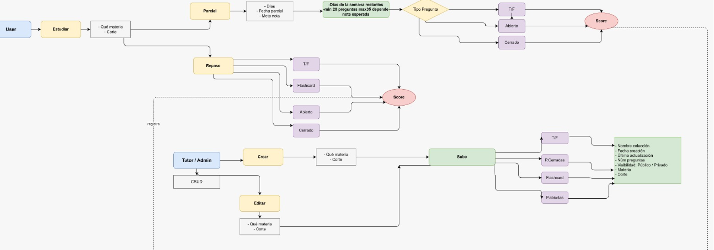
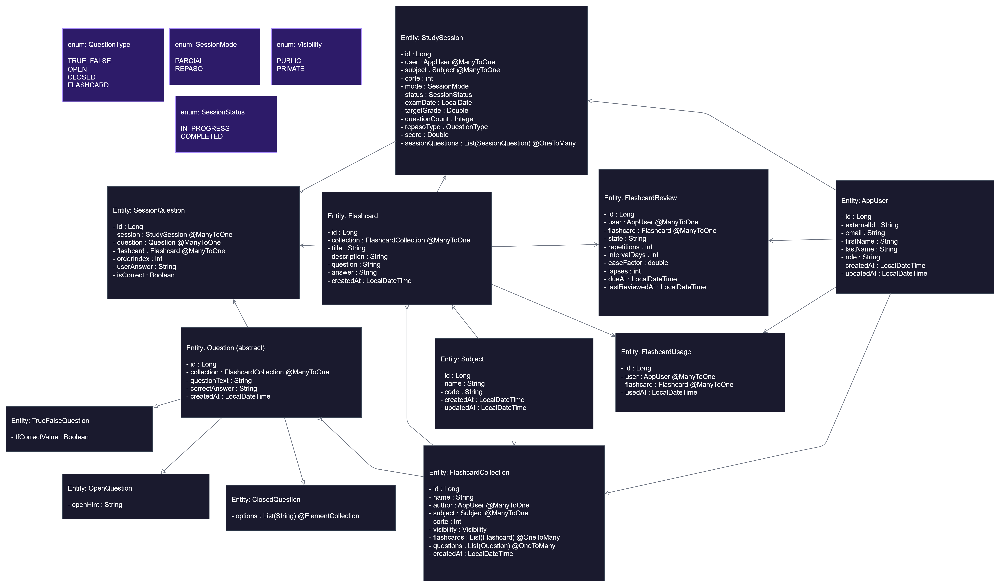
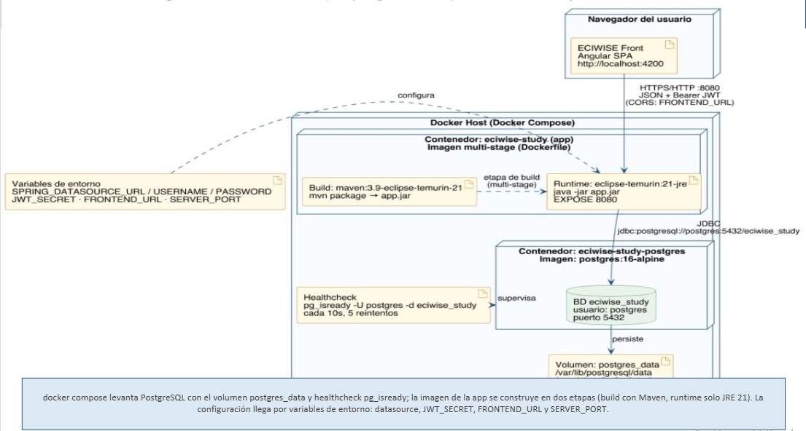

# Study Service

## Overview

`eciwise-study` is the microservice responsible for managing the academic study experience within the ECIWise platform. It provides students with structured tools to prepare for exams and practice course content, while giving monitors and admins the ability to create and organize study material.

The service handles two core domains:

- **Content management**: monitors and admins can create subjects, flashcard collections, and formal questions (True/False, Open, and Closed). Students can create their own private flashcard collections for personal study.
- **Study sessions**: students can start a study session for a specific subject and semester period (corte) in one of two modes: **Parcial**, which simulates an exam with a dynamically calculated question set based on days remaining and target grade; and **Repaso**, which allows free practice by choosing a specific question type.

---

## Study Module Flow
Click on the image to zoom in

[](img_7.png)
[](img_8.png)
The study module supports two distinct user roles with different capabilities.

**Students** can start study sessions by selecting a subject and a semester period (corte), then choosing between two modes:

- **Parcial** — simulates an exam by calculating the number of questions based on days remaining and target grade (minimum 20, maximum 35), presenting True/False, Open, and Closed questions.
- **Repaso** — allows free practice by selecting a specific question type (True/False, Flashcard, Open, or Closed).

Both modes produce a score out of 5.0 at the end of the session, which is registered in the student's history.

Students can also create flashcard collections by grouping flashcards with a question/description and an answer, associated to a subject and corte.

**Monitors and admins** have full CRUD access to collections and can create and edit formal questions (True/False, Closed, Open) within collections, specifying the subject, corte, visibility (public or private), and other metadata.

---

## Architecture
[](img_14.png)
The service follows a layered architecture. Every request passes through the Security Layer, where JwtAuthenticationFilter validates the Bearer JWT and loads the authenticated user before reaching any controller. The Presentation Layer contains the REST controllers grouped by domain. The Business Layer holds the services and domain logic, with CurrentUserService handling just-in-time user provisioning shared across all services. The Persistence Layer uses Spring Data JPA with Hibernate, Flyway for schema migrations, and connects to a PostgreSQL 16 database via JDBC on port 5432
### **Runtime Environment**
The service is built with **Spring Boot 3.3.13** and **Java 21**, backed by a **PostgreSQL 16** database running in Docker. Database schema changes are managed exclusively through Flyway migrations.

### Package Structure

```
com.eciwise.study
├── auth/          JWT filter and security configuration
├── config/        CORS and Spring Security setup
├── exception/     Global exception handler and custom exceptions
├── flashcard/     Flashcard collections, flashcards, usage and review
├── user/          AppUser entity and CurrentUserService
└── study/
    ├── subject/   Subject entity, CRUD
    └── (root)     Questions, study sessions, session questions
```

### Runtime Dependencies

| Dependency | Version |
|---|---|
| spring-boot-starter-parent | 3.3.13 |
| spring-boot-starter-web | — |
| spring-boot-starter-security | — |
| spring-boot-starter-data-jpa | — |
| spring-boot-starter-validation | — |
| flyway-core | — |
| flyway-database-postgresql | — |
| jjwt-api | 0.12.6 |
| postgresql | runtime |
| lombok | optional |

### Database Migrations

| Version | Description |
|---|---|
| V1 | Create core tables |
| V2 | Create flashcards and users |
| V3 | Create flashcard reviews |
| V4 | Study module — subjects, questions, study sessions, session questions |

---

## JWT-based Identity

On every request, the service reads the JWT token and extracts the following claims:

| Claim | Purpose |
|---|---|
| sub | Identifies the user (stored as external_id in app_users) |
| email | User email |
| nombre | User first name |
| apellido | User last name |
| rol | User role: estudiante, monitor, admin |

---
## Data Model

### AppUser

| Column | Type | Notes |
|---|---|---|
| `id` | `BIGINT PK` | Auto-generated |
| `external_id` | `VARCHAR` | User ID from eciwise-auth (from JWT `sub` claim) |
| `email` | `VARCHAR` | From JWT `email` claim |
| `first_name` | `VARCHAR` | From JWT `nombre` claim |
| `last_name` | `VARCHAR` | From JWT `apellido` claim |
| `role` | `VARCHAR` | From JWT `rol` claim: `estudiante`, `monitor`, `admin` |
| `created_at` | `TIMESTAMP` | Defaults to `NOW()` |
| `updated_at` | `TIMESTAMP` | Defaults to `NOW()` |

### Subject

| Column | Type | Notes |
|---|---|---|
| `id` | `BIGINT PK` | Auto-generated |
| `name` | `VARCHAR` | Unique subject name |
| `code` | `VARCHAR` | Subject code (optional) |
| `created_at` | `TIMESTAMP` | Defaults to `NOW()` |
| `updated_at` | `TIMESTAMP` | Defaults to `NOW()` |

### FlashcardCollection

| Column | Type | Notes |
|---|---|---|
| `id` | `BIGINT PK` | Auto-generated |
| `name` | `VARCHAR` | Collection name |
| `author_id` | `BIGINT FK` | References `app_users.id` |
| `subject_id` | `BIGINT FK` | References `subjects.id` |
| `corte` | `INT` | Semester period (`1`, `2` or `3`) |
| `visibility` | `VARCHAR` | `PUBLIC` or `PRIVATE` |
| `created_at` | `TIMESTAMP` | Defaults to `NOW()` |
| `updated_at` | `TIMESTAMP` | Defaults to `NOW()` |

### Flashcard

| Column | Type | Notes |
|---|---|---|
| `id` | `BIGINT PK` | Auto-generated |
| `collection_id` | `BIGINT FK` | References `flashcard_collections.id`, `ON DELETE CASCADE` |
| `title` | `VARCHAR` | Flashcard title |
| `description` | `TEXT` | Optional description |
| `question` | `TEXT` | Flashcard question |
| `answer` | `TEXT` | Flashcard answer |
| `created_at` | `TIMESTAMP` | Defaults to `NOW()` |
| `updated_at` | `TIMESTAMP` | Defaults to `NOW()` |

### Question

| Column | Type | Notes |
|---|---|---|
| `id` | `BIGINT PK` | Auto-generated |
| `collection_id` | `BIGINT FK` | References `flashcard_collections.id`, `ON DELETE CASCADE` |
| `question_type` | `VARCHAR` | `TRUE_FALSE`, `OPEN` or `CLOSED` — SINGLE_TABLE inheritance discriminator |
| `question_text` | `TEXT` | Question statement |
| `correct_answer` | `TEXT` | Correct answer |
| `tf_correct_value` | `BOOLEAN` | `TRUE_FALSE` only: correct boolean value |
| `open_hint` | `TEXT` | `OPEN` only: optional hint |
| `created_at` | `TIMESTAMP` | Defaults to `NOW()` |

### QuestionOptions

| Column | Type | Notes |
|---|---|---|
| `question_id` | `BIGINT FK` | References `questions.id`, `ON DELETE CASCADE` |
| `option_text` | `VARCHAR` | `CLOSED` only: text for each answer option |

### FlashcardReview

| Column | Type | Notes |
|---|---|---|
| `id` | `BIGINT PK` | Auto-generated |
| `user_id` | `BIGINT FK` | References `app_users.id` |
| `flashcard_id` | `BIGINT FK` | References `flashcards.id`, `ON DELETE CASCADE` |
| `state` | `VARCHAR` | Spaced repetition state |
| `repetitions` | `INT` | Number of repetitions completed |
| `interval_days` | `INT` | Days until next review |
| `ease_factor` | `DOUBLE` | SM-2 algorithm ease factor |
| `lapses` | `INT` | Number of times forgotten |
| `due_at` | `TIMESTAMP` | Scheduled date for next review |
| `last_reviewed_at` | `TIMESTAMP` | Last time the card was reviewed |
| `created_at` | `TIMESTAMP` | Defaults to `NOW()` |
| `updated_at` | `TIMESTAMP` | Defaults to `NOW()` |

### StudySession

| Column | Type | Notes |
|---|---|---|
| `id` | `BIGINT PK` | Auto-generated |
| `user_id` | `BIGINT FK` | References `app_users.id` |
| `subject_id` | `BIGINT FK` | References `subjects.id` |
| `corte` | `INT` | Semester period being studied |
| `mode` | `VARCHAR` | `PARCIAL` or `REPASO` |
| `status` | `VARCHAR` | `IN_PROGRESS` or `COMPLETED` |
| `exam_date` | `DATE` | `PARCIAL` only: exam date |
| `target_grade` | `DOUBLE` | `PARCIAL` only: target grade (`0.0`–`5.0`) |
| `question_count` | `INT` | `PARCIAL` only: question count calculated by algorithm |
| `repaso_type` | `VARCHAR` | `REPASO` only: question type (`TRUE_FALSE`, `OPEN`, `CLOSED`, `FLASHCARD`, `null` = ALL) |
| `score` | `DOUBLE` | Final score out of `5.0`, `null` while `IN_PROGRESS` |
| `created_at` | `TIMESTAMP` | Defaults to `NOW()` |
| `updated_at` | `TIMESTAMP` | Defaults to `NOW()` |

### SessionQuestion

| Column | Type | Notes |
|---|---|---|
| `id` | `BIGINT PK` | Auto-generated |
| `session_id` | `BIGINT FK` | References `study_sessions.id`, `ON DELETE CASCADE` |
| `question_id` | `BIGINT FK` | References `questions.id` — nullable, exclusive with `flashcard_id` |
| `flashcard_id` | `BIGINT FK` | References `flashcards.id` — nullable, exclusive with `question_id` |
| `order_index` | `INT` | Question order within the session |
| `user_answer` | `TEXT` | Student's answer |
| `is_correct` | `BOOLEAN` | Whether the answer was correct |
| `created_at` | `TIMESTAMP` | Defaults to `NOW()` |
| `updated_at` | `TIMESTAMP` | Defaults to `NOW()` |


---

## Entity Relationship Diagram

[](img_12.png)
The diagram reflects the full database schema of the eciwise-study microservice, composed of 10 tables. `app_users` is the central table, connecting to collections, reviews, usage and sessions. `subjects` connects to collections and sessions. `flashcard_collections` groups content under a subject and corte, containing both flashcards and questions. `study_sessions` records each session started by a student, containing multiple `session_questions` which reference either a formal question or a flashcard — never both at the same time.

## JPA Class Diagram

[](img_11.png)
The diagram reflects the Java entity model of the eciwise-study microservice, composed of 11 classes and 4 enums.
AppUser is the central entity, referenced by FlashcardCollection, FlashcardReview, FlashcardUsage and StudySession. Subject connects to FlashcardCollection and StudySession. FlashcardCollection is the main content container, owning both Flashcard and Question collections.
Question is abstract and uses @Inheritance(SINGLE_TABLE), with three subclasses: TrueFalseQuestion, OpenQuestion and ClosedQuestion. StudySession owns a collection of SessionQuestion entities, each referencing either a Question or a Flashcard  never both.
Four enums support the domain: Visibility, QuestionType, SessionMode and SessionStatus
---

## Endpoints

### Subjects

| Method | Path | Auth | Description |
|---|---|---|---|
| `GET` | `/api/subjects` | Yes | List all subjects |
| `GET` | `/api/subjects/{id}` | Yes | Get a subject by ID |
| `POST` | `/api/subjects` | `admin`, `monitor` | Create a new subject |
| `PUT` | `/api/subjects/{id}` | `admin`, `monitor` | Update a subject |
| `DELETE` | `/api/subjects/{id}` | `admin`, `monitor` | Delete a subject |

### Collections

| Method | Path | Auth | Description |
|---|---|---|---|
| `GET` | `/api/collections` | Yes | List all visible collections (public + own) |
| `GET` | `/api/collections/mine` | Yes | List current user's own collections |
| `GET` | `/api/collections/public` | Yes | List public collections from other users |
| `GET` | `/api/collections/{id}` | Yes | Get a collection by ID |
| `POST` | `/api/collections` | Yes | Create a new collection |
| `PUT` | `/api/collections/{id}` | Yes | Update a collection |
| `DELETE` | `/api/collections/{id}` | Yes | Delete a collection |

### Flashcards

| Method | Path | Auth | Description |
|---|---|---|---|
| `GET` | `/api/collections/{collectionId}/flashcards` | Yes | List flashcards in a collection |
| `POST` | `/api/collections/{collectionId}/flashcards` | Yes | Create a flashcard in a collection |
| `GET` | `/api/flashcards/{id}` | Yes | Get a flashcard by ID |
| `PUT` | `/api/flashcards/{id}` | Yes | Update a flashcard |
| `DELETE` | `/api/flashcards/{id}` | Yes | Delete a flashcard |
| `POST` | `/api/flashcards/{id}/use` | Yes | Register flashcard usage |

### Flashcard Review

| Method | Path | Auth | Description |
|---|---|---|---|
| `GET` | `/api/flashcards/{id}/review` | Yes | Get review state for a flashcard |
| `POST` | `/api/flashcards/{id}/review` | Yes | Submit a review result for a flashcard |
| `GET` | `/api/review/due` | Yes | List flashcards due for review today |

### Flashcard Usage

| Method | Path | Auth | Description |
|---|---|---|---|
| `GET` | `/api/usage/me` | Yes | Get usage history for the current user |

### Questions

| Method | Path | Auth | Description |
|---|---|---|---|
| `GET` | `/api/collections/{collectionId}/questions` | Yes | List questions in a collection |
| `POST` | `/api/collections/{collectionId}/questions` | `admin`, `monitor` | Create a question in a collection |
| `GET` | `/api/questions/{id}` | Yes | Get a question by ID |
| `PUT` | `/api/questions/{id}` | `admin`, `monitor` | Update a question |
| `DELETE` | `/api/questions/{id}` | `admin`, `monitor` | Delete a question |

### Study Sessions

| Method | Path | Auth | Description |
|---|---|---|---|
| `POST` | `/api/study/parcial` | Yes | Start a Parcial study session |
| `POST` | `/api/study/repaso` | Yes | Start a Repaso study session |
| `GET` | `/api/study/sessions/{id}` | Yes | Get a study session by ID |
| `POST` | `/api/study/sessions/{id}/answer` | Yes | Submit an answer for a session question |
| `POST` | `/api/study/sessions/{id}/complete` | Yes | Complete a study session and calculate score |
| `GET` | `/api/study/history` | Yes | Get completed session history for current user |

---

## Service Communication

This service operates as a self-contained service that relies exclusively on the JWT token for user identity and authorization.

### Just-in-time User Provisioning

The first time a user makes any request, the service automatically creates a local snapshot of their identity in the `app_users` table using the JWT claims. This snapshot is updated on subsequent requests if any claim has changed.

### Authorization

All role checks and ownership validation are performed locally using the JWT claims and the data stored in this service's own database.

## Container Diagram
[](img_15.png)


