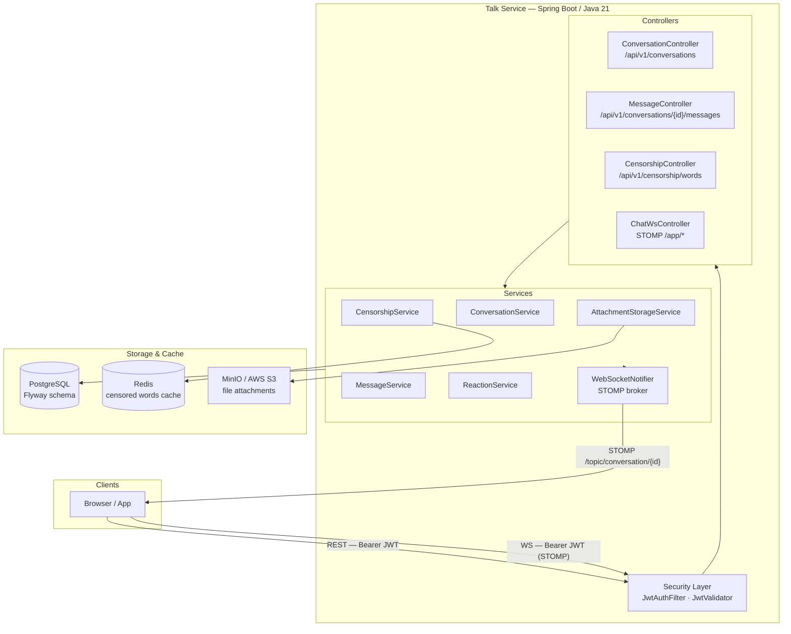
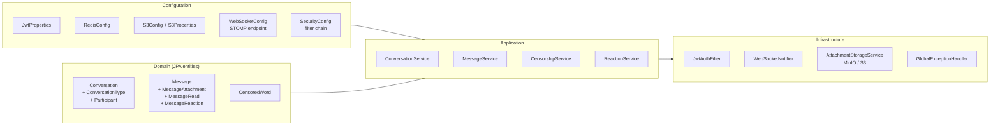
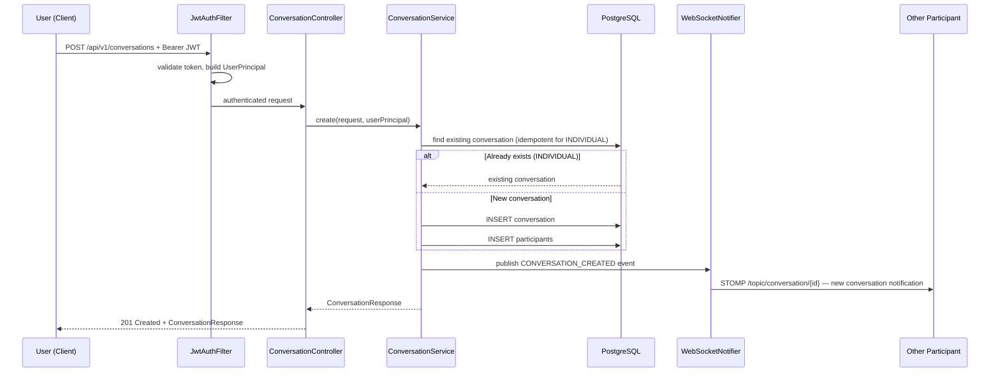
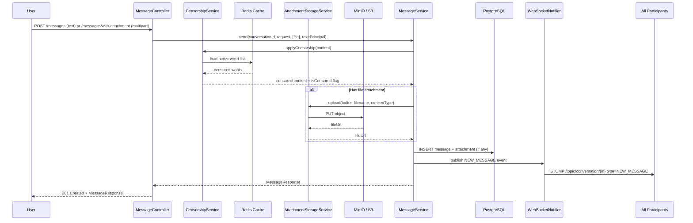
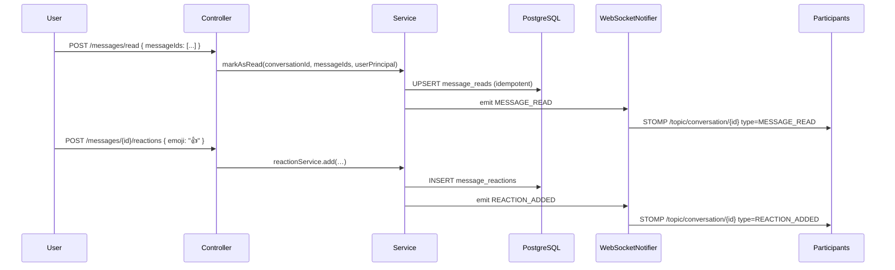
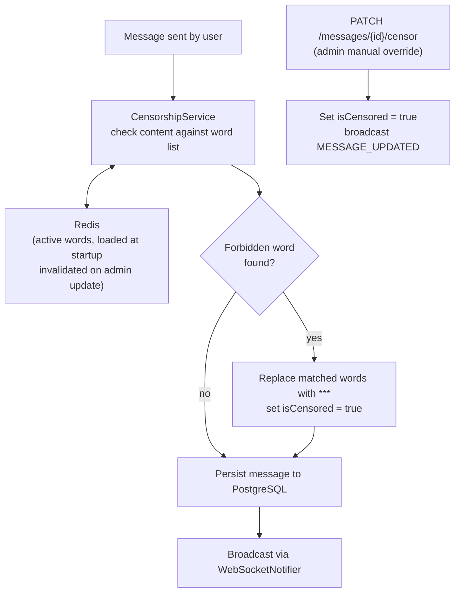
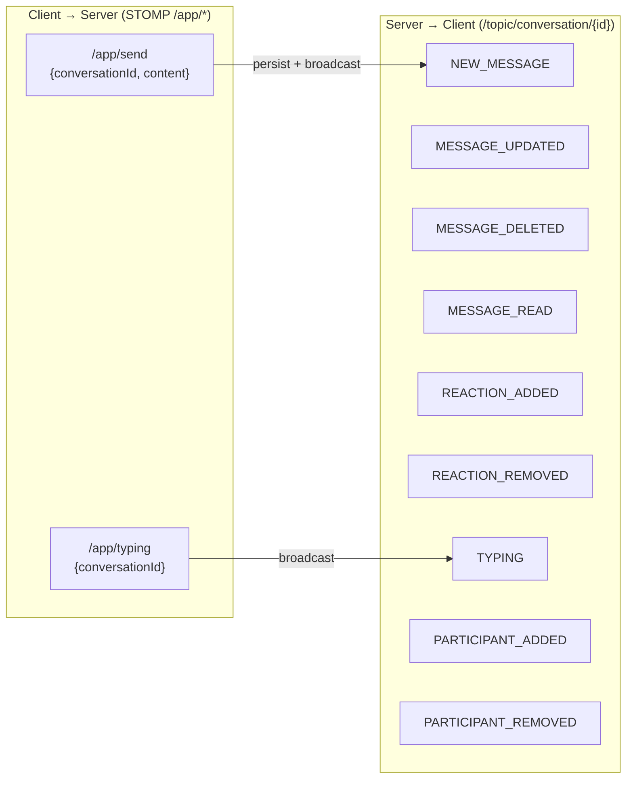
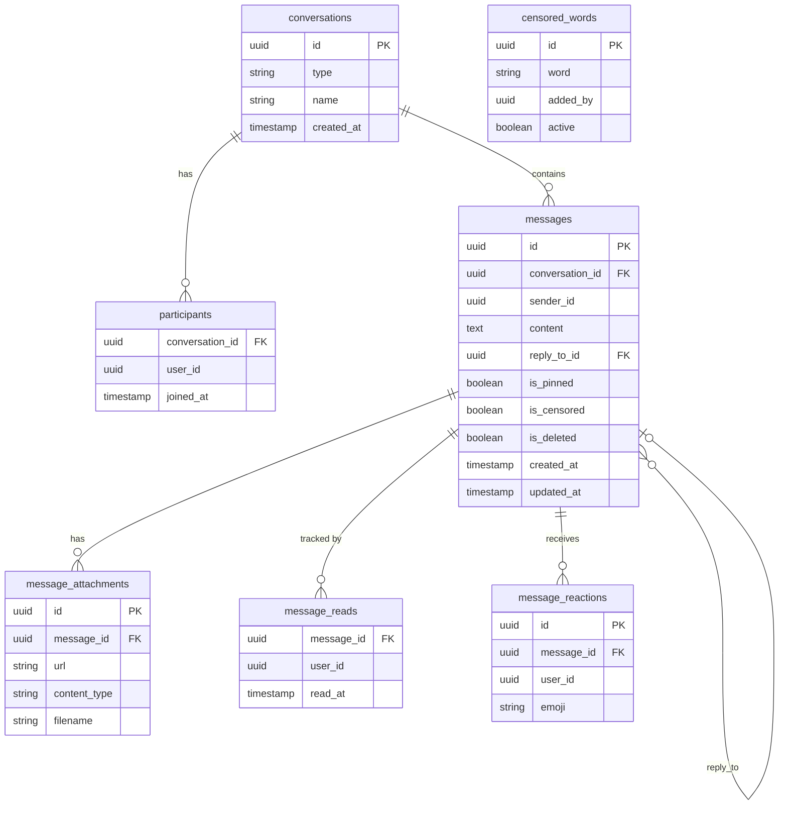

# Talk Service

## Overview

`talk` is the real-time chat microservice for the ECIWise platform. It exposes a REST API for managing conversations and messages, and a WebSocket (STOMP) channel for live updates. The service integrates JWT authentication, PostgreSQL persistence, Redis for censored-word caching, Flyway for schema migrations, and MinIO / AWS S3 for file attachments.

The service handles six core domains:

- **Conversations**: create and manage individual and group chats; add or remove participants.
- **Messages**: send, edit, delete, pin, and reply to messages; attach images and documents.
- **Censorship**: automatically filter forbidden words before persistence; administrators manage the blocklist.
- **Reactions**: add and remove emoji reactions on any message.
- **Read receipts**: mark messages as read and broadcast the update over WebSocket.
- **Real-time**: push new messages, edits, reactions, and read events to all participants via STOMP.

---

## System Architecture



---

## Internal Component Diagram



---

## New Conversation Flow



---

## Message Send Flow



---

## Read Receipt & Reaction Flow



---

## Censorship Flow



---

## WebSocket Event Map



---

## Data Model



---

## Endpoints

### Conversations (`/api/v1/conversations`)

| Method | Path | Auth | Description |
|---|---|---|---|
| `POST` | `/api/v1/conversations` | JWT | Create an individual or group conversation |
| `GET` | `/api/v1/conversations` | JWT | List conversations for the authenticated user |
| `GET` | `/api/v1/conversations/{id}` | JWT | Get conversation details |
| `PUT` | `/api/v1/conversations/{id}` | JWT | Update conversation metadata |
| `DELETE` | `/api/v1/conversations/{id}` | JWT | Delete a conversation |
| `POST` | `/api/v1/conversations/{id}/participants` | JWT | Add a participant |
| `DELETE` | `/api/v1/conversations/{id}/participants/{userId}` | JWT | Remove a participant |

### Messages (`/api/v1/conversations/{conversationId}/messages`)

| Method | Path | Auth | Description |
|---|---|---|---|
| `GET` | `/messages` | JWT | List messages paginated (50 per page, asc by `createdAt`) |
| `POST` | `/messages` | JWT | Send a text message |
| `POST` | `/messages/with-attachment` | JWT | Send a message with file attachment (multipart) |
| `PUT` | `/messages/{messageId}` | JWT | Edit message text |
| `DELETE` | `/messages/{messageId}` | JWT | Soft-delete a message |
| `PATCH` | `/messages/{messageId}/censor` | JWT (admin) | Manually censor a message |
| `POST` | `/messages/read` | JWT | Mark a list of message IDs as read |
| `POST` | `/messages/{messageId}/reactions` | JWT | Add an emoji reaction |
| `DELETE` | `/messages/{messageId}/reactions/{emoji}` | JWT | Remove an emoji reaction |
| `PATCH` | `/messages/{messageId}/pin` | JWT | Toggle pin state |
| `GET` | `/messages/pinned` | JWT | List pinned messages |

### Censorship (`/api/v1/censorship/words`)

| Method | Path | Auth | Description |
|---|---|---|---|
| `GET` | `/api/v1/censorship/words` | JWT (admin) | List all censored words |
| `POST` | `/api/v1/censorship/words` | JWT (admin) | Add a forbidden word |
| `DELETE` | `/api/v1/censorship/words/{id}` | JWT (admin) | Deactivate a forbidden word |

---

## Deployment

### Configuration

| Variable | Purpose |
|---|---|
| `SERVER_PORT` | HTTP port (default `3003`) |
| `SPRING_DATASOURCE_URL` | PostgreSQL JDBC URL |
| `SPRING_DATASOURCE_USERNAME` | Database user |
| `SPRING_DATASOURCE_PASSWORD` | Database password |
| `SPRING_REDIS_HOST` | Redis host |
| `SPRING_REDIS_PORT` | Redis port (default `6379`) |
| `JWT_SECRET` | HS256 shared secret |
| `MINIO_ENDPOINT` | MinIO or S3-compatible endpoint |
| `MINIO_ACCESS_KEY` | Object storage access key |
| `MINIO_SECRET_KEY` | Object storage secret key |
| `MINIO_BUCKET` | Target bucket name |

### Local Execution

```bash
docker compose up -d   # start PostgreSQL, Redis, MinIO
mvn spring-boot:run    # Flyway migrations run automatically on startup
```

---

## Further Reading

- Source repository: [EciWise/talk](https://github.com/EciWise/talk)
- C4 diagrams: `talk/docs/diagramas/`
- Database schema: Flyway migrations in `src/main/resources/db/migration/`
