# Tutoring Service

## Overview

`tutoring` is the microservice responsible for managing academic tutoring within the ECIWise platform. It allows tutors to publish recurring availability, automatically converts that availability into bookable tutoring slots, and enables students to search, reserve, cancel, and reschedule sessions.

The service handles three core domains:

- **Institutional scheduling**: administrators manage subjects, rooms, time slots, and tutor–subject authorization.
- **Tutor availability**: tutors publish recurring availability templates with subject, modality, capacity, and validity dates. A scheduled job materializes concrete tutoring sessions from those templates.
- **Student reservations**: students search available sessions and reserve, cancel, or reschedule their participation with transactional capacity control.

The current implementation also maintains a local user projection from JWT claims and publishes domain events in-process. Attendance, evaluations, and reputation have database support but no active API or use cases yet.

---

## Tutoring Module Flow

The tutoring lifecycle starts with institutional configuration and ends with a student reservation:

1. An administrator creates subjects, rooms, and institutional time slots.
2. An administrator assigns and authorizes a tutor for a subject.
3. The tutor publishes a recurring availability template.
4. The daily materialization job creates concrete `Tutoria` slots within a moving time window.
5. A student searches programmed sessions with available capacity.
6. The student reserves a slot; PostgreSQL increments capacity conditionally inside a transaction.
7. The student may cancel or atomically reschedule the reservation.
8. The tutor or an administrator may cancel the entire tutoring session and release its reservations.

### User Capabilities

**Students** can search sessions by subject, modality, date, or tutor; inspect session details; reserve available capacity; cancel their reservation; and reschedule to another compatible session.

**Tutors** can publish, list, edit, and deactivate their own availability. They can also cancel tutoring sessions assigned to them.

**Administrators** manage institutional catalogs and tutor–subject assignments, can manage availability on behalf of tutors, and can trigger materialization manually.

### Materialization

`MaterializacionJob` runs every day at **01:00** in the process timezone. It executes the same `MaterializarVentana` use case exposed by the administrative endpoint.

- Active availability templates are expanded into matching calendar dates.
- The configured window is controlled by `MATERIALIZACION_VENTANA_SEMANAS`.
- The unique key `(tutorUserId, franjaId, fecha)` makes the operation idempotent.
- Duplicate attempts are reported as omitted instead of creating another session.
- Editing an availability template does not modify sessions already materialized.

---

## Architecture

[](tutoring/c4-componentes.svg)

The service follows **Hexagonal Architecture (Ports & Adapters)** combined with **Vertical Slicing** and **Domain-Driven Design**. Each business capability owns its domain, application use cases, and infrastructure adapters.

HTTP controllers and the materialization job are inbound adapters. Application use cases coordinate domain entities and outbound ports. Prisma repositories, the local user repository, and the in-memory event publisher are outbound adapters. The domain layer is plain TypeScript and does not depend on NestJS or Prisma.

### Runtime Environment

The service is built with **NestJS 11** and **TypeScript** on **Node.js 20+**. It uses **Prisma 7** with `@prisma/adapter-pg` to connect to PostgreSQL; the current hosted database target is Neon. JWT authentication is implemented with Passport JWT and HS256.

API documentation is generated at runtime with Swagger and exposed at `/api/docs`.

### Package Structure

```text
src/
├── auth/                         # JWT strategy, guards, roles, decorators
├── config/                       # environment validation
├── shared/
│   ├── domain/                   # value objects, enums, errors, events
│   └── infrastructure/           # Prisma, filters, in-memory publisher
└── modules/
    ├── identidad/                # local user projection from JWT claims
    ├── catalogos/                # subjects, rooms, time slots, tutor subjects
    ├── disponibilidad/           # recurring availability and materialization
    ├── tutorias/                 # session search and detail queries
    └── reservas/                 # reserve, cancel, reschedule, cancel session

prisma/
├── schema.prisma                 # relational model
├── migrations/                   # migration history
└── seed.ts                       # institutional time slots and rooms
```

Each vertical slice follows this internal shape:

```text
domain/{entities,value-objects,events,ports/outbound}
application/use-cases
infrastructure/{persistence,http/{controllers,dto}}
<slice>.module.ts
```

### Runtime Dependencies

| Dependency | Purpose |
|---|---|
| NestJS 11 | HTTP application and dependency injection |
| Prisma 7 | ORM and generated database client |
| `@prisma/adapter-pg` | PostgreSQL driver adapter |
| PostgreSQL / Neon | Persistent relational storage |
| Passport JWT | Bearer JWT validation |
| `class-validator` | Request DTO validation |
| `@nestjs/schedule` | Daily materialization job |
| `@nestjs/event-emitter` | In-process domain event delivery |
| `@nestjs/swagger` | Runtime OpenAPI documentation |
| Jest | Unit and application tests |

### Database Migrations

Prisma Migrate manages the schema under `prisma/migrations`. The generated Prisma client uses a custom output directory, so it must be regenerated after schema changes.

```bash
npx prisma migrate deploy
npx prisma generate
npm run seed
```

The seed is idempotent and creates the institutional weekday time-slot grid and room catalog used by local environments.

---

## JWT-based Identity

All functional routes require a Bearer JWT except the root health response at `GET /`.

The service validates:

- signature using the shared `JWT_SECRET`;
- algorithm fixed to `HS256`;
- token expiration;
- required `sub`, `email`, and `rol` claims.

### JWT Claims

| Claim | Purpose |
|---|---|
| `sub` | External user identifier |
| `email` | User email |
| `nombre` | User first name |
| `apellido` | User last name |
| `rol` | `estudiante`, `tutor`, or `admin` |

`JwtAuthGuard` authenticates requests and `RolesGuard` enforces handler-level roles. The service does not call the authentication service during normal requests; Auth and Tutoring share a JWT contract.

### Just-in-time User Projection

`JwtCaptureInterceptor` asynchronously upserts authenticated users into `usuario_local` using the most recent JWT claims. A synchronization failure is logged but does not block the main request.

This projection allows read models to display local user data without a synchronous Auth dependency. External user IDs stored in domain tables are intentionally not foreign keys to `usuario_local`.

---

## Data Model

The source of truth is `prisma/schema.prisma`.

[](tutoring/modelo-er.svg)

### Institutional Catalogs

| Model | Purpose | Important constraints |
|---|---|---|
| `Materia` | Subject catalog | Unique `codigo`; logical activation |
| `Sala` | Physical room catalog | Unique `codigo`; optional building metadata |
| `FranjaHoraria` | Institutional weekday time slot | Day, start/end time, ordering, activation |
| `TutorMateria` | Tutor authorization for a subject | Unique tutor–subject pair; authorization flag |

### Scheduling

| Model | Purpose | Important constraints |
|---|---|---|
| `DisponibilidadTutor` | Recurring availability template | Tutor, slot, subject, modality, capacity, validity |
| `Tutoria` | Concrete materialized session | Unique tutor–slot–date; state and occupied capacity |

`DisponibilidadTutor` supports `PRESENCIAL` and `VIRTUAL` modalities. Physical availability references a room, while virtual sessions may expose an `enlaceVirtual` when available.

### Reservations

| Model | Purpose | Important constraints |
|---|---|---|
| `Participante` | Student reservation for a session | Unique student–session pair; reservation/cancellation state |

Capacity is stored in `Tutoria` as `cuposMaximos` and `cuposOcupados`. Reservation persistence updates this counter conditionally to prevent overbooking under concurrency.

### Identity, Evaluations, and Reputation

| Model | Current status |
|---|---|
| `UsuarioLocal` | Active local projection populated from JWT claims |
| `EvaluacionTutoria` | Schema support only; no active endpoint or use case |
| `EvaluacionParticipante` | Schema support only; no active endpoint or use case |
| `ReputacionTutor` | Schema support only; no active projection or query API |
| `ReputacionEstudiante` | Schema support only; no active projection or query API |

---

## Business Rules

| Rule | Status | Enforcement |
|---|---|---|
| RN-01 — A student must not overlap tutoring sessions | Implemented | Overlap query before reserving or rescheduling |
| RN-02 — A tutor has one availability per time slot | Implemented | Database unique constraint |
| RN-03 — The subject must exist and be assigned | Implemented | Foreign key and tutor authorization check |
| RN-04 — Only students can reserve | Implemented through JWT | Required `estudiante` role |
| RN-05 — Only authorized tutors publish availability | Implemented | Authorized `TutorMateria` validation |
| RN-06 — Evaluate only completed tutoring sessions | Pending | No evaluation use case |
| RN-07 — One evaluation per participant | Partial | Prisma uniqueness, no executable flow |
| RN-08 — Cancellation requires a reason | Implemented | DTO and domain validation |
| RN-09 — Capacity must never be exceeded | Implemented | Conditional transactional update |

RN-09 is concurrency-safe because PostgreSQL increments capacity only while `cupos_ocupados < cupos_maximos`. RN-01 currently uses a prior read rather than a serializable database constraint, so concurrent overlapping reservations by the same student remain an integration scenario worth testing explicitly.

---

## Endpoints

The live OpenAPI contract is available at `/api/docs` while the service is running.

### Identity

| Method | Route | Access | Description |
|---|---|---|---|
| GET | `/identidad/me` | Authenticated | Return normalized JWT claims |
| GET | `/identidad/usuarios/:userId` | Authenticated | Read a captured local user |

### Subjects

| Method | Route | Access | Description |
|---|---|---|---|
| POST | `/catalogos/materias` | Admin | Create a subject |
| GET | `/catalogos/materias` | Authenticated | List subjects; optionally active only |
| PATCH | `/catalogos/materias/:id/activar` | Admin | Activate a subject |
| PATCH | `/catalogos/materias/:id/desactivar` | Admin | Deactivate a subject |

### Rooms and Time Slots

| Method | Route | Access | Description |
|---|---|---|---|
| POST | `/catalogos/salas` | Admin | Create a room |
| GET | `/catalogos/salas` | Authenticated | List rooms |
| POST | `/catalogos/franjas` | Admin | Create an institutional time slot |
| GET | `/catalogos/franjas` | Authenticated | List time slots; optionally filter by day |

### Tutor–Subject Assignments

| Method | Route | Access | Description |
|---|---|---|---|
| POST | `/catalogos/tutor-materias` | Admin | Assign a subject to a tutor |
| GET | `/catalogos/tutor-materias` | Authenticated | List assignments for a tutor |
| PATCH | `/catalogos/tutor-materias/:id/autorizar` | Admin | Authorize an assignment |
| PATCH | `/catalogos/tutor-materias/:id/desautorizar` | Admin | Revoke authorization |

### Availability and Materialization

| Method | Route | Access | Description |
|---|---|---|---|
| POST | `/disponibilidad` | Tutor, admin | Publish recurring availability |
| GET | `/disponibilidad` | Tutor, admin | List tutor availability |
| PATCH | `/disponibilidad/:id` | Owner, admin | Edit availability |
| PATCH | `/disponibilidad/:id/desactivar` | Owner, admin | Deactivate availability |
| POST | `/disponibilidad/materializacion` | Admin | Run materialization manually |

### Tutoring Sessions

| Method | Route | Access | Description |
|---|---|---|---|
| GET | `/tutorias` | Authenticated | Search programmed sessions with capacity |
| GET | `/tutorias/:id` | Authenticated | Read session details |

Supported search filters are `materiaId`, `modalidad`, `fecha`, and `tutorUserId`.

### Reservations

| Method | Route | Access | Description |
|---|---|---|---|
| POST | `/reservas` | Student | Reserve a tutoring session |
| POST | `/reservas/:tutoriaId/cancelar` | Student | Cancel the student's reservation |
| POST | `/reservas/reprogramar` | Student | Atomically move to another session |
| POST | `/reservas/cancelacion-tutoria` | Tutor, admin | Cancel a session and release reservations |

### Error Mapping

| HTTP | Meaning |
|---|---|
| 400 | Invalid request or domain value |
| 401 | Missing, invalid, or expired JWT |
| 403 | Insufficient role or ownership |
| 404 | Resource not found |
| 409 | Duplicate, full session, or capacity race |
| 422 | Business rule violation |

---

## Service Communication

### Authentication Contract

The external Auth service issues HS256 JWTs. Tutoring validates them locally and does not make a synchronous Auth HTTP request during normal API operations.

### Domain Events

The application publishes events such as tutoring materialization, reservation, and cancellation through an `IEventPublisher` port. The current adapter uses `EventEmitter2`, so delivery is local to the Node.js process.

### External Messaging

RabbitMQ is a planned integration, not an active runtime dependency. No adapter currently consumes `RABBITMQ_URL`, and events are not durable across process restarts.

### Database Communication

Prisma repositories are the only active persistence adapters. The service owns its tutoring schema and uses PostgreSQL transactions for reservation and rescheduling consistency.

---

## C4 — Level 1: System Context

[](tutoring/c4-contexto.svg)

### Actors

| Actor | Interaction |
|---|---|
| Student | Searches, reserves, cancels, and reschedules tutoring sessions |
| Tutor | Publishes availability and cancels assigned sessions |
| Administrator | Manages catalogs, authorizations, and materialization |

### Systems

| System | Responsibility |
|---|---|
| Tutoring Service | Scheduling, session search, and reservation management |
| Auth Service | Issues the shared HS256 JWT |
| PostgreSQL / Neon | Stores catalogs, availability, sessions, and reservations |

### Relationships

- Clients call the Tutoring REST API with a Bearer JWT.
- Auth issues the token, while Tutoring validates its contract locally.
- Tutoring reads and writes its PostgreSQL database through Prisma.

---

## C4 — Level 2: Containers

[](tutoring/c4-contenedores.svg)

### Containers

| Container | Technology | Responsibility |
|---|---|---|
| REST Application | NestJS 11 | Controllers, guards, use cases, Swagger |
| Scheduler | `@nestjs/schedule` | Daily materialization trigger |
| Event Bus | EventEmitter2 | In-process domain event dispatch |
| Persistence Adapter | Prisma 7 | Repository implementations and transactions |
| Database | PostgreSQL / Neon | Durable relational data |

The REST API, scheduler, and event bus run in the same Node.js process; they are logical containers in the diagram, not independent deployments.

### External System

The Auth service is external and shares the JWT validation contract. There is no runtime network call from Tutoring to Auth for each request.

---

## Design Patterns & Best Practices

### 1. Hexagonal Architecture

Domain and application layers depend on ports. Prisma, HTTP, scheduling, and event delivery are replaceable adapters.

### 2. Vertical Slicing

Identity, catalogs, availability, tutoring search, and reservations are organized as business capabilities rather than technical layers shared across the entire service.

### 3. Domain-Driven Design

Entities and value objects protect invariants such as modality, capacity, validity ranges, cancellation reasons, and reservation state.

### 4. Idempotent Materialization

The materialization job can safely repeat because the tutor–slot–date unique constraint prevents duplicate sessions.

### 5. Transactional Capacity Control

Capacity is claimed with a conditional SQL update inside a transaction, preventing overbooking even when multiple students reserve simultaneously.

### 6. Just-in-time Identity Projection

JWT claims populate a local user read model without coupling every query to the Auth service.

### 7. Domain Event Port

Use cases publish domain events through an interface. The current in-memory adapter can later be replaced by durable messaging without moving event creation into controllers.

---

## Deployment

### Environment Variables

| Variable | Required | Purpose |
|---|---|---|
| `NODE_ENV` | No | Runtime environment |
| `PORT` | No | HTTP port |
| `DATABASE_URL` | Yes | PostgreSQL runtime connection |
| `DIRECT_URL` | Yes | Direct database connection required by startup validation |
| `JWT_SECRET` | Yes | Shared HS256 secret, minimum 16 characters |
| `JWT_EXPIRATION` | No | Informational token TTL |
| `MATERIALIZACION_VENTANA_SEMANAS` | No | Materialization horizon |

### Local Execution

```bash
npm install
npx prisma generate
npx prisma migrate deploy
npm run seed
npm run start:dev
```

### Verification Commands

```bash
npm run build
npm test
npm run test:cov
npm run test:e2e
```

### Current Operational Limitations

- The repository does not include a `Dockerfile` or `docker-compose.yml`.
- No application deployment manifest is currently defined.
- The cron timezone is not configured explicitly.
- Multiple replicas may repeat materialization work; uniqueness prevents duplicates but not redundant processing.
- CORS is enabled without an explicit production origin allowlist.
- Attendance, observations, evaluations, reputation, and dedicated history endpoints are not implemented.

---

## Further Reading

- Source repository: [EciWise/tutoring](https://github.com/EciWise/tutoring)
- Runtime API contract: `/api/docs`
- Relational source of truth: `prisma/schema.prisma`
- Module composition: `src/app.module.ts` and `src/modules/*`

